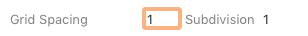
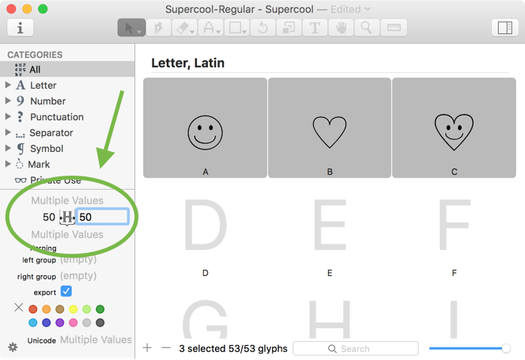
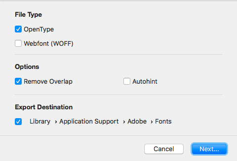

原文: [Importing from Illustrator into Glyphs Mini](https://glyphsapp.com/learn/importing-from-illustrator-into-glyphs-mini)
# IllustratorからGlyphs Miniへの読み込み

チュートリアル

[ Glyphs Mini ](https://glyphsapp.com/learn?q=glyphs+mini)

執筆者：

[ en ](https://glyphsapp.com/learn/importing-from-illustrator-into-glyphs-mini) [ es ](https://glyphsapp.com/es/learn/importing-from-illustrator-into-glyphs-mini) [ fr ](https://glyphsapp.com/fr/learn/importing-from-illustrator-into-glyphs-mini)

2022年8月12日更新（初版公開：2017年2月24日）

Adobe Illustratorでベクター描画を準備し、それをフォントにしたいと思っていますか。コピー＆ペーストと同じくらい簡単ですが、注意すべき詳細がいくつかあります。

## 座標の精度

「ファイル > フォント情報」で、ウィンドウの下部に「グリッドの間隔」という値があります。「グリッドの間隔」がゼロでない場合、すべての座標は「グリッドの間隔」の値で丸められます。しかし、「グリッドの間隔」をゼロに設定すると、Glyphs Miniは浮動小数点座標を使用し、実質的に丸めは発生しません。（OK、正確に言うと、小数点以下2桁までなので、少しの丸めは発生します。）

したがって、読み込み後に多くの変形を計画している場合や、描画に非常に細かいディテールがある場合は、「グリッドの間隔」を0/1に設定してください。そうでなければ、通常は1/1に保つことをお勧めします。Glyphs Miniに読み込む*前*に、ベクターアートを正しいサイズに拡大縮小することを検討してください。

## スケール：1ポイント = 1ユニット

Illustratorの1ポイントは、Glyphs Miniの1ユニットに対応します。デフォルトでは、1ユニットはemの1000分の1です。より正確には、フォント情報（Cmd-I）でUPM（units per em）の値を設定したものです。1em全体は、ユーザーが後でフォントサイズを設定したものです。

これは、デフォルトでは、Illustratorの描画は小さすぎる可能性が高いことを意味します。平均的なエックスハイトはemの半分、つまり500ユニットです。そして、500ユニットはIllustratorでは500ポイントに相当します。これは、エックスハイトだけで約17.6センチメートル（ほぼ7インチ）です！

Illustratorで描画をすでに拡大縮小しておくのは良い考えです。これにより、後の段階での丸め誤差を最小限に抑えることができます。特に、「グリッドの間隔」がゼロでない場合はそうです。そのためには、もしそうなっていなければ、測定単位をポイントに設定すると良いでしょう。これは、ウィンドウの端にある定規を右クリックするか、Illustratorのアプリケーション環境設定で設定を変更することで行えます。

## コピー＆ペースト

さて、あとはベクター描画をIllustratorからGlyphs Miniにコピー＆ペーストするだけです。*閉じたパス*のみをコピーし、ペーストする際には正しいグリフがアクティブになっていることを確認してください。

ただし、一つ問題があります。Illustratorはキャンバス全体に対して一つの座標系を使用しますが、フォントの座標はグリフごとに機能します。Glyphs Miniは、大きくずれた座標を認識し、そのオブジェクトを本当にグリフの境界外に配置したいのか尋ねてきます。99.9%の場合、「境界を修正」を選びたいでしょう。

Glyphs Miniは、貼り付けられた描画をベースラインまたは現在のグリフの左サイドベアリング、あるいはその両方に揃えます。これは、それをグリフの境界内に戻すために必要なものです。しかし、これによりオーバーシュートやディセンダーのようなものが乱れる可能性があります。もっと良い方法があります。

## 配置を制御する

IllustratorのCS4までのバージョンでは、ウィンドウの左上隅にある、垂直定規と水平定規が交差する小さな領域から十字線をドラッグすることで、原点を設定できます。Glyphs Miniは、ペーストする際に原点の位置を尊重します。Illustratorの原点は、グリフのx=0/y=0の点、つまり左サイドベアリングとベースラインが交差する点に対応します。

Illustrator CS5以降では、[アートボードオプション](http://vector.tutsplus.com/learn/tools-tips/quick-tip-artboard-options/)でその原点を設定する必要があります。アートボードパレットを表示させ、パレットメニューから「オプション」を選ぶか、アートボードシンボルをダブルクリックするか、ツールバーのアートボードツールをダブルクリックします。例えば、アートボードの高さを500ptに設定し、その原点を左下隅に設定できます。

そうすれば、文字やシンボルを次のように拡大縮小・再配置できます。

グリフの幅はどうでしょうか？貼り付け後、グレーの情報ボックスに値を入力することで、右サイドベアリングを素早く修正できます。あるいは、フォントタブでグリフを選択し、ウィンドウ左下の情報エリアにメトリクス値を入力することで、すべてを一度に設定できます。

## クリーンアップ

冒頭で述べたように、良いパスについてはもっと言うべきことがたくさんありますが、ここでは最悪の問題を修正するための手早く簡単な方法を紹介します。

1.  フォントタブで、すべてのグリフを選択します（Cmd-A）。
2.  「グリフ > 極値点を追加」を選択します。これにより、パスセグメントの極値点にノードが挿入されます。それが何を意味するかわからなくても、心配しないでください、とにかくやってみてください。
3.  「グリフ > パスの方向を修正」（Cmd-Shift-R）を選択します。これにより、グリフ内のカウンターとパスの順序が修正されます。
4.  「グリフ > パスを整理」（Alt-Cmd-Shift-T）を選択します。これにより、余分なノードや重複した座標が削除されます。
5.  アウトラインに非常に高いディテールが必要でない限り、「グリフ > 座標を丸める」も選択すると良いでしょう。これにより、すべての座標が最も近い整数に丸められます。
6.  もし、非常に複雑なベクター（100以上のノードを持つ、または多くのオーバーラップするパスを持つ）がある場合は、今すぐ「グリフ > オーバーラップを削除」（Cmd-Shift-O）を検討してください。これにより、後の書き出しが高速化されます。

## SVG

編集用に開かれているグリフには、SVGをドラッグすることもできます。ただし、SVGは十分に単純である必要があります。そうでなければ、部分的にしか読み込まれません。つまり、パスが詳しすぎたり複雑すぎたりしないこと、埋め込みビットマップがないこと、ストロークがないこと、色やグラデーションがないことなどです。お分かりですね。

## 書き出し

作業が終わったら、フォントを書き出すことができます。非常に規則的な、「普通の」テキストフォントでない限り、「オートヒント」オプションなしで書き出すことをお勧めします。

以前の段階ですでに行っていない限り、「オーバーラップを削除」を常に選択してください。オーバーラップの削除は、技術的に複雑な操作であり、多くの処理能力を必要とするため、書き出しを遅くします。もしテスト目的で頻繁に再書き出しをする場合は、このオプションを無効にすることを検討してください。

フォントをテストするために、Font BookやFontExplorerのようなアプリにフォントを**インストールしないでください**。何かを修正して再書き出しすると、[フォントキャッシュの問題](eliminating-font-cache-problems.md)に遭遇します。Adobeアプリでフォントをテストする方が良いです。[Adobe Fontsフォルダ](testing-your-fonts-in-adobe-apps.md)を使用します。あるいは、[Webフォント](creating-a-webfont-in-glyphs-mini.md)としてWebブラウザでフォントをテストします。そうすれば、再書き出し後に必要なのは、テストページをリロードすることだけです。

さて、準備はできました。楽しんでください。

---

更新履歴 2020-03-11: 「Font Explorer」を「FontExplorer」に、「Adobe fonts folder」を「Adobe Fonts folder」に変更。

更新履歴 2020-05-10: 長年気づかれなかったタイトルの誤字を修正。

更新履歴 2022-07-28: タイトル、関連記事、軽微なフォーマットを更新。

更新履歴 2024-03-22: SVGに関するセクションを追加。

## 関連記事

[すべてのチュートリアルを見る →](https://glyphsapp.com/learn)

*   ### [Glyphs Miniでウェブフォントを作る](creating-a-webfont-in-glyphs-mini.md)

チュートリアル

[ Glyphs Mini ](https://glyphsapp.com/learn?q=glyphs+mini)

*   ### [Glyphs Miniでのフォント情報の設定](font-info-settings-in-glyphs-mini.md)

チュートリアル

[ Glyphs Mini ](https://glyphsapp.com/learn?q=glyphs+mini)

*   ### [Glyphs Miniでピクセルフォントを作る](creating-a-pixel-font-in-glyphs-mini.md)

チュートリアル

[ Glyphs Mini ](https://glyphsapp.com/learn?q=glyphs+mini)

*   ### [Glyphs Miniでオールキャップスフォントを作る](creating-an-all-caps-font-in-glyphs-mini.md)

チュートリアル

[ Glyphs Mini ](https://glyphsapp.com/learn?q=glyphs+mini)

*   ### [Illustratorから読み込む](importing-from-illustrator.md)

チュートリアル

*   ### [既存のフォントを読み込む](importing-existing-fonts.md)

チュートリアル

[ トラブルシューティング ](https://glyphsapp.com/learn?q=troubleshooting)