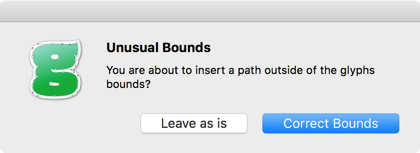
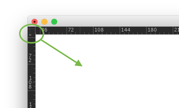
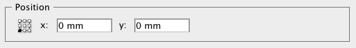
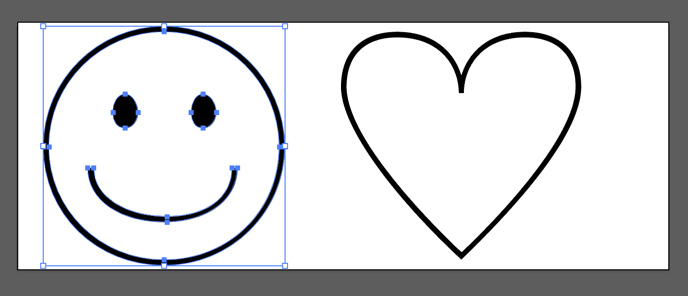
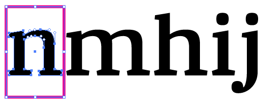

原文: [Importing from Illustrator](https://glyphsapp.com/learn/importing-from-illustrator)
# Illustratorからの読み込み

チュートリアル

執筆者: Rainer Erich Scheichelbauer

[ en ](https://glyphsapp.com/learn/importing-from-illustrator) [ fr ](https://glyphsapp.com/fr/learn/importing-from-illustrator) [ zh ](https://glyphsapp.com/zh/learn/importing-from-illustrator)

2022年8月12日更新（初版公開：2012年12月20日）

Adobe Illustratorで素晴らしいデザインを作成し、それをフォントにしたいと思っていますか。Glyphsでそれらを最大限に活用する方法を見つけましょう。

Illustratorの描画をGlyphsに取り込む方法について尋ねられると、私の最初の反応は通常、「やらないで！」です。Illustratorの描画ツールは平均的なイラストには十分かもしれませんが、フォントでは通常、Illustratorが提供できるよりも良いカーブの品質が必要です。そして、Glyphsのツールは、特にカーブセグメントに関して、より高いアウトラインの品質を達成するのに役立ちます。詳細は[チュートリアル](drawing-good-paths.md)で説明しました。ですから、Glyphsでデザインを再描画することを検討してください。パスを読み込んで後でクリーンアップするよりも、手間が少ないかもしれません。

## 座標の精度

「ファイル > フォント情報 > その他」には、「グリッドの間隔」という値があります。「グリッドの間隔」がゼロでない場合、すべての座標はグリッドの間隔の値で丸められます。しかし、「グリッドの間隔」をゼロに設定すると、Glyphsは浮動小数点座標を使用し、実質的に丸めは発生しません。したがって、読み込み後に多くの変形を計画している場合や、描画に非常に細かいディテールがある場合は、「グリッドの間隔」をゼロに設定してください。そうでなければ、通常は1に保つことをお勧めします。

## スケール：1ポイント = 1ユニット

Illustratorの1ポイントは、Glyphsの1ユニットに対応します。デフォルトでは、1ユニットはemの1000分の1です。より正確には、フォント情報（Cmd-I）でUPM（units per em）の値を設定したものです。1em全体は、後でフォントサイズを設定したものです。

これは、デフォルトでは、Illustratorの描画は小さすぎる可能性が高いことを意味します。平均的なエックスハイトはemの半分、つまり500ユニットです。そして、500ユニットはIllustratorでは500ポイントに相当します。これは、エックスハイトだけで約17.6センチメートル（ほぼ7インチ）です！

Illustratorで描画をすでに拡大縮小しておくのは良い考えです。これにより、後の段階での丸め誤差を最小限に抑えることができます。特に、「グリッドの間隔」（上記参照）がゼロでない場合はそうです。そのためには、測定単位をポイントに設定すると良いでしょう。これは、ウィンドウの端にある定規を右クリックするか、Illustratorのアプリケーション環境設定で設定を変更することで行えます。

## コピー＆ペースト

さて、あとはベクター描画をIllustratorからGlyphsにコピー＆ペーストするだけです。閉じたパスのみをコピーし、ペーストする際には正しいグリフがアクティブになっていることを確認してください。

ただし、一つ問題があります。Illustratorはキャンバス全体に対して一つの座標系を使用しますが、フォントの座標はグリフごとに機能します。Glyphsは、大きくずれた座標を認識し、そのオブジェクトを本当にグリフの境界外に配置したいのか尋ねてきます。99.9%の場合、「境界を修正」を選びたいでしょう。

Glyphsは、貼り付けられた描画をベースラインまたは現在のグリフの左サイドベアリング、あるいはその両方に揃えます。これは、それをグリフの境界内に戻すために必要なものです。しかし、これによりオーバーシュートやディセンダーのようなものが乱れる可能性があります。もっと良い方法があります。

## 配置を制御する

IllustratorのCS4までのバージョンでは、ウィンドウの左上隅にある、垂直定規と水平定規が交差する小さな領域から十字線をドラッグすることで、原点を設定できます。Glyphsは、ペーストする際に原点の位置を尊重します。Illustratorの原点は、グリフのx=0/y=0の点、つまり左サイドベアリングとベースラインが交差する点に対応します。

Illustrator CS5以降では、アートボードオプションでその原点を設定する必要があります。アートボードパレットを表示させ、パレットメニューから「オプション」を選ぶか、アートボードシンボルをダブルクリックするか、ツールバーのアートボードツールをダブルクリックします。例えば、アートボードの高さを500ptに設定し、その原点を左下隅に設定できます。

そうすれば、文字やシンボルを次のように拡大縮小・再配置できます。

さて、もしあなたが真のギークなら、各オブジェクトの周りに同じサイズのボックスを配置し、Illustratorのアクションでそれらを正しいサイズと位置に拡大縮小させ、ボックスを削除してオブジェクトをクリップボードにコピーすることができます。

グリフの幅はどうでしょうか？貼り付け後、グレーの情報ボックスに値を入力することで、右サイドベアリングを素早く修正できます。あるいは、フォントタブでグリフを選択し、ウィンドウ左下の情報エリアにメトリクス値を入力することで、すべてを一度に設定できます。

## クリーンアップ

冒頭で述べたように、良いパスについてはもっと言うべきことがたくさんありますが、ここでは最悪の問題を修正するための手早く簡単な方法を紹介します。

1.  フォントタブで、すべてのグリフを選択します（Cmd-A）。
2.  「パス > 極値点を追加」を選択します。これにより、パスセグメントの極値点にノードが挿入されます。それが何を意味するかわからなくても、心配しないでください、とにかくやってみてください。
3.  「パス > パスの方向を修正」（Cmd-Shift-R）を選択します。これにより、グリフ内のカウンターとパスの順序が修正されます。
4.  「パス > パスを整理」（Cmd-Shift-T）を選択します。これにより、余分なノードや重複した座標が削除されます。
5.  アウトラインに非常に高いディテールが必要でない限り、「パス > 座標を丸める」も選択すると良いでしょう。これにより、すべての座標が最も近い整数に丸められます。

貼り付け直後、ポイントの座標は「グリッドの間隔」に丸められません。それらが丸められるのは、適用した最初の変形の後に限られます。「パス > 変形」を介して、すべてのグリフに一度に小さな移動変形を適用すると、すべてがグリッドにスナップします。もし整数座標だけが必要なら、「パス > 座標を丸める」コマンドで十分です。

ピクセルパーフェクションを求めますか？それなら[このブログ投稿](pixel-perfection.md)をチェックしてください。

それを済ませれば、準備完了です。楽しんでください。

---

更新履歴 2022-08-12: 軽微なフォーマットを更新。

## 関連記事

[すべてのチュートリアルを見る →](https://glyphsapp.com/learn)

*   ### [既存のフォントを読み込む](importing-existing-fonts.md)

チュートリアル

[ トラブルシューティング ](https://glyphsapp.com/learn?q=troubleshooting)

*   ### [IllustratorからGlyphs Miniに読み込む](importing-from-illustrator-into-glyphs-mini.md)

チュートリアル

[ Glyphs Mini ](https://glyphsapp.com/learn?q=glyphs+mini)