原文: [Intermediate layers](https://glyphsapp.com/learn/intermediate-layers)
# 中間レイヤー

チュートリアル

[ インターポレーション ](https://glyphsapp.com/learn?q=interpolation)

執筆者: Rainer Erich Scheichelbauer

2024年6月12日

中間レイヤーは、個々のグリフのインターポレーションを微調整するのに役立ちます。

*中間レイヤー*（別名：*ブレース・レイヤー*）は、非常に強力です。個々のグリフのインターポレーションを微調整することができます。*ブレース・レイヤー*という用語は、サイドバーでの短い表記法に由来します。情報表示に中括弧`{}`を使用するためです。詳細は後述します。

## なぜ中間レイヤーが必要か？

そもそも、なぜグリフのインターポレーションを微調整したいのでしょうか？もっともな質問です。それは、例えばウェイト軸上で、*Thin*から*Heavy*までのように、かなり広い範囲にわたるインターポレーションがある場合に、頻繁に必要になります。

さらに、ほとんどのグリフではインターポレーションがうまく機能していると仮定しましょう。例えば、小文字の`o`の場合、編集ビューで*すべてのインスタンスを表示*してすべてのステップをプレビューすると、心地よい気分になります。

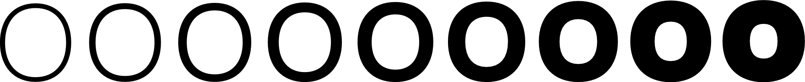

しかし、密集した文字では、そうはうまくいきません。小文字の`e`を例にとってみましょう。ベースラインとエックスハイトの間に3本の横線があるため、最も太いマスターでは横線の太さを妥協する必要があります。これが太い`e`です。

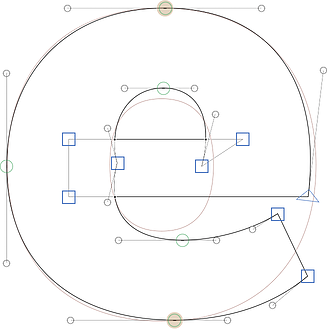

背景には、参考のために`o`が表示されています。ご覧の通り、上下の水平なカーブは両方とも、太い`o`よりもずっと細いです。これは、クロスバーも押し込む必要があるためです。もちろん、クロスバー自体は他の横線よりもずっと細いです。そして、クロスバーの内側にある青いノードについてお尋ねになる前に言っておくと、これはカウンターのカーブがクロスバーに少し急な角度で入るようにするための、私のお気に入りのとっておきのテクニックです。

いずれにせよ、これが現在の`e`の補間の様子です。

うーん…さて、ポジティブなことから始めましょう。インターポレーションの最初と最後は問題ありません。「当たり前だ」とあなたが言うのが聞こえます。それらはマスターの描画と同じだからです。その通りです。その間は、インターポレーションの中間に向かって徐々に悪化していき、クロスバーが細すぎます。また、上下の水平なカーブの部分も、お腹のあたりがモヤモヤするような、ネガティブな気分にさせます。

もし、最も問題のある箇所に行って、そこで`e`を修正できたらどうでしょうか？実は、それができるのです。

## ステップ1：スイートスポットを見つける

まず、中間ステップを追加するのに最も理にかなった場所を選びましょう。この場合、それは水平線と垂直線が等しく太くなるまでの場所です。上のeのシーケンスを見ると、そのスイートスポットは4番目か5番目の補間のあたりだと推測できます。では、「ファイル > フォント情報 > 書き出し」でこれらを確認してみましょう。

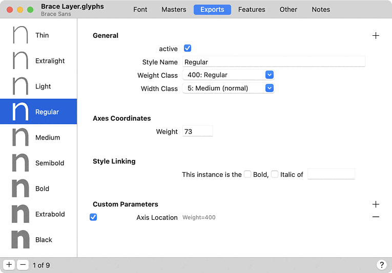

…すると、ウェイトの補間値として73と93が得られます。これが、私たちが介入する必要があるおおよその領域です。今日は優柔不断なので、妥協案として80を選びます。編集ビューのグリフに戻り、「レイヤー」パレットに注目しましょう。そこにあるマスターレイヤーのいずれか、例えば最初のものを選択します。

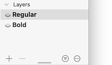

## ステップ2：レイヤーを複製する

左下のプラスボタンを押します。選択したマスターの複製が新しい*バックアップレイヤー*として表示され、名前には今日の日付が付きます。

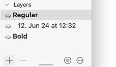

ここが重要なステップです。**そのバックアップレイヤーをクリックして選択します。** このようにハイライトされます。

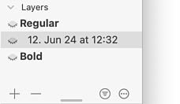

## ステップ3：中間レイヤーにする

新しいレイヤーは自動的に選択されないため、人々が間違ったレイヤーを編集してきたことがあるので、これは重要でした。OK、ではこのレイヤーを中間レイヤーに変えましょう。そのレイヤーを右クリックするか、アクションメニュー（三点アイコン）をクリックしてこのメニューを表示し、そこから（お察しの通り）*中間レイヤー*を選びます。

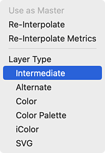

すると、ミニダイアログが表示され、そのレイヤーをあなたの補間空間のどこに置きたいか尋ねられます。

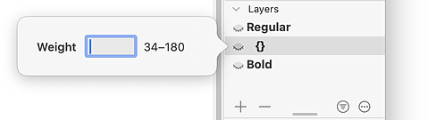

ここで、`80`と入力し、ReturnキーまたはEnterキーを押して確定します。

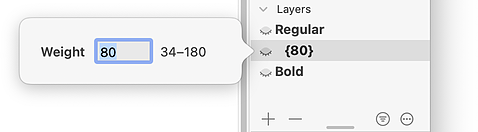

## ステップ4：再補間する

まだ補間のプレビューをオンにしていますか？それなら、私たちの補間が実際には悪化したことに気づいたかもしれません。これを見てください。

まあ、何が起こったかはお分かりでしょう。中間レイヤーは最初のマスターと全く同じシェイプなので、80までは半分死んだような補間になっています。これを修正しましょう。中間レイヤーがまだ選択されていることを確認し、そのポップアップメニューを再度表示します。レイヤーを右クリックするか、アクションメニューをクリックします。ただし、今回は*再補間*を選びます。

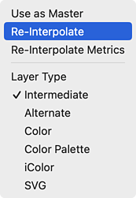

すると、補間は以前と同じ状態に戻ります。

## ステップ5：編集する

え、これまでの作業は全部無駄だったって？いえ、そんなことはありません！今や、80の位置のアウトラインを示す編集可能な中間レイヤーが手に入り、それを修正できます。例えば、このように。

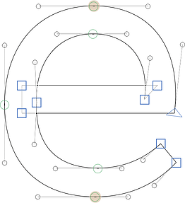

ここでは、`e`がまだできるだけモノライン（単線）らしく描かれていることを確認しました。アイデアは、この点までは水平線と垂直線が同じように太くなるということです。この点以降は、垂直線が水平線よりも太くなります。うまくいったか見てみましょう。

ずっと良くなりました。おめでとうございます、これでインターポレーションの微調整に成功しました。ちょうど今、太いマスターを微調整したくなりました…私の人生、こんな感じです。

## ブレース・レイヤー vs. マスター

もちろん、単に「ファイル > フォント情報 > マスター」で中間マスターを追加することもできます。しかし、それには中間レイヤー（別名：ブレース・レイヤー）に比べていくつかの欠点があります。

1.  個々のブレース・レイヤーは、デザインスペースの*どこにでも*中間ステップを置くことができます。`s`は90の位置にブレース・レイヤーを置くのが良いかもしれませんが、`a`は70が良いかもしれません。完全なマスターを追加すると、一つの場所を選び、それをグリフセット全体に適用せざるを得なくなります。
2.  完全なマスターを追加すると、グリフセット全体を管理する必要があります。選択したグリフにブレース・レイヤーを使えば、同じかそれ以上の結果を、はるかに少ない作業で得られるかもしれません。
3.  完全なマスターでは、カーニングもすべてやり直す必要があります。ブレース・レイヤーの場合、カーニングは補間されます。

もちろん、ほとんど*すべて*のグリフにブレース・レイヤーを作成していることに気づいたら、「フォント情報 > マスター」で本格的な完全なマスターを追加する方が良いかもしれません。

## 関連記事

[すべてのチュートリアルを見る →](https://glyphsapp.com/learn)

*   ### [マルチプルマスター、パート1：マスターの設定](multiple-masters-part-1-setting-up-masters.md)

チュートリアル

[ 補間 ](https://glyphsapp.com/learn?q=interpolation)

*   ### [マルチプルマスター、パート2：アウトラインの互換性を保つ](multiple-masters-part-2-keeping-your-outlines-compatible.md)

チュートリアル

[ 補間 ](https://glyphsapp.com/learn?q=interpolation)

*   ### [マルチプルマスター、パート3：インスタンスの設定](multiple-masters-part-3-setting-up-instances.md)

チュートリアル

[ 補間 ](https://glyphsapp.com/learn?q=interpolation)

*   ### [シェイプの切り替え](switching-shapes.md)

チュートリアル

[ 補間 ](https://glyphsapp.com/learn?q=interpolation)

*   ### [個々のグリフのための追加マスター：Glyphs 2のブレース・トリック](additional-masters-for-individual-glyphs-the-brace-trick.md)

旧チュートリアル

[ 補間 ](https://glyphsapp.com/learn?q=interpolation)