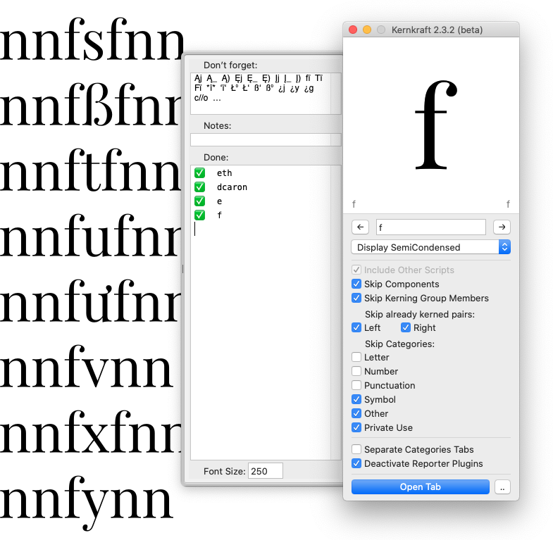

原文: [Kerning](https://glyphsapp.com/learn/kerning)
# カーニング

チュートリアル

執筆者: Rainer Erich Scheichelbauer

[ en ](https://glyphsapp.com/learn/kerning) [ fr ](https://glyphsapp.com/fr/learn/kerning) [ zh ](https://glyphsapp.com/zh/learn/kerning)

2023年10月4日更新（初版公開：2013年3月25日）

グリフのペアの中に囲まれた空白を変更することをカーニングと呼びます。ここでは、Glyphsでそれを行う方法を、あなたの作業を簡単にするためのたくさんの良いヒントと共にご紹介します。

カーニングは通常、フォント制作プロセスの非常に遅い段階で行うものです。グリフの[スペーシングを適切に行う](spacing/.md)ことで、できるだけ遠くまで進んでみてください。しかし、どれだけうまくやっても、一部の文字の組み合わせは決してうまくいかないことに気づくでしょう。これが、カーニングなしではやっていけない点に達したときです。よくある例の一つが、「VA」の組み合わせ、つまり大文字のVの後に大文字のAが続く場合です。

これは重要です。カーニングという用語は、2つの文字の*組み合わせ*、つまりグリフの*ペア*に囲まれた空白を調整することを意味することを覚えておいてください。単一の文字をカーニングすることはできません。単一の文字の左右のサイドベアリングを調整することは、スペーシングと呼ばれます。

## ショートカット

さて、VとAのサイドベアリングを最適化しましたが、まだその間に空白が多すぎます。これは、「VAND」のような単語を入力すると明らかになります。これはデンマーク語で「水」を意味し、ルーマニア語とモルドバ語では「売る」を意味すると信じています。（実際には、後者は「vând」とサーカムフレックス付きで綴られると、信頼できる情報源から聞いています。）調整が必要な組み合わせだけを入力するのではなく、空白がすでに適切に見えるいくつかの文字を文脈として追加することをお勧めします。この方法で、直接比較ができます。そして、この例では、NとDの間のスペースはかなり良いと思います。


### プロのヒント
スペーシングとカーニングは、意図したフォントサイズで判断するようにしてください。ズームインしすぎると、カーニングをきつくしすぎる傾向があります。左下の目のシンボルでプレビューエリアを開き、区切り線を適切なサイズにドラッグして、正気を保ちましょう。

でも、「VAND」というより「V AND」に見えますよね？もし同意するなら、VとAの間のスペースについて何かをする必要があります。言い換えれば、「VA」をカーニングする必要があります。

最も簡単な方法は、VとAの間にカーソルを置き、CtrlキーとOptキーを押しながら、左右の矢印キーでカーニングを調整することです。Shiftキーを追加すると10単位ずつ増減します。


Optキーが追加されていることを除けば、これらは文字の左サイドベアリングを調整するためのショートカット、Ctrl-矢印キーまたはShift-Ctrl-矢印キーと同じであることにお気づきかもしれません。論理的な私たちなら、RSBスペーシングのショートカット、Cmd-矢印キーまたはShift-Cmd-矢印キーにOptキーを追加すると、現在の文字の右側のカーニングを操作する結果になるはずです。そして、実際にはそうなります。Cmd-Opt-矢印キーまたはShift-Cmd-Opt-矢印キーは、この例ではAとNの間のカーニングを変更します。

## カーニングペアの表示

計測ツール（ショートカットL）に切り替えることで、サンプルテキスト内のカーニングペアを追跡できます。負のカーニングは水色で、正のカーニングは薄黄色で表示されます。この例のフォントには必要ありませんが、NとDの間に正のカーニングを追加して、どのように見えるかを示しました。


### プロのヒント
「Glyphs > 環境設定 > 外観 > カーニングインジケーターの色」で色をカスタマイズしてください。

実際、テキストツール（ショートカットT）でも、これらの色の小さな断片が見えます。「表示 > メトリクスを表示」（Shift-Cmd-M）がオンになっていて、十分にズームインしていることを確認してください。


また、グレーの情報エリア（Cmd-Shift-I）では、現在の文字に関連するカーニング値を見ることができます。この例では、VとAの間のカーニングは-80です。


## グループカーニング

おそらく、「VA」を「VÄ」、「VÅ」、「VÀ」と同様に、そしておそらく「WA」とも同じようにカーニングしたいでしょう。この場合、グリフをグループに入れ、カーニングを特定のグリフだけでなく、グリフの*グループ*全体に適用することができます。この場合、VとWは1つのグループを形成し、A、Ä、Å、Àは別のグループを形成します。

では、どうすればよいのでしょうか？簡単です。各グリフには、その情報パネル（Cmd-Shift-I）に「グループ」とラベル付けされた2つのフィールドがあります。さて、ここが重要です。各グリフは、1つの左グループと1つの右グループに属することができます。良い例は小文字のæです。左側はaのように見え、右側はeのように見えます。そこで、左の「a」グループと右の「e」グループに入れます。


**グループ名は任意です。** 例えば、e、c、o、qの左カーニンググループは、同じシェイプを共有しているため、`o`と名付けることができます。しかし、あなたにとって意味があれば、`lowercaseRound`など、別の名前を付けることもできます。メトリクスキー（[スペーシング](spacing.md)チュートリアル参照）とは異なり、*カーニンググループ名はグリフへの参照ではありません。*

### ヒント
「左」と「右」の使用法に関する補足：「右カーニンググループ」はカーニングペアの「左グリフ」になり、その逆もまた然りです。例えば、Lの右グループはTの左グループとカーニングし、Lはカーニングペアの左グリフで、Tは右にあります。「まあ、そうだよね、だから何」とあなたが言うのが聞こえますが、書体デザイナー間のコミュニケーションでは、以前に混同されたことがあります。ですから、もし不確かなら、再確認してください。

さて、カーニングエントリの隣にある鍵の記号に注目してください。

*   **もし鍵が閉じていれば、グループカーニングです。** これは、カーニング値が表示されている個々のグリフだけでなく、グループ全体に適用されることを意味します。
*   **もし鍵が開いていれば、カーニングの例外です。** つまり、その値は表示されているそのグリフにのみ適用され、グループ全体には適用されません。

この例では、「væ」のカーニングは右のvグループのすべてのグリフに適用されますが、æにのみ適用され、左のaグループの他のグリフ、つまり「va」や「vä」、「và」などには適用されません。個人的には、ここでは例外をお勧めしませんので、その鍵を再び閉じるでしょう。

カーニングペア「æw」は、値-10で、右のeグループと左のwグループのすべてのグリフに適用されます。したがって、カーニング値はew、èw、éẃ、ëẅ、ẽẁ、œwなどのペアにも適用されます。お分かりですね。

グループを管理する良い方法は、ウィンドウの左上隅にあるこのボタンでフォントビュー（Cmd-Opt-1）をリストモードに切り替えることです。


そうすれば、スプレッドシートのようにグリフのデータを管理できます。


Tabキーを押すと次のフィールドに移動し、Shift-Tabキーで前のフィールドに移動します。Returnキーを押すと次の行に移動します。列ヘッダーをクリックするとソートされ、もう一度クリックするとソート順が逆になります。列ヘッダーを右クリックすると列をカスタマイズできます。

## グループの一括設定

カーニンググループを一度に複数のグリフに適用できます。フォントビュー（グリッドまたはリストモード）で複数選択し、ウィンドウの左下にある設定を操作します。


グリッドモードでは、複数のグリフを選択してコンテキストメニューを呼び出し（右クリックまたはCtrlキーを押しながらクリック）、そこでカーニンググループを設定することもできます。


## グループの表示

グループカーニングを行うときは、「表示 > グループメンバーを表示」を有効にすると、Glyphsは現在の文字ペアのすべてのグループメンバーを互いに重ねて表示します。複雑に聞こえますが、1枚のスクリーンショットがすべてを一目で説明してくれます。


それぞれのカーニンググループのすべてのメンバーを、すべてのダイアクリティカルマークを含めて見ることができます。これにより、衝突の可能性をずっと簡単に見つけることができます。そして、いつ例外を導入すべきかがわかります。

## カーニングの例外

さて、例外とは何かを確立しました。それは、2つの鍵のうち少なくとも1つが開いているときです。したがって、カーニングの例外には3つのタイプがあります。

*   **グループ対グリフ：** 左の鍵は閉じており、右の鍵は開いています。左側のグループのすべてのグリフは、右側のその単一のグリフとカーニングします。
*   **グリフ対グループ：** 左の鍵は開いており、右の鍵は閉じています。左側の単一のグリフは、右側のグループのすべてのグリフとカーニングします。
*   **グリフ対グリフ：** 両方の鍵が開いています。左側の単一のグリフは、右側の単一のグリフとカーニングします。

すべて良いですが、いつどの鍵を開ける必要があるのでしょうか？簡単です。例外の側の鍵を開けます。良い例を挙げましょう。例えば、「Yo」を-70ユニットでカーニングしたとします。このように。


もちろん、グループカーニングの利点を活かしたいので、鍵は閉じています。結局のところ、「Yø」や「Yó」は、「Ýo」や「Ỳç」、そしてYのダイアクリティカルマークと小文字の丸い文字の他のすべての組み合わせと同様に、全く問題なく見えます。そして、すべてのダイアクリティカルマークの組み合わせをチェックし、これに遭遇します。


öのウムラウトマークがYに近づきすぎています。グループカーニングを変更するだけでは、元の「Yo」ペアにギャップができてしまいます。そこで、odieresisの鍵を開き、Ctrl-Opt-Shiftを押しながら右矢印を繰り返し押し、グループ対グリフの例外を作成します。


oグループの他のすべての文字は、グループカーニングされたままです。odieresisだけが個別の例外を持ちます。大文字に小文字のダイアクリティカルマークが付くのは、ラテン文字における例外の最も頻繁なシナリオです。したがって、グループ対グリフのカーニングはよく起こります。

時々、グリフ対グループの状況もあります。例えば、QとOが同じ右グループを共有している場合などです。通常、Qは右側でより多くの衝突を起こします。例えば、「Qp」というペアの場合です。その場合、左の鍵（Qの右側の鍵）を開き、正のカーニングを追加します。

ラテン文字やそれに類する単純なスクリプトでは、両方の鍵を開けることはかなり稀です。しかし、特に狭いダイアクリティカルマークでは、それも起こります。恐ろしい組み合わせ「ïï」（二重iウムラウト）も、これらの状況に含まれます。

## カーニング戦略

最終的に数百、場合によっては千を超えるカーニングペアになるため、カーニングに体系的に取り組むのが良い方法です。もちろん、デザイナーによって異なる方法がアドバイスされますが、ほとんどの人は大まかにこれに同意するでしょう。

*   **グループカーニング**
    *   カーニンググループを設定する。
    *   右グループと左グループの組み合わせを見ていき、鍵を閉じたままにすることを確認する。その際、グリフをグループ化し、どのグループのペアが意味をなすかを決定する。例えば、
        *   小文字と小文字
        *   大文字と小文字
        *   大文字と大文字
        *   文字の周りの句読点
        *   （プロポーショナル）数字の周りの句読点
        *   句読点と句読点
    *   カーニングしすぎない：参照用にカーニングされていないペア（「nn」や「HH」など）を近くに置いておく。
    *   特定のグリフ、例えば等幅数字などについては、カーニングを完全に避ける。
*   **例外**
    *   衝突や接近しすぎているペアを見つけ、最も意味のある場所（左、右、または両方）で鍵を開け、正のカーニングを追加する。
    *   ギャップのあるペアを見つけ、最も意味のある場所で鍵を開け、負のカーニングを追加する。
    *   カーニングしすぎを避ける。

最小カーニング値とインクリメント値を決めましょう。通常、スペーシングはできるだけ正確に行い、カーニングは大まかに行うのが理にかなっています。もし非常に小さいカーニングペア（10ユニット未満）がたくさん必要だと感じたら、スペーシングを見直すことを検討してください。

## ヒント

コツをつかめば、キーボードショートカットのCtrl-Opt-矢印キーやShift-Ctrl-Opt-矢印キーは非常に便利で、Cmd-Opt-矢印キーやShift-Cmd-Opt-矢印キーは次のカーニングペアにも使えます。唯一の問題は、時々Optキーから指が滑り、突然スペーシングをめちゃくちゃにしてしまうことです。しかし、恐れることはありません、助けがあります！ウィンドウの右下にある鍵を繰り返しクリックして、このように見えるまで、Glyphsを**カーニングのみモード**に切り替えることができます。


これは、スペーシングが無効になり、カーニングが有効になることを意味します。したがって、Ctrl-矢印キーは効果がなく、何も起こりません。もちろん、そのアイコンをもう一度クリックするまでは。

ついでに言えば、**サンプルテキストを順に見ていく**ためのキーボードショートカットを設定するのは良い考えです。「Glyphs > 環境設定 > サンプル文字列」で良いテキストサンプルを設定します。次に、「編集 > サンプルテキストを選択…」でアクセスします。そして、「Glyphs > 環境設定 > ショートカット」で、「編集 > その他 > 次のサンプル文字列を選択」と「編集 > その他 > 前のサンプル文字列を選択」にキーボードショートカットを追加できます。この方法で、カーニングし、次のサンプル文字列に進み、カーニングし、次のサンプル文字列に進み、カーニングし、というように、飽きるまで続けることができます。そして、カーニング中に速い音楽をかければ、さらに速くカーニングできます。

**負のオーバーカーニングは避けましょう。** どのグリフも、その幅の半分以上カーニングされるべきではありません。それより少ない方が良いです。安全のために、個人的にはグリフの幅の40%以上カーニングしないことをお勧めします。なぜなら、そうしないと「T.T」という3文字組が「TT」というペアよりも狭くなってしまうからです。そして、これも最も典型的な例です。コンマやピリオドのような句読点が続く大文字です。

**GPOSテーブルのオーバーフローを避ける。** 内部的に、OpenTypeフォントはいわゆるテーブルで構成されており、情報を保持しています。これらのテーブルの一つがGPOSと呼ばれ、「glyph positioning（グリフの位置決め）」の略です。とりわけ、すべてのカーニング情報がここに保存されます。時々、そのテーブルが「オーバーフロー」します。つまり、許可される最大値である64キロバイトより大きくなるのです。もしフォントを書き出そうとしてGPOSオーバーフローエラーが出た場合は、以下のいずれかを行ってください。

*   カーニングの量を減らす：小さくて重要でないペアを取り除く。ラテン文字のみのフォントは、500から1500ペアの間であるべきで、それ以上ではありません。キリル文字では、通常はるかに少ないカーニングです。
*   例外の量を減らす：グループ対グリフおよびグリフ対グループのカーニングは問題を引き起こします。特に、関与するグループが大きい場合です。
*   「ファイル > フォント情報 > フォント」で、カスタムパラメータ「Use Extension Kerning」を追加します。これはいくつかの魔法を行い、より多くのカーニングを可能にします。以前は互換性が低いと見なされていたため問題がありましたが、実際には、拡張カーニングをサポートしない古いアプリはすべて20年以上前のものであり、それらのアプリは無視する方が良いでしょう。

次に、エラーなしでフォントが書き出されるまで、再度書き出しを試みてください。

## カーニングの読み込み

もしすでに一つのフォントで独自のグループを設定しており、最前面にあるファイルにも同じグループを持たせたい場合は、

*   ターゲットフォントのすべてのグリフを選択してください。なぜなら、これは選択されたグリフのカーニングのみを読み込むからです。
*   「ファイル > 読み込み > メトリクス」を選び、カーニンググループをコピーしたいフォントファイルを選びます。
*   表示されるダイアログで、カーニングおよび/またはカーニングクラス（グループの別名）を読み込むかどうかを選択します。


インポート機能はUFOおよびGlyphsファイルを受け付けます。「カーニングを読み込む」オプションは、.ufoファイルから読み込む場合にのみ有効です。しかし、待ってください、もし.glyphsファイルからカーニングを読み込みたい場合はどうすればよいでしょうか？

簡単です。カーニングウィンドウを使います。読み進めてください。

## カーニングウィンドウ

「ウインドウ > カーニング」、別名カーニングウィンドウを介して、カーニングを管理、ソート、そして何よりもコピー＆ペーストできます。コピーしたいカーニングペアを選択（またはCmd-Aで全部選択）し、コピーして、別のフォント（または同じフォントの別のマスター）に切り替えて、そのフォントのカーニングウィンドウにペーストするだけです。カーニンググループは、先頭にアットマーク（@）が付いて青色で、個々のグリフは茶色で表示されます。


そしてもちろん、カーニングウィンドウでは、現在選択されているフォントマスターと書字方向のすべてのカーニングペアの概要が表示されます。


それぞれの列ヘッダーをクリックすることで、カーニングをソートできます。列ヘッダーをもう一度クリックすると、ソート順が昇順と降順の間で切り替わります。「カーニング」ウィンドウでペアをクリックすると、Glyphsは選択されたペアのグリフをメインウィンドウの現在のカーソル位置に挿入します。もし多くのカーニングペアがある場合は、検索フィールドを使って欲しいものを素早く見つけることができます。検索フィールドの隣にある小さな虫眼鏡をクリックすると、追加の検索オプションにアクセスできます。


### ヒント
もし探しているカーニングが見つからない場合は、検索オプションが選択されている可能性があります。そのメニューから「リセット」を選ぶことで、それらをリセットする必要があります。

待ってください、まだあります。カーニングウィンドウの右下にある歯車メニューを見てください。そこには3つの便利な機能が隠されています。

1.  *クリーンアップ*は、効果のないカーニング値、例えば、もはやフォントにない文字のカーニングエントリのような残り物を削除します。
2.  *圧縮*は2つのことを行います。第一に、可能な限り例外をグループカーニングに変えます。正確には、グリフ対グリフのカーニングをグループ対グリフのカーニングに、そしてグリフ対グループまたはグループ対グリフのペアをグループ対グループのカーニングに変えます。ですから、2回圧縮する必要があるかもしれません。第二に、不要なカーニングの例外を削除します。例えば、AグループとVグループの間のグループカーニングが-80であるにもかかわらず、個別の「ÄV」カーニングペアが-80である場合です。そのカーニングの例外は目に見える違いをもたらさないため、「圧縮」機能はそれを不要と見なし、削除します。
3.  *すべてのグリフを表示*は、現在選択されているカーニングペアのすべての可能な組み合わせの概要を表示します。左側のすべてのグループメンバーと右側のすべてのグループメンバーです。


## カスタムインクリメント

もし、1ユニット単位のインクリメントがカーニングでうまくいかないと思うなら、独自の値を設定できます。これを行うには、「ウインドウ > マクロパネル」を開き、以下をペーストします。
```python
Glyphs.defaults["GSKerningIncrementHigh"] = 20
Glyphs.defaults["GSKerningIncrementLow"] = 5
```
次に、「実行」ボタンを押します。これにより、Cmd-Option-矢印キーとCtrl-Option-矢印キーが5ユニット単位のステップに、Shift-Cmd-Option-矢印キーとShift-Ctrl-Option-矢印キーが20ユニット単位のステップに設定されます。もちろん、5と20の数字は、自分が快適に感じる任意の値に置き換えることができます。

カーニングのインクリメントをデフォルトに戻すには、マクロウィンドウでこのコードを実行するだけです。
```python
Glyphs.defaults["GSKerningIncrementHigh"] = None
Glyphs.defaults["GSKerningIncrementLow"] = None
```
これにより設定が削除され、Glyphsはデフォルトの1および10ユニットのインクリメントに戻ります。

## 便利な拡張機能

カーニングに対処するのに役立つ多くのプラグインやスクリプトがあります。「ウインドウ > プラグインマネージャ」を自由に探してみてください。いくつかハイライトを紹介します。

### プラグイン

[Kern-A-Lytics](glyphsapp3://showplugin/Kern-A-Lytics) by Frank Grießhammerは、マスター間のカーニングを視覚化し、カーニング値の編集、平均化、補間を可能にします。不整合を見つけるのに便利です。Glyphsのリード開発者であるGeorg Seifert氏がGlyphsに移植しました。


[Show Kern Values](glyphsapp3://showplugin/Show%20Kern%20Values)は、テキストの上にカーニング値を表示します。


Mark Frömberg氏の[Show Kerning Groups](glyphsapp3://showplugin/Show%20Kerning%20Groups)は、現在のグリフの左右のカーニンググループのすべてのグリフを重ねて表示します。複雑に聞こえますか？でも、見れば一目瞭然です。


[Remove Kerning Exceptions](glyphsapp3://showplugin/Remove%20Kerning%20Exceptions)は、現在のマスターで選択されたグリフのすべてのカーニングの例外を削除し、グループカーニングのみを残します。*Rename Glyphs*パラメータで文字の形を変更し、そのカーニングの例外がもはや適用されないような状況で役立ちます。

Mark Frömberg氏の[Kernkraft](glyphsapp3://showplugin/Kernkraft)は、カーニングされていないペアをリストアップします。インストール後、「グリフ」メニューで見つけることができます。これは[wikiのステップバイステップのドキュメント](https://github.com/carrois/Kernkraft/wiki)が付属しています。



ちなみに、同じダウンロードには*Kernschmelze*も含まれています。これは、フォントファミリーのマスター間でカーニングをコピーしたり補間したりするのに役立ちます。


### スクリプト

[mekkablue scripts](glyphsapp3://showplugin/mekkablue%20scripts)には、広範な*Kerning*サブメニューがあります。以下にハイライトをいくつか挙げますが、詳細については[readme](https://github.com/mekkablue/Glyphs-Scripts/blob/master/README.md#kerning)を参照してください。

*   *Set Kerning Groups*は、各グリフの各側のカーニンググループをかなりうまく推測します。あちこちで結果を調整する必要があるかもしれませんが、かなり進むことができます。
*   *Adjust Kerning in Master*は、すべてのカーニングペアに値を追加したり、すべてのペアを値で乗算したり、値で丸めたりできます。
    
*   *Auto Bumper:* 最小距離、左右のグリフを指定すると、Auto Bumperは現在のマスターに必要な最小限のカーニングを追加します。
*   *GapFinder*と*KernCrasher*は、大きなギャップがある、または間にスペースが少なすぎるカーニングコンボを含む新しいタブを開きます。
    
*   *New Tab with Overkerned Pairs:* しきい値のパーセンテージを尋ね、幅のしきい値を超えるすべての負のカーニングペアを含む新しいタブを開きます。
*   *Sample String Maker:* ユーザー定義のカテゴリ用のカーニング文字列を作成し、それらをサンプル文字列に追加します。グループカーニングのみで、グループのないグリフは無視されます。
*   *Remove Small Kerning Pairs*と*Exception Cleaner*は、不要なカーニングペアを減らすのに役立ちます。
    

[Toshi Omagariのスクリプト](glyphsapp3://showplugin/Glyphs-Scripts)には、カーニングを管理するためのいくつかのスクリプトが含まれています。その中には、

*   *Display Unlocked Kerning Pairs*は、編集ビューで例外を表示します。
*   *Rename Kerning Groups*は、カーニンググループとそれに関連するペアの名前を変更します。
*   *Permutation Text Generator*は、カーニング用のグリフ順列サンプルテキストを出力します。
    
*   *Copy Kerning Pairs*は、例えば大文字からスモールキャップへといったパターンをコピーします。ペア対ペアおよびプリセットグループのコピーをサポートします。
    

Tim Ahrens氏の[Freemix scripts](glyphsapp3://showplugin/JAF%20Freemix%20Scripts%20by%20Tim%20Ahrens)（完全な[readme](https://github.com/justanotherfoundry/freemix-glyphsapp)）には、カーニングを*拡張*するためのスクリプトがあります。拡張とは、圧縮の反対を意味します。グループカーニングをすべての可能なカーニングの例外に変えます。これは、多くの例外ペアを意味します。警告はしましたよ。

### Kern On

一番良いものを最後に取っておきました。Tim Ahrens氏が[Kern On](https://kern-on.com)という商用プラグインを書きました。これは、あなたが行ったカーニングを見て、それを1分で仕上げてくれます。カーニンググループの設定は不要で、良いスペーシングだけが必要です。そして200ドルで、このチュートリアルの内容を完全に忘れることができます。ただ言っているだけです。

---
サンプルフォント：[Playfair Display](http://www.google.com/webfonts/specimen/Playfair+Display)、Claus Eggers Sørensen氏提供、Lawabo UnroundedとPlantagoのカメオ出演、Schriftlabor提供。

---

更新履歴 2016-02-16: Glyphs 2向けに更新（Sacha Rein氏に感謝）。

更新履歴 2018-01-30: カスタムステップ、スクリプト、および「Show All Glyphs」に関する注記を追加。

更新履歴 2018-08-10: 「View > Show Group Members」を追加。

更新履歴 2019-03-26: 誤字を修正（Nathalie Dumont氏に感謝）。

更新履歴 2021-09-29: Glyphs 3向けに更新、新しいスクリーンショット、拡張機能、ヒント、戦略を追加、部分的に書き直し。

更新履歴 2022-11-03: 余分な単語を削除（Curtis氏に感謝）。

更新履歴 2023-10-04: 異なる文脈での左と右という用語に関する注記を追加（Michael氏に感謝）。

## 関連記事

[すべてのチュートリアルを見る →](https://glyphsapp.com/learn)

*   ### [文脈依存のカーニング](contextual-kerning.md)

チュートリアル

[ OpenTypeフィーチャー ](https://glyphsapp.com/learn?q=opentype+features)

*   ### [スペーシング](spacing.md)

チュートリアル