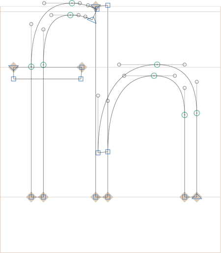

原文: [Ligatures](https://glyphsapp.com/learn/ligatures)
# 合字（リガチャ）

チュートリアル

[ OpenTypeフィーチャー ](https://glyphsapp.com/learn?q=opentype+features)

執筆者: Rainer Erich Scheichelbauer

[ en ](https://glyphsapp.com/learn/ligatures) [ fr ](https://glyphsapp.com/fr/learn/ligatures) [ zh ](https://glyphsapp.com/zh/learn/ligatures)

2022年7月23日更新（初版公開：2012年10月25日）

合字の作成方法を知りたいですか？とても簡単です。試してみてください。

時々、文字が衝突してあまり見栄えが良くないことがあります。これは、通常、次の文字にまで伸びる小文字のfでよく起こります。そして、もしその次の文字がl、b、hのようなアセンダーを持つ場合、文字は衝突します。このようなときに、書体デザイナーは合字グリフを作成することを決定します。

## 合字の作成

例えば、小文字のfが小文字のhと衝突するとします。


あまり良くありませんね。そこで、合字グリフを作成しましょう。「グリフ > グリフを追加…」を選び、合字の個々の部分のグリフ名をアンダースコアで繋げて、`f_h`と入力します。Glyphsは、`f`と`h`のコンポーネントで合字を事前に構築します。


さて、これらのコンポーネントを個別のパスに変え、元の`f`と`h`へのリンクを切断すべきです。これを行うには、「グリフ」メニューから「コンポーネントを分解」（Cmd-Shift-D）を選びます。これでアウトラインが得られます。

### プロのヒント
複数のマスターがある場合、Optionキーを押しながら行うと、メニューコマンドが「グリフ > すべてのマスターでコンポーネントを分解」（Cmd-Opt-Shift-D）に変わります。



そして、好みに合わせて編集できます。


OK、笑わないでください。私は地球上で最高の合字ビルダーではありませんから。いずれにせよ、これでグリフの作成は完了です。しかし、どうやって機能させるのでしょうか？

## 合字フィーチャーの作成

合字はOpenTypeフィーチャーを介して機能します。もしGlyphsがグリフの中に適切に名付けられた合字を見つければ、それらを自動的に作成できます。「ファイル > フォント情報」（Cmd-I）を開き、「フィーチャー」タブに移動して、左下の「更新」ボタンを押すだけです。


そして、おそらく他のいくつかのものと一緒に、Glyphsは`dlig`というフィーチャーを作成します。それをクリックすると、フィーチャーコードを見ることができます。
```
sub f h by f_h;
```
これは、「f」に続く「h」のシーケンスを、合字グリフ「f_h」で置き換えることを意味します。まさに私たちが望んでいたことです。やった！

## liga vs. dlig

しかし、待ってください、なぜ`dlig`なのでしょうか？これは[discretionary ligatures（任意の合字）](https://docs.microsoft.com/en-us/typography/opentype/spec/features_ae#dlig)の略で、このフィーチャーが「デフォルトでオフ」であることを意味します。つまり、ユーザーが最初に有効にする必要があります。

もしデフォルトでオンにしたい場合は、`liga`（[standard ligatures（標準の合字）](https://docs.microsoft.com/en-us/typography/opentype/spec/features_ko#liga)）というフィーチャーに入れるべきです。最も良い方法は、グリフ名に`.liga`という接尾辞を追加することです。この場合、私たちの合字を`f_h.liga`にリネームできます。

さて、再び「更新」ボタンを押すと、ほら、これを含む`liga`フィーチャーができます。
```
sub f h by f_h.liga;
```
はい！参考までに、一部の合字グリフはすぐに`liga`に配置されるため、接尾辞は必要ありません。完全なリストはこちらです。
```
fi
fl
f_f
f_f_i
f_f_l
```
`fi`と`fl`が上記で述べた命名規則に従っていないことにお気づきかもしれません。それは、これらが歴史的な例外だからです。これらの2つのグリフ名は、OpenTypeよりずっと前から存在していました。実際には、もし望むなら`f_i`と`f_l`と呼ぶこともできますが、繰り返しになりますが、`.liga`接尾辞を追加しない限り、それらは`dlig`に入ります。

## 合字のアンカー

合字にアンカーを追加すると、通常とは少し異なるアンカーが得られます。そこで、「グリフ > アンカーを設定」（Cmd-U）を選ぶか、複数のマスターがある場合はOptキーを押しながらコマンドを「グリフ > すべてのマスターにアンカーを設定」（Cmd-Opt-U）に変えて実行すると、次のようになります。

*   `top_1`、`top_2`、`bottom_1`、`bottom_2`など：すべてのアクセントアンカーは、合字の各部分について指定する必要があります。したがって、アンカー名は単一のグリフと同じですが、文字の番号を示すアンダースコアと数字の接尾辞が付きます。例えば、`top_3`は、合字の3番目の文字のトップアンカーを意味します。これらのアンカーは、複合グリフとマーク対ベースの位置決めの両方で機能します。
*   `caret`アンカー：できればベースライン上に配置してください。これらのアンカーは、ユーザーが合字を含む単語内をカーソルで移動するときの、カーソルの可能な位置を示します。3文字以上の合字がある場合、アンカーの順序は問題ありません。重要なのはx座標だけです。したがって、単語内でカーソルを後退させることはできません。注意：すべてのアプリがキャレットの位置決めをサポートしているわけではありません。TextEditのようなMacアプリはサポートしていますが、Adobeアプリはサポートしていません。

もしアンカーをきれいに配置できれば、あなたの合字のアンカーは次のようになります。


## 合字のテスト

実際に機能するか見てみたいですか？編集タブ（Cmd-T）を開き、合字のシーケンスを含む単語、例えばこの場合は「hifhum」と入力します。（それが何かを意味するとは思いませんし、もしそうなら、何か悪いことでないことを願います。）さて、ウィンドウの左下にある「フィーチャー」ボタンをクリックし、表示されるポップアップメニューから合字フィーチャーのいずれかを選びます。


そして、合字が適用されます。


もしうまくいかない場合は、グリフ名が正しいか確認し、おそらく「フォント情報 > フィーチャー」の「更新」ボタンを押すか、編集ビューのフィーチャーポップアップメニューから「フィーチャーを更新」を選ぶことで、フィーチャーコードを再生成してください。

## 便利なスクリプトとプラグイン

**Ligature Caret:** Friedrich Althausen氏が、キャレットの位置決めを視覚化するこのプラグインを作成しました。[プラグインマネージャで無料で入手](glyphsapp3://showplugin/Ligature%20Caret)し、「表示 > Ligature Caret」で有効にしてください。

**アラビア語のアンカーの順序付け：** [mekkablue scripts](glyphsapp3://showplugin/mekkablue%20scripts)には、「Anchors > Fix Arabic Anchor Ordering in Ligatures」があり、`lam_alef-ar`のようなすべてのアラビア語の合字で、番号付きのトップアンカーとボトムアンカーをすべて右から左に並べ替え、座標を保持します。ファイル形式の変換で、アンカーの順序が間違っていることがあります。もしあなたのフォントが影響を受けているなら、このスクリプトを一度実行すれば修正されるはずです。

さて、これくらいです。合字作りを楽しんでください！

---

更新履歴 2016-02-19: Glyphs 2のスクリーンショットを更新。

更新履歴 2019-04-10: *Layers*メニューを*Glyph*メニューに変更。

更新履歴 2020-12-04: リンクとスクリーンショットを更新、Glyphs 3向けの軽微な変更。

更新履歴 2022-07-23: *Ligature anchors*と*Useful scripts and plug-ins*を追加。

## 関連記事

[すべてのチュートリアルを見る →](https://glyphsapp.com/learn)

*   ### [フィーチャー、パート1：単純な置換](features-part-1-simple-substitutions.md)

チュートリアル

[ OpenTypeフィーチャー ](https://glyphsapp.com/learn?q=opentype+features)