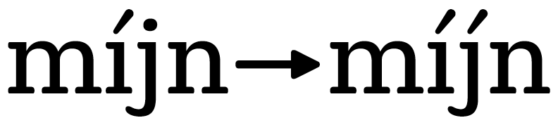
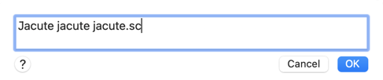

原文: [Localize your font: accented Dutch IJ](https://glyphsapp.com/learn/localize-your-font-accented-dutch-ij)
# フォントをローカライズする：アクセント付きのオランダ語のIJ

チュートリアル

[ 言語 ](https://glyphsapp.com/learn?q=languages) [ OpenTypeフィーチャー ](https://glyphsapp.com/learn?q=opentype+features)

執筆者: Rainer Erich Scheichelbauer

[ en ](https://glyphsapp.com/learn/localize-your-font-accented-dutch-ij) [ fr ](https://glyphsapp.com/fr/learn/localize-your-font-accented-dutch-ij) [ zh ](https://glyphsapp.com/zh/learn/localize-your-font-accented-dutch-ij)

2022年8月11日更新（初版公開：2012年9月17日）

オランダ語を話す人々は、アキュートアクセントを付けることで音節を強調することができます。したがって、「ík」は特別な強調が加わった「ik」です。特殊なケースが一つあります。それはijです。iとjの両方にアクセントを付ける必要があります。問題は、アキュート付きのjがないことです。簡単な解決策を見つけましょう。

オランダ語には一つの特殊性があり、それは[IJ/ij](<http://en.wikipedia.org/wiki/IJ_\(digraph\)>)です。これは、短いei（*korte ei*）に対して長いij（*lange ij*）とも呼ばれます。ijを[別の文字と見なすべきかどうか](http://taaladvies.net/taal/advies/vraag/1194)については、長い議論がありました。公式には、それは2つの別々の文字と見なされていますが、スペル上は単一の文字のように扱われます。

タイポグラフィの世界でも、IJとijのダイグラフの両方の部分を一緒に保つべきか、ポジティブトラッキングが適用されたときにスペースを空けるべきかについて、意見が分かれています。ほとんどの、しかしすべてのタイポグラファーが、iとjの部分が別々に描かれている場合（ダイグラフデザイン）、あるいはiとjと同等である場合は、他の文字と同様にトラッキングで離すべきだと同意するでしょう。実際に合字として描かれている場合（合字デザイン）のみ、ポジティブトラッキング環境でも一体性を保つべきです。

参考までに、Unicodeには実際に`U+0132 LATIN CAPITAL LIGATURE IJ`と`U+0133 LATIN SMALL LIGATURE IJ`がありますが、これらは単なる[互換性文字](http://en.wikipedia.org/wiki/Unicode_compatibility_characters)です。つまり、後方互換性の理由からのみ存在し、その使用は推奨されていません。さらに、IJキーを持つキーボードは存在せず、Unicode U+0132やU+0133を生成する広範なキーボードレイアウトもありません。したがって、これについては安全に忘れて構いません。

## Jのアクセント

オランダ語の書き言葉では、[母音にアクセントを付ける](http://woordenlijst.org/leidraad/5/1/)ことで音節に特別な強調を加えることができます。*ík*は*ik*の代わりに、*dóén*は*doen*の代わりに、*vóór*は*voor*の代わりになどです。そして、はい、お察しの通りです。IJ/ijが強調されるとき、I/iとJ/jの両方にアキュートを付けなければなりません。

さて、Unicodeを使えば、jにアキュートを付けることが可能です。確かに、アキュート付きのJ/jはエンコードされていませんが、J/jは*あります*し、`U+0301 COMBINING ACUTE ACCENT`も*あります*。ですから、マークアタッチメントをそれに使うことができます。理論的には、ユーザーが必要なのは、jを入力し、その後に結合する、非スペーシングのアキュートを入力することだけです。もしユーザーが結合アキュートの入力方法を知っていれば、問題はありません。問題は、そのようなユーザーが稀であることだけです。

大多数、より正確に言えば、事実上すべてのオランダ語とフラマン語のユーザーは、キーボードでi-jまたはI-Jを別々に入力します。そして、それをアクセント付けするときは、それぞれí-jまたはÍ-Jと入力します。これは、私たちのフォントに、`iacute j`シーケンスを次のようなものに変換するOpenTypeフィーチャーが必要であることを意味します。



つまり、必要なのはアキュート付きのjだけですよね？簡単です。まず、フォントに`jdotless`と`acutecomb`（そして、もしデザインが必要とするなら、`acutecomb.sc`または`acutecomb.case`）があることを確認してください。これにより、2つのことが可能になります。第一に、フォントに結合アキュートがあり、アキュートを受け取ることができるドットなしのjがあるため、知識のあるユーザーがjに結合アキュートを追加できるようになります。第二に、次のステップでGlyphsがそれぞれの複合グリフを事前に作成できるようになります。読み進めてください。

ほとんどの場合と同様に、もしあなたのijがダイグラフデザインなら、単に`jacute`と`Jacute`をフォントに追加するだけです。もしスモールキャップがあるなら、`jacute.sc`も追加するのを忘れないでください。これを行う最も手っ取り早い方法は、「グリフ > グリフを追加…」（Cmd-Shift-G）を実行し、表示されるダイアログに`Jacute jacute jacute.sc`と入力することです。「生成」ボタンを押すと、グリフがフォントに追加され、正しい複合グリフが含まれます。



## 強調されたIJのためのOpenTypeフィーチャー

さて、「ファイル > フォント情報 > フィーチャー」（Cmd-I）に進み、左下の「更新」ボタンをクリックしてOpenTypeフィーチャーを更新してください。次に、`locl`フィーチャーを見てください。Glyphsは以下の行を追加しているはずです。
```
language NLD;
sub iacute j' by jacute;
sub Iacute J' by Jacute;
```
もし小文字のiにアキュートが付いたものの後に小文字のjがタイプされた場合、または大文字のIにアキュートが付いたものの後に大文字のJがタイプされた場合、jまたはJは、私たちがフォントに追加したばかりの、アキュート付きの対応するものに置き換えられます。ただし、言語がオランダ語に設定されている場合に限ります。もし`locl`が自動化されておらず、自分でコードを書くことを好む場合は、これらの行を手動で追加する必要があります。

Glyphsは、「言語システム」プレフィックスにもこの行を追加します。
```
languagesystem latn NLD;
```
繰り返しになりますが、もしあなたの`Languagesystems`が自動化されていない場合は、この行をコードに追加するのを忘れないでください。さもないと、`locl`フィーチャーは機能しません。

もしフォントにスモールキャップがあるなら、スモールキャップフィーチャー`smcp`と`c2sc`には、それぞれ`jacute`を`jacute.sc`に、`Jacute`を`jacute.sc`に置き換える行があるはずです。繰り返しになりますが、もしこれらのフィーチャーを「フィーチャーを自動的に生成」オプションで自動化しないことを選んだ場合は、これらの、または類似の行をコードに追加するのを忘れないでください。

最後にチェックすべき場所は、`ccmp`というフィーチャーです。ルックアップの一つに、Glyphsはこの行を追加するはずです。
```
sub [i j]' @CombiningTopAccents by [idotless jdotless];
```
これが、適切なUnicodeソリューションがマークアタッチメントで機能するようにするコード行です。ドット付きのjは、結合する上付きアクセントがそれに加えられるたびに、ドットなしのjに置き換えられます。

## 合字デザインの代替案

もしあなたのIJやijが本当に合字になっているか、あるいは別の特別な形（例えば、Iが短くなっているなど）をしている場合は、代わりに`I_J.loclNLD i_j.loclNLD`と`Iacute_J.loclNLD iacute_j.loclNLD`を追加したいと思うでしょう。繰り返しになりますが、Glyphs（バージョン2.3.1以降）はOpenTypeフィーチャーコードを自動化できます。そして再び、もしスモールキャップがあるなら、適切な`.sc`バリアントを追加してください。

これだけです。Adobe InDesignやQuarkXPressのようなレイアウトプログラムで、テキストの言語をオランダ語に設定し、m-í-j-nとタイプすれば、jにもアクセントが付きます。クールですね。

---
サンプルフォント：[HENRIETTE](http://www.typejockeys.com/fonts/Henriette) BY TYPEJOCKEYS.

---

更新履歴 2014-09-02: Glyphs 2の新しいグリフ名に更新。

更新履歴 2016-05-30: 推奨されるj-acuteソリューションを反映するように書き直し。

更新履歴 2016-06-08: 合字デザインの代替案を追加。
Rob Mientjes氏に感謝します。

更新履歴 2019-10-24: タイトル、関連記事、軽微なフォーマットを更新、compoundsをcompositesに置き換え。