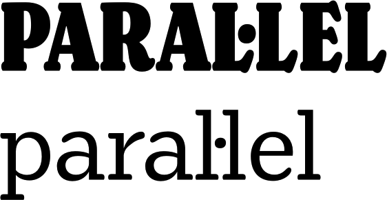
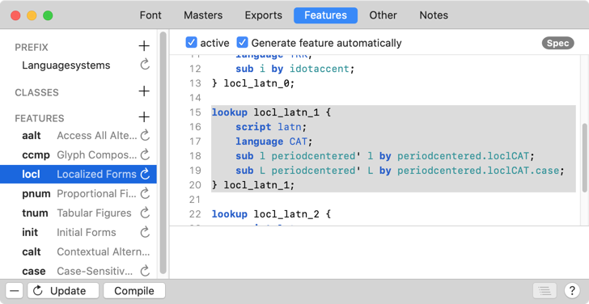
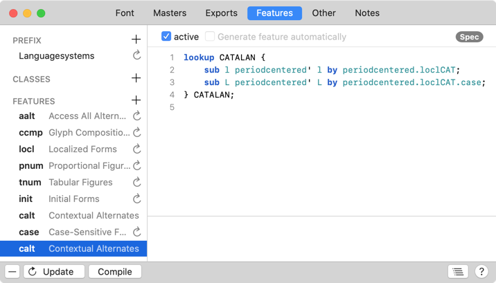
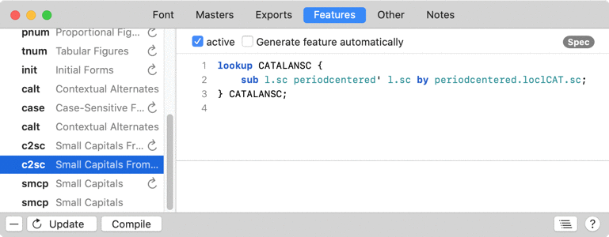
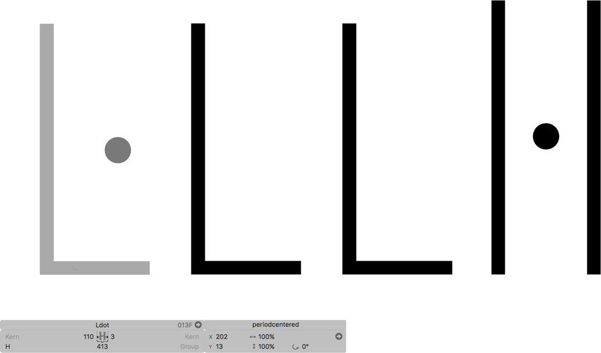

原文: [Localize your font: Catalan punt volat](https://glyphsapp.com/learn/localize-your-font-catalan-punt-volat)
# フォントをローカライズする：カタルーニャ語のプント・ヴォラット

チュートリアル

[ 言語 ](https://glyphsapp.com/learn?q=languages) [ OpenTypeフィーチャー ](https://glyphsapp.com/learn?q=opentype+features)

執筆者: Rainer Erich Scheichelbauer

[ en ](https://glyphsapp.com/learn/localize-your-font-catalan-punt-volat) [ fr ](https://glyphsapp.com/fr/learn/localize-your-font-catalan-punt-volat) [ zh ](https://glyphsapp.com/zh/learn/localize-your-font-catalan-punt-volat)

2023年5月10日更新（初版公開：2012年10月3日）

カタルーニャでは、2つのLの間に中黒の点が見られることがあります。その理由と、フォントへの実装方法をここで解説します。

カタルーニャ人は、2つのLの間に[プント・ヴォラット](http://en.wikipedia.org/wiki/Interpunct#Catalan)をタイプするとき、L·L（L–中黒–L）とタイプします。これは、それが*エラ・ジェミナーダ*であることを示すためで、発音が異なる二重のLとは区別されます。

### ヒント
エラ・ジェミナーダ（L·L）は英語のLのように発音されます。通常の二重のLは英語のYのように聞こえます。

タイポグラフィ的には、考慮すべきことが2つあります。第一に、2つのLまたはlの間にスペースはありません。言い換えれば、2つの単語ではなく、依然として1つの単語のように見えるべきです。したがって、中黒の挿入によって生じる余分な距離は、あまり大きすぎてはいけません。第二に、点は2つのLまたはlの間の視覚的な中心に現れる必要があります。



書体デザイナーは、この問題に対してさまざまな解決策を用います。個人的には、「スペーシングによる解決策」と「Ldotによる解決策」の組み合わせをお勧めします。しかし…急がないで、プント・ヴォラットを解決するための可能な方法を順に見ていきましょう。

## カーニングによる解決策

純粋なカーニングによる解決策を好む書体デザイナーもいます。このためには、単にL-中黒-Lのシーケンスをカーニングするだけです。編集タブにCOL·LEGIやparal·lelのようなカタルーニャ語の単語を入力し、満足がいくまで[カーニング](kerning.md)します。[コンテキストカーニング](contextual-kerning.md)を検討することもあるでしょう。

良い点は、これがAppleのTextEditや他のほとんどのCocoaアプリのような、言語に依存しない組版環境で機能することです。これは、Macのテキストエンジンが言語の指定を許可せず、したがって`locl` OpenTypeフィーチャー（ローカライズされたフォーム、後述）を無視するためです。

しかし、このアプローチにはいくつかの問題があります。

*   カーニングが無効になっている場合、またはカーニングが利用できない環境でフォントが使用される場合には機能しません。
*   中黒を、例えば辞書で音節を示すなど、他の目的にも使用したい場合があり、その場合、「col·li·sion」のような単語で問題が発生する可能性があります。
*   デフォルトの中黒は、この目的には高さが合わない場合があります。
*   中黒は、大文字と小文字のL（そして、もしフォントにスモールキャップがあるならスモールキャップのL）の両方に合わない可能性があり、悪い妥協案に頼らざるを得なくなるかもしれません。

## スペーシングによる解決策

これらの問題のため、カーニングなしで問題を解決することをお勧めします。これを行うには、以下のグリフを作成します。

1.  **小文字：** `periodcentered.loclCAT`という名前のグリフを作成し、プント・ヴォラットを含めます。2つの*小文字*のLの間に完璧に収まるようにデザインします。
2.  **大文字：** `periodcentered.loclCAT.case`でプロセスを繰り返します。グリフには、2つの*大文字*のLの間に視覚的に中央揃えされるプント・ヴォラットを含める必要があります。
3.  **スモールキャップ：** もしフォントにスモールキャップがあるなら、2つのスモールキャップのLの間に視覚的に中央揃えされる`periodcentered.loclCAT.sc`を作成します。

重要：**カーニングはせず**、それぞれのLの間にプント・ヴォラットをフィットさせるには、[スペーシング](spacing.md)のみを使用してください。完全にカーニングから除外し、カーニンググループも設定しないでください。

「その接尾辞はどういう意味？」とあなたが尋ねるのが聞こえます。簡単です。`.case`は[Case-Sensitive Forms](http://www.microsoft.com/typography/otspec/features_ae.htm#case)を表し、「句読点などを…大文字のシーケンスやライニング数字のセットにより良く機能する位置にずらす」ためのOpenTypeフィーチャーです。一方、`locl`は[Localized Forms](http://www.microsoft.com/typography/otspec/features_ko.htm#locl)フィーチャーの4文字コードで、デフォルトのグリフを「ローカライズされたバリアントフォーム」に置き換えることを意図しています。そして`CAT`の部分は、カタルーニャ語の[Language System Tag](http://www.microsoft.com/typography/otspec/languagetags.htm)です。

そして、この接尾辞を利用すれば、Glyphsは自動的にローカライズされた中黒を*Localized Forms*フィーチャーに追加できます。「ファイル > フォント情報 > フィーチャー」に進み、「更新」ボタンを押して、`locl`フィーチャーを見てください。おおよそ次のようなセクションがあるはずです。
```
lookup locl_latn_1 {
    script latn;
    language CAT;
    sub l periodcentered' l by periodcentered.loclCAT;
    sub L periodcentered' L by periodcentered.loclCAT.case;
} locl_latn_1;
```
この例では「1」という数字ですが、フォントに他のローカライズがある場合は、異なる場合があります。このコードは、(a)言語がカタルーニャ語に設定され、かつ(b)中黒が2つの小文字のLグリフの間に現れた場合にのみ、カタルーニャ語のperiodcentered.loclCATに置き換えられ、2つの大文字のLグリフの間ではperiodcentered.loclCAT.caseに置き換えられることを意味します。



多くの書体デザイナーは、これを最善の解決策と考えています。主な理由は、トラッキングを増やしても生き残るからです。ただし、ドットと周囲の小文字のlの間のスペースは、2つの文字間のスペースほど増えるべきではありません。そして、カーニングがない環境でも機能します。デフォルトでは、Microsoft Wordではカーニングがオフになっていることを考慮してください。

一つの欠点は、ユーザーがテキストの言語を設定する必要があることです。もう一つは、言語に依存しない環境では失敗することです。しかし、もし上記で述べた辞書のケースを無視できると思うなら、コードを`calt`（文脈依存代替字形）フィーチャーにコピーできます。



スクリプト文と言語文は削除してください。そうでなければ、言語に依存しなくなります。そして、ルックアップの名前を変更するのを忘れないでください。例えば`lookup CATALAN`のようにです。そうしないと、`locl`フィーチャーのコードと衝突します。したがって、`calt`コードは次のようになります。
```
lookup CATALAN {
    sub l periodcentered' l by periodcentered.loclCAT;
    sub L periodcentered' L by periodcentered.loclCAT.case;
} CATALAN;
```
もしスモールキャップもある場合は、`.sc`グリフに対応する行を挿入します。
```
lookup CATALAN {
    sub l periodcentered' l by periodcentered.loclCAT;
    sub L periodcentered' L by periodcentered.loclCAT.case;
    sub l.sc periodcentered' l.sc by periodcentered.loclCAT.sc;
} CATALAN;
```

### 代替のスモールキャップフィーチャーコード

あるいは、高度なフィーチャーコードによる解決策を選ぶこともできます。すでに自動生成されたものの後に、追加の`smcp`と`c2sc`エントリを追加します。新しいフィーチャーエントリの自動コード生成を無効にします。次に、最初のもの（通常は`c2sc`が先に来ます）にスモールキャップコードを持つルックアップを追加します。
```
lookup CATALANSC {
    sub l.sc periodcentered' l.sc by periodcentered.loclCAT.sc;
} CATALANSC;
```
…そして、2番目のものに対応するルックアップ呼び出しを追加します。
```
lookup CATALANSC;
```
これで、スモールキャップのフィーチャーは次のようになります。



「コンパイル」ボタンを押して、コードが正常にチェックされるか確認してください。

## 合字による解決策

フォントにL、l、そして中黒があると仮定して、これらの合字を追加します。できれば「グリフ > グリフを追加…」（Cmd-Shift-G）経由で。

*   `L_periodcentered_L.loclCAT`
*   `l_periodcentered_l.loclCAT`
*   もしスモールキャップがあるなら`l_periodcentered_l.loclCAT.sc`

Glyphsは、`locl`ルックアップに以下のコードを自動生成します。
```
script latn;
language CAT;
sub l periodcentered l by l_periodcentered_l.loclCAT;
sub L periodcentered L by L_periodcentered_L.loclCAT;
```
今となっては、長所と短所がお分かりでしょう。プラス面では、エラ・ジェミナーダを完全に制御できます。しかし、言語に依存しない環境では失敗し、トラッキングを増やすとうまく機能しません。したがって、この解決策はお勧めしません。しかし、もしこの解決策を採用する場合は、上記のように、言語に依存しない環境のために`calt`にコードを複製できます。

## Ldotによる解決策

あるいは、特に後方互換性を非常に気にするなら、古いグリフであるLdotとldotを実際に構築し、続く大文字または小文字のLと見栄えが良くなるようにデザインすることができます。

待てよ、「古い」ってどういうこと？

[80年代の古い8ビットエンコーディング](http://en.wikipedia.org/wiki/ISO/IEC_6937)では、別々の`Ldot`と`ldot`が存在していました。これらは今日まで、UnicodeのU+013F LATIN CAPITAL LETTER L WITH MIDDLE DOTとU+0140 LATIN SMALL LETTER L WITH MIDDLE DOTとして残っています。これらはもはや使用されるべきではありません。なぜなら、単なる互換性文字だからです。そして実際には、今世紀に入ってからタイプされたテキストでこれらに遭遇する可能性は非常に低いです。

しかし、これは*文字*でテキストを生成する人々にのみ当てはまります。私たちはフォントを作る人々であり、*グリフ*レベルでは、見栄えが良ければ何でもできます。では、始めましょう。



`Ldot`と`ldot`を作成すると、Glyphsは`L`または`l`コンポーネントと`periodcentered`を持つグリフを提供します。もちろん、独自のプント・ヴォラットを作成したい場合は、`periodcentered`コンポーネントを削除、置換、または分解することができます。

もし上記のスペーシングソリューションからの`.loclCAT`グリフがあるなら、それらを単にLdotにコンポーネントとして挿入するのが最善です。これにはmekkablueスクリプト*Build Ldot and ldot*を使用できます（下記参照）。あるいは、この[レシピ](recipes.md)を「グリフ > グリフを追加」で使って、自分でやることもできます。
```
L+periodcentered.loclCAT.case=Ldot
l+periodcentered.loclCAT=ldot
l.sc+periodcentered.loclCAT.sc=ldot.sc
```
繰り返しになりますが、もしGlyphsがフォント内にすべての関連グリフを見つければ、この`locl`フィーチャーを自動的に作成してくれます。
```
script latn;
language CAT;
sub  l' periodcentered' l by ldot;
sub  L' periodcentered' L by Ldot;
```
多くの書体デザイナーは、トラッキングを増やすと非常に馬鹿げて見えるため、この解決策にあまり満足していません。残念です。

## 複数の解決策の組み合わせ

複数の解決策を組み合わせることに問題はありません。特に、言語に依存しない解決策とローカライズされた解決策を組み合わせることです。この方法で、互換性を最大限に高めることができます。

しかし、もし複数の`locl`解決策がある場合、自動フィーチャージェネレータはどれを選ぶのでしょうか？まあ、スペーシング解決策が合字解決策より優先され、合字解決策がLdot解決策より優先されます。もちろん、もし自動化や優先順位に満足できない場合は、`locl`フィーチャーの自動生成を無効にして、独自のコードを入力しても構いません。

私たちは、スペーシングによる解決策を心から推奨し、念のためにLdotも追加することをお勧めします。

## 便利なスクリプト

[mekkablue scripts](glyphsapp3://showplugin/mekkablue%20scripts)には、以下のものがあります。

*   *Build Glyphs > Build Ldot and ldot:* このスクリプトは、スペーシングソリューションからの`.loclCAT`グリフがあることを前提とし、フォント内のLdotをそれでリセットします。
*   *Build Glyphs > Center punt volat:* フォント内にあるすべての`periodcentered.loclCAT`グリフを調べ、対応するLを見つけ、ドットがそれらの間に中央揃えされるようにスペーシングを調整します。プント・ヴォラットのアドバンス幅は変更しません。

そして、じゃじゃーん！これで、あなたのフォントはカタルーニャ語に対応しました！

---

更新履歴 2014-12-01: スペーシングと合字の解決策、二重アンダースコアのハック、解決策の組み合わせを追加。多くの小さな改善。

更新履歴 2016-02-19: Glyphs 2のスクリーンショットを更新。

更新履歴 2016-10-16: *ela geminada*の長年の誤字を修正（Joan Montané氏に感謝）。

更新履歴 2017-09-12: 誤字を修正。

更新履歴 2019-10-25: 誤字を修正。

更新履歴 2021-09-10: Glyphs 3向けに部分的に書き直し、便利なスクリプト、新しいスクリーンショット、二重アンダースコアのハックを削除。

更新履歴 2022-08-11: タイトル、関連記事、軽微なフォーマットを更新。

更新履歴 2023-05-10: *Center punt volat*スクリプトを追加。