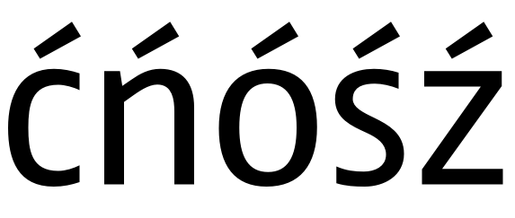
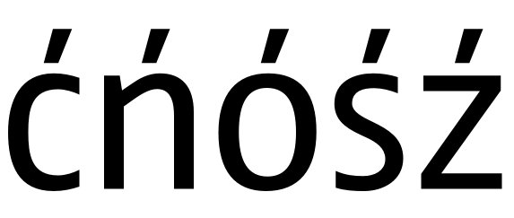
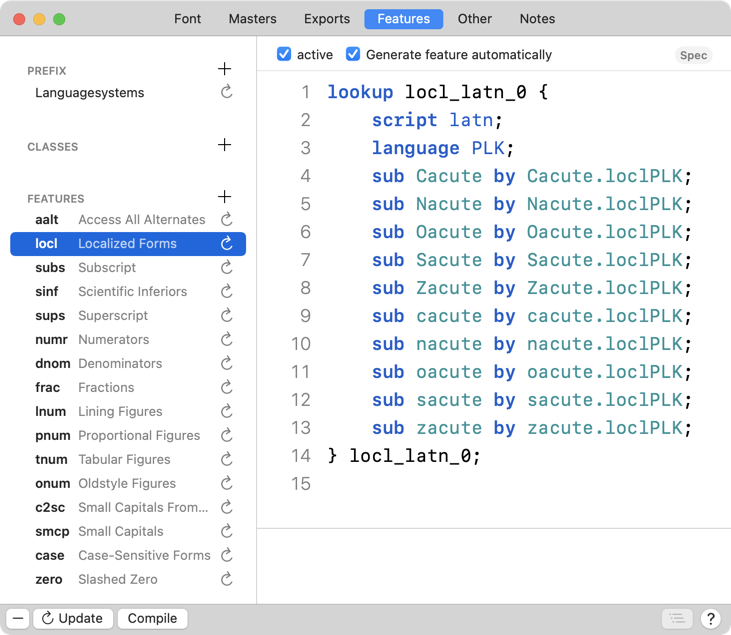

原文: [Localize your font: Polish kreska](https://glyphsapp.com/learn/localize-your-font-polish-kreska)
# フォントをローカライズする：ポーランド語のクレスカ

チュートリアル

[ 言語 ](https://glyphsapp.com/learn?q=languages) [ OpenTypeフィーチャー ](https://glyphsapp.com/learn?q=opentype+features)

執筆者: Rainer Erich Scheichelbauer

[ en ](https://glyphsapp.com/learn/localize-your-font-polish-kreska) [ fr ](https://glyphsapp.com/fr/learn/localize-your-font-polish-kreska) [ zh ](https://glyphsapp.com/zh/learn/localize-your-font-polish-kreska)

2022年8月11日更新（初版公開：2012年9月8日）

ポーランド語では、c、n、o、s、zは、大文字と小文字の両方でアキュートアクセント（別名クレスカ）を取ることができます。しかし、ポーランド人はアキュートを少し違った方法で描きます。この短いチュートリアルで、そのすべてを学びましょう。

ポーランド語のアキュート、別名「クレスカ」は、通常より傾斜が急で、ベースとなる文字の視覚的な中心から始まります。

これが通常のアキュートの見た目です。



そして、これがポーランド語のクレスカの見た目です。



## ポーランド語のクレスカを作成する

技術的には、ここには2つの選択肢があります。妥協案として、アキュート付きの文字をポーランド語*と*他の言語の両方で問題なく見えるように描くかです。

あるいは、アキュートアクセントのポーランド語バージョンを追加することもできます。既存の`acutecomb`をコピー＆ペーストすると、`acutecomb.001`が得られます。これを`acutecomb.loclPLK`にリネームします。 अब、ポーランド語のアキュートをクレスカらしく調整できます。そして、アキュート付き文字のポーランド語バリアントを構築できます。「グリフ」メニューから「グリフを追加…」（Cmd-Shift-G）を選び、適切なグリフ名を入力します。
```
Cacute.loclPLK
Nacute.loclPLK
Oacute.loclPLK
Sacute.loclPLK
Zacute.loclPLK
cacute.loclPLK
nacute.loclPLK
oacute.loclPLK
sacute.loclPLK
zacute.loclPLK
```
これで、フォントにクレスカ文字ができました。しかし、実際にどうやって使うのでしょうか？OpenTypeフィーチャーにお任せください！

## loclフィーチャー

グリフを適切に命名したので、Glyphsに`locl`フィーチャーを自動的に処理させることができます。「ファイル」メニューから「フォントビュー」を選び（Cmd-I）、[訳注：原文はFile menuだが、Font Infoの誤りと思われる]、「フィーチャー」タブに切り替えて「更新」ボタンをクリックするだけです。すると、Glyphsは自動的に`PLK`言語システムとポーランド語の置換を`locl`フィーチャーに追加します。



これだけで、あなたのフォントにポーランド語のクレスカを正常に実装できました。InDesignの文字パレットの言語メニューからポーランド語を選択することで、それを適用できます。

## 参考文献

クレスカはポーランド語の唯一の専門分野ではありませんが、通常、この種の特別なOpenTypeの注意が必要なのはこれだけです。ポーランド語についてさらに詳しく知りたい場合は、Adam Twardoch氏の優れた「[Polish diacritics: how to?](http://www.twardoch.com/download/polishhowto/index.html)」を読んでください。そこでは、悪名高いスラッシュ付きのL/lとオゴネクについてもカバーしています。フォントにポーランド語を話させたいなら必読です。

---

更新履歴 2014-09-02: Glyphs 2の新しいグリフ名に更新。

更新履歴 2016-02-19: Glyphs 2のスクリーンショットを更新。

更新履歴 2019-11-09: メニュー名を*Font*から*Glyph*に変更（Glyphs 3）。

更新履歴 2022-11-08: タイトルを更新、軽微なフォーマット。