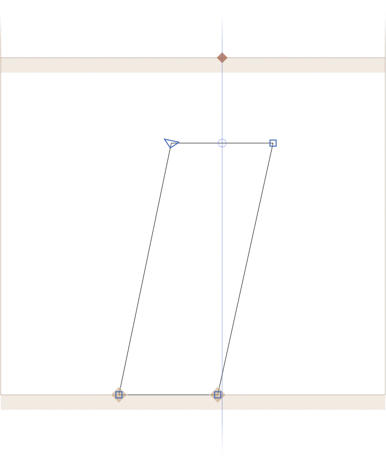
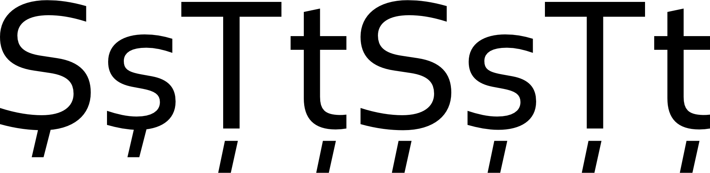
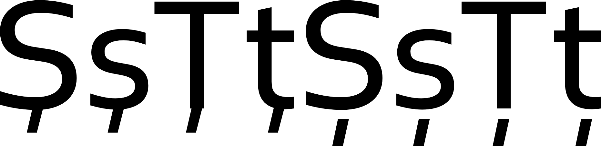

原文: [Localize your font: Romanian and Moldovan comma accent](https://glyphsapp.com/learn/localize-your-font-romanian-and-moldovan)
# フォントをローカライズする：ルーマニア語とモルドバ語のコンマアクセント

チュートリアル

[ 言語 ](https://glyphsapp.com/learn?q=languages) [ OpenTypeフィーチャー ](https://glyphsapp.com/learn?q=opentype+features)

執筆者: Rainer Erich Scheichelbauer

[ en ](https://glyphsapp.com/learn/localize-your-font-romanian-and-moldovan) [ fr ](https://glyphsapp.com/fr/learn/localize-your-font-romanian-and-moldovan) [ zh ](https://glyphsapp.com/zh/learn/localize-your-font-romanian-and-moldovan)

2018年5月5日更新（初版公開：2012年8月26日）

ルーマニア語およびラテン文字を使用するモルドバ語では、フォントにコンマアクセント付きの文字、特にS/sとT/tが必要です。このチュートリアルを使えば、それらを正しく作成し、実装するのは簡単です。

ルーマニア語のSとTにコンマアクセントを付けるのは簡単です。

まず、`commaaccentcomb`という名前の新しいグリフを作成します。コンマをコピーして貼り付け、ベースラインの下に移動させ、必要に応じてサイズを少し調整します。多くの場合、通常の（句読点としての）コンマは少し大きすぎるように見える傾向があり、特に高さが高すぎます。太さについては、ステムの幅を参考にしてください。いずれにせよ、コンマアクセントは十分に目立つ必要があるので、あまり小さくしすぎないでください。ディセンダーの短い太い書体では、ディセンダーより少し下にはみ出しても構いません。

配置に関しては、コンマアクセントはTのステムまたはSのカーブの真下に完全に中央揃えされるべきです。アンカーを設定する（Cmd-U）か、アンカーをリセットする（Cmd-Opt-U）のを忘れないでください。そうすれば、次のようなものができあがります。



シェイプの上部にある水平線の真上にアンカーを中央揃えにしたことに注目してください（スクリーンショットでは、これは青いガイドで強調されています）。もし`bottom`と`_bottom`アンカーがコンマアクセントとTの両方の中央に配置されていれば、それらはきれいに整列します。Sは時々、`bottom`アンカーの視覚的な配置を必要とし、それによって下付きアクセントが視覚的な中心に収まります。

これで、コンマアクセント付きの文字を作成できます。Cmd-Shift-Gを押して、次のように入力します。
```
Scommaaccent
scommaaccent
Tcommaaccent
tcommaaccent
```
これで完了です。本当に簡単です。通常、大文字用に別の`.case`バージョンは必要ありません。

## セディーユ 対 コンマアクセント

いや、待ってください、まだ完全ではありません。もう一つあります。あなたは[Unicode](unicode.md)について聞いたことがあるかもしれません。古い時代、ルーマニア語のコンマアクセント文字は、`U+015E`（S）、`U+015F`（s）、`U+0162`（T）、`U+0163`（t）にエンコードされていました。ここまでは順調です。残念なことに、誰かがこれらの文字を`WITH COMMA ACCENT`の代わりに`WITH CEDILLA`と名付けてしまいました。
```
U+015E LATIN CAPITAL LETTER S WITH CEDILLA
U+015F LATIN SMALL LETTER S WITH CEDILLA
U+0162 LATIN CAPITAL LETTER T WITH CEDILLA
U+0163 LATIN SMALL LETTER T WITH CEDILLA
```
これは問題です。なぜなら、トルコ語のように、セディーユ付きのS/sを持つ他の言語があり、これらの言語は同じコードポイント`U+015E`と`U+015F`を使用するからです。では、私たちはS/sをどのように描くべきでしょうか？セディーユ付きで、それともコンマアクセント付きで？

絶望しないでください、解決策があります。この問題に対処するため、Unicodeはコンマアクセント付きの文字に代替のコードポイントを導入しました。
```
U+0218 LATIN CAPITAL LETTER S WITH COMMA BELOW
U+0219 LATIN SMALL LETTER S WITH COMMA BELOW
U+021A LATIN CAPITAL LETTER T WITH COMMA BELOW
U+021B LATIN SMALL LETTER T WITH COMMA BELOW
```
幸いなことに、現代のルーマニア語のテキストは新しいコードポイントを使用します。そして、Glyphsもあなたの`commaaccentcomb`文字をそこに配置します。

## loclフィーチャー

しかし、時には古いエンコーディングを使用するテキストに出くわすことがあります。このようなケースのために、Glyphsは`locl`フィーチャーに、言語がルーマニア語に設定されたときに`scedilla`を`scommaaccent`などに切り替えるエントリを自動的に作成します。

これを実現するには、文字を作成し、「ファイル > フォント情報 > フィーチャー」に進み、「更新」ボタンをクリックするだけです。Glyphsは、次のようなものを含む`locl`フィーチャーを生成するはずです。
```
script latn;
language MOL;
sub Scedilla by Scommaaccent;
sub scedilla by scommaaccent;
sub Tcedilla by Tcommaaccent;
sub tcedilla by tcommaaccent;
language ROM;
sub Scedilla by Scommaaccent;
sub scedilla by scommaaccent;
sub Tcedilla by Tcommaaccent;
sub tcedilla by tcommaaccent;
```
ご覧の通り、Glyphsはルーマニア語のフィーチャーコード（`ROM`）だけでなく、モルドバ語のコード（`MOL`）も作成します。モルドバ語はモルドバ共和国で話されるルーマニア語の方言であり、したがって、上記のすべてがモルドバ語にも当てはまります。

Glyphsは、`locl`フィーチャーに`MOL`と`ROM`のコードを自動的に生成するだけでなく、「プレフィックス」にそれぞれの言語システムエントリも追加します。ですから、ただリラックスして、「更新」ボタンを押し、Glyphsにその魔法をかけてもらうだけです。

## セディーユ付きのTとt

このすべてには、結局のところ、一つの副作用があります。私の知る限り、地球上のどの書き言葉でも、セディーユ付きのTやtは使われていません。では、`U+0162`と`U+0163`で何をすべきなのでしょうか？

これに対処するには、基本的に2つの方法があります。

**1. 時々一貫性がないが、それでも少なくとも50%は正しい方法：** 一つの考え方として、これらのコードポイントはルーマニア語のコンマアクセント付きT/tにしか使われないのだから、`Tcedilla`を`Tcommaaccent`のように、`tcedilla`を`tcommaaccent`のように描いても構わないというものがあります。これを行うには、`Tcedilla`（および`tcedilla`）に入り、すべてを選択して（Cmd-Aを2回押す）削除します。次に、グリフに`Tcommaaccent`（またはそれぞれ`tcommaaccent`）をコンポーネントとして配置します。「レイヤー」メニューから「コンポーネントを追加」（Cmd-Shift-C）を選択し、続いて`Tcommaaccent`または`tcommaaccent`を選択することでこれを行うことができます。



**2. 常に一貫しているが、時には100%間違っているより良い方法：** 一部の人々は、これは良くないと言います。なぜなら、これによって（間違った）セディーユ付きのsが、ルーマニア語のテキストで（正しい）コンマアクセント付きのtと一緒に表示されるという不整合が生じる可能性があるからです。これらの人々は、悪いデザインは一貫性のないデザインよりも良いと信じており、これらの文字は実際には存在しないにもかかわらず、セディーユ付きのTとtを描き、それを`Tcedilla`（`U+0162`）と`tcedilla`（`U+0163`）に入れることを提案します。`locl`フィーチャーが機能すれば、それはとにかく正しく置き換えられます。したがって、最悪の場合でも、デザインが悪い文字があるだけで、不整合は決してありません。Glyphsはデフォルトで`Tcedilla`と`tcedilla`をこのように作成します。



どちらの方法を選ぶかはあなた次第です。ルーマニアのデザイナーの中には、両方の陣営の支持者がいます。前回尋ねたときは、より多くの人々が不整合アプローチ（上記で説明した最初のもの）を好むようでしたが、この質問に関する適切な調査に基づいた代表的な数値は持っていません。

## 大文字 対 小文字

最後に一つアドバイスです。通常は、*小文字と大文字の両方*に*1つ*のコンマアクセントを描くだけで済みます。しかし、もしそれが他のすべてのアクセントで異なるデザインを持つ書体であるなら、`commaaccentcomb.case`バリアントを検討することができます。そのような大文字のコンマアクセントは、おそらく少し太くて長く、大文字の太いステムに合わせるでしょう。もしすでに大文字用に別のセディーユがあるなら、大文字のコンマアクセントも欲しくなるでしょう。大文字のコンマアクセントができたら、単に「グリフ > 複合グリフを作成」（Ctrl-Cmd-C）でコンマアクセント付きの大文字を再生成するだけです。

---
サンプルフォント：[BEGA](https://www.fontstore.com/font/bega/about) BY SABINA CHIPARĂ AND DIANA OVEZEA.

---

更新履歴 2014-09-02: Glyphs 2の新しいグリフ名に更新。

更新履歴 2016-02-19: Glyphs 2のスクリーンショットを更新。

更新履歴 2018-05-02: いくつかの表現を修正、テキストを洗練、スクリーンショットを更新。（Sabina Chipară氏に感謝！）

更新履歴 2022-08-03: タイトル、関連記事、軽微なフォーマットを更新。