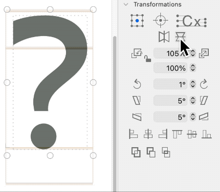
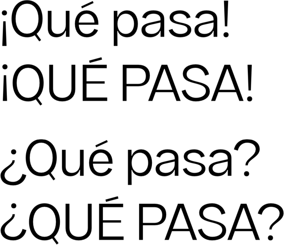
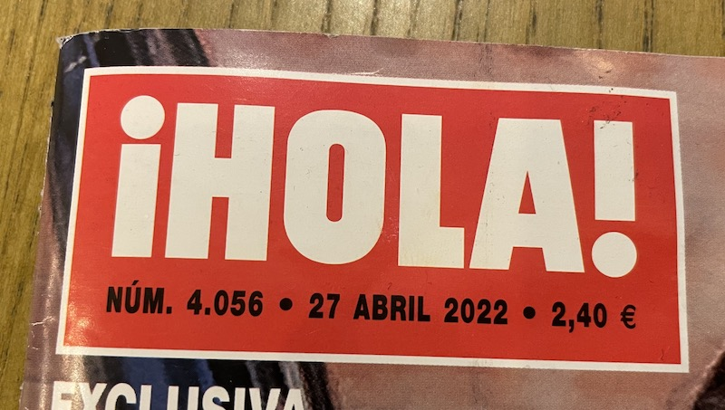
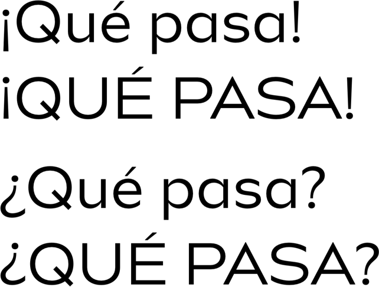
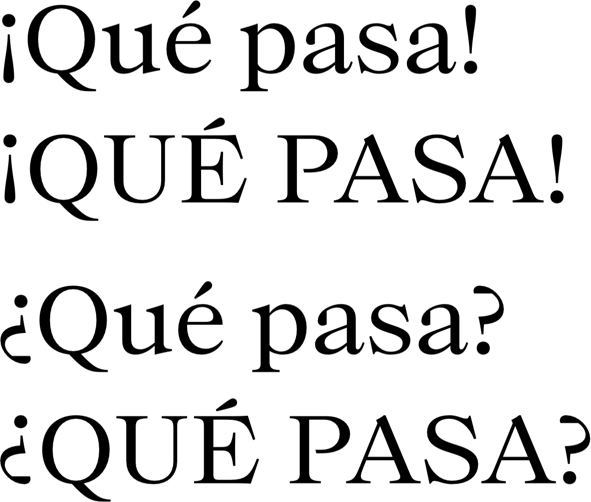
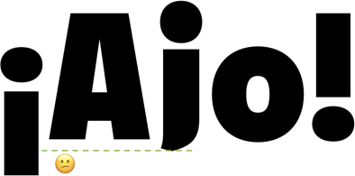
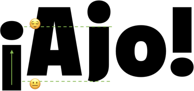
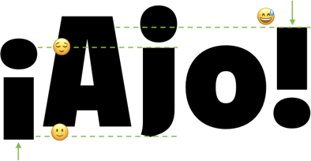
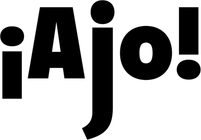

原文: [Localize your font: Spanish inverted question and exclamation marks](https://glyphsapp.com/learn/localize-your-font-spanish-inverted-question-and-exclamation-marks)
# フォントをローカライズする：スペイン語の逆疑問符と逆感嘆符

チュートリアル

[ 言語 ](https://glyphsapp.com/learn?q=languages)

執筆者: Rainer Erich Scheichelbauer

2022年8月12日更新（初版公開：2022年4月30日）

スペイン語では、疑問符の上下を逆にしたものが疑問文の始まりを示し、感嘆符を逆にしたものが強調したい文の最初に置かれます。

カスティーリャ・スペイン語の正書法では、2つの特別な句読点が必要です。

*   `questiondown`: 逆疑問符¿（Unicode値 U+00BF）
*   `exclamdown`: 逆感嘆符¡（Unicode値 U+00A1）

これらは文の最初だけでなく、文の途中にも現れます。これは、強調したい文の部分だけを強調するためです。スペイン語のキーボードだけでなく、ほとんどのラテン語キーボードで入力できます。近年、ほとんどのスペイン語話者は、特にカジュアルなテキストでは、これらを一貫して使用しなくなったことを認めています。また、ほとんどのモバイルデバイスでは、入力するのが少し面倒です。しかし、本格的な高級タイポグラフィでは、依然として必須です。

一般的な信念（そしてWikipediaが主張していること）に反して、これらはガリシア語で要求されてきたわけではなく、今ではほとんど使われていません。誰かがその神話をあなたに伝えようとした場合に備えて言っておくと、カタルーニャ語では全く使われていません。アストゥリアス語のテキストでは使われているのを見たことがあります。しかし、アストゥリアス語のテキストはそれほど多くありません。フィリピンの方言ワライワライ語には公式の正書法がなく、私の知る限り、逆向きの記号はワライワライ語の書き言葉では使われていません。

## 逆向きの記号を作成する

最も重要なルールは、逆向きの記号は、正立している counterpart（対応物）と**視覚的に等しい**ことです。シェイプに適用したい視覚的な補正は、これを尊重する必要があります。ほとんどの場合、それらを*全く*同じにしても問題ありません。そこで、「グリフ > グリフを追加…」（Cmd-Shift-G）を選び、表示されるダイアログに以下の行をペーストします。

```
exclam=exclamdown
question=questiondown
exclam=exclamdown.case
question=questiondown.case
```
次に、逆向きの記号を編集用に開き、正立している記号がコンポーネントとして入っているのを見つけます。「選択」ツール（ショートカットV）でそれらを選択し、「変形」パネルの2つのミラーボタンで水平方向と垂直方向に反転させます。



`exclamdown`と`questiondown`は、大文字小文字混合組版で使用され、そのドットは、正立している記号のドットがベースラインに接するのと同様に、エックスハイトに揃えることになっています。もし垂直比率が中途半端に普通なら、`exclamdown`と`questiondown`の下部は、だいたいディセンダーの位置になります。しかし、これは厳密な要件ではありません。もしディセンダーより少し下にはみ出してしまい、強迫観念が湧き上がってくるのを感じたら、3つの選択肢があります。コンポーネントを分解し、パスを少しだけ潰してフィットさせるか、ドットがエックスハイトのオーバーシュートを少し超えるように少し上げるか、あるいは句読点はディセンダーに収まらなくてもよいという悲惨な状況を受け入れるかです。ただ、逆感嘆符が小文字の`i`と誤読されないようにだけはしてください。



`exclamdown.case`と`questiondown.case`は、オールキャップス組版で使用され、そのドットはキャップハイトのオーバーシュートに接するように、そしてその下部はベースラインにしっかりと立つようにします。これは、あなたの正立した感嘆符と疑問符がキャップに揃っていることを前提としています。もしそうでなければ、それはおそらく間違いであり、句読点のデザインを見直すことをお勧めします。自動整列を使用していれば、そしてそうすべきですが、反転したコンポーネントはすぐに正しく整列します。

いずれにせよ、フォントには`.case`バリアントが必要です。そうでなければ、スペイン語のタイプユーザーは、調整されていない`exclamdown`を使う代わりに、小文字の`i`に頼るかもしれません。冗談ではありません。これは本当に起こります。



したがって、フォントに4つのグリフすべてが含まれていることを確認してください。もしそうなら、これで完了です。おめでとうございます、あなたのフォントはスペイン語をサポートしました！

### デザインバリエーション

大文字小文字混合組版の逆向きの記号については、エックスハイトより少し上に上がるのも許容範囲です。これには、逆向きの記号の下部が通常ベースラインとディセンダーの間のどこかにうまく収まるため、ディセンダーについて全く気にする必要がなくなるという利点があります。大文字小文字混合組版の行にある逆向きの記号に注目してください。



これにはもう一つ側面があります。あなたのキャップに比べて、エックスハイトが非常に高いと想像してください。そして、`down`マークをさらに少し上に押し上げ、大文字小文字混合組版のマークが大文字用のマークにかなり近くなると想像してください。



…すると、大文字小文字混合組版のマークは、オールキャップス設定に*ほとんど*問題なくなります。もちろん、それは依然として違法ですが。しかし、OpenTypeに無知なソフトウェアを使用している、あるいは`case`フィーチャー（[Case-Sensitive Forms](https://docs.microsoft.com/en-us/typography/opentype/spec/features_ae#tag-case)）へのアクセス方法を知らないユーザーは、キャップの文脈でこれを妥協案として受け入れることができるかもしれません。

しかし、これはすべてが失敗した場合の次善の策にすぎないことを覚えておいてください。グリフセットに`exclamdown.case`と`questiondown.case`なしで済むとは思わないでください。

## スモールキャップ

もしフォントにスモールキャップの記号がある場合は、この2行を追加できます。
```
exclam.c2sc=exclamdown.c2sc
question.c2sc=questiondown.c2sc
```
私は句読点に`.c2sc`（[Small Capitals From Capitals](https://docs.microsoft.com/en-us/typography/opentype/spec/features_ae#tag-c2sc)）接尾辞を使用しています。なぜなら、句読点は`c2sc`にのみあるべきで、`smcp`（[Small Caps](https://docs.microsoft.com/en-us/typography/opentype/spec/features_pt#tag-smcp) from lowercase）にはないからです。なぜなら、ユーザーが*小文字*のみをスモールキャップに変換し、したがって組版に*大文字*がまだ残っている場合、句読点は*大文字*に合わせて向きを変える必要があり、そうでなければ低すぎると見える可能性が高いからです。

しかし、もしあなたがスモールキャップの句読点に`.sc`という接尾辞を好む人々の一人なら、適宜調整するか、助けを求めてください。プチキャップ：同じことです。お分かりですね。

## 珍しい垂直比率

さて、もしあなたが非常にクリエイティブで、とてつもなく深い、あるいは極端に浅いディセンダーを持つ、あのファンシーなデザインの一つを持っているなら、あなたは困ったことになります。なぜなら、第一のルールは依然として有効だからです。逆向きの記号は、正立しているものと同じでなければなりません。しかし、それを収めるのは難しいかもしれません。

### 非常に浅いディセンダー

もしあなたのディセンダーがベースラインをわずかに下回る程度で、上で説明したように感嘆符を単に反転させると、`exclamdown`はディセンダーよりずっと下にはみ出してしまいます。そして、それはデザインの目的を損なう可能性があります。



浅いディセンダーのポイントは、それを下回らないことですよね？少なくとも、遠くまでは。デザインによっては、`exclamdown`を少し上げることでなんとかなるかもしれません。



これは妥協案です。もしあなたの逆感嘆符がまだディセンダーより下に落ちるなら、それは理想的ではなく、あなたはスペイン語のタイポグラフィにふさわしい正義を果たしていません。

そこで、解決策があります。これをスペインの書体デザイナーに見せたところ、彼らはこう言いました。浅いディセンダーはデザインの指導原理であり、感嘆符はそれを破る。そこであなたができることは、感嘆符の高さを犠牲にすることです。このようなデザインにとっては、それは小さな代償であり、そうすれば感嘆符は実際に収まります。じゃーん！



### 非常に深いディセンダー

反対の、非常に深いディセンダーは、実際にはあまり問題ではありません。感嘆符はそれを単に無視できます。



ねえ。結局のところ、それは*句読点*です。このようなデザインで、`comma`を下に伸ばすこともないでしょう？

## 便利なスクリプト

[mekkablue scripts](glyphsapp3://showplugin/mekkablue%20scripts)には、「Build Glyphs > Build exclamdown and questiondown」というスクリプトがあります。これは、それぞれの正立した記号がフォントにすでに存在する場合、大文字小文字混合、大文字、スモールキャップの逆向きの記号を構築します。

---
サンプルフォント：[Fusiona](https://brandingwithtype.com/typefaces/bw-fusiona)、[Aleta](https://brandingwithtype.com/typefaces/bw-aleta)、[Beto](https://brandingwithtype.com/typefaces/bw-beto)。Alberto Romanos氏提供。

María Ramos、Laura Meseguer、そしてLletraferits 2022の参加者の皆様、ご協力ありがとうございました！

---

更新履歴 2022-05-17: 「便利なスクリプト」を追加。

更新履歴 2022-07-19: 軽微なフォーマット更新。