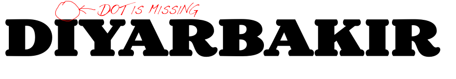

原文: [Localize your font: Turkish i](https://glyphsapp.com/learn/localize-your-font-turkish)
# フォントをローカライズする：トルコ語のi

チュートリアル

[ 言語 ](https://glyphsapp.com/learn?q=languages) [ OpenTypeフィーチャー ](https://glyphsapp.com/learn?q=opentype+features)

執筆者: Rainer Erich Scheichelbauer

[ en ](https://glyphsapp.com/learn/localize-your-font-turkish) [ fr ](https://glyphsapp.com/fr/learn/localize-your-font-turkish) [ zh ](https://glyphsapp.com/zh/learn/localize-your-font-turkish)

2015年9月2日更新（初版公開：2012年8月27日）

トルコ語およびいくつかの関連言語では、点のあるİ/iと点のないI/ıを区別します。もしフォントにスモールキャップや合字を含める予定なら、このチュートリアルを読むのに数分かけるべきです。

トルコには[ディヤルバクル](http://en.wikipedia.org/wiki/Diyarbak%C4%B1r)という町があり、そこには点のないıと点のあるiの両方が含まれているので素晴らしいです。

ご覧の通り、他の言語ではこの区別はされません。もしこの単語を大文字やスモールキャップで組むと、iは点を失ってIになり、したがって点のないI/ıと区別がつかなくなります。これは良くありません。

したがって、私たちはフォントにトルコ語を教える必要があります。もし言語がI/ıとİ/iを区別する言語に設定されている場合、iの点を保持しなければなりません。

## 必要なグリフ

Glyphsには簡単な解決策があります。まず、フォントに`idotless`と`dotaccentcomb`があることを確認してください。もしなければ、`i`のコピーを2つ作成するだけです。1つを`idotless`にリネームし、ドットを削除します。もう1つを`dotaccentcomb`にリネームし、ステムを削除します。もちろん、すでに`dotaccentcomb`がない場合の話です。両方のアンカーをリセットします（Cmd-Opt-U）。

### 注意
2.0より前のアプリのバージョンでは、`idotless`は`dotlessi`と呼ばれていました。

 अब、グリフ`Idotaccent`、特に`idotaccent`を作成します。Glyphsは後者を`idotless`と`dotaccentcomb`コンポーネントから自動的に組み立て、したがって`i`のコピーを生成します。

Glyphsがフォント内に`idotaccent`を見つけると、`locl`フィーチャーにそれぞれの項目を自動的に作成できます。これらは、トルコ語`TRK`、カザフ語`KAZ`、タタール語`TAT`、クリミア・タタール語`CRT`、アゼルバイジャン語`AZE`に対して、`i`を`idotaccent`に置き換えます。これらの言語はすべて、`idotless`と`idotaccent`、`I`と`Idotaccent`を区別します。

 अब、単にスモールキャップ用に`idotaccent.sc`と`idotless.sc`を作成すれば準備完了です。言語が上記のいずれかに設定されている場合、`i`は最初に`idotaccent`に置き換えられます。したがって、スモールキャップフィーチャーが実行されるとき、もはや`i`はなく、`idotaccent`と`idotless`だけがあり、これらは別々の`.sc`フォームを持っています。

今必要なのは、「フォント情報」の「フィーチャー」タブにある更新ボタン（丸い矢印の付いたもの）をクリックすることだけです。ふぅ！

## iを含む合字

同様の問題がiを含む合字にも当てはまります。よくあるのは`fi`と`f_f_i`です。もしあなたのフォントにそのような合字があり、これらの場合にiが点を失うのであれば、トルコ語にとっては良くありません。したがって、これらの合字が防がれるようにする必要があります。これに対処するには、3つの可能な方法があります。

1.  何もしないで、上記で説明した魔法の`idotaccent`に単に頼る。`i`は`idotaccent`に置き換えられ、合字はf-iシーケンスが見つかった場合にのみ有効になるので、準備万端です。
2.  あるいは、fiとffiの合字がiの点を失わないように、デザインを調整する。この特定のケースでは、フィーチャーコードを`sub f i by fi;`から`sub f [i idotaccent] by fi;`に調整したいかもしれません。
3.  あるいは、別々の`f_idotaccent`と`f_f_idotaccent`合字を導入する。それは*本当に*クールでしょう。

これだけです。あなたのフォントは5つの新しい言語を学びました！フォントを書き出して、お気に入りのクリミア・タタール語の詩でテストしてみましょう。あるいは、もしあなたのクリミア・タタール語が錆びついてしまったなら、単に「Diyarbakır」という単語を使ってみてください。

---

更新履歴 2013-11-13: 言語システムエントリを手動で編集することに関する古い部分を削除しました。Glyphsは এখনそれを自動的に処理します。

更新履歴 2014-12-11: ドットなしグリフの新しい表記法に更新しました。

更新履歴 2014-09-02: Glyphs 2の新しいグリフ名に更新しました。

更新履歴 2022-08-12: 軽微なフォーマットと表現の修正。