原文: [Localize your plug-in](https://glyphsapp.com/learn/localize-your-plug-in)
# プラグインをローカライズする

チュートリアル

[ スクリプト ](https://glyphsapp.com/learn?q=scripting)

執筆者: Rainer Erich Scheichelbauer

[ en ](https://glyphsapp.com/learn/localize-your-plug-in) [ zh ](https://glyphsapp.com/zh/learn/localize-your-plug-in)

2022年7月29日更新（初版公開：2018年11月20日）

さて、素晴らしいプラグインを書き上げ、期待通りに動作し、ユーザーも満足しているとします。しかし、最初の苦情が届きます。「Que? No español?（何？スペイン語はないの？）」とか「Qu’est-ce que ça veut dire? Pas de Français?（これはどういう意味？フランス語はないの？）」、さらには「Jahimmelherrgottkruzifix, gibt’s denn koa Boarisch?（なんてこった、バイエルン語はないのか？）」といった具合に。

あなたのプラグインは、まだドイツ語、フランス語、スペイン語に対応していませんか？では、その修正方法はこちらです。（注意：このチュートリアルには高度な内容が含まれています。）

要するに、あなたのプラグインは英語しか話せませんが、ユーザーは他の言語でアプリを実行しています。もしあなたが彼らの言語を話せなくても、通常、問題のインターフェースをどのように翻訳すればよいか尋ねると、彼らは非常に協力的です。あるいは、尋ねられる誰かに会うかもしれません。絶対にやってはいけないことは、単にテキストをGoogle翻訳にかけることです。そうすると、非常に混乱したユーザーを生み出すことになりかねません。警告はしましたよ。

## ステップ1：.nibと.xibをBase.lprojに入れる

翻訳が機能するためには、翻訳が必要なファイルを特別なサブフォルダに入れる必要があります。この翻訳されていない元のファイルのコレクションは、*Base*と呼ばれます。したがって、サブフォルダは、私たちの*言語プロジェクト*の*Base*であるため、`Base.lproj`と呼ばれます。

さて、始めましょう。プラグインを右クリックし、コンテキストメニューから「パッケージの内容を表示」を選択して、プラグインの中に入ります。そこから、「Contents > Resources」に移動します。そこにあなたの*plugin.py*、*IBdialog.nib*、*IBdialog.xib*があるはずです。もしもっと洗練されたUIを作成した場合は、より多くの.nibと.xibファイルがあるでしょう。

1.  **Baseを決定する。** すべての.nibと.xibファイルを選択します。
    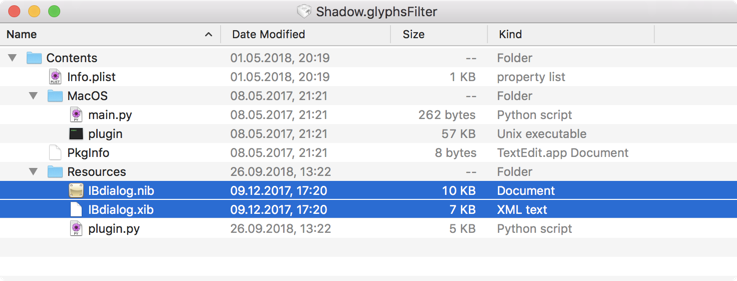

2.  **Baseをサブフォルダに集める。** 右クリックし、表示されるコンテキストメニューの一番上から「選択項目から新規フォルダを作成」を選びます。
    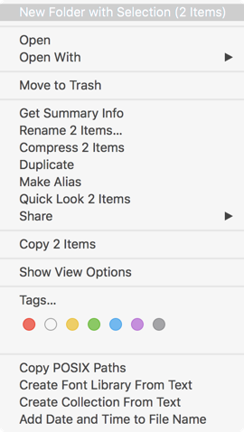

3.  **Baseサブフォルダに名前を付ける。** 新しく作成されたフォルダを`Base.lproj`にリネームします。
    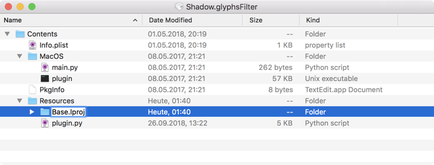
    注意してください。名前は大文字と小文字を区別します。大文字の`B`、残りは小文字です。

*Base.lproj*フォルダが基礎となり、これからBaseの翻訳を含む言語固有の*.lproj*フォルダを追加していきます。しかし、まずは英語の.lprojを作成します。はい、その通りです、英語です。

## ステップ2：英語の.lprojフォルダを追加する

なぜ英語の言語プロジェクトフォルダが必要なのでしょうか？結局のところ、プラグインはすでに英語*です*。ですから、翻訳だけが必要だと思うかもしれません。まあ、そうではありません。重要なのは、Baseはもう変更しない、あるいはできるだけ少なく変更するべきだということです。なぜなら、何としても避けたいのは、IDが変更されることだからです。（IDについては、このチュートリアルの後半で説明します。）これは、後で英語のテキストを変更する場合、例えばタイプミスを修正したい場合、それを*.xib/.nib*ではなく*.lproj*ファイルで行うことを意味します。

1.  **言語フォルダを作成する：** 作成した*Base.lproj*フォルダの隣に、`en.lproj`という名前のフォルダを1つ追加します。
    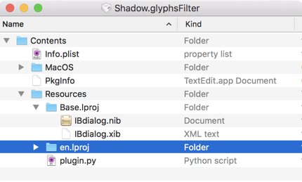

2.  **各.nibファイルに対応する.stringsファイルを追加する：** 次に、お気に入りのテキストエディタ、例えば[Atom](https://atom.io)、[SublimeText](https://www.sublimetext.com)、[TextMate](https://macromates.com)などを起動し、新しいファイルを作成し、それを*en.lproj*フォルダ内に`IBdialog.strings`という名前で保存します。
    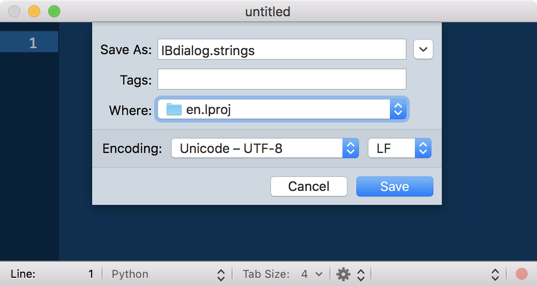
    名前は、*Base.lproj*内の.nibファイルと同じでなければなりません。繰り返しになりますが、名前は大文字と小文字を区別します。大文字の`IB`、小文字の`dialog`、そして`.strings`という接尾辞です。

もし*IBdialog*以外に他の.xib/.nibファイルがある場合は、各`.nib`に対応する`.strings`ファイルを1つずつ追加してください。

ステップ2はこれだけです。すべて正しく行っていれば、おおよそ次のようになります。

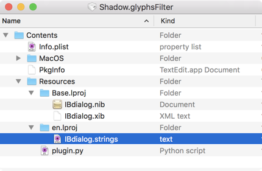

ここまでは順調です。しかし、空の.stringsファイルはあまり役に立ちません。内容を追加しましょう。まだファイルを閉じないでください。

## ステップ3：英語の.stringsファイルに内容を追加する

今やるべきことは、プラグインに特定のテキスト要素が新しいテキスト内容を持つことを伝えることです。そのためには、要素をIDで識別し、その属性の一つ、通常は`title`に、新しいテキスト文字列を割り当てる必要があります。

1.  **IDを見つける：** *Base.lproj*内の.xibファイルをXcodeで開き、翻訳が必要なテキストセルを選択します。注意：実際にテキストフィールド*セル*を選択するようにしてください。テキストフィールドだけではありません。これは重要です。なぜなら、フィールドとセルは異なるIDを持っているからです。つまり、左サイドバーの*Dialog*セクションの三角形の記号を開きます。要素がハイライトされる方法でもわかります。下のスクリーンショットを見てください。
    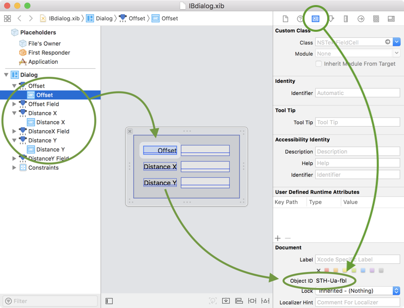
    次に、テキストセルが選択された状態で、*右*サイドバーの*Identity Inspector*（3番目のアイコン）を選択します。さて、サイドバーの*Document*ペインを探し、*Object ID*を選択してコピーします。IDを.stringsファイルにペーストします。再び.xibファイルを開かずにIDが何を参照しているか分かるように、`/*`と`*/`の間に説明、または元の英語のテキストをコメントとして追加するのが良い考えです。今のところ、.stringsファイルではこのようになります。
    ```
    /* "Offset" */
    STH-Ua-fbl
    ```
    ダイアログ内の他のすべてのテキストセルについても同じことを行います。Object IDに関連付けられたプレースホルダーやツールチップがある場合は、それらも追加することを検討してください。

2.  **属性を見つける：** Object IDは*オブジェクト*を指しますが、私たちが行いたいのは、異なる言語設定のコンテキストで、その属性のいくつかに新しい値を割り当てることです。平たく言えば、テキストフィールドセル*（=オブジェクト）*に付随する1つ以上のテキスト文字列*（=属性）*を翻訳*（=新しい値を割り当てる）*したいのです。

属性の適切なキーワードを決定するために、*Identity Inspector*（右サイドバーの上の3番目のアイコン）または*Attributes Inspector*（4番目のアイコン）を見て、そこにある名前をキャメルケース（小文字で始まる）に変換します。そうすれば、属性のキーワードが得られます。例えば、*Tool Tip*は`toolTip`に、*Title*は`title`に、*Placeholer*は`placeholder`になります。

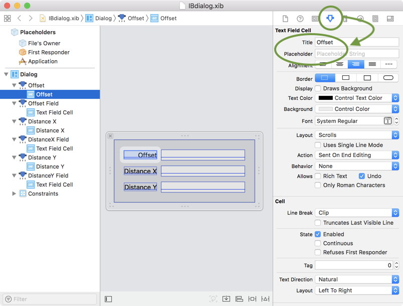

他にも多くの属性があることがわかります。それらにも同じ方法でアクセスできます。しかし通常、翻訳のためには、テキストを含むものだけを.stringsファイルに含めるのが理にかなっています。

3.  **.stringsコードを整理する。** .stringsファイルの内容はC記法でなければならないため、私たちのコードは次のように変換する必要があります。
    ```
    /* "Offset" */
    "STH-Ua-fbl.title" = "Offset";
    ```
    1.  IDに属性をドット接尾辞として追加します：`STH-Ua-fbl.title`
    2.  接尾辞付きのIDをダムクォートで囲みます：`"STH-Ua-fbl.title"`
    3.  等号を追加します：`=`
    4.  割り当てられたテキストをダムクォートで囲んで追加します：`"Offset"`
    5.  行末にセミコロンを追加します：`;`
    6.  コメントが`/*`と`*/`の間にあるか再確認します。

翻訳したいすべての属性に対してこれを行います。すべて正しく行っていれば、テキストエディタがシンタックスハイライトで助けてくれ、おおよそ次のようになります。

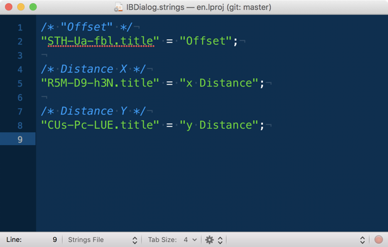

繰り返しになりますが、オブジェクトには翻訳したい属性が複数ある場合があります。私たちの例は、次のようにもなり得ます。
```
/* "Offset" */
"STH-Ua-fbl.title" = "Offset";
"STH-Ua-fbl.toolTip" = "Width of the shape contour";
```
ステップ3はこれで終わりです。今後は、この.stringsファイルで変更を行うべきであり、もはや.xibではないことを覚えておいてください。

## ステップ4：英語以外の.lprojフォルダを作成する

Baseと英語の言語プロジェクトを設定したので、サポートしたい各言語の言語プロジェクトフォルダが必要です。これらは、すでに作成した*en.lproj*フォルダと全く同じですが、*.strings*ファイルに、それぞれの言語の翻訳を追加する点が異なります。

### プロのヒント
.stringsファイルを頻繁に開くことになるので、常にお気に入りのテキストエディタで開くことを検討してください。Finderでファイル情報（Cmd-IまたはCmd-Opt-I）を開き、「このアプリケーションで開く」で好みのアプリを選び、「すべてを変更…」ボタンをクリックします。

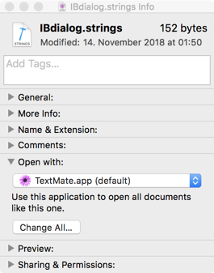

さて、始めましょう。

1.  **言語固有の言語プロジェクトフォルダを作成する。** Finderで*en.lproj*フォルダを選択して複製し（「ファイル > 複製」、Cmd-D）、新しいフォルダを[2文字のISO 639-1言語コード](https://en.wikipedia.org/wiki/List_of_ISO_639-1_codes)と`.lproj`接尾辞にリネームします。
    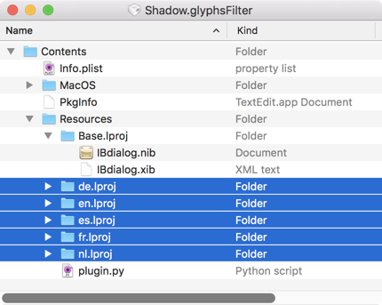

2.  **翻訳を追加する。** 各*.lproj*内で、*.strings*ファイルを開き、等号の右側のダムクォートで囲まれたテキストを変更します。
    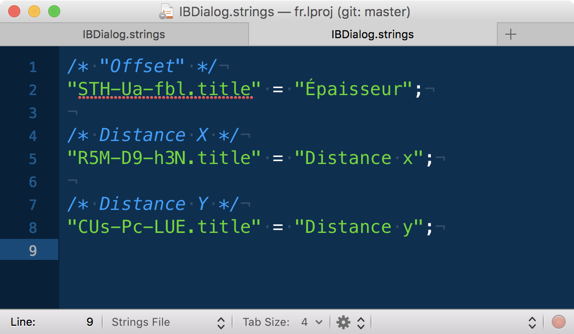
    いくつかのアドバイス：もしその言語を話せない場合は、.lprojフォルダを、その言語を話すプラグインのユーザーに送り、文字列の翻訳を依頼することを検討してください。もし誰も知らなければ、[フォーラムの投稿](http://forum.glyphsapp.com)で助けを求めることを検討してください。プラグインの場合、翻訳するテキストは通常非常に少なく、無料で手伝ってくれる人を簡単に見つけることができます。特に、提供するプラグインも無料であればなおさらです。もし商用なら、お返しにプラグインの無料コピーを提供することを検討してください。

もちろん、どんな言語でも追加できます。しかし、何よりもまず、Glyphs.appがすでにローカライズされている言語を検討してください。そうすれば、これらの言語のユーザーにとって、よりスムーズなUI体験を提供できます。

*   `cs`: チェコ語
*   `de`: ドイツ語
*   `en`: 英語
*   `es`: スペイン語
*   `fr`: フランス語
*   `it`: イタリア語
*   `ja`: 日本語
*   `ko`: 韓国語
*   `pt`: ポルトガル語
*   `ru`: ロシア語
*   `tr`: トルコ語
*   `zh_CN`: 中国語（簡体字、中国大陸）
*   `zh-Hant`: 中国語（繁体字、台湾）

リストに中国語が2回、異なる接尾辞で表示されているのがわかります。これは、簡体字と繁体字という2つの可能な書記バリアントに区別する必要があるためです。前者は中国大陸で、後者は台湾/中華民国で書かれます。

## ステップ5：.xibを一度再コンパイルする

もう一つやるべきことがあります。プラグインを、Baseと言語固有のカスタマイズを区別するローカライズされたプロジェクトに変換したので、.xibを再び.nibにコンパイルする必要があります。

おそらくやり方はご存知でしょう。Terminal.appで*Base.lproj*フォルダを開き、`ibtool IBdialog.xib --compile IBdialog.nib`と入力してReturnキーを押します。あるいはもっと良いのは、[GlyphsSDKリポジトリ](https://github.com/schriftgestalt/GlyphsSDK)で提供されている*Compile .xib to .nib.app*に.xibファイルをドラッグすることです。

### プロのヒント
*Compile .xib to .nib.app*を.xibファイルを開くデフォルトのアプリとして設定できます。そうすれば、.xibをダブルクリックするだけで完了です。

良いニュース：これを一度行うだけで十分です。今後の翻訳の追加や変更は、.stringsファイルで指定するだけで済みます。ハイタッチ！

## ステップ6：Pythonコード内のテキストをローカライズする

何か忘れていませんでしたか？はい、忘れていました。もしプラグインをPythonで書いたなら、.pyファイル内にも翻訳が必要な文字列がいくつかあるでしょう。通常はメニュー名、おそらくボタンの単語、そしてもしプラグインにコンテキストメニューがあればそれもです。

この場合、.pyファイル内に収めることができます。単にすべての文字列（Unicode文字列を含む）を`Glyphs.localize()`関数で置き換えるだけです。`localize()`関数は、辞書を引数として取ります。辞書のキーは2文字の言語コードで、対応する値は翻訳文、できればUnicode文字列です。

例を挙げると、これを、
```python
self.menuName = 'Shadow'
```
…これを、
```python
self.menuName = Glyphs.localize({
    'en': u'Shadow',
    'de': u'Schatten',
    'fr': u'Ombreur',
    'nl': u'Schaduw',
    'es': u'Sombrear',
})
```
文字列の前に`u`が付いていることに注目してください。これにより、文字列がUnicode文字列に変換されます。もし翻訳に非ASCII文字が含まれている場合は、これが必要です。安全のために、常にそれらを追加しておいても害はありません。もし.pyファイルでUnicode文字列を使用する場合は、ファイルの先頭でエンコーディングを宣言するのが良い考えです。このように。
```python
# encoding: utf-8
```
ちなみに、これはプラグインの領域外の通常のPythonスクリプトでも機能します。バニラコードともうまく統合されます。かなりクールですね。

OK、これで終わりだと思います。 अब、プラグインをローカライズするためのすべてのツールが手に入りました。コツをつかめば、それは一種のギークな楽しみになり、やめられなくなるでしょう。ですから、心ゆくまでローカライズを楽しんでください。:-)

## ローカライズをテストする

ローカライズをテストするには、まず「Glyphs > 環境設定 > ユーザー設定 > ローカライズを無効にする」のチェックが*外れている*ことを確認してください。そうでなければ、Glyphsを別の言語に切り替えることができません。

次に、「システム環境設定 > 言語と地域」に進み、テストしたい言語をリストの一番上にドラッグします。もしその言語が表示されていなければ、プラスボタンで追加してください。例えば、スペイン語のローカライズをテストするには、リストにスペイン語を追加し、一番上にドラッグします。このように。

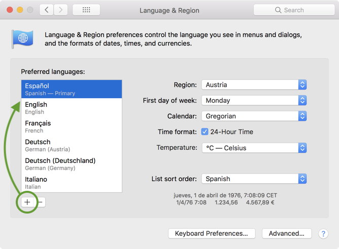

変更を確定するには、システム環境設定を再度閉じるだけです。ダイアログが表示され、Macを再起動するかどうか尋ねられます。Macを再起動したくは*ありません*。

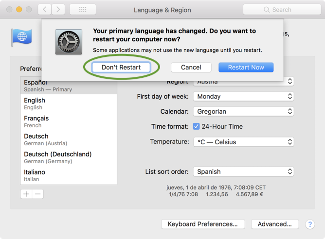

しかし、Glyphs.appは再起動*したい*です。

### プロのヒント
アプリを最も早く再起動する方法は、Dockアイコンを右クリックし、Optionキーを押しながら、下矢印キーを押してDockメニューの「強制終了」を選択し、（まだOptionキーを離さずに！）Returnキーを押して確定することです。これでGlyphs.appを終了させました。 अब、再び起動できます。マウスポインタはすでにアプリのアイコンの上にあるので、マウスボタンを押すだけで再び起動します。少し練習すれば、これは1、2秒でできるようになります。

起動後、Glyphsはスペイン語で実行されます！「Filtros」または「Vista」メニューであなたのプラグインを探してください。その名前は、`self.menuName`をスペイン語化したものに変わっているはずです。そして、ほら！

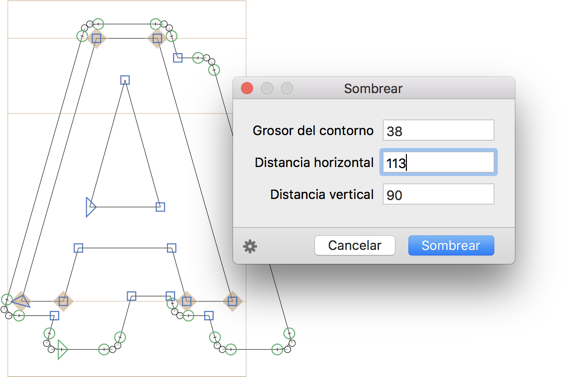

## トラブルシューティング

さて、嘘はつけません。必ず*何か*がうまくいかないものです。もし翻訳が表示されず、途中で迷子になったら、これらのいくつかのヒントが問題を素早く見つけるのに役立ちます。

*   **オブジェクトが違う：** 見つけたIDで正しいオブジェクトを参照していることを確認しましたか？最も典型的なのは、誤って*テキストフィールド*を指すIDを使用してしまい、*テキストフィールドセル*ではないことです。Xcodeのサイドバーの*Dialog*セクションで、十分に掘り下げていることを確認してください。ほら、愛情のこもったスマイリーが付いている方が、あなたが欲しいものです。
    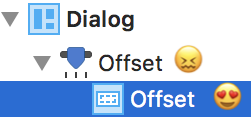

*   **IDが変更された：** .xibに変更を加えましたか？もしかしたら、テキストフィールドの1つを新しいオブジェクトに置き換えたか、別の.xibから貼り付けたか？IDが変更された可能性があります。その場合は、.xibを再コンパイルし、特にObject IDを再度確認する必要があります。
*   **セミコロンを忘れた：** .stringsファイルでは、各代入の後にセミコロンを入れなければなりません。こればかりは勘弁してください、申し訳ありません。
*   **一度再コンパイルしましたか？** *Base.lproj*を追加した後に.xibを再コンパイルしましたか？コンパイルをもう一度行っても何も損はありませんので、安全のために、いずれにせよそれをやっておくと良いでしょう。

---

更新履歴 2020-11-13: Glyphs 3のウェブサイト向けに再フォーマット（ヒントと導入文）。

更新履歴 2022-07-29: タイトル、関連記事、軽微なフォーマットを更新。

## 関連記事

[すべてのチュートリアルを見る →](https://glyphsapp.com/learn)

*   ### [プラグインの作成](plugins.md)

チュートリアル

[ スクリプト ](https://glyphsapp.com/learn?q=scripting)

*   ### [スクリプト：Python 3へのアップグレード](scripting-upgrading-to-python3.md)

チュートリアル

[ スクリプト ](https://glyphsapp.com/learn?q=scripting)