原文: [Make your font work in Windows](https://glyphsapp.com/learn/make-your-font-work-in-windows)
# フォントをWindowsで動作させる

チュートリアル

[ トラブルシューティング ](https://glyphsapp.com/learn?q=troubleshooting)

執筆者: Rainer Erich Scheichelbauer

2024年10月2日更新（初版公開：2024年4月23日）

あなたもフォントでWindowsを修正しようとしたことがありますか？クラブへようこそ。

フォントを制作する際、通常はWebブラウザ、Adobeアプリ、そしてWindowsという3つの環境を気にします。特に、Windows上のWordです。そこでうまくいけば、どこでもうまくいきます。

Wordといえば、フォントに関してはMac版のWordとWindows版のWordでかなりの違いがあります。この記事はWindowsについてですが、Mac版のWordで何が違うかについての注記も含まれています。

## TrueType

Windows向けのフォントを制作する場合、明らかにTTF（ファイル名拡張子`.ttf`）として書き出し、CFF（拡張子`.otf`）を避けるのが賢明です。なぜでしょうか？理由は2つあります。第一に、一部の機能、特にドキュメントへの埋め込みはTrueTypeフォントを必要とします。CFFは埋め込めません。そして、PSベースのOTFでPDFを書き出すと、そのアウトラインはまずビットマップ化されます。以下は、Windows上のWordから書き出されたPDFのOの左上部分です。


ええ。これが作り話だったらいいのにと思います。

第二に、TTFはCFFよりもパフォーマンスが優れています。ある単語を入力し、腕を組んで椅子に寄りかかりながら、文字が一つずつ画面に現れるのを見守るほどです。公平を期すために言うと、これはかなり複雑なアウトラインを含むフォントで起こりましたが、それでもそのTTF版は問題なく動作しました。ですから、はい、WindowsにはTTFのみです。

TTFにはデジタル署名、別名`DSIG`テーブルが必要です。さもなければ、Windows上のWordはそれをOpenTypeフォントとして認識せず、合字やカーニングを含むOpenTypeフィーチャーは機能しません。デフォルトでは、Glyphsは自動的に空の`DSIG`をTrueTypeの書き出しに追加します。しかし、カスタムパラメータ*Export DSIG Table*でそれを強制または抑制できます。最近のWindows上の最近のWordのバージョンでは、そのようなデジタル署名が必要ないかもしれないという噂が耳に入りました。後方互換性のためだけでなく、多くのフォントテスト環境（例えば、フォント販売プラットフォーム上）がそうでないと文句を言うため、いずれにせよ含めても損はありません。

## テストインストール

最善の策は、[AppStoreのParallels](https://apps.apple.com/at/app/parallels-desktop/id1085114709?mt=12)のような仮想化ソリューションです。すぐにWindowsが付属しているサブスクリプションのいずれかを入手してください。そして、買い物のついでに、MicrosoftからOffice 365のサブスクリプションを入手してください。最大5人のユーザーがそれでOfficeをインストールでき、副次的な利点として、同じライセンスでMac版もインストールできます。

フォントのインストールは、MicrosoftがAppleよりもうまくやったことの一つです。必要なのは、フォントファイルを右クリックし、非常に分かりやすい「その他のオプション」を選ぶことだけです。

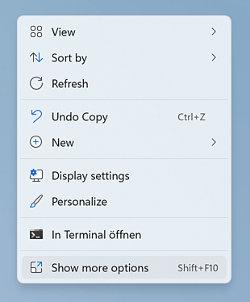

その後、2番目のコンテキストメニューが表示され、そこから「インストール」を選択できます。

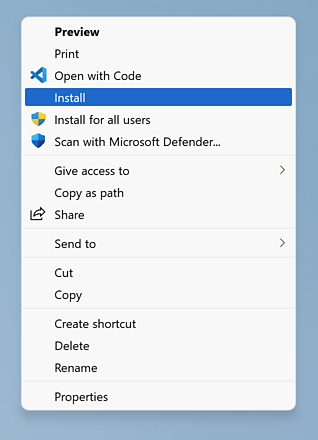

これはAppleより優れているとは言えない、とあなたは言うでしょう。そして、フォントファイルでやりたいことの一つであるにもかかわらず、2つのコンテキストメニューをくぐり抜ける必要があるという退屈な事実に関しては、あなたは正しいです。しかし、それらを*再インストール*する必要がある場合、もう一度同じことをするだけで、古いフォントのインストールは上書きされ、すぐに有効になります。すごい。フォントキャッシュの問題はありません。マイクロソフト、よくやりました。

インストールしたら、Ctrl-DまたはCtrl-Shift-Fでアクセスできる「フォント」ウィンドウから、Wordでそれらを選ぶだけです。

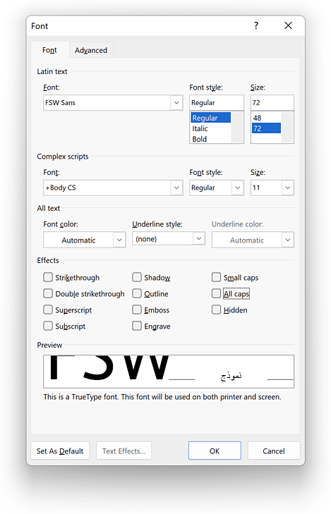

実際には、テキストを選択するとすぐに、フォントピッカーのミニバージョンが表示されます。

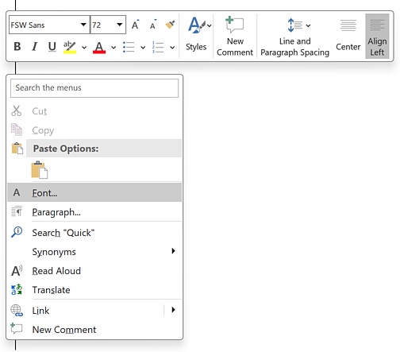

システムからフォントを削除するのは簡単です。「このPC > ローカルディスク > Windows > Fonts」に移動します。ここに、インストールされているすべてのフォントがファミリーごとにグループ化されて存在します。右クリックしてコンテキストメニューから「削除」を選択すれば、それらは消えます。

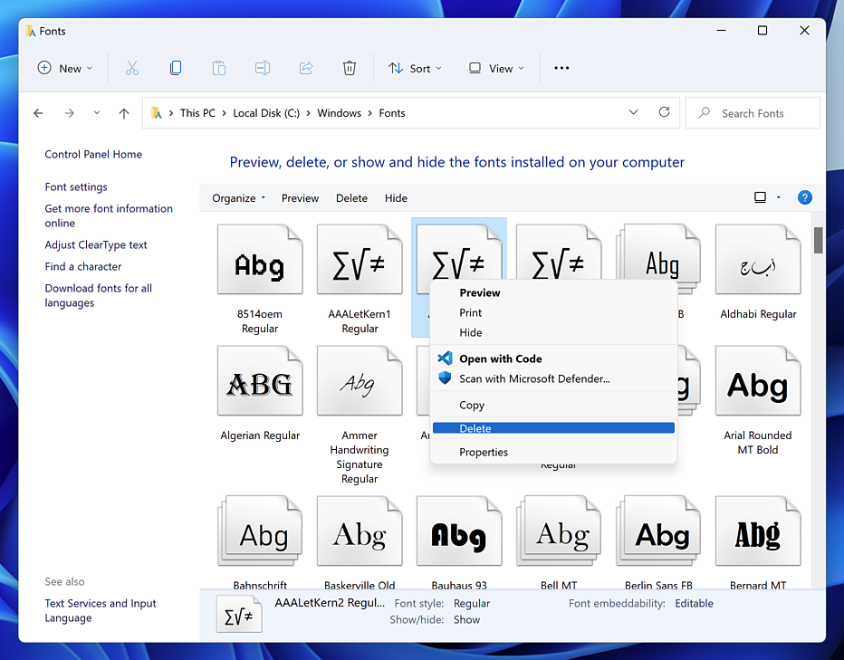

もしファミリーから個々のフォントを削除したい場合は、まずファミリーをダブルクリックしてください。

## グリフセット

Win 1252文字セットは常にカバーするようにしてください。加えて、意図するエンドユーザーのキーボードで入力が想定されるすべての文字もです。さもないと、フォールバックフォントによる置換のリスクがあります。つまり、人々が何かを入力し、あなたのフォントに表現されていない文字のキーを意図せず打つと、ほとんどのOfficeソフトウェア（Windows版のWordを含む）は、その文字をサポートする最初の利用可能なフォントで置換します。そして、その後に入力されるすべての文字もです。そうです、文字通りあなたのフォントが変更されてしまいます。

Win 1252文字セットについては、「言語 > ラテン語 > レガシーエンコーディング」を参照してください。ついでに、Mac版のWordで同様の問題を避けるために、そこにある「Mac Roman」もカバーしておきましょう。

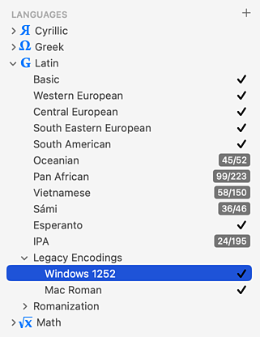

特に、すべての引用符とダッシュをカバーしていることを確認してください。これらはフォントビューのサイドバーの「カテゴリ > 句読点 > 引用符」と「ダッシュ」にあります。これは重要です。なぜなら、Wordはユーザーが入力中に引用符とダッシュを自動置換するからです。そして、それが再びフォントのフォールバックを引き起こす可能性があります。

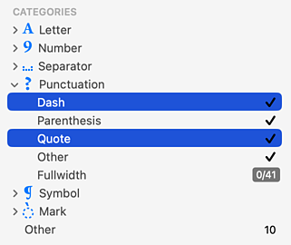

もしフォントに等幅のライニング数字があるなら、それをデフォルトの数字にしてください。さもないと、Windowsユーザーから文句が来ます。ここで初めて聞いたはずです。「フォント情報 > 書き出し」の「グリフをリネーム」と「フィーチャーを更新」パラメータを使って、その場でそれを行うことができます。

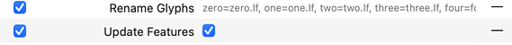

「グリフをリネーム」パラメータには、標準的なグリフの命名規則に従い、接尾辞なしのプロポーショナルなデフォルト数字と`.tf`接尾辞付きの等幅数字があると仮定して、次のようなコードが含まれます。
```
zero=zero.lf
one=one.lf
two=two.lf
three=three.lf
four=four.lf
five=five.lf
six=six.lf
seven=seven.lf
eight=eight.lf
nine=nine.lf
zero.tf=zero
one.tf=one
two.tf=two
three.tf=three
four.tf=four
five.tf=five
six.tf=six
seven.tf=seven
eight.tf=eight
nine.tf=nine
```
上記のコードは、既存のプロポーショナル数字を`.lf`接尾辞付きのセットに移動させます。次に、`.tf`数字をデフォルトの名前に移動させます。「フィーチャーを更新」パラメータは、あなたの`lnum`（ライニング数字）と`tnum`（等幅数字）フィーチャーを再計算し、これで準備完了です。

## ファミリー

複数のフォント間でファミリーを形成することについて言うべきことはすべて、[命名規則のチュートリアル](naming.md)にあります。要するに、Wordは4メンバーの「RIBBI」ファミリーしか認識しません。RIBBIは**R**egular、**I**talic、**B**old、**B**old **I**talicの略です。アイデアは、フォントメニューでファミリーを選択し、BボタンとIボタンを通じて他のファミリーメンバーを選択するというものです。

つまり、一方では、BボタンとIボタンを通じて到達*できない*スタイルは、*別のファミリーと見なされる*ことを意味します。結果として、RIBBI以外のウェイトは、アルファベット順にソートされた別のエントリとしてリストされます。つまり、BlackはSemiboldの前に来ます。それぞれのイタリックは、再びIボタンで到達できます。

もしこれが気に入らないなら、まあ、運が悪かったとしか言えません。これがWindows（少なくともWindows版Word）のフォントメニューのロジックなので、それを受け入れてください。WordをInDesignに変える魔法のハックはないのです。Microsoftでさえ、自社のフォントを並べ替えることはできません。

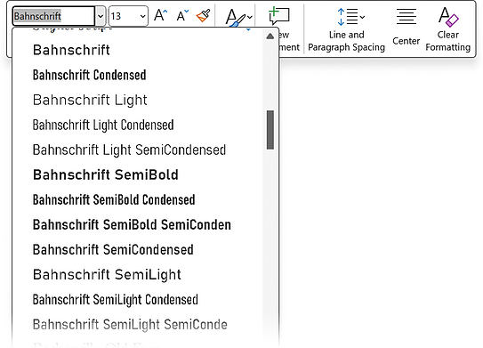

ちなみに、Microsoft OfficeのMac版ではこれは異なります。そこでは、すべてのスタイルがファミリーごとに、そしてファミリー内では幅とウェイトクラスによってソートされます。

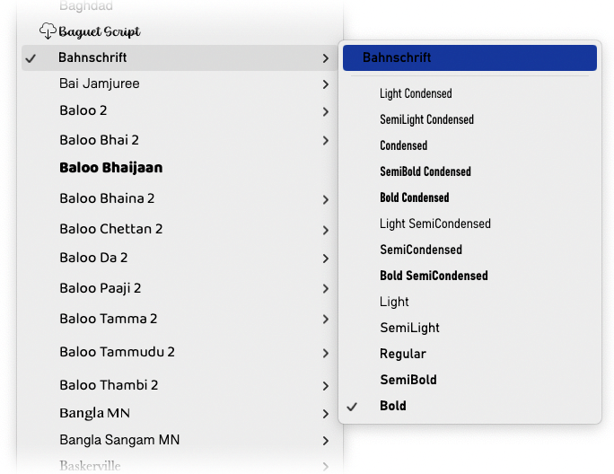

ウェイトクラスといえば、使用すべき最も低いウェイトクラスは250であると聞いたことがあるかもしれません。なぜなら、Wordはそれ以下のウェイトクラスに設定されたフォントを、表示するには細すぎると見なし、人工的に太字にするからです。良いニュースがあります。もはやそれは必要ありません。ウェイトクラスのバグは20年以上前に修正されました。ですから、1から1000までのウェイトクラスの全範囲を使用できます。しかし、後方互換性はどうでしょうか？お願いですから、やめてください。四半世紀も前のWordのバージョンを使っているようなケチな人が、あなたのフォントに1セントも払うとは思えません。言い換えれば、その市場セグメントは安全に無視できます。

命名に関する2つのアドバイスです。第一に、**名前は短く保ちましょう**。ファミリー名とスタイル名の両方です。これは良い考えです。なぜなら、Windowsのフォントメニューは非常に小さく、長すぎると古いバージョンのWindowsでは[フォントが「無効」であると文句を言うことがある](multiple-masters-part-3-setting-up-instances#g-keep-your-style-name-short.md)からです。しかし、バージョン11以降のWindowsは長い名前も問題なく扱えるようです。

第二に、一部の文字の組み合わせは名前で使用できないようです。[少なくとも`NOR`（すべて大文字）についてはこれが真実であることを確認できます](https://forum.glyphsapp.com/t/cursive-in-font-name-and-microsoft-apps/30049/5)。これは、フォントがWordのフォントメニューに表示されない原因となりました。これは、ブール演算子「nor」のように、コーディング用に予約されている単語に関連している可能性があると推測されるかもしれません。しかし、`AND`は名前で問題なく機能します。いずれにせよ、すべてを試してもフォントが表示されない場合は、名前を変更してみて、それが助けになるか確認してください。もし他に禁止されている文字の組み合わせを発見したと思われる場合は、フォーラムでお知らせください。このチュートリアルを更新します。

## バーティカルメトリクス

OK、バーティカルメトリクスのアイデアは、3つのメトリクスセット間で何とか良い同期（または妥協点）を見つけることです。

*   `OS/2` winAscentおよびwinDescent
*   `OS/2` typoAscender、typoDescender、typoLineGap
*   `hhea` ascender、descender、lineGap

そして、*常に*OS/2 selection bit 7を有効にしてください。これは「Use Typo Metrics」とも呼ばれます。しかし、それはGlyphs 3以降ではとにかくデフォルトです。

これらのメトリクスが*すべき*こと：OS/2 Win値は、*クリッピング*にのみ使用されるべきです。行の位置を決定するために、WindowsはOS/2 Typoを、Macはhheaメトリクスを使用すべきです。悪いニュースは、もし*Use Typo Metrics*がオンの場合、Windows上のWordはOS/2 Typo値を*クリッピングと行の位置決めの両方*に使用します。これはバグであり、近いうちに修正される可能性は低いです。

ちなみに、Mac版のWordは、どのビットが設定されていても、*行の位置とクリッピングの両方*に常にhhea値を使用します。ですから、どのバーティカルメトリクス戦略に従うにせよ、常にTypo値とhhea値を互いに同期させ、重要なグリフのいずれにも食い込まないようにしてください。

これは、ラテン語とアラビア語など、非常に異なる垂直メトリクスを組み合わせる必要がある多言語書体にとっては悩みの種です。そのような場合、あなた（またはあなたのクライアント）は、タイトな行揃えと、画面上でグリフが切れないことのどちらが重要かを決める必要があります。Wordでは両立できません、申し訳ありません。

## ヒンティング

もし[ttfautohint](hinting-truetype-autohinting.md)を使用する予定なら、「Windows互換性」をオンにしてください。なぜなら、これによりOS/2のwinAscentとwinDescentの位置にアラインメントゾーンが導入され、意図しないクリッピングの可能性が減少するからです。ttfautohintでのヒンティングに関するその他のすべてについては、はい、[チュートリアルを読んでください](hinting-truetype-autohinting.md)。

## OpenTypeフィーチャー

正直に言うと、フィーチャーを機能させることは、これまでで最も不透明なことです。ここで求められるすべてを行ったとしても、Windows上のWordでフィーチャーが機能しないことがあります。なぜでしょうか？わかりません。しかし、わかっていることは、フォントに`DSIG`テーブルがあること（上記参照）と、「フォント情報 > フィーチャー」で「言語システム」が適切に設定されていることを再確認しなければならないということです。さもなければWordはストライキを起こします。良いニュース：Glyphsはこれを自動的に行いますが、時々「更新」ボタンを押す必要があるかもしれません。

Windows上のWordで機能するかどうかを確認する方法は、Ctrl-Dを押してフォントメニューを開き、まだ選択していなければフォントを選び、次に「詳細設定」タブに進むことです。そこで、フィーチャーのオプションがすべて灰色で表示されて絶望するか、

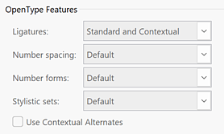

あるいは、シャンパンのボトルを開けることができます。なぜなら、それらが実際に利用可能だからです。

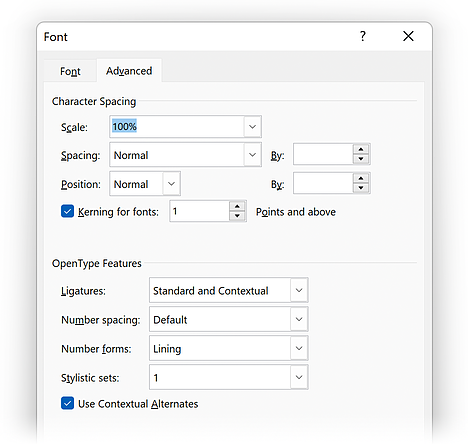

このウィンドウは、クライアントに教育する必要があるものでもあります。あなたは今、Wordのフォントウィンドウの「詳細設定」タブについて知っている世界人口の0.1%に属していますが、クライアントはそれについて全く知らない可能性があります。どんなアプリでもデフォルトでオンになっているべきOTフィーチャーは、Wordではユーザーによって有効にされる必要があり、それはまさにここで行われなければなりません。

はい。一度に1つのスタイルセットしか有効にできず、その名前はメニューに表示されません。ですから、スタイルセットをやりすぎないようにするか、いくつかのセットを別のセットに統合するオプションを提供してください。しかし、ほとんどのWindowsユーザーはスタイルセットについて聞いたことがないので、あまり心配しないでください。

PowerPointでは、いかなるOpenTypeフィーチャーも機能しません。PowerPointのコードベースは非常に古く、柔軟性がなく、壊れているため、PowerPointで何かを機能させようと考えることすらやめてください。

## カラー

Windows上のWordは、他のアプリと同様に、CPAL/COLRをサポートしています。したがって、もし色が必要なら、[チュートリアルに従う](creating-a-microsoft-color-font.md)だけで大丈夫です。しかし…恐縮ですが、もう一つあります。カラーフォントの技術を混ぜることはできません。純粋なCPAL/COLRでなければなりません。特に、SVGは追加しないでください。もし追加すると、Wordはすべての色情報を無視し、（白黒の）フォールバックレイヤーのみを再現します。

ため息。クロスプラットフォーム互換のカラーフォントについては、こんなものです。私たちの推奨：TTFの書き出しでは、COLRテーブルの書き出しを有効にし、SVGテーブルの書き出しを無効にしてください。「ファイル > フォント情報 > 書き出し」でカスタムパラメータを使えば簡単にできます。

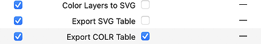

## カーニング

Microsoftアプリでカーニングを表示させることは、それ自体が科学ですが、以前に機能したいくつかの方法があります。しかし、すべてを正しく行っても、それでも機能しない状況があるでしょう。では始めましょう。

カーニングが機能するためには、…

*   …ペア調整カーニングは、*Font Info > Exports*に追加された*Keep Kerning in one Lookup*というカスタムパラメータを使って、単一のルックアップにマージする必要があります。
    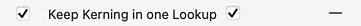

*   …フォントには少なくとも他に1つのGPOSフィーチャーが必要です。マーク対ベースの`mark`またはマーク対マークの位置決めの`mkmk`で十分です。*Remove Features*パラメータでフォントを最適化しようとするときは、このことを覚えておいてください。これら2つは削除しないでください。
*   …「フォント」ウィンドウ（Ctrl-D、上記参照）の「詳細設定」タブで有効にする必要があります。カーニングの最小サイズを、1ポイントのような馬鹿げた低い値に設定します。なぜMicrosoftがユーザーにこのようなことをさせるのか、私に聞かないでください。

場合によっては、カーニングは*エンコードされた*グリフ間でのみ機能するとユーザーから報告されています。しかし、私はそれを確認できません。もちろん、エンコードされていないグリフにPUAコードを追加してみて、それが助けになるか試すことはできます。私の推測では、うまくいかないでしょう。つまり、「カーニングを平坦化」しない限りは。それは何かと尋ねますか？まあ、読み進めてください。

### カーニングの最後の手段

OK、何をしてもカーニングが機能しない場合はどうしますか？最後の手段として試せる3つのことがあります。

#### バリアブルフォントに切り替える

PowerPointでカーニングを機能させることを含む、Windowsでの多くの問題に対するありそうにない解決策は、あなたの書体をバリアブルフォントとして書き出すことです。「ファイル > フォント情報 > 書き出し」で、新しいバリアブルフォント設定を作成し、「フォント」タブのデフォルトのファミリー名とは異なるファミリー名を追加します。これはフォントの命名競合を避けるために必要で、通常はファミリー名に「Var」や「Variable」を追加します。次に、「ファイル > 書き出し > バリアブル」経由で書き出します。

運が良ければ、これで解決です。私のテストでは、これは悪名高い非互換性を持つPowerPointでもカーニングを機能させました。

#### distハック

実際には、Wordでさえ無視できないOTフィーチャーがいくつかあります。なぜなら、それらは一部のスクリプトがOfficeで機能するために不可欠だからです。その一つが[Distancesフィーチャー](https://learn.microsoft.com/en-us/typography/opentype/spec/features_ae#tag-dist)、略して`dist`です。これは南アジアおよびブラーフミー系文字が機能するために必要で、したがって常にオンになっています。

`dist`フィーチャーに便乗して、Distancesフィーチャー内でカーニングのルックアップを呼び出すことができます。すでに*Keep Kerning in one Lookup*カスタムパラメータを追加していると仮定して、必要なのは、*Add Feature*という別のカスタムパラメータを追加し、`dist`フィーチャーを選び、この行を追加することだけです。
```
lookup kern_DFLT;
```
これは、`kern`フィーチャー内の最初のルックアップの名前になります。そして、`dist`は`kern`フィーチャーの後に追加されるので、そこからそのルックアップを呼び出すことができます。もしすべて正しく行っていれば、次のようになります。

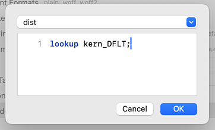

もし*Keep Kerning in one Lookup*パラメータでそれらを一つのルックアップにまとめない場合は、次のようになります。
```
lookup kern_DFLT;
lookup kern_latn;
lookup kern_cyrl;
```
…などなど、お分かりですね。カーニングを持つすべてのスクリプトに対して、`kern_XXXX`のルックアップ呼び出しを追加します。ここで`XXXX`は[OpenTypeスクリプトタグ](https://learn.microsoft.com/en-us/typography/opentype/spec/scripttags)です。カーニングを持たないスクリプトや、フォントにさえないスクリプトは避けてください。

しかし、これはハックであることを覚えておいてください。そして、それは他のアプリでフォントが誤動作する原因になる可能性があるので、絶望的なハックです。現在のバージョンのWordでは機能するかもしれませんが、クライアントは喜ぶかもしれませんが、他のアプリでは機能しないかもしれません。さらに悪いことに、OpenTypeフィーチャーを完全に壊す可能性があります。ですから、私はそれをお勧めしません。私の経験では、最近のOfficeのバージョンでは機能しないこともあります。でもまあ、あなたの場合は違うかもしれませんし、ラッキーかもしれません。

#### カーニングを平坦化する

OpenTypeフォントでは、カーニング情報は`kern`フィーチャーに保存され、これは`GPOS`（「グリフ位置決め」）テーブルの一部です。この種のカーニングの素晴らしい点は、*グループカーニング*と呼ばれることができることです。本質的に、グループカーニングとは、AYをカーニングすると、ÄY、ÃY、ÁY、さらにはAÝや、ÅŸのようなあり得ない組み合わせでさえも、同じようにカーニングされることを意味します。これは、これらの文字がすべてグループの一部であるためです。この場合は、すべてのAのダイアクリティカルマークを含むAグループと、すべてのYのダイアクリティカルマークを含むYグループです。

OpenType以前の暗黒時代には、`kern`フィーチャーを持つ`GPOS`テーブルのようなものはありませんでした。したがって、グループカーニングもありませんでした。`kern`テーブルで、いくつかの個々のグリフを互いにカーニングすることしかできませんでした。はい、フィーチャーではなく*テーブル*です。kernテーブルとkernフィーチャーを混同しないように、テーブルは時々「古いスタイルのkernテーブル」または「OpenType以前のkernテーブル」と呼ばれます。いずれにせよ、kernテーブルの制限は、フォントが200グリフ程度しか含まず、その半分強が文字であったため、大きな問題ではありませんでした。通常、1000から2000のグリフペアリングで済んでいました。しかし、今日では、基本的なフォントでさえ500グリフ以上を数え、何万もの潜在的なペアリングを生み出し、古き良きOpenType以前のkernテーブルの繊細な限界をいつでも超えてしまいます。

GPOSテーブルを粉々に砕いて、代わりに古いスタイルのカーニングテーブルを持たせたらどうでしょうか？結局のところ、それは昔、私たちの祖父たちが石と木の棒で最初のコンピュータを作った頃には、いつも機能していたのですから（PowerPointでさえ、ゴホン、ゴホン）。

はい、それは実際に機能しますが、それは再びフォントを壊すことを意味します。もはやグループカーニングはなくなり、さらに最も重要なグリフ間のペアのためにサブセット化を行う必要があり、途中で多くのカーニング情報を失うことになります。これが、[mekkablue scripts](glyphsapp3://showplugin/mekkablue%20scripts)の「Kerning > Kern Flattener」スクリプトが行うことです。まず、フォントを複製し（つまり、コピー上で作業し）、定義済みの数のグリフペアリングのカーニングを追加し、すべてのグループカーニングと、もしあれば`GPOS`フィーチャーを削除します。したがって、「ウィンドウ > カーニング」は、グループなしでこのようになります。

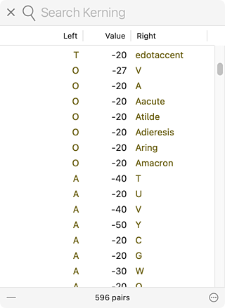

最後に、書き出すインスタンスに、よく隠された、トップシークレットのカスタムパラメータを追加します。それは「Export kern Table」と呼ばれます。


これにより、`GPOS`テーブルの`kern`フィーチャーが抑制され、代わりに古いスタイルの`kern`テーブルがTTF書き出しに追加されます。（このパラメータはCFF OpenTypeフォントでは機能しません。なぜなら、OpenType以前は、テーブルはTTFにしか存在せず、PostScriptベースのOpenType以前のフォントには`kern`テーブルがなかったからです。OpenType以前のPostScriptフォントは、非常に異なる構造でした。）

ファイルの複製から書き出し、その後、保存せずに閉じます。なぜなら、それに含まれているのは、あなたのフォントの壊れたバージョンだけだからです。次に、新しい書き出しをインストールし、WindowsにインストールしてOfficeで試す間、幸運を祈ります。

幸運を祈ります。

## リンクと詳細情報

*   このトピックは、[フォーラムで頻繁に議論されています](https://forum.glyphsapp.com/t/not-def-tofu-showing-in-ms-office-font-list/20005/5)。
*   ATypI Tech Talks 2022、「Make Your Fonts Work in…」のセクション[Word and Microsoft Office](https://youtu.be/wmT4LfcIP5Q?t=173)。
*   Typedrawers: [MS Word 2010でOT/TTFのレイアウトフィーチャーを機能させる方法](https://tinyurl.com/dsig-ttf)（DSIGテーブルに関する論理的根拠を含む）。

---

更新履歴 2024-06-12: ユニコードとカーニングに関する説明、およびNORの文字の組み合わせに関する注記を追加。Göranさん、ありがとう！

更新履歴 2024-07-04: 誤字を2つ修正。

更新履歴 2024-07-23: カラーのセクションを追加。

更新履歴 2024-10-02: カーニングのためのバリアブルフォントソリューションを追加。

## 関連記事

[すべてのチュートリアルを見る →](https://glyphsapp.com/learn)

*   ### [ネーミング](naming.md)

チュートリアル

*   ### [マルチプルマスター、パート3：インスタンスの設定](multiple-masters-part-3-setting-up-instances.md)

チュートリアル

[ 補間 ](https://glyphsapp.com/learn?q=interpolation)