原文: [Making small caps](https://glyphsapp.com/learn/making-small-caps)
# スモールキャップの作成

チュートリアル

[ OpenTypeフィーチャー ](https://glyphsapp.com/learn?q=opentype+features)

執筆者: Rainer Erich Scheichelbauer

[ en ](https://glyphsapp.com/learn/making-small-caps) [ fr ](https://glyphsapp.com/fr/learn/making-small-caps) [ zh ](https://glyphsapp.com/zh/learn/making-small-caps)

2022年9月13日更新（初版公開：2015年10月29日）

さて、すべての大文字グリフを終え、波に乗っていますか？ここでは、ソフトウェアが大文字からスモールキャップを生成する方法を紹介します。

## 複製とリネーム

Glyphsは、スモールキャップに特別な命名規則を採用しています。小文字の名前に接尾辞`.sc`を付けます。あるいは、小文字からスモールキャップへの変換には`.smcp`、大文字からスモールキャップへの変換には`.c2sc`という接尾辞もあります。

まず、スモールキャップにしたいすべての文字を複製する必要があります。一般的には、コンポーネントで構成されていないすべての大文字が対象となります。フォントビューの左下にある歯車のアイコンをクリックし、「スマートフィルタを追加」を選択することで、これらを簡単にフィルタリングできます。次に、「パスの数」、「より大きい」、「0」を選択します。

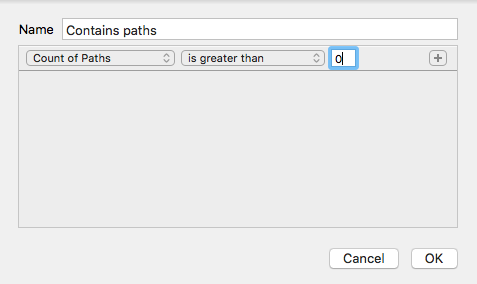

さて、Cmdキーを押しながら選択することで、フィルタと「文字 > 大文字」を同時に選択します。これにより、コンポーネントを持たないすべての大文字が得られます。

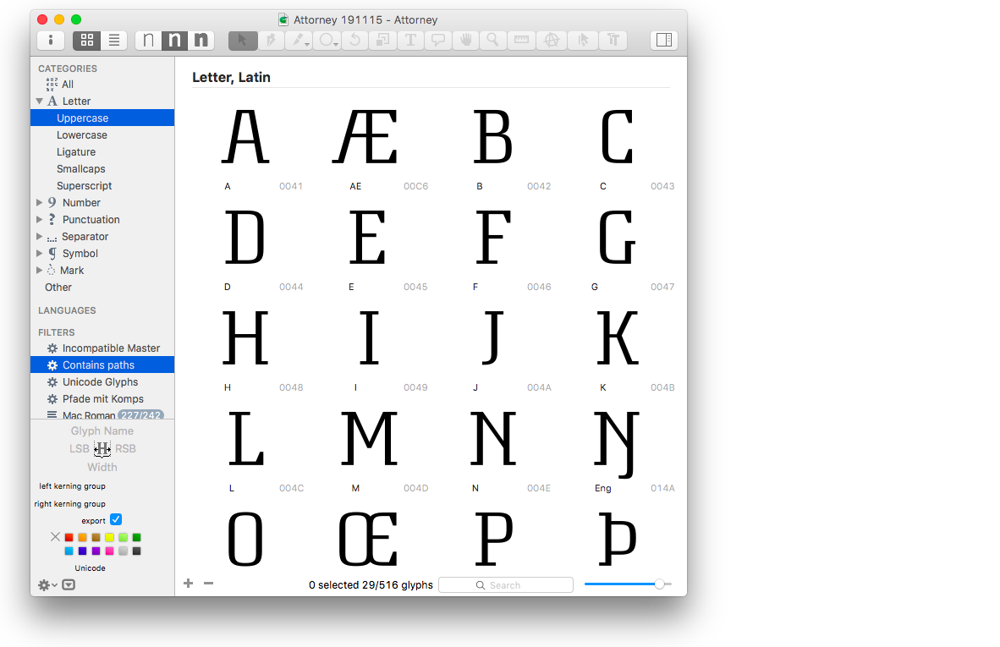

もしデザイン上必要なら、数字、句読点、記号のスモールキャップのバリエーションも忘れないでください。この例では、大文字に絞ります。選択したすべての文字を選び、「グリフ > グリフを複製」（Cmd-D）に進みます。これで、複製されたすべてのグリフに`.001`という接尾辞が付きます。

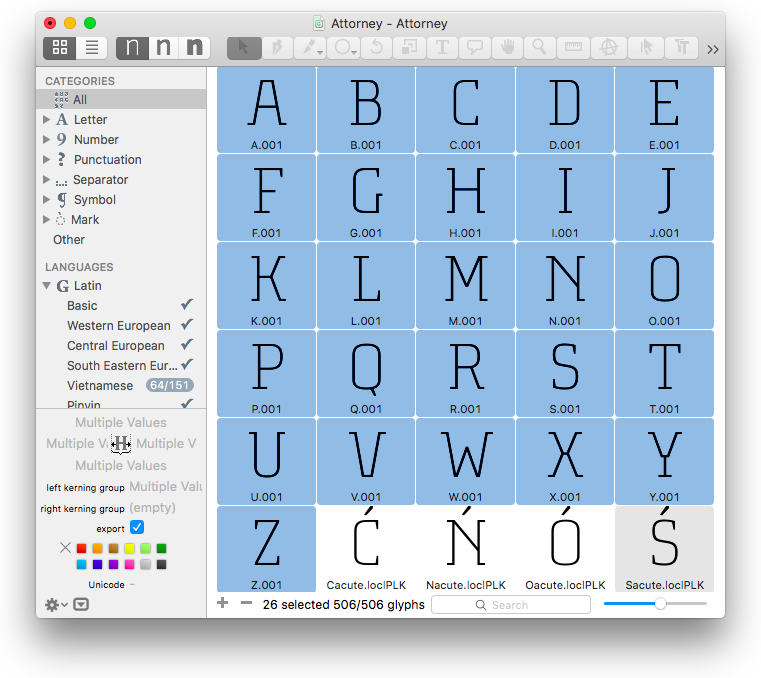

さて、スモールキャップには`.sc`という接尾辞が付くので、リネームする必要があります。しかし、一つずつリネームする必要はありません。`.001`グリフをすべて選択し、Shift-Cmd-Fを押すか、「編集 > 検索 > 検索と置換」に進みます。「検索」ボックスに`.001`を、「置換」ボックスに`.sc`を入力し、「置換」を押します。

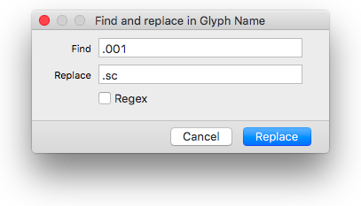

グリフの名前を大文字から小文字に簡単に切り替えるには、[mekkablueのスクリプト](https://github.com/mekkablue/Glyphs-Scripts)の「Glyph Names」フォルダにある「Make glyph names lowercase」スクリプトを使用するだけです（Glyphs 3の場合、[ここをクリックしてプラグインマネージャ経由で直接インストールできます](glyphsapp3://showplugin/mekkablue%20scripts)）。これにより、選択したグリフの名前が自動的に小文字に変わります。

あるいは、マニア向けには、もっとクールな内蔵の方法があります。この小さなトリックを使えば、リネームのステップ（接尾辞の追加と小文字化）を一度に行うことができます。

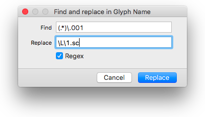

繰り返しになりますが、グリフを選択し、「編集 > 検索 > 検索と置換」（Shift-Cmd-F）に進み、「検索」フィールドに`(.*)\.001`と入力します。`(.*)`は任意の数の任意の文字を意味し、`\.001`はリテラルのドットに続く「001」を意味します。次に、「置換」フィールドに`\L\1.sc`と入力します。`\L`は続くものをすべて小文字に変換し、`\1`は括弧内の最初の式、この場合は`(.*)`を表します。そして`.sc`は私たちが好むスモールキャップの名前の接尾辞です。今回は、「Regex」もチェックする必要があります。これは正規表現を意味し、これらの面白いドット、アスタリスク、括弧が何かを意味するものです。超簡単！

## スケーリングと微調整

さて、小さくなければスモールキャップとは言えません。したがって、グリフを「スケール」する必要がありますが、同時にステムの幅はそのままに保つ必要があります。繰り返しになりますが、これをすべて手動で行う必要はありません。ウェイト軸に複数のマスターがある場合は、Tim Ahrens氏の[Font Remix Tools](http://remix-tools.com/glyphsapp)の「RMX Scaler」機能を使用できます。しかし、これらは実際には単なるスケーリング以上のことをします。「RMX Scaler」はステムの幅を維持しようとします。これはスモールキャップで私たちが望むことです。しかし、RMXはあなたのステム幅を推測することはできないので、「フォント情報 > マスター」（Cmd-I）で各マスターの水平および垂直ステム幅を定義する必要があります。

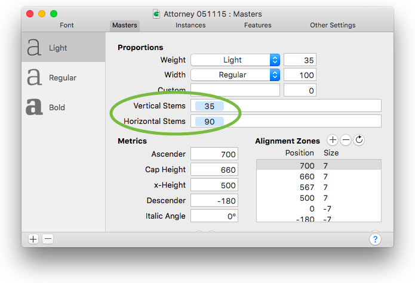

次に、フォントビューまたは編集ビューで、将来のスモールキャップグリフを選択し、「フィルタ > RMX Scaler」を実行し、あなたのデザインにとって意味のある値を入力します。

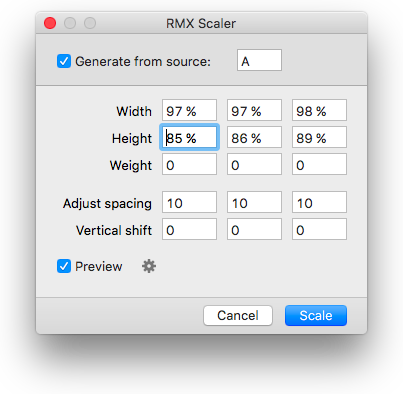

各列は1つのマスターを表します。列にカーソルを置くと、RMX Scalerは編集ビューをそれぞれのマスターに切り替えるので、常に行っていることの良いプレビューが得られます。「幅」の値は「高さ」の値より高くしたいと思うでしょうし、スモールキャップの高さはエックスハイトより少し上にしたいでしょう。アウトラインを拡大する単位値を指定することで、ステムの「ウェイト」を変更することもできます。これは、スモールキャップがスペクトルの端で時々起こるように、細すぎるように見える場合です。通常、スモールキャップはもう少しスペーシングも必要です。「スペーシングを調整」フィールドに単位値を入力します。「垂直シフト」フィールドは上付きグリフ用なので、ここでは無視できます。

RMXは大きな助けになりますが、一度に非常に多くのことをこなしてくれる一方で、完成したスモールキャップを与えてくれるわけではないことを覚えておいてください。手動での微調整はまだ必要になります。

さて、これまでに達成したことはこちらです。

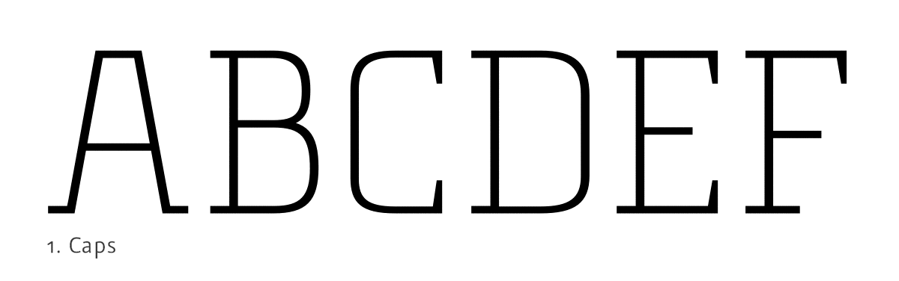

## スモールキャップの高さ

メトリクスにはエックスハイトとキャップハイトがあるので、スモールキャップの高さもあるべきです。これを行うには、使用しているGlyphsのバージョンに応じて異なる方法があります。

### Glyphs 3でスモールキャップの高さを追加する

「フォント情報 > マスター > メトリクス」に進み、「メトリクス」の見出しの隣にあるプラスボタンをクリックして、新しいメトリクスエントリを追加します。

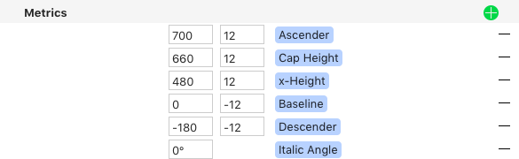

ダイアログシートが表示され、必要なすべての情報を尋ねられます。「メトリックタイプ」として「x-Height」を選択してください。なぜなら、私たちのスモールキャップの高さは、スモールキャップグリフのエックスハイトを置き換えることになっているからです。

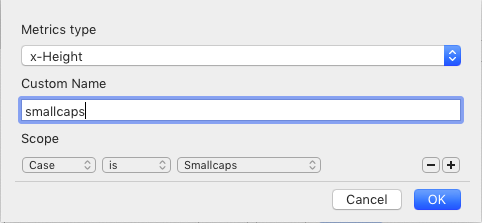

「名前」は任意です。私は「smallcaps」を選びました。好きなものを選んでください。そして最も重要なのは、「適用範囲」で、どのグリフにメトリクスを表示するかを決定することです。この場合は簡単です。「適用範囲」を、「ケース」が「スモールキャップ」であるすべてのグリフに設定します。

したがって、すべて正しく行っていれば、あなたのメトリクスセクションには、スモールキャップ用の新しいエントリも表示されるはずです。

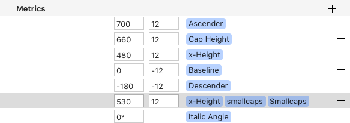

メトリックエントリは、すべてのマスターで自動的に同期されます。しかし、まだ行う必要があるのは、値、つまりフォントユニットでの実際の高さを設定することです。通常、これはエックスハイトより少し上になります。この例では、エックスハイト480より50ユニット高い530を選びます。

### Glyphs 2でスモールキャップの高さを追加する

「フォント情報 > マスター」に進み、新しい「カスタムパラメータ」を追加し、各マスターで「smallCapHeight」を選択します。「値」には、スモールキャップに対応する高さを入力します。この方法なら、編集ビューを何十ものガイドで散らかす必要がありません。最後に、オーバーシュートを忘れないでください。「アラインメントゾーン」の更新ボタンを押して必要に応じて調整するか、プラスボタンで手動で追加します。

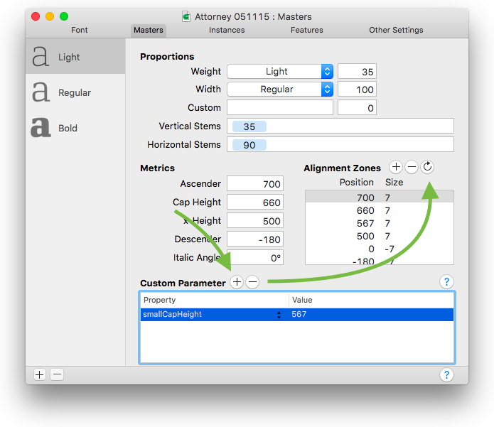

 अब、`.sc`グリフを編集するたびに、編集ビューのエックスハイトの代わりにスモールキャップの高さが表示されます。

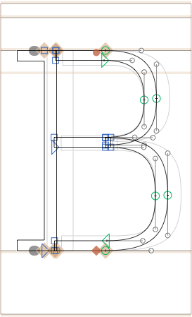

## 欠けているスモールキャップを追加する

他のすべての文字はどうでしょうか？簡単です。Glyphsは、まだ対応するスモールキャップがないすべての文字を追跡しています。フォントビュー（Cmd-Opt-1）に進み、左のサイドバーに「カテゴリ > 文字 > スモールキャップ」があり、まだ欠けているスモールキャップの文字数を示す動的なカウンターが表示されます。

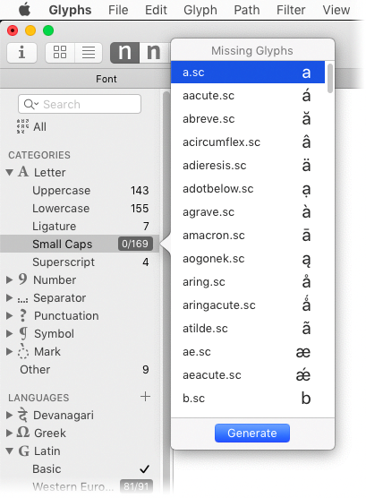

このスクリーンショットでは、169個の潜在的なスモールキャップがあり、そのうち0個が現在フォントにあります。エントリを右クリックし、提案されたすべてのスモールキャップを選択し、「生成」をクリックします。

これは動的なカウンターであることを覚えておいてください。したがって、後で大文字または小文字を追加した場合は、スモールキャップの数を確認するようにしてください。

## OpenTypeフィーチャー

スモールキャップのフィーチャーを追加するには、「ファイル > フォント情報 > フィーチャー」に進み、「更新」をクリックし、次に「コンパイル」をクリックします。これで、`smcp`と`c2sc`という2つの追加フィーチャーがあるはずです。最初の`smcp`は、小文字のグリフをスモールキャップに変え、`c2sc`（「caps to small caps」の略）は、大文字で同じことをします。

InDesign、QuarkXPress、Affinity DesignerなどのDTPアプリケーションは、通常、スモールキャップに関して2つの選択肢を提供します。

*   小文字のみをスモールキャップにする：`smcp`のみをトリガーします。
*   *すべて*（大文字*と*小文字）の文字をスモールキャップにする：`smcp`と`c2sc`の*両方*をトリガーします。

もし独自のカスタムフィーチャーコードを書く必要があり、`c2sc`に入れるか`smcp`に入れるかを決めなければならない場合は、このことを覚えておいてください。

そして、この大変な作業の後、それが実際に機能するかどうか知りたくなるでしょう。[Adobeプログラムでフォントをテストする方法について詳しくはこちら](testing-your-fonts-in-adobe-apps.md)。

## 特殊なケース

OK、特別な注意が必要なケースがいくつかあります。それらを見ていきましょう。

### 文字

`idotless`と`jdotless`を扱うには2つの方法があります。考えてみれば、スモールキャップのバリアントは、iとjのスモールキャップと全く同じに見えるべきです。フォントに`i.sc`と`j.sc`がすでにあると仮定して、「グリフ > グリフを追加…」（Cmd-Shift-G）でグリフ作成ダイアログを呼び出し、次のように入力できます。
```
i.sc=idotless.sc
j.sc=jdotless.sc
```
…そしてフィーチャーを更新すれば、完了です。

あるいは、フォントに重複したグリフがあるのを好まない人々の一人かもしれません。その場合は、「ファイル > フォント情報 > フィーチャー」に進み、2番目の`smcp`フィーチャーを追加し、その自動化を無効にして、このコードを追加します。
```
sub idotless by i.sc;
sub jdotless by j.sc;
```
それは次のようになります。

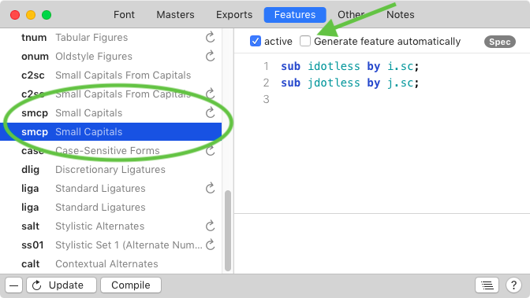

合字は、スモールキャップのフィーチャーが合字のフィーチャーの前に実行されるため、問題にはならないはずです。もちろん、エンコードされた古い合字、最も顕著なのは`fi`と`fl`がある場合を除いてです。それらはもはや使用されるべきではありませんが、残念ながら、一部のMacのキーボードレイアウトにはまだそれらが残っているため、フォントに追加する必要があります。その場合は、「ファイル > フォント情報 > フィーチャー」に進み、`ccmp`フィーチャーを更新してください。それには、少なくともこれらの2行を含むルックアップが含まれているはずです。
```
lookup ccmp_latn_1 {
    sub fi by f i;
    sub fl by f l;
} ccmp_latn_1;
```
この方法なら、古い合字`fi`と`fl`は常にそれぞれの文字に分解され、スモールキャップのフィーチャーがその役割を果たすことができます。

バルカン語のダイグラフ`Lj lj LJ Dz dz DZ`などの古いダイグラフも同様に機能します。

### 句読点

句読点グリフについては、`.sc`の代わりに`.c2sc`という接尾辞を検討してください。これにより、句読点は`smcp`からは除外されますが、`c2sc`には含まれます。これは良い考えです。なぜなら、句読点は、*大文字と小文字の両方*がスモールキャップに変換される場合にのみスモールキャップになるべきだからです。小文字だけがスモールキャップ化される場合は、同じままであるべきです。

言うまでもなく、スモールキャップ処理が必要な句読点グリフはごくわずかです。一部についてはオプションです。丸括弧、角括弧、中括弧のスモールキャップのバリエーションが必要かどうか、よく考えてください。あるいは、デフォルトをスモールキャップにも合うようにデザインすれば、`.c2sc`バリアントを追加する必要はありません。

しかし、これらを追加する必要があります。
```
exclam.c2sc
exclamdown.c2sc
question.c2sc
questiondown.c2sc
```
そして、もしフォントにインターロバングがある場合も同様です。
```
interrobang.c2sc
invertedinterrobang.c2sc
```
なぜなら、これらを追加しないと、あなたのフォントはスペイン語で機能しないからです。ですから、たとえスモールキャップの句読点を追加したくなくても、すべての感嘆符と疑問符については追加しなければなりません。あるいは、あなたのフォントを「スペイン語非対応」として市場に出すかです。あなたの選択です。

### 旧バージョン：Glyphs 2で欠けているスモールキャップを追加する

もしGlyphs 2を使用している場合、サイドバーに動的な「スモールキャップ」グリフリストがないことに気づくかもしれません。したがって、もし古いバージョンのGlyphsを操作する必要がある場合、ワークフローとして私が提案するのは次のとおりです。

まず、「スマートフィルタ」を追加しますが、今回は「最初のマスターにコンポーネントあり」と「はい」を選択します。

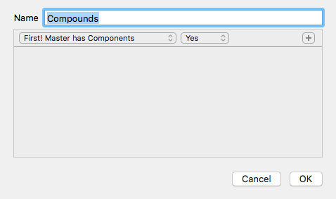

さて、先ほど大文字で行ったように、フィルタと「小文字」を同時に選択します。Cmdキーを押しながらです。これらの文字をすべて選択し、右クリックして「グリフ名をコピー > スペース区切り」を選択します。これで、小文字のコンポーネントのすべてのグリフ名がクリップボードに入りました。

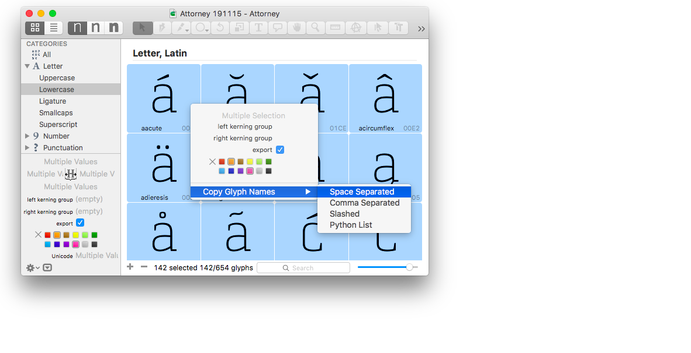

お好みのテキストエディタ、例えば[TextMate](https://macromates.com/download)、[TextWrangler](http://www.barebones.com/products/textwrangler/)、[Atom](https://atom.io)、[Sublime](http://www.sublimetext.com/2)、または[BBEdit](http://www.barebones.com/support/bbedit/updates.html)を開き、そこにペーストします。「検索と置換」機能を使って、すべてのスペースを`.sc`とスペースに置き換えます。

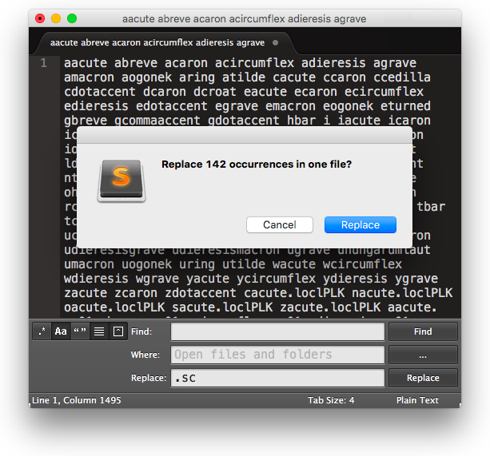

これで、`aacute`、`abreve`、`acaron`、…が`aacute.sc`、`abreve.sc`、`acaron.sc`、…に変わるはずです。新しいリストをコピーして、再びGlyphsに切り替えます。「グリフ > グリフを追加」（Shift-Cmd-G）に進み、リストをペーストして「生成」を押します。Glyphsは、あなたのスモールキャップグリフを構築し、可能な限り`.sc`コンポーネントを優先します。完了！

また、フォントビューの左下にあるプラスボタンを押してグリフを手動で追加し、それらをリネームすることもできます。例えば、ウムラウト付きのaのスモールキャップバリアントに`adieresis.sc`という名前を付け、「グリフ > コンポジットを作成」（Ctrl-Cmd-C）に進みます。すると、グリフはコンポーネント`a.sc`と`dieresiscomb.sc`で構成されます。Glyphsは、可能な限り同じ接尾辞を持つグリフを優先します。したがって、フォントに`dieresiscomb.sc`がない場合は、代わりに`dieresiscomb`をデフォルトとして使用します。

---

更新履歴 2019-02-11: 軽微な修正、フォーマット、誤字を修正し、Atomのリンクを追加。

更新履歴 2019-08-09: 「Make glyph names lowercase」スクリプトの名前を変更し、誤字を修正（Nathalie Dumontさん、ありがとう）。

更新履歴 2021-10-06: メトリクス設定でGlyphs 2と3の区別を明確にしました。

更新履歴 2021-10-07: 「Special Cases」（特別な場合）のセクションを追加。

更新履歴 2022-09-13: 誤字を修正し（Curtisさん、ありがとう）、関連記事を追加しました。

## 関連記事

[すべてのチュートリアルを見る →](https://glyphsapp.com/learn)

*   ### [数字：スモールキャップス用の数字](small-cap-figures.md)

チュートリアル

[ OpenTypeフィーチャー ](https://glyphsapp.com/learn?q=opentype+features)

*   ### [オールキャップスフォントの作り方](creating-an-all-caps-font.md)

チュートリアル

*   ### [フォントをローカライズする：トルコ語のi](localize-your-font-turkish.md)

チュートリアル

[ 言語 ](https://glyphsapp.com/learn?q=languages) [ OpenTypeフィーチャー ](https://glyphsapp.com/learn?q=opentype+features)

*   ### [フォントをローカライズする：スペイン語の逆疑問符と逆感嘆符](localize-your-font-spanish-inverted-question-and-exclamation-marks.md)

チュートリアル

[ 言語 ](https://glyphsapp.com/learn?q=languages)

*   ### [フォントをローカライズする：カタルーニャ語のプン・ボラット](localize-your-font-catalan-punt-volat.md)

チュートリアル

[ 言語 ](https://glyphsapp.com/learn?q=languages) [ OpenTypeフィーチャー ](https://glyphsapp.com/learn?q=opentype+features)