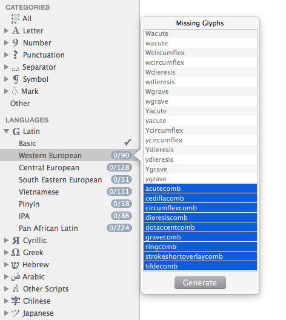

原文: [Mark attachment](https://glyphsapp.com/learn/mark-attachment)
# マークのアタッチメント

チュートリアル

執筆者: Rainer Erich Scheichelbauer

[ en ](https://glyphsapp.com/learn/mark-attachment) [ fr ](https://glyphsapp.com/fr/learn/mark-attachment) [ zh ](https://glyphsapp.com/zh/learn/mark-attachment)

2022年8月17日更新（初版公開：2015年2月20日）

非スペーシングの結合マークを使えば、ユーザーは*どんな*文字にも*どんな*アクセントも付けることができます。これはマークアタッチメントの魔法の力によって可能になり、Glyphsでの実装は簡単です。

フォントにアクセント付きの文字を持たせるには、2つの方法があります。1つ目は、コンポジットグリフとして事前に作成する方法です。これについては[ダイアクリティクスのチュートリアル](diacritics.md)で説明しました。CFF書き出し時にコンポーネントは分解され、必要に応じてオーバーラップが削除されます。これはフォント全体に多くのパスの複製があることを意味しますが、この方法は最も互換性が高いため広く使用されています。そして、フォントがどのような環境で表示されるか予測できない場合は、この方法に固執する必要があるかもしれません。

しかし、2つ目の方法として、マークとベースグリフをそのまま保持し、レンダリングエンジンにその場でそれらをくっつけさせることもできます。これをマークアタッチメントと呼びます。お察しの通り、大きな利点は、最終的なフォントのファイルサイズが大幅に削減されることです。*マーク対ベース*アタッチメントと呼ばれる方法を使えば、*どんな*アクセントも*どんな*ベースグリフにも自由につけることさえできます。さらに、アクセントを互いに*重ねる*ことさえ可能です。これにも名前があり、フォントの専門家はこれを*マーク対マーク*アタッチメントと呼んでいます。

この楽しい機能すべての欠点は、アプリケーションのサポートが不足していることです。しかし、徐々により多くのソフトウェアがマークアタッチメントをサポートするようになっています。したがって、この現実に対処する最善の方法は、事前に作成されたコンポジットとアタッチメント用のマークの両方をフォントに入れることです。

## 結合アクセントの追加

マークのアタッチメントを機能させるためには、*結合マーク*、または*非スペーシングマーク*と呼ばれるものが必要です。マークのアタッチメントは、古いスペーシングマークでは機能しません。

通常、結合マークは名前の末尾に`comb`が付き、独自の結合マークを持つスクリプトを除いて、通常はこれらのUnicode範囲に存在します。

*   `U+0300-036F COMBINING DIACRITICAL MARKS`
*   `U+20D0-20FF COMBINING DIACRITICAL MARKS FOR SYMBOLS`
*   `U+1DC0-1DFF COMBINING DIACRITICAL MARKS SUPPLEMENT`
*   `U+FE20-FE2F COMBINING HALF MARKS`

「でも、フォントに追加したい言語にはどれが必要なの？」とあなたが尋ねるのが聞こえます。心配しないでください。サイドバーの言語カテゴリで、言語エントリを右クリックして追加できます。



結合マークを見るには、下にスクロールする必要があるかもしれません。例えば、`Western Latin`には、これらが必要です。
```
acutecomb
cedillacomb
circumflexcomb
dieresiscomb
dotaccentcomb
gravecomb
ringcomb
strokeshortoverlaycomb
tildecomb
```

## アンカーの追加

基本的に、今必要なのは、文字とマークが接続できる定義済みの位置のセットだけです。これを行うには、ベースとなる文字とアクセントに*アンカー*を追加します。言い換えれば、アンカーは、文字とマークが互いにどこで接続されるかをGlyphsに伝える位置マーカーとして機能します。選択したグリフにデフォルトのアンカーを素早く追加するには、「グリフ > アンカーを設定」（Cmd-U）を使用します。もし間違ってしまったと思ったら、Optionキーを押しながら「グリフ > アンカーをリセット」（Cmd-Opt-U）を選択できます。

グリフ内のアンカーは一意の名前を持ちます。ベースグリフには`top`、`bottom`、`center`、`ogonek`という名前のアンカーがあります。アンカーが選択されていると、現在のグリフのアンカーと接続できるマークの雲が見えます。


マークグリフには同じ名前のアンカーがありますが、前にアンダースコアが付いています。つまり、`_top`、`_bottom`、`_center`、`_ogonek`です。実際には、マークには両方のアンカーが含まれているため、アンカーを積み重ねることができます。


私たちにとって最も重要なのは、`top`と`bottom`アンカー、そしてマーク内のそれらのアンダースコア付きバリアントです。デフォルトのアンカーは良い出発点であり、Glyphsにはどのアンカーがどのグリフに関連付けられているかという大きな内蔵データベースがあります。上記で説明したようにデフォルトのアンカーを追加すると、Glyphsはそれらをデフォルトの場所に配置しようとさえします。したがって、多くのグリフでアンカーの位置を調整する必要があるかもしれません。そして、独自のものを追加したい場合は、グリフ内を右クリックし、コンテキストメニューから「アンカーを追加」を選択することで行うことができます。

さて、ここがポイントです。アンダースコア付きのアンカーは、直前のグリフ内の対応するベースアンカーに接続しようとします。もしマークが直前のマークに対応するアンカーを見つけられない場合、その前のマークを探し、ベースレターに到達するまで続けます。

例えば、アキュートアクセント（グリフ名`acutecomb`）は、その`_top`アンカーをベースグリフの`top`アンカーに接続することで、小文字のeのどこに行くべきかを正確に知っています。もしその間にウムラウト（別名`dieresiscomb`）があれば、`dieresiscomb`内に`top`があればそれを使用します。

ですから、アンカーの位置は賢く選びましょう。以下を強くお勧めします。

*   **アンカーは可能な限り垂直メトリクスライン上に保ちましょう。** 例えば、`bottom`はベースラインに、`top`は小文字ではエックスハイトまたはアセンダーに、大文字ではキャップハイトに保ちます。
*   賢明にも`_top`アンカーをエックスハイトに置いたので、**小文字のマークはエックスハイトの上に保ちましょう。**
*   大文字のマークには**ケースバリアントを使いましょう。** マークを複製し（Cmd-D）、キャップハイトの上に移動させ、アンカーをリセットし（Cmd-Opt-U）、接尾辞を`.case`に変更します。これで、大文字の複合グリフを作成する際、利用可能であれば`.case`バリアントが優先されます。既存の複合グリフは、「グリフ > コンポーネントグリフを作成」（Cmd-Opt-Shift-C）で再作成できます。
*   **スモールキャップのバリアント**も同様に機能しますが、その場合は「ファイル > フォント情報 > マスター」の「メトリクス」セクションで定義されたスモールキャップの高さで、`.sc`接尾辞を使用します。スモールキャップに別のメトリクスを定義する場合は、その「適用範囲」を「ケース：スモールキャップ」に設定してください。

## スペーシングアクセントの派生

さて、Glyphsバージョン2.0以降、結合マークがデフォルトになりました。しかし、互換性の理由から、フォントには依然として古いスペーシングマークが必要です。

結合マークの作業が終わったら、古いマークを追加するだけです。これは自動的に生成されます。なぜそれが可能なのでしょうか？なぜなら、古いアクセントは結合アクセントのコンポーネントを再利用するからです。「ウインドウ > グリフ情報」で自分で見てみてください。


## 結合アクセントの入力

フォントでマークのアタッチメントをテストするには、InDesignのようなアプリケーションで非スペーシングアクセントを入力できる必要があります。まず、[フォントをAdobe Fontsフォルダに書き出し](testing-your-fonts-in-adobe-apps "Testing your fonts in Adobe apps | Tutorials | Glyphs".md)、次に新しいドキュメントを作成し、`a`のようなベースグリフを入力し、その後、結合アクセントを追加します。方法は次のとおりです。

まず、ツールバーの入力メソッドメニュー（メニューバーの旗の記号）から「絵文字と記号を表示」を選びます。もしそのようなメニューがない場合は、「システム環境設定 > キーボード > 入力ソース」で有効にし、「メニューバーに入力メニューを表示」オプションをオンにします。


次に、キャラクタービューアの左サイドバーに「Unicode」が表示されない場合は、ウィンドウ左上の歯車メニューから「リストをカスタマイズ…」を選びます。


…そして表示されるダイアログシートで、「コードテーブル > Unicode」を選びます。


これで、サイドバーで「Unicode」を選択し、ラテン文字とギリシャ文字の間の`0300`エリアまで下にスクロールし、そこにある結合アクセントのいずれかを選んで、ダブルクリックして挿入できます。


心配しないでください。これを設定する必要があるのは一度だけです。InDesignでは、結合アクセントを別々に選択して色を付けることさえできます。


繰り返しになりますが、賢い子供たちは、実際には[Ukelele](http://scripts.sil.org/cms/scripts/page.php?site_id=nrsi&id=ukelele "Ukelele")を使って、SILの親切な人々から独自のキーボードレイアウトを構築します。しかし、それはまた別の話です。

## 幅ゼロがいい？

非スペーシングの結合マークは、幅がゼロであるべきです。また、平均的な文字の上に位置できるように、左にずらす（つまり、負の左サイドベアリングを持つ）べきです。これは、マーク機能が機能しない場合のフォールバックとして意図されています。

しかし、.glyphsファイルでは、結合アクセントの幅をゼロに設定する必要はありません。アプリにそれを処理させることができます。書き出し時に、Glyphsは自動的にLSBをRSBに合わせます。これにより編集が容易になり、RSBだけを気にすればよくなります。つまり、LSBを編集に便利な値、例えば50ユニットや自分に合った任意の値に設定できます。これは良いニュースです。なぜなら、幅がゼロのグリフは編集ビューでダブルクリックするのが難しいからです。最高ですね！

---

更新履歴 2016-02-19: スクリーンショットを更新。

更新履歴 2018-02-01: ゼロ幅に関する説明文を追加。

更新履歴 2020-02-13: 欠落していた単語を追加。

更新履歴 2021-08-07: 欠落していた画像を修正。スモールキャップスのアクセントに関する注記を追加。

更新履歴 2022-08-17: 軽微なフォーマット変更、タイトルを変更、compoundsをcompositeに修正。