原文: [How to make a monoline font](https://glyphsapp.com/learn/monoline)
# モノラインフォントを作成する方法

旧バージョンのチュートリアル

執筆者: Rainer Erich Scheichelbauer

[ en ](https://glyphsapp.com/learn/monoline) [ fr ](https://glyphsapp.com/fr/learn/monoline) [ zh ](https://glyphsapp.com/zh/learn/monoline)

2022年7月29日更新（初版公開：2016年2月29日）

完璧なモノラインフォントを簡単に作成する方法を知りたいですか？私たちのとっておきの秘密をあなたと共有します。

モノラインフォントとは、縦画と横画の太さが同じフォントのことです。手書き風フォントや、このようなディスプレイフォントに最適です。

### バージョンに関する注意
この記事はGlyphs 2以前のバージョンに関するものです。

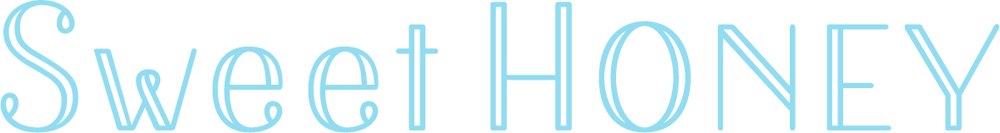

## パスを描く

フォントを作成する最初のステップは、もちろんパスを描くことです。当たり前ですね。しかし、モノラインフォントには*開いた*パスが必要です。開いたパスの端は、丸いノードではなく平らなノードとして表示され、パスの方向を示す矢印が表示されます。

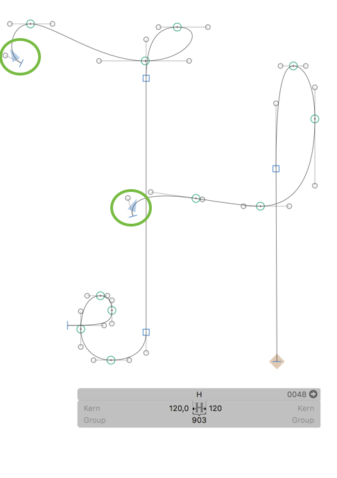

いい感じですね！しかし、これらのパスはモノラインフォントの「骨格」にすぎません。開いたパスは書き出すことができません。そこで、今度はその骨に肉を付ける必要があります。それにはいくつかの方法があります。読み進めてください。

## オフセットカーブフィルタ

最初の方法は、フィルタ「オフセットカーブ」です。「フィルタ > オフセットカーブ」で呼び出すだけです。

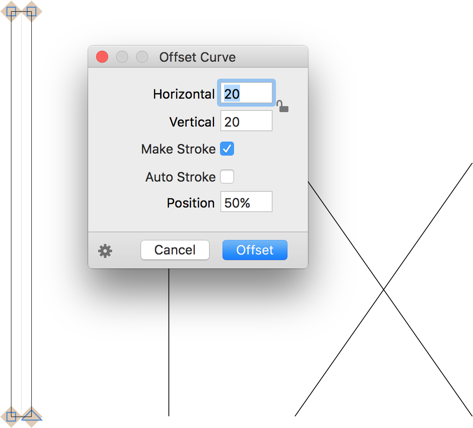

お好みの値を入力し、「ストロークを作成」オプションをチェックします。すると、グリフの拡大プレビューが表示されます。「位置」設定は、拡大の分布を制御します。0%では、パスは右側にのみ拡大されます。100%では、パスは左側にのみ拡大されます。50%では、拡大はパスの両側に均等に分布します。これが 아마 あなたが望むものでしょう。右側と左側は、パスの方向によって決まります。

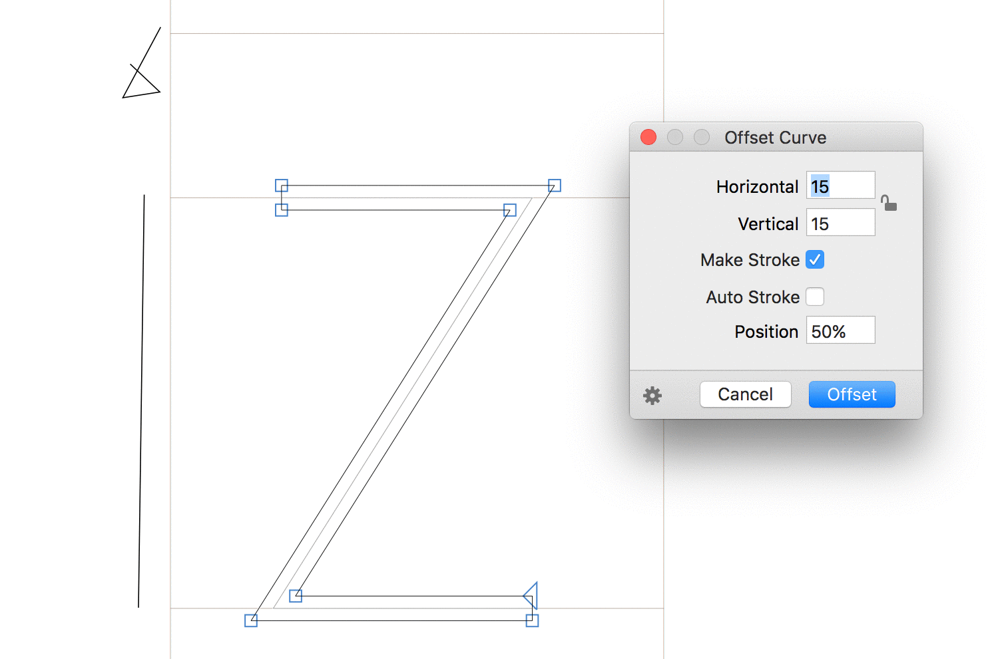

「自動ストローク」オプションを使用すると、垂直方向の寸法はそのまま維持されます。その場合、オフセット位置は50%と見なされます。

**しかし、まだ「オフセット」ボタンを押さないでください。** 代わりに、歯車をクリックしてください。「カスタムパラメータをコピー」を選択します。なぜなら、そうすると、この値がカスタムパラメータとしてクリップボードにコピーされ、非破壊的に作業できるようになるからです。

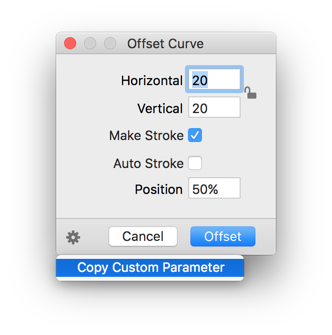

さて、「オフセットカーブ」ウィンドウで「キャンセル」を押し、次に「ファイル > フォント情報」（Cmd-I）に進み、「インスタンス」タブを選択します。ウィンドウの左下隅にあるプラスボタンをクリックして新しいインスタンスを追加し、何か印象的な名前を付けます。私は今日、完全にクリエイティブな気分なので、「Offset 20」と名付けます。さて、「カスタムパラメータ」フィールドの白い領域をクリックしてフォーカスを合わせ、Cmd-Vを押して以前にコピーしたカスタムパラメータをペーストします。

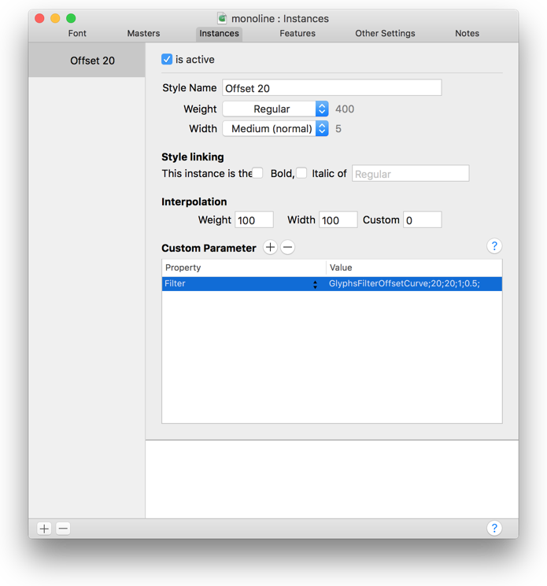

 अब、フォントを書き出すと、カスタムパラメータが設定され、オフセットが有効になっているのがわかります。フォントを書き出すには、「ファイル > 書き出し」（Cmd-E）に進み、ファイル形式を選択します。ただし、「オーバーラップを削除」のチェックは外しておいてください。なぜなら、このオプションは貴重な開いたパスを削除してしまうからです。[Adobeプログラムでフォントをテストする](testing-your-fonts-in-adobe-apps.md)ことをお勧めします。

書き出されたフォントがどのようになるかをプレビューするには、「表示 > オフセットプレビューを表示」を有効にできます。フィルタが以前に一度使用されていれば、Glyphsは編集ビューにグレーのプレビューを表示します。もしそうなら、Glyphsはその値を環境設定に保存し、プレビューはその値から値を読み取ります。ヒント：「オフセットカーブ」を一度適用し、Cmd-Zですぐに元に戻すだけです。

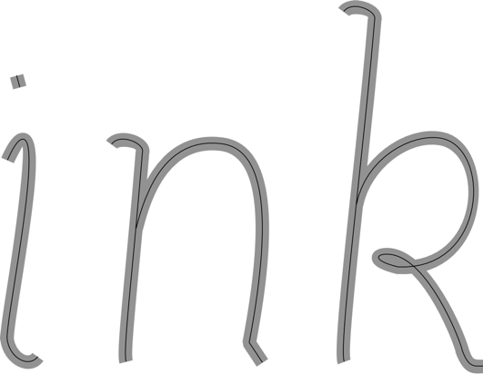

## 角を丸める

時々、角や端が奇妙に見えることがあります。この例では、角は本当に醜く、端もかなり奇妙です。げっ！

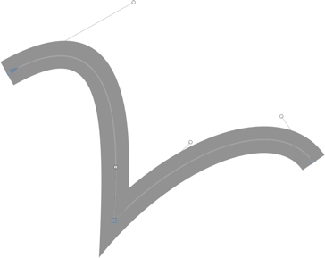

もしフォントに丸い角を持たせたいなら、簡単な方法があります。「フィルタ > 角を丸める」に進み、半径を選びます。「視覚補正」をチェックすることで、Glyphsは角の丸みの半径を調整し、それらが同じサイズに見えるようにします。

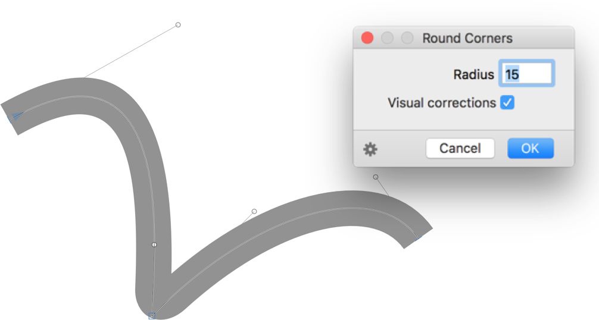

再び、歯車をクリックして「カスタムパラメータをコピー」を選択することで、カスタムパラメータのコードをコピーします。「ファイル > フォント情報」（Cmd-I）に進み、「オフセットカーブ」パラメータの*後*に、Cmd-Vでカスタムパラメータをペーストします。さて、再び書き出し、ファイル形式を選択します。

## ヌードラーフィルタ

「オフセットカーブ」と「角を丸める」の結果を一度に得るには、mekkablueの「ヌードラー」フィルタを使用できます。これをインストールするには、「ウインドウ > プラグインマネージャ」に進み、「ヌードラー」フィルタを探して、「インストール」ボタンをクリックし、Glyphsを再起動します。これで、「フィルタ > ヌードラー」で見つけることができます。

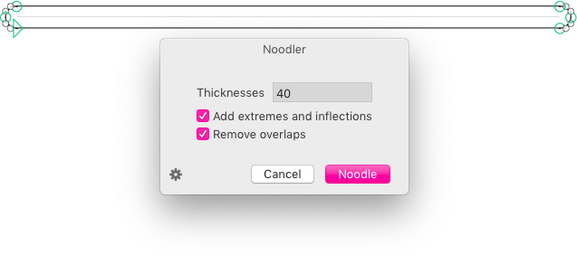

デザインに応じて「太さ」の値を変更します。以前と同様に、非破壊的に作業できます。直接適用するのではなく、歯車をクリックして「カスタムパラメータをコピー」を選択します。「フォント情報 > インスタンス > カスタムパラメータ」（Cmd-I）に進み、以前と同様に、Cmd-Vでコードをペーストします。あるいは、新しい「インスタンス」を追加してそこにペーストすることもできます。この方法なら、比較のためにフォントの2つの別々のバージョンを持つことができます。

しかし、「ヌードラー」と、「オフセットカーブ」プラス「角を丸める」の間には違いがあります。「ヌードラー」フィルタはパスに丸い端を追加しますが、「角を丸める」はパスの端を丸めます。

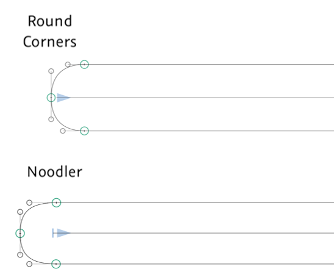

## 問題点

二重に曲がったパス、つまり、最初に時計回りに曲がり、次に反時計回りに曲がる、またはその逆のセグメントがある場合、問題が発生する可能性があります。この場合、太さを保つために、セグメントの変曲点にノードを追加すべきです。そのためには、パス上をクリックしながらShiftキーを押します。Glyphsは最も近い極値点または変曲点を見つけ、そこにノードを挿入します。これは、「オフセットカーブ」が有効な場合に、変曲点がある場合とない場合の二重に曲がったパスの見た目の例です。

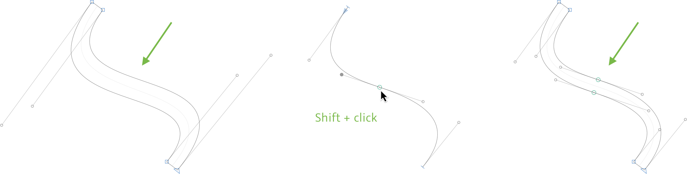

あるいは、mekkablueの「変曲点を挿入」フィルタを使用することもできます。これも「ウインドウ > プラグインマネージャ」経由で利用可能です。上記と同様に、「インストール」をクリックし、アプリを再起動すると、「フィルタ」メニューで見つけることができます。フィルタの詳細、カスタムパラメータとしての使用方法などについては、[そのGitHubページ](https://github.com/mekkablue/InsertInflections)を参照してください。「ヌードラー」と「ブロードニブ」フィルタは、自動的に変曲点を挿入します。

カーブが狭すぎると、問題が発生することもあります。

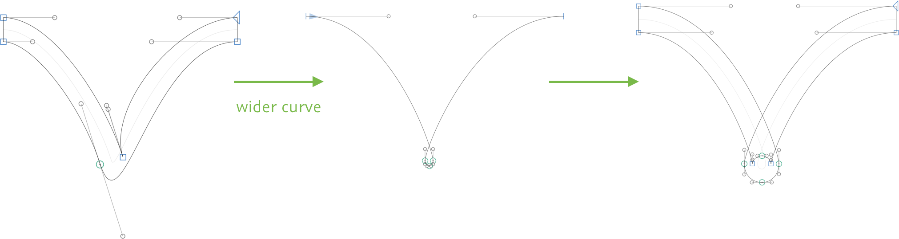

それを防ぐには、まあ、もっと広いカーブを描くべきです。時には、極値点や変曲ノードも役立ちます。

もし鋭角な角があり、「角を丸める」で奇妙な結果が出る場合は、パスを2つに分割できます。そのためには、「描画ツール」（P）を選択し、分割したいノードをクリックします。

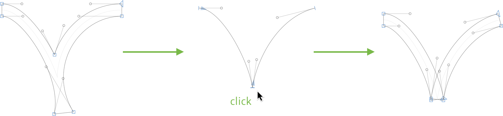

## ブロードニブフィルタ

グリフを幅広ペンのストロークに変えたい場合は、mekkablueの「BroadNibber」フィルタを使用できます。繰り返しになりますが、これは「ウインドウ > プラグインマネージャ」経由でインストールし、「インストール」ボタンをクリックしてGlyphsを再起動します。再起動後、「フィルタ > Broad Nibber」というメニュー項目が表示されます。

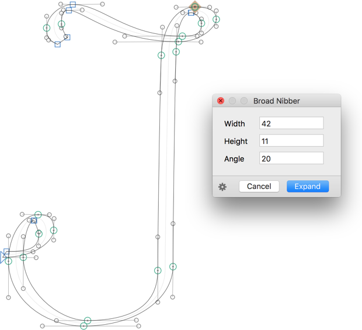

このフィルタは幅広ペンをシミュレートします。ダイアログの値で実験し、次に歯車をクリックして、「カスタムパラメータをコピー」をメニューから選び、そのコードを「フォント情報 > インスタンス」（Cmd-I）のインスタンスの「カスタムパラメータ」フィールドにペーストします。

## 荒らす

これはかなり面白いフィルタです。「フィルタ > 荒らす」に進んでください。

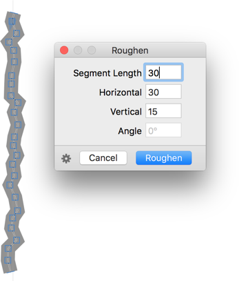

あなたのパスは小さな直線のパスセグメントに切り刻まれ、ノードはランダムに散らばります。もし「オフセットカーブ」のプレビューをオンにしていれば、すぐに最終結果が見られます。再び、歯車をクリックして「カスタムパラメータをコピー」を選択し、カスタムパラメータのコードをコピーします。「フォント情報」（Cmd-I）に進み、Cmd-Vでコードをペーストするか、新しいインスタンスを追加してそこにペーストします。

## フィルタの組み合わせ

複数のフィルタを組み合わせたい場合は、注意が必要です。カスタムパラメータの順序は非常に重要です。順序を並べ替えると、粒状感が（多かれ少なかれ）大幅に変わります。

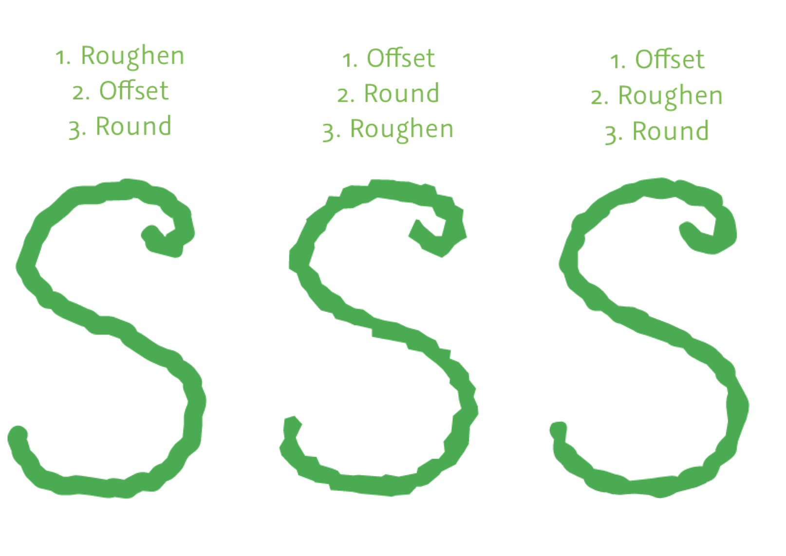

よく見ると、粒状感だけでなく、角の丸み、アウトラインの平行度や太さにも違いがあります。

> **マニア向けヒント：** mekkablueの「ヌードラー」フィルタ（「ウインドウ > プラグインマネージャ」経由で利用可能）には、複数の値を入力できます。チェックしてみてください。

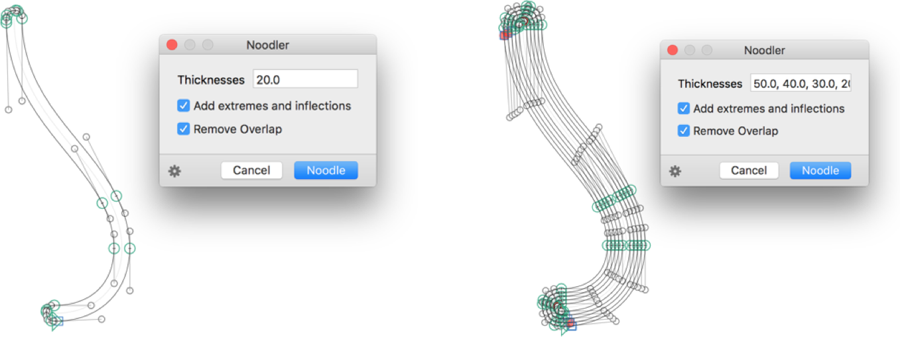

実験を楽しんでください！

---
サンプルフォント：Bussi by Stella Chupik（最初の例）

---

更新履歴 2018-12-10: オフセットカーブパラメータプレビューフィルタのインストール方法を削除しました。

更新履歴 2016-09-12: プラグインマネージャを追加しました。

更新履歴 2022-07-29: タイトル、関連記事、軽微なフォーマットを更新しました。