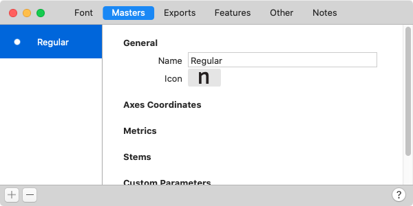
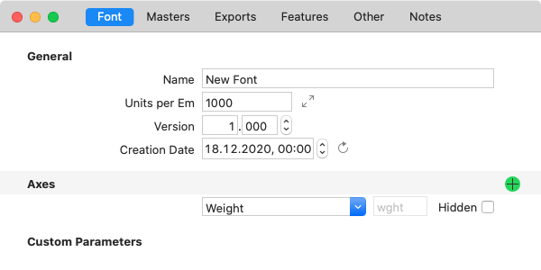
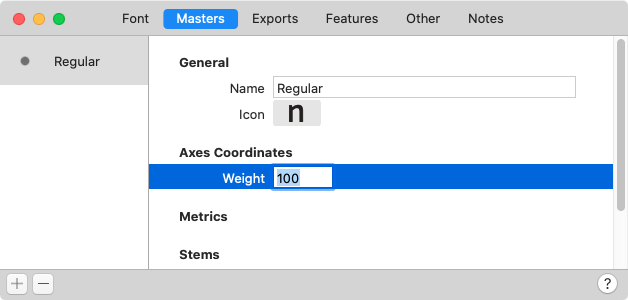
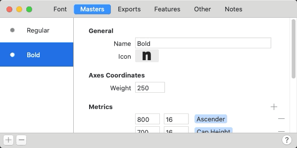
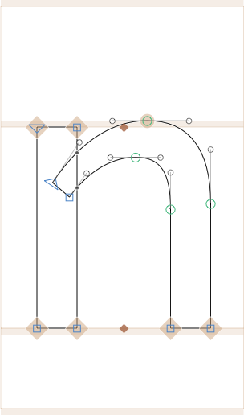
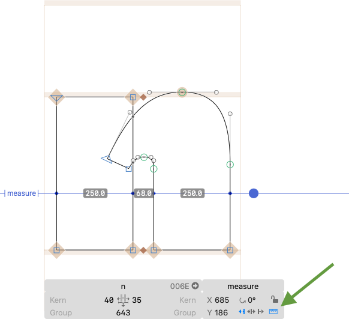
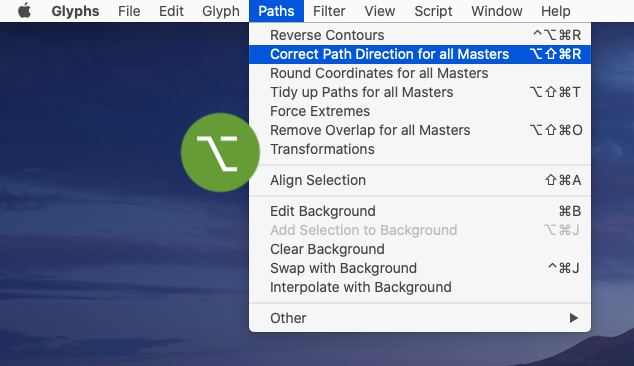
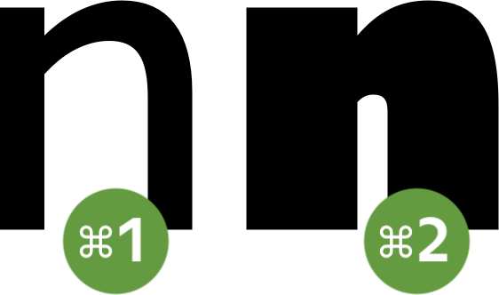

原文: [Multiple Masters](https://glyphsapp.com/learn/multiple-masters-part-1-setting-up-masters)
# マルチプルマスター、パート1：マスターの設定

チュートリアル

[ インターポレーション ](https://glyphsapp.com/learn?q=interpolation)

執筆者: Rainer Erich Scheichelbauer

[ en ](https://glyphsapp.com/learn/multiple-masters-part-1-setting-up-masters) [ zh ](https://glyphsapp.com/zh/learn/multiple-masters-part-1-setting-up-masters)

2021年6月13日更新（初版公開：2013年11月9日）

大規模なフォントファミリーの制作を考えていますか？それなら、複数のマスターを描き、管理し、補間を理解する必要があります。

「マルチプルマスター」（略してMM）は、[かつてはフォントユーザー自身がフォントを補間できるフォントフォーマットでした](http://en.wikipedia.org/wiki/Multiple_master_fonts)。おそらくその複雑さとAdobe製品以外でのサポート不足のため、あまり普及せず、90年代後半に廃止されました。

大規模なフォントファミリーを作成するために、MM補間技術は現代の書体デザインにおいて依然として重要な役割を果たしています。言うまでもなく、それはGlyphsに組み込まれています。しかし、まず*マスター*と*インスタンス*の違いを理解する必要があります。

## マスター vs. インスタンス

**マスター**は、*あなたが描くもの*です。それらは、続く補間の*入力*となります。マスターは、フォント情報の「マスター」タブで管理されます。各グリフの異なるレイヤーにそれらを描きます。ファミリーで作業しているときは、常にマスター間を行き来して、それらがうまく補間されるように確認します。マスターは、「ファイル > フォント情報 > マスター」で設定します。

**インスタンス**またはスタイルは、*コンピュータが計算するもの*です。それらは、補間の*出力*、つまり書き出された*結果*です。インスタンスは、フォント情報の「書き出し」タブで管理されます。Glyphsの場合、それらはすぐに使えるOpenTypeフォントとして書き出されます。適切に設定され、すべてが意図通りに機能すれば、補間されたインスタンスのポイントやパスをいじる必要は決してありません。インスタンスは、「ファイル > フォント情報 > 書き出し」で設定します。

## マスターの設定

さて、パーティーを始めましょう。新しいGlyphsファイルを作成したら、「ファイル > フォント情報」を選び、「マスター」タブに移動します。1つのマスターがすでにあります。

ご覧の通り、「Regular」マスターと名付けられています。注意：この名前はマスターのデザインについて何も意味しません。マスターは非常に細く、あるいは非常に太く見えるかもしれません。実際には、マスターの名前と、選択できる「アイコン」は、完全に任意です。

ですから、マスターには*どんな*名前でも付けられるので、あなたにとって意味のある名前を選ぶのが最善でしょう。一部のデザイナーは、インスタンスとより良く区別するために、「Lightest」、「Boldest」などと呼ぶことを好みます。同じことが「アイコン」にも当てはまります。あなたにとって意味のあるものを選んでください。

補間を行うためには、少なくとも1つの軸に沿って分布する、2つ以上のマスターが必要です。

## 軸を追加する

「軸って何？」とあなたが言うのが聞こえます。簡単です。軸はあなたの補間の次元です。それらはあなたのデザインスペースを定義します。例えば、ABC DinamoのArizonaの3次元デザインスペースを見てください。

Glyphsでは、「フォント情報 > フォント」で定義したどの軸に沿っても補間できます。それは「ウェイト」軸、「ウィズ」軸、「オプティカルサイズ」軸などの「クラシック」な定義済み軸のいずれか、あるいはあなたが考えつく、あなたにとって意味のあるほとんど何でも構いません。軸を作成するには、「フォント情報 > フォント」に進み、「Axes」の見出しの隣にあるプラスボタンを押すと、軸が表示されます。

### 旧バージョンのヒント
**Glyphs 2**では、*Weight*軸は最初の軸として暗黙的に扱われていました。異なる設定の場合は、「ファイル > フォント情報 > フォント」で*Axes*カスタムパラメータを追加する必要がありました。アプリバージョン2では、最大6つの軸が許可されていました。

メニューにリストされている軸のいずれかを選ぶか、独自の軸（「カスタム軸」）を作成することができますが、今のところは*Weight*軸に留まりましょう。各軸には*軸名*と4文字の*軸タグ*が付属しており、この場合は「Weight」と`wght`です。さて、マスターを軸の異なる位置に配置する必要があります。

### プロのヒント
**カスタム軸**にも4文字のタグが必要です。将来の仕様拡張との衝突を避けるため、カスタム軸は**すべて大文字**のタグを持つことが期待されています。したがって、例えば、*Serif*軸には小文字の`serf`ではなく、すべて大文字の`SERF`を選んでください。なぜなら、小文字は将来仕様に追加される可能性があるからです。

「マスター」タブに戻ると、今度は*Weight*軸の新しい軸座標フィールドがあることがわかります。あなたにとって意味のあるどんな数値でも入れることができます。多くのデザイナーは、ウェイト軸にだいたいのストローク幅を選ぶのを好みます。この場合は100としましょう。

さて、補間するためには2番目のマスターを追加する必要があります。左下のプラスボタンをクリックし、そこにあるオプションのいずれかを選ぶことができます。

*   **マスターを追加：** 新しい空のマスターを追加します。
*   **他のフォントを追加：** 2番目の.glyphsファイルの内容を新しいマスターとして挿入します。
*   **選択項目を複製：** 現在選択されているマスターの複製を新しいマスターとして追加します。

あるいは、サイドバーでマスターの名前をドラッグし、同時にOptionキーを押しながら、マウスボタンを離すとマスターが複製されます。それが済んだら、以下のことを確認してください。

*   **名前とアイコンを変更する：** これはあなた自身のための、参照用です。あなたにとって意味があり、マスターを切り替えるときに方向を見つけやすくする名前とアイコンを選んでください。
*   **軸座標を変更する：** これは最重要です。異なる軸座標を持つ必要があります。さもないと補間できません。考えてみれば理にかなっています。100と100の間で補間はできないからです。

この場合、Regularマスターに*Weight*値100を、Boldマスターにウェイト値250を与えましょう。これで、Weight軸上にウェイト座標100と250の2つのマスターができました。

## マスターを描く

さて、描画は簡単です。実際には、Glyphsで他のものを描くのと同じです。唯一の違いは、2つの「マスターレイヤー」に描く必要があることです。これらは、先ほど設定した2つのマスターに対応しているため、その名前が付いています。マスターレイヤーを切り替えるには、Cmd-1とCmd-2、つまりコマンドキーとマスターの番号を押すだけです。このボタンは、フォントに2つ以上のマスターがあると表示され、これを使ってマスターレイヤーを切り替えることもできます。

さて、「Regular」マスターに切り替えて、ストローク幅100の文字を描きましょう。もちろん、どの文字体系のどのグリフから始めても構いませんが、「生産的な」シェイプを選ぶのが良い考えです。ラテン文字では、h、u、m、i、lなどで再利用できるため、nから始めるのが好きです。では、これが私たちのnです。

覚えておいてください。「Regular」という用語は、ウェイト軸上のマスターの任意の名前にすぎず、描く文字のデザインについては何も言っていません。ですから、あなたのnが、人々が実生活でRegularと呼ぶものよりも少し細すぎたり太すぎたりしても、心配しないでください。

nの作業が終わったら、すべてを選択してクリップボードにコピーします。次に、Cmd-2を押して「Bold」マスターに切り替え、そこにnをペーストします。そして、ノードを動かしてnを非常に太くします。通常は、白いスペースを減らして文字がより濃く見えるようにしたいものです。結局のところ、より太いウェイトは、ページ上でより濃い色を達成するためのものです。したがって、サイドベアリングを少し減らすことと同じくらい、カウンターを小さくすることが重要です。

### プロのヒント
ノードやセグメントを移動する際、CtrlキーとOptキーを同時に押し続けると、ドラッグ中や矢印キーでの操作中に、周囲のハンドルが比例して調整されるため、役立つことがあります。これは「ナッジング」と呼ばれます。

コンテキストメニューからガイドを追加し、それを計測モードに切り替えることを検討してください。それには、ガイドを選択し、グレーの情報ボックス（Cmd-Shift-I）で計測オプションを有効にします。そうすれば、ストロークがすでに十分に太いかどうかをいつでも確認できます。クールですね！

### プロのヒント
もし指使いが非常に上手なら、Ctrl-Opt-Cmdを押し続けて一時的に計測ツールに切り替え、計測定規をドラッグし始めます。マウスボタンをまだ押したまま、Shiftキーを追加して完全に水平にし、今度はGキーを押して現在表示されている線を計測ガイドに変えます。 अब、マウスボタンを離します。

そして、描画が終わったら、「パス」メニューの同名のコマンドでパスの方向を修正し、パスを整理することを検討してください。ここに秘訣があります。Optionキーを押しながら行うと、「パス」コマンドの多くが全マスターモードになります。したがって、「パス > すべてのマスターでパスの方向を修正」（Cmd-Opt-Shift-R）と「すべてのマスターでパスを整理」（Cmd-Opt-Shift-T）を実行でき、それらは両方のマスターに同時に影響します。

Cmd-1とCmd-2でいつでも切り替えられることを覚えておいてください。しかし、太いnの作業が終わったら、それらを並べて見てみる価値があります。それは「編集 > すべてのマスターを表示」で行うことができます。これが私たちの2つのnマスターの様子です。マスターにアクセスするためのショートカットについての微妙なリマインダーも含まれています。

## より多くの値を入力する

さて、「フォント情報 > マスター」にある他のすべての入力フィールドを見て、これが単なる秘密ではないだろうとは思います。はい、ご期待の通り、そこの*すべて*の数値は、*すべて*のエントリが*すべて*のマスターで相互に対応している限り、補間されます。何をしようと、他のすべてのマスターにも同じ順序で対応する値を入力する必要があります。この方法で、Glyphsはどの数値の間で補間すべきかを知ります。これには、ステム値、垂直メトリクス、そしてカスタムパラメータで入力されたすべての数値が含まれます。

続きを読む：[マルチプルマスター、パート2：アウトラインの互換性を保つ](multiple-masters-part-2-keeping-your-outlines-compatible.md)

---

更新履歴 2014-06-20: 補間されたナッジのプロのヒントの誤字を修正。（Jeff Kellem氏に感謝。）

更新履歴 2015-07-21: 3Dを追加し、Glyphs 2向けに更新。

更新履歴 2021-01-04: Glyphs 3向けに書き直し、更新。

更新履歴 2021-06-13: Abel Martins氏によるLottieアニメーションを追加。

## 関連記事

[すべてのチュートリアルを見る →](https://glyphsapp.com/learn)

*   ### [マルチプルマスター、パート2：アウトラインの互換性を保つ](multiple-masters-part-2-keeping-your-outlines-compatible.md)

チュートリアル

[ 補間 ](https://glyphsapp.com/learn?q=interpolation)

*   ### [マルチプルマスター、パート3：インスタンスの設定](multiple-masters-part-3-setting-up-instances.md)

チュートリアル

[ 補間 ](https://glyphsapp.com/learn?q=interpolation)