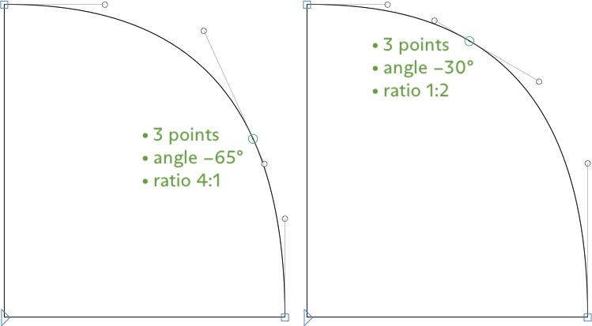

原文: [Multiple Masters](https://glyphsapp.com/learn/multiple-masters-part-2-keeping-your-outlines-compatible)
# マルチプルマスター、パート2：アウトラインの互換性を保つ

チュートリアル

[ インターポレーション ](https://glyphsapp.com/learn?q=interpolation)

執筆者: Rainer Erich Scheichelbauer

[ en ](https://glyphsapp.com/learn/multiple-masters-part-2-keeping-your-outlines-compatible) [ zh ](https://glyphsapp.com/zh/learn/multiple-masters-part-2-keeping-your-outlines-compatible)

2021年1月4日更新（初版公開：2013年11月24日）

さて、Glyphsでの補間に対応した、互換性のある描画方法を学びましょう。

## アウトラインの互換性を理解する

インターポレーション（補間）が行われるとき、実際に補間されるのは、各ノード、ハンドル、コンポーネント、アンカーのx座標とy座標です。ポイントとコンポーネントは特定の順序で保存されており、その順序はすべてのマスターで同じでなければなりません。

要するに、補間には*互換性のあるアウトライン*が必要です。アウトラインの互換性を実現するためには、以下を確認する必要があります。

*   すべてのマスターが、パス、ノード、ハンドル、アンカー、そしてコンポーネントの*数が同じ*であること
*   すべてのコンポーネント、パス、ノード、ハンドルが、すべてのマスターで*同じ順序*であること
*   すべてのマスターが*同じセットのアンカー*を持っていること

これだけです！これだけで、補間の魔法が可能になります。

## 互換性のないグリフを見つける

アウトラインに互換性がないグリフは、フォントビュー（Cmd-Opt-1）で赤い三角形でマークされます。


…または、編集ビューで開くと、上部に赤いストライプが表示されます。

### プロのヒント
レイヤーフォントやカラーフォントには、互換性が必要ない複数のマスターがある場合があります。その場合、赤いインジケーターは必要ないので、「ファイル > フォント情報 > フォント」で*Enforce Compatibility Check*パラメータを追加し、オフにします。


そうすると、赤いインジケーターは、*マスター値とは異なる補間値で設定されたインスタンスが少なくとも1つある場合*にのみ表示されます。言い換えれば、実際に補間を試みている場合にのみ、アウトラインの非互換性について指摘されることになります。


そして、フォントビュー（Cmd-Opt-1）では、互換性のないグリフをフィルタリングすることもできます。デフォルトのインストールには、左のサイドバーに「Incompatible masters」という名前のプリインストールされたスマートフィルタがあります。


もしまだそこにない場合は、ウィンドウの左下隅にある歯車メニューからスマートフィルタを追加できます。


表示されるダイアログで、わかりやすい名前を付け、属性から「Master Compatible」を選び、そのブール値を「No」にします。


ダイアログを確定すると、ほら！サイドバーの「フィルタ」の下にリストされます。

## グリフを互換性のあるものにする

互換性のないグリフに遭遇した場合、アウトラインの互換性を確立するための3つの防御策があります。

### 1. パスの方向を修正する

互換性の問題の最も主な原因は、間違った開始点であり、それに続いて各マスターでのアウトラインの順序の違いがあります。これらの大部分は、「パス > パスの方向を修正」（Cmd-Shift-R）で、またはOptionキーを押しながら「パス > すべてのマスターでパスの方向を修正」（Cmd-Opt-Shift-R）で修正できます。

### ヒント
このコマンドは、フォントビューまたは編集ビューで任意の数のグリフを選択し、メニューから選択することで、一度に多くのグリフに適用できます。すべてのマスターレイヤーが考慮されるように、Optionキーを押すのを忘れないでください。


このコマンドは、実際には3つのことを行います。

*   パスの構造を分析し、必要であれば各パスの**パスの方向**（時計回り対反時計回り）を切り替えます。
*   各パスの**開始ノードを正規化**します。通常はベースラインにできるだけ近く、できるだけ左の位置に設定します。
*   **シェイプ**（パスとコンポーネント）を、通常は左下から右上へと**並べ替え**ます。

運が良ければ、これでグリフは互換性を持つようになります。ダメでしたか？OK、次のステップに進みましょう。

### 2. シェイプを並べ替える

さあ、手を汚す時間です。袖をまくり上げて、「フィルタ > シェイプの順序」を選びましょう。


…すると、悪名高いシェイプの順序ダイアログが表示されます。各行はシェイプを、各列はマスターまたは中間マスターを表します。もし2つのマスターがあれば、2つの列が表示されます。あなたの仕事は、すべての列のすべてのシェイプを同じ順序にドラッグし、各行が対応するシェイプのみで構成されるようにすることです。必要なのは、クリック＆ドラッグだけです。


まだ互換性がありませんか？さて、私たちの秘密兵器の出番です…

### 3. 互換性ビュー

そのグリフを編集ビューで開き、非常に便利な「表示 > マスター間の互換性を表示」（Ctrl-Opt-Cmd-N）、別名「互換性ビュー」を利用しましょう。


あなたが見ているものは、

*   このグリフの補間に関連するすべてのマスターが分解図で表示されます。
*   各シェイプは、シェイプの順序を示すカラーコードで色分けされています（同じ色は同じ順序を意味します）。
*   各シェイプの開始点の隣には、シェイプの順序を示すインデックス番号があります。
*   開始点間の接続線は、どのシェイプがマスター間で接続されているかを示します。
*   アンカー間の接続線。
*   対応する選択されたポイント間の接続線。
*   色分けされたラインセグメントとカーブセグメント（下記参照）。

カラーコードはいくつかのことを示しています。

*   緑：互換性のあるセグメント
*   黄：技術的には互換性のあるセグメントですが、マスター間で角度が20°以上ずれています。これは間違った開始点を示唆しています。
*   赤：互換性のないセグメント。対応するセグメントが他のマスターにない（点の数が違う）か、一方のマスターではカーブセグメントで、もう一方ではラインセグメントである（セグメントタイプが互換性がない）かのどちらかです。

#### ノードの欠落

もし黄色や赤色のセグメントを見つけたら、問題が具体的にどこにあるかを見るクールな方法は、問題のあるパス上のノードの1つを選択し、タブキーでノードを順に見ていき、どれが正しく接続され、どれが間違ったノードと接続しているかを確認することです。


ほら、パス2では、右下のノードを除いて、補間線が他のマスターの間違ったノードと接続しています。さらに、*最後の*セグメントは赤色です。つまり、他のマスターで補間する相手がいません。これは、他のマスターのパスに**ノードが欠けている**ことを意味します。

そして、どのノードかさえも教えられます。正しく接続されているノードの*後*のノードです。他のマスターでは、上の空白を開くためのオーバーラップ部分の角が欠けています。どうやって分かったかって？簡単です。コツは、まだ正しく接続されている最後のノードまでタブで移動し、「ふう、ここまでは順調」と思うことです。その後、最初にうまく接続されていないノードにタブで移動すれば、最も疑わしい容疑者が見つかります。

そこで、単に他のマスターに切り替えて、そのノードを追加し、右上のセグメントを少し傾けます。

#### 間違った開始ノード

このケースを見てください。左のパスが黄色であることがわかります。これは、パスは互換性がありますが、各セグメントが20度以上角度を変えていることを意味します。どうしてそんなことがあり得るのでしょうか？


セグメントの一つをダブルクリックしてパスを選択してみましょう。すると、こうなります。


うわぁ。各ノードが間違ったノードと接続しています。常に、補間されるべきだったノードの隣のノードとです。左下のノードは右下のノードと、右下のノードはオーバーラップ部分の角と、オーバーラップ部分の角は右上のノードと、右上のノードは左上のノードと、そしてその左上のノードは左下のノードとです。

あるいは、同じことをもっと短く言うこともできます。**開始ノードが同期していません。** 実際には、「パスの方向を修正」コマンドはこれを正しく処理するはずですが（そして通常はそうです）、もしそうでなければ、手動で修正する方法がいくつかあります。

まず、まだ互換性ビューにいる間に、他のマスターの開始ノードを必要な位置にドラッグするだけです。開始ノードが正しく設定されると、黄色のハイライトが消えるのを見てください。


あるいは、開始ノードが正しい位置にないマスターに切り替えます。そこで、最初にしたいノードを右クリックし、コンテキストメニューから「このノードを最初に」を選びます。


あるいは、問題のパスを選択し、Harbortypeスクリプトの「次のノードを最初に」を、マスターが正しく補間されるまで、できればキーボードショートカットで繰り返し実行します。

### ヒント
特に明記されていない限り、ここで説明するサードパーティのスクリプトやプラグインはすべて、「ウインドウ > プラグインマネージャ」から無料でワンクリックでインストールできます。

どの方法を選んでも、最終的に編集結果を確認するには、パスを再度選択します。


線が多かれ少なかれ平行に保たれ、常に正しいノード同士が接続されているのがわかりますか？これが本来あるべき姿です。

#### アンカーの欠落

アンカーには破線のコネクタがあります。もし、あるマスターでこれらのいずれかが原点（x=0, y=0）に向かっているのを見たら、それはそのマスターでこのアンカーが欠落していることを意味します。


互換性ビューでは、そのアンカーの名前も表示されるので、何が起こっているかがわかります。

いずれにせよ、これらは簡単に修正できます。もし標準的なアンカーなら、「グリフ > アンカーを設定」（Cmd-U）で欠けているすべてのアンカーを追加できます。もっと良いのは、Optionキーを押しながら「グリフ > すべてのマスターにアンカーを設定」（Cmd-Opt-U）です。あるいは、標準的なアンカーでない場合は、アンカーを選択してクリップボードにコピー（Cmd-C）し、それが欠けているマスターに切り替えて、そこにペースト（Cmd-V）します。

あるいは、もし状況が混乱しすぎている場合は、mekkablueスクリプトの「Anchors > Insert All Anchors in All Masters」を実行できます。これは、すべてのマスターのすべてのアンカーを探し、欠けているものを同様の相対的な位置に挿入します。

## シェイプシフターを見つける

グリフが完全に互換性がある場合でも、各マスターに2つ以上の、ポイントが互換性のあるシェイプがある場合、まだ潜在的な落とし穴があります。`equal`記号（=）、`ellipsis`（…）、`colon`（:）、`quotedblbase`（„）、または`divide`記号（÷）のようなケースを考えてみてください。これらのグリフを、「表示 > マスター間の互換性を表示」を有効にして（Ctrl-Opt-Cmd-N）見ると、線が交差したり、互いを迂回したりしているのが見えたら、それは問題です。


マスターは完全に互換性があり、すべてのアウトラインは緑色です。しかし、線は*上*の点が*下*の点と補間され、その逆もまた然りであることを示しています。良くない。全く良くありません。あなたの`divide`記号が点をピンポンさせたいのでなければ。


これは**シェイプシフター**と呼ばれます。なぜなら、補間の進行中にシェイプの数が変わるからです。最初と最後では3つのシェイプを数えます。補間の途中では、ドットとバーが融合するため、1つのシェイプしか数えられません。

繰り返しになりますが、「パス > すべてのマスターでパスの方向を修正」（Cmd-Opt-Shift-R）でこれは処理されるはずです。しかし、もしそれで修正されない場合は、手動でパスを並べ替えることを試みることができます。

*   パスを1つずつ選択してクリップボードにカット（Cmd-X）し、すぐにそれを貼り付け直す（Cmd-V）。
*   「フィルタ > シェイプの順序」を使用する。
*   あるいは、互換性ビューで、一方のアウトラインの開始点をもう一方の開始ノードの上にドラッグする。


そして、すべてが元通りになります。


ふぅ！でも…でも…もしそれらを見つけるのがそんなに難しいなら、どうやってフォント内の厄介なシェイプシフターを見つけるのでしょうか？

良い質問です。2つのmekkablueスクリプトが助けになります。

*   *Interpolation > Find Shapeshifting Glyphs:* マスターと中間の補間でのシェイプを数え、時計回りと反時計回りのシェイプの数が常に同じでないグリフを報告します。まずこれを実行し、分析オプションを賢く選んでください（ツールチップを見てください）。
    

*   *Interpolation > New Tab with Dangerous Glyphs for Interpolation:* 理論的に間違って補間される可能性のあるすべてのグリフをリストアップします。つまり、開始ノードを変更したりパスを並べ替えたりした後でも互換性を保つ方法があるすべてのグリフです。このスクリプトを最後に実行し、プレビューエリアを開き（ウィンドウ左下の目のシンボルをクリック）、*Show All Instances*に切り替え、次にテキストツール（ショートカットT）に切り替えて、カーソルをグリフからグリフへと移動させ、各グリフの補間がOKかどうかを確認します。

### 特殊なケース：ノードトラベラー

非常にトリッキーな特殊ケースがあります。通常、補間全体でcwとccwパスの数が同じままであるため、技術的にはシェイプシフターではありません。上の黄色いパスのケース、つまりすべてのノードが次のノードと接続している間違った開始点のケースを覚えていますか？私はこれらのケースを「ノードトラベラー」と呼ぶのが好きです。

それらは見つけるのが難しいです。なぜなら、「Find Shapeshifting Glyphs」スクリプトはそれらをリストアップせず、「Dangerous Glyphs」スクリプトを実行した後にすべての補間を素早く見ていくと、簡単に見逃してしまうからです。しかし、いくつかの手がかりがあります。それらは*実質的に常に*、すべてがカーブまたはすべてがラインである、1種類のセグメントしか持たないパスで発生します。それらは小さなアウトライン（ピリオド、ドット、コンマ、ダッシュなど）や、薄く引き伸ばされたアウトライン（スラッシュ、クロスバー、ストローク、マクロンなど）では、通常比較的短いセグメントで、最も見過ごされがちです。そして、ノードトラベリングの最も可能性の高い候補は、`oslash`の`slashlongcomb`です。


もちろん、キャップとスモールキャップのØでも起こり得ます。スラッシュが1ノードインデックス分、微妙に前に進んでいるのがわかりますか？本当に見逃しやすいほど微妙です。

繰り返しになりますが、それらを見つけようとするmekkablueスクリプトがあります。「Interpolation > Travel Tracker」を実行し、移動率としてしきい値のパーセンテージ、通常は40または50を設定し、「Find」を押します。


移動率は、ノードが補間中に移動することが許されるグリフのバウンディングボックスのパーセンテージです。通常、ノードはほぼ同じ位置に留まり、グリフを太くするのに十分なだけわずかに移動します。ノードがグリフのバウンディングボックスの一方の端から反対側の端まで飛ぶことは、意図的でない限り、非常にありそうにありません。しかし、ここで探しているのはまさにそのようなケースです。スクリプトはその後、「ウインドウ > マクロパネル」（Cmd-Opt-M）に詳細なレポートを書き込み、許容範囲を超えて移動するノードを持つすべてのグリフを含む新しいタブを開きます。それはいくつかの偽陽性を報告します。ほとんどは、補間でずっと太くなる非常に小さなシェイプで、`period`や`dotaccentcomb`はおそらく結果に表示されます。それに応じて移動率を微調整するとよいでしょう。しかし、それは本当のノードトラベラーも捕らえます。そして、私たちは夜、安らかに眠ることができます。

## オーバーラップを保持する

さて、かつては静的なフォントではすべてのパスのオーバーラップを削除しなければならないと聞いたことがあるかもしれません。まあ、それは忘れてください。なぜなら、これはGlyphsが書き出し時に自動的に処理できる技術的な問題であり、「ファイル > 書き出し」（Cmd-E）ダイアログで「オーバーラップを削除」オプションを有効にしておく限りはです。実際には、補間の目的のためには、パスにオーバーラップを保持する方がはるかに賢明です。なぜかを理解するための典型的な例を一つ挙げます。


Rの脚を見てください。ボウルの下のノードを迂回しているのがわかります。脚とボウルを別々に保つことで、補間が保証されます。それに、Rの編集もずっと簡単になり、それは良いことです。

もしすでにオーバーラップを削除してしまった場合は、コーナーノードを選択し、コンテキストメニューを表示して「コーナーを開く」を選択するか、Optionキーを押しながら「すべてのマスターでコーナーを開く」を選択することで、それらを取り戻すことができます。

### プロのヒント
開いたコーナーを再び閉じるには、オーバーラップ部分の2つのノードを選択し、コンテキストメニューから「ノードを再接続」を選ぶか、Optionキーを押しながら「すべてのマスターでノードを再接続」を選ぶことができます。


2つのノードを選択し、コンテキストメニューから「ノードを再接続」を選ぶか、Optionキーを押しながら「すべてのマスターでノードを再接続」を選びます。


そして、最終的には次のようなシェイプになります。


重要なのは、クロスバーの完全性を損なうことなくステムを編集でき、その逆もまた然りということです。そして、オーバーラップ領域をキンクの修正（デキンキング）に使うことができます。「デ…何？」読み進めてください。

## キンクを避ける

知っておくべき深刻な問題が一つあります。補間のキンク（折れ曲がり）です。キンクは、以下の3つの基準をすべて満たすポイントの配置がある場合に発生します。

*   滑らかな接続を形成するための*一直線上の3つのポイント*
*   マスター間で*角度が異なる*
*   *ポイント間の比率が異なる*、つまり、（a）最初のポイントと中央のポイントの間の距離と、（b）中央のポイントと最後のポイントの間の距離の比率。

これら3つすべてが当てはまる場合、補間でキンクが発生します。例えば、これらの2つのマスターを見て、カーブ上の滑らかなポイントの3つ組に注意してください。



 अब、これら2つのマスターシェイプの間で補間すると何が起こるか見てみましょう。


どうしてこんなことになるのでしょうか？答えは、マルチプルマスター技術では、*各個別のポイントを線形に*補間するという状況にあります。線形補間は、通常、書体デザインにおける私たちの補間のニーズのほとんどすべてにとって問題ないため、それはOKです。つまり、緑の滑らかなコネクタが補間されるとき、それは隣のハンドルのことを何も知りません。3つのポイントはそれぞれ独自の道を歩みます。そして、3つのキンク条件が満たされると、それらの道は一致しません。

### 3つの解決策

しかし、キンクを避ける方法も知っています。3つの条件のうち1つを取り除けば、それで大丈夫です。

*   もしあなたのデザインがそれを許すなら、**その3つ組を取り除いてください。** 全くなくすか、2つのポイントに減らすかのどちらかです。
    
    ノード数を減らすことは、しばしば、わずかにエレガントなカーブになるという追加の利点があります。

*   それが不可能な場合は、できるだけ**マスター間の角度を同期させる**ことを試みてください。小さな違いは気づかれずに済む可能性があり、したがって十分良いかもしれません。このJの3つ組は、両方のマスターでイタリック角度が同じであるため、キンクを引き起こしません。
    
    できるだけ、滑らかなカーブの接続を水平または垂直に保ってください。描画ツール（ショートカットP）でShiftキーを押しながらクリックして極値点を追加し、その後、極値点間の斜めの点を一つずつ削除します。繰り返しになりますが、*角度*は同じであり、キンクについて心配する必要はありません。

*   上記のいずれも不可能な場合は、最後の手段を試してください。**ポイント間の距離の比率を同じに保つ**ことです。時には、セグメントを開いた角に伸ばすことで、ポイントのためのより多くの操作スペースを得ることができます。
    
    太いRでは、直線セグメントが快適にオーバーラップ部分に伸びることができるため、3つ組の比率を維持できます。

### キンクを見つける

mekkablueスクリプトには、「Interpolation > Kink Finder」という便利なスクリプトがあります。補間で許容できると考える最大のキンクの深さ、例えば0.8や0.9ユニットを定義します。すると、スクリプトはすべてのグリフの補間でそれより大きなキンクを探し始めます。

### プロのヒント
補間後のすべての座標が単位グリッドに丸められるため、非常に小さなサブユニットのキンクを避けるのは難しいでしょう。これらのキンクは、単位の対角線の半分までになることがあります。あるいはピタゴラスの定理で言えば、(1²+1²)の平方根の半分 = 0.707ユニットです。ですから、正気を保つためには、キンクを探す際には少なくとも0.7ユニットのへこみは許容してください。


追加のオプションについては、それぞれのツールチップを参照してください。スクリプトが実行されると、「キンキーなノード」（キンクを引き起こすポイントの3つ組の中央のノード）を、補間における最大のキンクの深さを示す絵文字と数字でマークします。


### キンクを修正する

3つ組をデキンキングするには、いくつかの選択肢があります。まず、手動で行うことができます。中央のポイントを選択し、それがコーナーポイントではなくカーブポイントとして定義されていること、つまり緑色であることを確認します。滑らかな接続（緑）とコーナー（青）を切り替えるには、Returnキーを押します。次に、Optionキーを押しながら、最初のポイントと最後のポイントの間の線に沿ってポイントを移動させます。これはマウスまたは矢印キーのどちらでも行えます。


Henrique Beier氏のプラグイン*Show Smooth Node Angle and Proportion*は、キンクが最小限に抑えられる、あるいは完全に解消される場所を見つけるのに役立ちます。これは現在選択されているノードの測定値を表示し、測定値が他のマスターと一致しない場合は黄色で、一致する場合は灰色で表示します。


この3つの点の組は、角度が（灰色で表示されているように）他のマスターと同じであるため、キンクを引き起こしません。したがって、比率が異なっていても（黄色で表示されているように）、キンクはありません。

あるいは、mekkablueスクリプトコレクションの「Interpolation > Dekink Master Layers」スクリプトを使用します。やり方は次のとおりです。比率が最適だと思うマスターに進み、3つのポイントのいずれかを選択し、「スクリプト」メニューからスクリプトを実行します。スクリプトは、他のすべてのマスターで対応する配置を見つけ、対応するポイントを、表示されているマスターの他の2つのポイントに対する同じ相対的な位置に押し込みます。すべてのポイントの3つ組が同じ比率になるはずです。ふう、非常に複雑に聞こえますが、それほど難しくはありません。[この短いビデオを見て](http://tinyurl.com/dekink-py)、自分で判断してください。

キンクを取り除くもっと快適な方法は、Tim Ahrens氏の[Remix Harmonizer](https://remix-tools.com)であり、正確にはその*Dekink Only*オプションです。これの素晴らしい点は、補間*後*にこれらの小さなキンクをならすことができることです。言い換えれば、キンクを*避ける*のではなく、書き出し時に*修正する*のです。方法はこうです。「フィルタ」メニューから*RMX Harmonizer*を実行しますが、どのボタンも押さずに、ウィンドウの左下にある歯車メニューを開き、「カスタムパラメータをコピー：Dekink only」を選びます。


これで、パラメータコードがクリップボードにコピーされました。「ファイル > フォント情報 > インスタンス」で、影響を受けるすべてのインスタンスの*カスタムパラメータ*にペーストするだけです。


もしパラメータがあなたの描画に干渉しすぎることを恐れるなら、カンマ区切りのグリフ名のリストを持つ`include`文を追加することで、それを特定のグリフだけに限定できます。あなたのカスタムパラメータの*値*は、最終的に次のようになります。

```
RMXHarmonizer; dekink; include: A, V, W, K, X, X.ss01
```
これだけです。フォントファミリーが書き出されるとき、Harmonizerは遭遇した補間後のキンクをすべて修正します。

さあ、皆さんもマスターを互換性のあるものにしましょう！

続きを読む：[マルチプルマスター、パート3：インスタンスの設定](multiple-masters-part-3-setting-up-instances.md)

---

更新履歴 2014-03-07: 「Be Suspicious」セクションにPythonスクリプトへのリンクを追加。

更新履歴 2014-08-23: Dekinkデモビデオのリンクを更新。

更新履歴 2015-07-21: Glyphs 2向けに更新。

更新履歴 2017-10-30: *RMX Harmonizer > Dekink only*を追加。

更新履歴 2018-07-05: *Dekink Masters*の使用に関する軽微な更新。

更新履歴 2021-01-06: Glyphs 3向けに書き直し、更新。

## 関連記事

[すべてのチュートリアルを見る →](https://glyphsapp.com/learn)

*   ### [マルチプルマスター、パート3：インスタンスの設定](multiple-masters-part-3-setting-up-instances.md)

チュートリアル

[ 補間 ](https://glyphsapp.com/learn?q=interpolation)

*   ### [マルチプルマスター、パート1：マスターの設定](multiple-masters-part-1-setting-up-masters.md)

チュートリアル

[ 補間 ](https://glyphsapp.com/learn?q=interpolation)