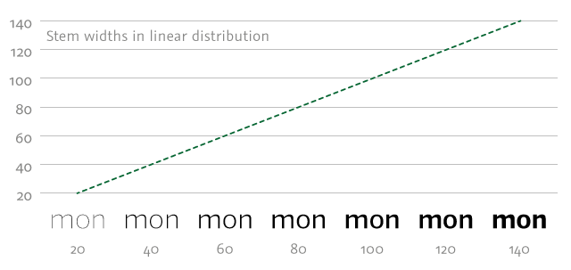
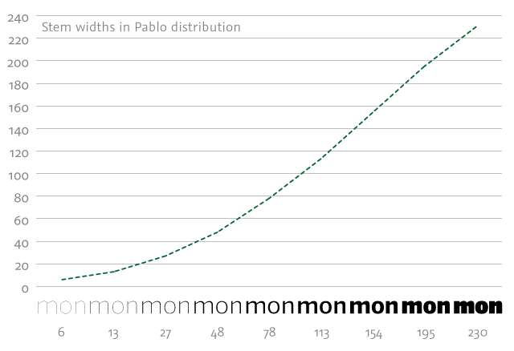

原文: [Multiple Masters](https://glyphsapp.com/learn/multiple-masters-part-3-setting-up-instances)
# マルチプルマスター、パート3：インスタンスの設定

チュートリアル

[ インターポレーション ](https://glyphsapp.com/learn?q=interpolation)

執筆者: Rainer Erich Scheichelbauer

[ en ](https://glyphsapp.com/learn/multiple-masters-part-3-setting-up-instances) [ zh ](https://glyphsapp.com/zh/learn/multiple-masters-part-3-setting-up-instances)

2021年9月17日更新（初版公開：2013年12月13日）

マルチプルマスターの設定方法とアウトラインの互換性を保つ方法を学んだので、次はインスタンスを決定する時です。偶然にも、ステップバイステップのチュートリアルを用意しました。

さて、[インターポレーションのためにマスターを設定](multiple-masters-part-1-setting-up-masters.md)し、その後、[グリフのパスが互換性を持つように確認](multiple-masters-part-2-keeping-your-outlines-compatible.md)しました。 이제、私たちが生成しようとしているフォントファミリー内の各フォント、つまりスタイルとなる*インスタンス*を決定する時が来ました。

## インスタンスの設定

さて、これを済ませましょう。「ファイル > フォント情報 > 書き出し」に進み、左下のプラスボタンでインスタンスを追加します。「インスタンスを追加」を選ぶと、「Regular」という名前の新しいインスタンスが挿入されます。「マスターごとにインスタンスを追加」を選ぶと、Glyphsは「フォント情報 > マスター」で定義されたマスターと同じ軸座標を持つインスタンスを挿入します。

そして、すでにインスタンスがある場合は、それを選択してコピー（Cmd-C）＆ペースト（Cmd-V）するか、もっと手早く、左のサイドバーでその名前をOptionキーを押しながらドラッグすることで複製できます。

### ヒント
もし古いバージョンのGlyphsで作業している場合：バージョン1と2では、「書き出し」タブは「インスタンス」と呼ばれていました。

フォントファミリーとそのすべてのインスタンスの命名に関する詳細は、[命名規則のチュートリアル](naming.md)で説明されています。しかし、今のところ、最も重要なフィールドは「スタイル名」、「ウェイトクラス」、「ウィズクラス」、そして「軸座標」です。

### ヒント
本当に「フォント情報 > 書き出し」にいることを再確認してください。他のタブにも「名前」フィールドがありますので。

まず、*スタイル名*は通常、フォントスタイルの幅（コンデンスからワイド）、ウェイト（ライトからボールド）、そして傾き（イタリックかどうか）を示す単語の組み合わせで、その順序で構成されます。スタイル名はもちろんどのようなものでも構いませんが、慣習に従うことでフォントの互換性が高まります。時々、スタイル名は幅、ウェイト、傾きを超えて、例えばオプティカルサイズ（キャプションからディスプレイまで）や、デザインにとって意味のある他の区別を示す必要がある場合もあります。

いずれにせよ、スタイル名は各インスタンスで*一意*でなければならないので、スタイル名は慎重に選びましょう。大文字と小文字、さらには単語間のスペースも使用できるので、アンダースコアの使用に頼る必要はありません。数字は可能ですが珍しいです。通常、スタイル名はタイトルケース、つまり「bold italic」ではなく「Bold Italic」です。最大限の互換性を確保するためには、一般的にプレーンASCIIの英語のスタイル名をフォールバックとして用意するのが良い考えです。非ASCIIのスタイル名も可能ですが、すべての場所でサポートされているわけではありません。

### プロのヒント
ASCIIでは物足りませんか？特定の言語向けに追加のローカライズされた名前を検討してください。プラスをクリックして「ローカライズされたスタイル名」を選び、好きなだけ追加の言語で名前を追加します。命名はUnicodeを完全にサポートしています。

次に、名前のすぐ下にある「ウェイト」と「ウィズ」のポップアップを見てください。一見すると、これは「スタイル名」フィールドの冗長な繰り返しかもしれません。しかし、そうではありません。なぜなら、これはその隣の数値を決定し、それがAdobeアプリケーションのフォントメニューの順序を決定するからです。Regular=400、Bold=700のように、いくつかの名前と数値の組み合わせはあらかじめ決まっていますが、もしもっと区別が必要なら、間に余分な数値を自由に追加してください。その場合、「ウェイトクラス」の値を単なる数値で上書きするだけです。例えば、Medium (500)とSemibold (600)の間に余分なウェイトが必要な場合は、そのフィールドに`550`と入力します。

最後に、そして最も重要なのが、「ファイル > フォント情報 > フォント」で設定したすべての軸に対する*軸座標*です。[最初のMMチュートリアル](multiple-masters-part-1-setting-up-masters.md)で使用したステム幅を覚えていますか？この例では、100と250でした。ウェイトの補間値は、その範囲内の数値でなければなりません。言い換えれば、ここに入力した数値が、このフォントスタイルのステム幅になります！クールですね。

### プロのヒント
技術的には、マスターによって決定された範囲外の値を入力することで*外挿*することもできます。しかし、外挿は静的なフォントの書き出しでのみ機能し、バリアブルフォントでは機能しません。そして、結果は通常かなりがっかりするものです。

では、いくつかのインスタンスを追加し、それぞれに独自の一意の*スタイル名*、*ウェイトクラス*、そして*軸座標*を設定しましょう。私のインスタンスは今、このようになっています。

私の例で少し珍しいことが2つあります。ウェイトスペクトラムの太い方の端で名前付きのウェイトクラスが尽きたので、ウェイトクラス950の非常に太い「Extrablack」スタイルを追加しました。そして、「Bold」インスタンスの「スタイルリンク > Bold」チェックボックスをチェックしました。「Bold」という名前のインスタンスは、常に「RegularのBold」として登録されるべきです。スタイルリンクについて詳しくは、[命名規則](naming.md)のチュートリアルを読んでください。

## スタイルのプレビュー

さて、メインウィンドウの編集タブに戻りましょう。これまでは、そこでマスターのみを編集していました。しかし今、補間されたインスタンスもプレビューします。

1.  ウィンドウの左下隅にある目のアイコンをクリックして、プレビューエリアを開閉します。
2.  その隣のポップアップメニューからインスタンスを選ぶか、「すべてのインスタンスを表示」を選びます。
3.  区切り線をドラッグして、プレビューエリアのサイズを変更します。
4.  プレビューを反転、反転、ぼかすための追加のプレビュー設定を使用します。

デフォルトでは、プレビューエリアは現在のグリフに中央揃えされますが、プレビューを水平にドラッグして他の任意の位置に移動させることができます。

おめでとうございます、これで補間されたインスタンスをプレビューしています！

## 実環境でのテスト

もちろん、上記はGlyphs内のプレビューにすぎず、他のアプリでも書き出してテストする必要があります。しかし注意してください：**未完成のフォントをmacOSにインストールしないでください。** 例えば、Font Bookやサードパーティのフォントマネージャを使ってです。なぜなら、[フォントキャッシュの問題を避けたい](eliminating-font-cache-problems.md)からです。以下にテスト方法を示します。

*   WOFFおよびWOFF2の**Webフォント**については、[FontDrop](https://fontdrop.info)や[Wakamai Fondue](https://wakamaifondue.com)のようなフォントテストサイトを使用するか、[mekkablue script](glyphsapp3://showplugin/mekkablue%20scripts)の*Test > Webfont Test HTML*を使用できます。
*   **macOS**でのCFFおよびTTFデスクトップフォントのプレビューには、[FontGoggles](/tools/fontgoggles)や[TextPreview](/tools/textpreview)のような特別なテストアプリを使用します。
*   あるいは、「ファイル > 書き出し > OTF」（Cmd-E）の「テストインストール」オプションを使用できます。フォントはシステムメモリに書き込まれ、macOSアプリは最新のテストインストールを受け取ります。新しいテストインストールの後に変更を反映させるには、アプリを再起動する必要があるかもしれません。メモリ内のテストインストールされたフォントを取り除くには、Macを再起動するか、ログアウトして再度ログインします。
*   **Adobe**アプリでのCFFデスクトップフォントのテストには、[Adobe Fontsフォルダに書き出す](testing-your-fonts-in-adobe-apps/.md)ことを検討してください。そうすれば、すべてのフォントがInDesign、Illustrator、Photoshopですぐに利用可能になります。
*   **Windows**でのTTFのプレビューには、フォントを選択し、右クリックしてコンテキストメニューから「フォントをインストール」を選択し、既存のフォントを上書きすることを確認します。WindowsはmacOSのようにキャッシュの問題に悩まされることはありません。最悪の場合でもWordを再起動するだけです。

はい、もちろんAdobeアプリでTTFをテストしたり、WindowsでCFFをテストしたりすることもできます。ただ、AdobeのレンダラーはCFFに最適化されており、WindowsのレンダラーはTTFを好むというだけです。

## スタイル名を短く保つ

良いアドバイスが一つあります：*スタイル名をできるだけ短く保つ*ことで、Windowsでの問題を避けることができます。どれくらい短く？ファミリー名とスタイル名を合わせた長さが20文字を大きく超えなければ、安全圏内です。名前が長すぎると、Windowsはそのフォントが無効だと判断することがあります。相反する報告がありますが、*ファミリー名*には29文字が厳格な制限のようで、それより短い*合計*の長さでも問題を引き起こすことがありました。確かめる唯一の方法は、Windowsでテストインストールしてみることです。もしこのようなエラーが出たら、ファミリー名やスタイル名を短くすることを検討してください。

しかし、時には十分に短くできないこともあります。`Condensed Ultralight`のようなスタイル名を想像してみてください。非常に短いファミリー名でない限り、問題に突き当たるでしょう。このような場合は、スタイル名を構成する部分の短縮版を使用します。例えば、*Condensed*には`Cd`、*Extended*には`Xt`、*Light*には`Lt`、*Regular*には`Rg`、*Medium*には`Md`、*Semibold*には`Sb`、*Bold*には`Bd`、*Heavy*には`Hv`、*Black*には`Bk`、*Ultra*には`Ultr`などです。次に、*Typographic Subfamily Name*というカスタムパラメータを追加し、その値に名前の完全版を設定します。これが、実際にユーザーインターフェースに表示される名前になります。そういえば、ファミリー名も短くして、ファミリー名の完全版には*Typographic Family Name*パラメータを使用することもできます。

### レガシーのヒント
古いバージョンのアプリやOpenTypeの仕様では、「タイポグラフィック」名は「プリファード」名と呼ばれていました。したがって、カスタムパラメータは*preferredSubfamilyName*と*preferredFamilyName*と呼ばれていました。

繰り返しになりますが、短縮されたスタイル名についての詳細は、[命名規則のチュートリアル](naming.md)で確認してください。

## メニューのソート

上で述べたように、名前の下にある「ウィズクラス」と「ウェイトクラス」のポップアップが、少なくともAdobeアプリケーションでは、フォントファミリーのサブメニューの順序を決定します。しかし、どのように？さて、重要なのはウィズクラス（1～9）とウェイトクラス（1～1000）に関連付けられた数値です。要するに、これらの値はフォントの[OS/2テーブル](https://docs.microsoft.com/en-gb/typography/opentype/spec/os2)、またはバリアブルフォントの[STATテーブル](https://docs.microsoft.com/en-gb/typography/opentype/spec/stat)に保存されます。数値が小さいほどフォントメニューでの位置が高くなり、*ウィズクラス*がウェイトクラスよりも優先されます。

ウィズクラスについて詳しく見てみましょう。

| ウィズクラス | 仕様名 | 通常の% |
| :--- | :--- | :--- |
| 1 | Ultra-condensed | 50.0% |
| 2 | Extra-condensed | 62.5% |
| 3 | Condensed | 75.0% |
| 4 | Semi-condensed | 87.5% |
| **5** | **Medium (normal)** | **100.0%** |
| 6 | Semi-expanded | 112.5% |
| 7 | Expanded | 125.0% |
| 8 | Extra-expanded | 150.0% |
| 9 | Ultra-expanded | 200.0% |

[OS/2.usWidthClassの仕様](https://docs.microsoft.com/en-gb/typography/opentype/spec/os2#uswidthclass)

3列目のパーセンテージは、通常の幅との関係を大まかに示すためのものです。例えば、ファミリーにCondensedがある場合、それはRegularの平均幅の約75%であることが期待されます。しかし、これは固定されたものではなく、目分量で決めても構いません。フォントに幅の軸がある場合は、少し考えてから、デザインにとって最も意味のあるものを選んでください。

ウェイトクラスはもう少し楽しいです。

| ウェイトクラス | 仕様名 |
| :--- | :--- |
| 100 | Thin |
| 200 | Extra-light (Ultra-light) |
| 300 | Light |
| **400** | **Normal (Regular)** |
| 500 | Medium |
| 600 | Semi-bold (Demi-bold) |
| 700 | Bold |
| 800 | Extra-bold (Ultra-bold) |
| 900 | Black (Heavy) |

[OS/2.usWeightClassの仕様](https://docs.microsoft.com/en-gb/typography/opentype/spec/os2#usweightclass)

ウェイトクラスでは、数値の範囲が広く、したがって自由度も高くなります。あらかじめ定義された値だけでは不十分な場合は、1から1000までの任意の数値を挿入できます。多くのアプリケーションは、400のレギュラーまたはデフォルトのウェイトを期待し、700のスタイルリンクされたボールドウェイトを探します。それ以外は、好きな場所にウェイトを挿入できます。

そして、この例のようにウェイト軸しか使わない場合は、ウィズクラスはデフォルトの5のままにしておけます。

## ウェイトの配分

さて、補間軸上の*どこ*を選ぶかはわかりました。しかし、*何が*良い場所であるかはどうやってわかるのでしょうか？LightとBoldのマスターがあると仮定し、それらの値を*Ultralight*と*Heavy*インスタンスに使用するとします。では、その中間の*Light*、*Regular*、*Medium*、*Semibold*、*Bold*インスタンスは、具体的にどこに配置すべきでしょうか？

最初のステップとして、それらを均等に配分するのが良いスタートのように思えるかもしれません。そうすれば、連続するウェイト値の差は常に同じになります。例えば、Lightマスターが20、Boldマスターが140だとします。すると、インスタンスの値は20、40、60、80、100、120、140となります。2つのインスタンス間の差は常に20です。これをステムウェイトの*線形分布*、または単に*等間隔*と呼びます。しかし、残念ながら、それはあまりうまくいきません。

スペクトラムの中間にあるインスタンス間の差が小さすぎます。そして残念なことに、これが最も重要な部分です。それらはあまりにも似ていて、どれがRegular、Book、Boldなのか見分けがつきません。明らかに、より良い補間値が必要です。

インターポレーション理論の登場です。偉大なるLuc(as) de Grootが[指摘した](http://www.lucasfonts.com/about/interpolation-theory/)ように、重要なのは絶対的な差ではなく、ステムの成長率です。上の例では、最初のステップ、20から40の間は100%の増加です。2番目のステップ、40から60の間は、もはや50%の増加にすぎません。パーセンテージは最後まで徐々に減少し、120から140の間では、わずか16.67%の増加しかありません。より良い解決策を求めて、De Groot自身は、その成長率を（少なくとも垂直ステムについては）一定に保つことを提案しました。これは*Luc(as)の公式*または*Luc(as)分布*として有名になりました。これによると、*相対的な*視覚的な差は同じままで、*絶対的な*差は最初は小さいですが、スペクトラムの終わりに向かって大きくなります。

確かに改善されました。最悪の点と言えば、軽いウェイトが多すぎることです。大したことありません、1つ省略するか、全体で1ステップ少なくすればよいのです。そして、OK、認めましょう、最も太い2つのウェイト間のジャンプはかなり大きいです。それでも、最後の3つのウェイトは、Regular、Semibold、Boldの良いセットになるでしょう。いつもこんなにうまくいくのでしょうか？

いいえ、と比類なきPablo Impallariは言います。彼は、*非常に*細いものから*非常に*太いものへと補間する場合、Luc(as)分布は軸の太い方の端でステップが大きくなりすぎると考えています。言い換えれば、Semiboldに見えるものから、ほとんどの人がHeavyと認識するものへとすぐにジャンプしてしまうのです。そこにもう一つインスタンスを簡単に入れることができたでしょう。

言い換えれば、補間が*非常に多くの白と非常に少ない黒*（Light）から、*非常に少ない白と非常に多くの黒*（Heavy）まで及ぶ場合、軸の両端に向かってより小さなステップが必要です。結局のところ、最初の小さなステップでステムが倍になる可能性があり、最後の小さなステップで小さな白いカウンターが半分に切れる可能性があります。ですから、最初はLuc(as)分布のような分布が必要で、最後は線形分布のようなものが必要です。数学者は、これら2つの分布の間にいわゆるオジー曲線（S字曲線）を計算するでしょう。書体デザインの世界では、これは*パブロ分布*として知られるようになりました。

言い換えれば、Pablo Impallariの曲線は、Luc(as)分布から線形分布への段階的な補間です。[mekkablue script collection](https://github.com/mekkablue/Glyphs-Scripts)の*Masters*スクリプトの一部である*Insert Instances*スクリプトを使用できます。このスクリプトは、フォント情報ウィンドウの*インスタンス*タブに直接インスタンスを挿入します。

どの方法を選んでも、それを出発点としてください。デザインによって結果は大きく異なります。最終的には、あなたの目でステムウェイトの正確な配分を決めてください。

## 非常に軽いウェイト

特にヘアライン、シン、ライトは、整数座標へのグリッドスナップに悩まされます。1ユニットは、細いウェイトにとってはすでに大きな値であり、オーバーラップが削除され、結果として生じるノードがグリッドにフィットされると、歪みを引き起こす可能性があります。したがって、もし補間に非常に軽いインスタンスがある場合は、「ファイル > フォント情報 > その他の設定 > グリッドステップ」をゼロに設定して、強制的な整数座標を無効にすることを検討してください。あるいはもっと良いのは、「ファイル > フォント情報 > 書き出し」で、それぞれの「カスタムパラメータ」フィールドに`Grid Spacing`というカスタムパラメータを追加し、その値をゼロに設定して、軽いインスタンス*のみ*で無効にすることです。

重要な注意：より細かいグリッドはOpenType/CFFフォント、つまりPostScriptアウトラインを持つフォントに書き出されます。Glyphsはこれらを.otf拡張子で保存します。一部のソフトウェアは、より細かい座標グリッドに問題があることに注意してください。特に、Quark XPressや一部の古いプリンタドライバ（例：BR-Scriptドライバ）が関与するPDF作成では、小数座標に問題があり、各パスのそれぞれの開始点の領域に小さなへこみを示すことがあります。

OpenType/TTフォント、つまりTrueTypeアウトラインを持つフォントには、そもそもその機能はなく、すべての.ttfフォントで座標は丸められます。

ふぅ、これでコーヒーブレークに値しますね。

---

更新履歴 2013-12-14: Insert Instancesスクリプトの最新バージョンでは不要になったため、その使用上の注意を削除。

更新履歴 2015-07-20: Glyphs 2向けに更新。

更新履歴 2018-11-10: スクリーンショットを更新、編集ビューでのプレビューとグリッドの間隔パラメータに関するスクリーンショットを追加、命名に関するセクションを書き直し、フォントのインストールに関する警告とフォントキャッシュのチュートリアルへのリンクを追加。

更新履歴 2021-01-17: Glyphs 3向けの最初の調整を実施。全面的な書き直しを予定。

更新履歴 2021-09-17: Glyphs 3向けに、「インスタンスの設定」、「スタイルのプレビュー」、「スタイル名は短く」、「メニューのソート」の各章を部分的に書き直し。新章「実際のテスト」を追加。新しいスクリーンショットを追加。

## 関連記事

[すべてのチュートリアルを見る →](https://glyphsapp.com/learn)

*   ### [マルチプルマスター、パート1：マスターの設定](multiple-masters-part-1-setting-up-masters.md)

チュートリアル

[ 補間 ](https://glyphsapp.com/learn?q=interpolation)

*   ### [マルチプルマスター、パート2：アウトラインの互換性を保つ](multiple-masters-part-2-keeping-your-outlines-compatible.md)

チュートリアル

[ 補間 ](https://glyphsapp.com/learn?q=interpolation)