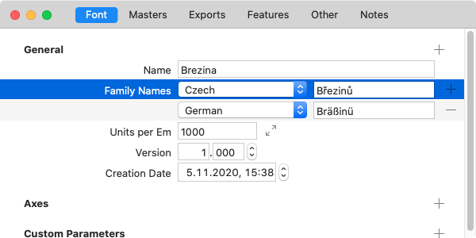

原文: [Naming](https://glyphsapp.com/learn/naming)
# 命名規則

チュートリアル

執筆者: Rainer Erich Scheichelbauer

[ en ](https://glyphsapp.com/learn/naming) [ fr ](https://glyphsapp.com/fr/learn/naming) [ zh ](https://glyphsapp.com/zh/learn/naming)

2023年10月4日更新（初版公開：2017年8月31日）

フォント名は、フォントメニューでのグループ化や順序を決定するため重要であり、ユーザーにフォントがどのように表示されるかにとって極めて重要です。フォントファミリーの命名は少しトリッキーな場合があるため、以下のチュートリアルで私たちの最良のヒントを共有することにしました。

フォントの命名においては、良い慣行を採用することが重要です。それを難しくしているのは、フォント名がフォント内の6つの異なる場所に保存されているという事実です。いや、実際にはもう少し多くの場所に。それがさらに複雑にしています。歴史的にそうなってしまったのです。

ああ、そして異なるアプリは、異なる方法でフォントの命名情報を読み取ります。以下に、私たちがベストプラクティスとして提案するものを示します。

## ファミリー名とサブファミリー（スタイル）名

基本的に、同じ*ファミリー名*を持つフォントは、ユーザーインターフェースで何らかの方法でグループ化できます。これが具体的にどのように行われるかは、もちろんあなたのフォントを使用するソフトウェアに依存します。*ファミリー名*は、「ファイル > フォント情報 > フォント > 名前」で設定できます。


ファミリー内の個々のフォントは、*サブファミリー名*（別名：スタイル名）によって区別される必要があります。これは、「ファイル > フォント情報 > 書き出し」の*名前*フィールドで設定されます。典型的なスタイル名は次のとおりです：*Regular, Italic, Bold, Medium, Light Italic, Display Bold, Caption Italic*など。言い換えれば、以下のキーワードの組み合わせです。

*   ウェイト：*Thin, Light, Extralight, Regular, Medium, Semibold, Bold, Extrabold, Heavy, Black*など。
*   幅：*Compressed, Condensed, Extended, Expanded*など。
*   傾き：*Italic, Oblique, Upright Italic, Backslant*など。
*   オプティカルサイズ：*Display, Text, Caption, Small*

もちろん、どんなスタイル名でも使用できます。デザインに合っていれば、*Felt Tip*や*Hatched*、*Outline*など、好きな名前を付けることもできます。名前に西欧ラテン語のアクセント記号が含まれていても、現代のソフトウェアではあまり問題にならないはずです。

もし一部のインスタンスに、デフォルトのファミリー名（「ファイル > フォント情報 > フォント > 名前」で設定されたもの）とは異なるファミリー名を付けたい場合は、「ファイル > フォント情報 > 書き出し」の該当するインスタンスに*Family Names*という一般プロパティを追加できます。

すると、次のような命名規則になります。

| ファミリー名 | サブファミリー名（スタイル名） |
| :--- | :--- |
| MyFontFamily | Regular |
| MyFontFamily | Italic |
| MyFontFamily | Bold |
| MyFontFamily | Bold Italic |
| MyFontFamily | Semibold |
| MyFontFamily | Semibold Italic |
| MyFontFamily | Black |
| MyFontFamily | Black Italic |
| MyFontFamily | Condensed |
| MyFontFamily | Condensed Italic |
| MyFontFamily | Condensed Bold |
| MyFontFamily | Condensed Bold Italic |
| MyFontFamily | Condensed Semibold Italic |
| MyFontFamily | Condensed Black |
| MyFontFamily | Condensed Black Italic |

## ローカライズされた名前

しかし、最大限の互換性を確保するためには、ファミリー名とスタイル名をプレーンASCII、英語、そして短く保つことには利点があります。それを超えて、非ASCII文字（例えば、日本語、アルメニア語、チェコ語の名前など）を使用したい場合は、*ローカライズされた*名前を追加するのが良い考えです。

ファミリー名をローカライズするには、「ファイル > フォント情報 > フォント」に進み、「一般」セクションのプラスボタンをクリックして一般プロパティを追加し、ポップアップから「Family Names」を選び、言語を選択して名前を設定します。



「一般」の隣にあるプラスボタンをクリックして*Family Names*を追加します。エントリーの隣にあるマイナスボタンをOptキーを押しながらクリックすると削除できます。

デフォルトのファミリー名とは異なる名前で表示させたい各言語のエントリを追加してください。言語の選択肢は限られています。なぜなら、この仕様ははるか昔、遠い銀河の彼方で書かれたものだからです。アイスランド語やアフリカーンス語、モンゴル語、マレー語、マケドニア語をサポートし、フラマン語とオランダ語を区別することさえできますが、すべての言語を知っているわけではありません。もしあなたが必要とする言語がメニューにない場合は申し訳ありませんが、私たちにできることはあまりありません。

スタイル名をローカライズするには、「ファイル > フォント情報 > 書き出し」の該当するフォントインスタンスに*Style Names*という一般プロパティを追加します。言語の追加方法は、*Family Names*と全く同じです。そういえば、*ファミリー*名も*書き出しインスタンスで*ローカライズできます。つまり、一般設定*Family Names*は、「ファイル > フォント情報 > 書き出し > 一般」でも利用可能です。これは、一部のインスタンスにカスタムファミリー名があり、それらもローカライズする必要がある場合に便利です。

ついでに言うと、デザイナー名や製造者名など、他の多くのエントリもローカライズできます。どうやって？もちろん、それぞれの一般プロパティを使います。この例では*Designers*と*Manufacturers*です。追加されたエントリがローカライズ可能であれば、言語メニューが表示され、フォントにずっと欲しかったすべての言語バリアントを追加できます。

## スタイルリンク

*スタイルリンク*と呼ばれるものを使って、個々のフォント間にファミリー関係を設定できます。あるインスタンスを、別のインスタンスのBold、Italic、またはBold Italicとして定義できます。これは、「ファイル > フォント情報 > 書き出し」の*スタイルリンク*セクションで非常に簡単に行えます。そこで必要なのは、Boldおよび/またはItalicのチェックボックスを有効にし、関連するインスタンスの名前を入力するだけです。例えば、


### プロのヒント
スタイルリンクのフィールドに*Regular*と入力する代わりに、単に空白のままにしておくことができます。Glyphsはその場合、*Regular*を想定します。エラーの原因が一つ減ります。

スタイルリンクを使うと、いわゆる「RIBBIファミリー」を作成できます。RIBBIは**R**egular、**I**talic、**B**old、**B**old **I**talicの頭文字です。これは少し制限があるように見えますが、その目的はOfficeソフトウェアでBoldボタンとItalicボタン、およびキーボードショートカットを有効にすることです。これを正しく行えば、TextEditでCmd-Bを使ってRegularとBoldを切り替えたり、WindowsのWordでCtrl-Iを使ってUprightとItalicを切り替えたりできます。ちなみに、Adobe InDesignも同じ目的でCmd-Shift-BとCmd-Shift-Iを使用します。

言い換えれば、スタイルリンクは4つのスタイル間の関係しか作成できません、それ以上はできません。もう一つ考慮すべきことは、リンクされたスタイルはMicrosoft Officeのフォントメニューに表示されないことです。Regularのみが表示され、リンクされたBold、Italic、Bold Italicスタイルは、BボタンとIボタン（またはそれぞれのキーボードショートカット）を通じてのみアクセスできます。したがって、私たちはスタイルリンクに対して以下の戦略を推奨します。

*   「Bold」インスタンスは、「Regular」の*Bold*です。
*   「Italic」インスタンスは、「Regular」の*Italic*です。
*   「Bold Italic」インスタンスは、「Regular」の*Bold*かつ*Italic*です。（注意：ItalicのBoldやBoldのItalicではありません。）
*   他のすべてのイタリックは、それぞれのアップライトの*Italic*です。例えば、「Semibold Italic」は「Semibold」の*Italic*です。
*   残りのすべてのアップライトについては、これらの設定を空白のままにしておきます。

したがって、すべてを正しく行えば、フォントファミリーの設定は次のようになります。

| ファミリー名 | サブファミリー（スタイル）名 | スタイルリンク |
| :--- | :--- | :--- |
| MyFontFamily | Regular | - |
| MyFontFamily | Italic | Regularの*Italic* |
| MyFontFamily | Bold | Regularの*Bold* |
| MyFontFamily | Bold Italic | Regularの*Bold*かつ*Italic* |
| MyFontFamily | Semibold | - |
| MyFontFamily | Semibold Italic | Semiboldの*Italic* |
| MyFontFamily | Black | - |
| MyFontFamily | Black Italic | Blackの*Italic* |
| MyFontFamily | Condensed | - |
| MyFontFamily | Condensed Italic | Condensedの*Italic* |
| MyFontFamily | Condensed Bold | Condensedの*Bold* |
| MyFontFamily | Condensed Bold Italic | Condensedの*Bold*かつ*Italic* |
| MyFontFamily | Condensed Semibold | - |
| MyFontFamily | Condensed Semibold Italic | Condensed Semiboldの*Italic* |
| MyFontFamily | Condensed Black | - |
| MyFontFamily | Condensed Black Italic | Condensed Blackの*Italic* |

おそらく、「Condensed Regular」ではなく「Condensed」、「Regular Italic」ではなく「Italic」と呼んでいることにお気づきでしょう。これは、「Regular」という名前の部分が*省略可能*と見なされるためです。つまり、「Condensed」や「Italic」のような他の名前の部分と組み合わされると、それは消えてしまいます。

## WindowsおよびOfficeソフトウェア向けの命名

Microsoft Wordは現在、*ファミリー名*と*サブファミリー（スタイル）名*に焦点を当てています。あるいは、もしあれば*WWSファミリー名*と*WWSサブファミリー名*です。WWSは**W**eight（ウェイト）、**W**idth（ウィズ）、**S**lope（スロープ）の略です。

### 豆知識
技術文献では、*ファミリー名*と*サブファミリー（スタイル）名*は通常、Name ID 1および2として参照されます。そして、WWS名はName ID 21（WWSFamilyName）および22（WWSSubfamilyName）として知られています。

「Name ID」という用語は、OpenTypeのNaming Tableのエントリを指し、これは命名情報がコンパイルされたフォントファイルに保存される方法です。詳細については、[Naming Tableの仕様](https://www.microsoft.com/typography/otspec/name.htm)を参照してください。

Microsoftのフォントメニューは、フォントファミリーのメンバーとしてRegular、Bold、Italic、Bold Italic、つまり上記で説明したスタイルリンクが設定されたRIBBIスタイルのみが可能であるというファミリーモデルを前提としています。これら4つ以外のものはすべて、別のファミリーと見なされなければなりません。したがって、Microsoftは公式にこの命名戦略を推奨しています。

| ファミリー名（ID 1） | サブファミリー（スタイル）名（ID 2） |
| :--- | :--- |
| MyFontFamily | Regular |
| MyFontFamily | Italic |
| MyFontFamily | Bold |
| MyFontFamily | Bold Italic |
| MyFontFamily Semibold | Regular |
| MyFontFamily Semibold | Italic |
| MyFontFamily Black | Regular |
| MyFontFamily Black | Italic |
| MyFontFamily Condensed | Regular |
| MyFontFamily Condensed | Italic |
| MyFontFamily Condensed | Bold |
| MyFontFamily Condensed | Bold Italic |
| MyFontFamily Condensed Semibold | Regular |
| MyFontFamily Condensed Semibold | Italic |
| MyFontFamily Condensed Black | Regular |
| MyFontFamily Condensed Black | Italic |

などなど。言い換えれば、*サブファミリー（スタイル）名*（ID 2）は、RIBBIスタイルのいずれかしかあり得ません。ウェイト、ウィズ、スロープに関する他のすべての情報は*ファミリー名*（ID 1）に入ります。もちろん、これが上の表とは非常に異なることもわかります。これにはいくつかの問題があります。扱うのが難しく、非常に多くの*familyName*パラメータを追加する必要があり、さらに悪いことに、「ファイル > フォント情報 > 書き出し」での全体像が失われます。なぜなら、ほとんどのスタイル名が同じだからです。また、Wordにとって正しいことが、DTPプログラムのような他のアプリにとって理想的ではないかもしれません。

しかし、待ってください…

良いニュースがあります：**これを行う必要はありません。** Glyphsは、書き出し時にこれを自動的に処理します。あなたのスタイルリンク情報に基づいて、Name ID 1と2が適切に設定されます。

> **Windows vs. Macの名前についての簡単な注意：** Glyphs 2では、上記はNaming Tableの*Windows*名でのみ行われていました。そうです、name tableの情報はフォント内に2回保存されます。1つはMac用（プラットフォームID 1）、もう1つはWindows用（プラットフォームID 3）です。理由は聞かないでください。Glyphs 3では、Mac名はWindows名と同期して保たれます。そして、よく考えてみると、これはMac名を余分なものにします。「フォント情報 > フォント」でカスタムパラメータ*Export Mac Name Table Entries*を追加し、それをオフに設定することでMac名を抑制できます（2番目のチェックボックスを無効にする）。

何らかの理由でこの自動化が機能しない場合、つまりWordのBボタンとIボタンが期待されるスタイルを生成しない場合は、*Style Map Family Names*という一般プロパティでスタイルマッピングを制御できます。このプロパティのポップアップからの引用がすべてを物語っています。

> **Style Map Family Names:** 太字、イタリック、太字イタリックのスタイルマッピングに使用されるファミリー名。これを使用して、より大きなフォントファミリー内にサブファミリーを作成できます。「最大4つのフォントがファミリー名を共有し、フォントスタイルリンキンググループ（レギュラー、イタリック、ボールド、ボールドイタリック – OS/2.fsSelectionビット設定で定義）を形成できます。Glyphsは、*スタイル名*フィールドのエントリと、インスタンスの*スタイルリンク*セクションのエントリを使用して、4つの個別のウェイトをリンクします。

繰り返しになりますが、ほとんどの場合、このプロパティは必要なく、それをローカライズする必要もさらにありません。でも、念のため。

## WWS名：Name ID 21および22

WWSは**W**eight（ウェイト）、**W**idth（ウィズ）、**S**lope（スロープ）の略です。ウェイトは、あなたのデザインの見かけの色やストロークの太さ、つまりlight、medium、bold、blackなどを指します。ウィズはフォントの伸び、つまりcondensedからwideまでを指します。スロープはフォントの見かけの角度で、通常はuprightまたはitalicです。WWS名、別名Name ID 21および22は、*以下の場合にのみ*必要です。

*   ファミリーにウェイト、ウィズ、スロープ*以外*のスタイルバリアントがある場合、つまり、フォントに非WWS軸がある場合。
*   そして、その非WWS軸に対して*通常ではない値*を持つフォントの場合のみ、つまり、スタイルがウェイト、ウィズ、スロープだけで純粋に表現できない場合。

フォントファミリーをオプティカルサイズのバリアント、例えば「Subhead」、「Display」、「Caption」などで拡張したいとします。上の表で見てきたフォントは、新しい*オプティカルサイズ*軸上で非通常ではないため、WWS名は必要ありません。しかし、*オプティカルサイズ*軸上で特別で非通常の占める位置を占める、新しく追加するフォントは、WWS名が必要です。

そして、これは、*非通常の名前で別のファミリーを作成*し、それらのファミリー名をID 21に入れ、しかし*ウェイト、ウィズ、スロープに関するすべての情報*はID 22に保持するという仕組みです。したがって、Name ID 22はRIBBI名だけでなく、*ウェイト、ウィズ、またはスロープのカテゴリに分類されるものすべて*、例えば*Medium Extended Italic*や*Bold Condensed Oblique*のためにもあります。

| ファミリー名 | サブファミリー（スタイル）名 | WWSファミリー名（ID 21） | WWSサブファミリー名（ID 22） |
| :--- | :--- | :--- | :--- |
| MyFontFamily | Display Light | MyFontFamily Display | Light |
| MyFontFamily | Display Light Italic | MyFontFamily Display | Light Italic |
| MyFontFamily | Display Medium Extended | MyFontFamily Display | Medium Extended |
| MyFontFamily | Display Medium Extended Italic | MyFontFamily Display | Medium Extended Italic |
| MyFontFamily | Display | MyFontFamily Display | Regular |
| MyFontFamily | Display Italic | MyFontFamily Display | Italic |
| MyFontFamily | Display Bold | MyFontFamily Display | Bold |
| MyFontFamily | Display Bold Italic | MyFontFamily Display | Bold Italic |
| MyFontFamily | Display Semibold | MyFontFamily Display | Semibold |
| MyFontFamily | Display Semibold Italic | MyFontFamily Display | Semibold Italic |

Glyphsでそれをどうやるか？簡単です。「ファイル > フォント情報 > 書き出し」で、該当するフォントに適切なカスタムパラメータを追加します。WWSファミリー名には、一般プロパティ*WWS Family Name*を、WWSサブファミリー名には*WWS Subfamily Name*を追加します。誰が推測したでしょうか。

**注1：** ID 21/22の包含は、OS/2.fsSelection.bit8の状態と正確に相関しているべきです。もしそれが何を意味するか知っているなら。もし知らなければ、心配しないでください。Glyphsがこれを自動的に処理します。

**注2：** *MyFontFamily Compressed*のような、スタイル名が純粋にWWSで表現できる場合、Name ID 21/22は必要ありませんでしたよね？しかし、実際には、仕様は、このfsSelectionビット8が設定されていれば、ID 21と22を含めることを妨げません。ですから、もし気が向いて、たくさんの時間を潰したいなら、どこにでも追加できます。しかし、本当に、早く終わらせて代わりにアイスクリームを食べましょう。もし自分でfsSelectionビット8を制御したいなら、インスタンスに*Has WWS Names*パラメータを追加してください。OpenTypeの仕様によれば、このビットは「フォントが“name” ID 21と22を使用しなくても、ウェイト/ウィズ/スロープファミリーと一致する“name”テーブル文字列を持っている」ことを示します。これは、フォントの命名が*すでにWWSスキームに従っている場合にのみ*意味があることを覚えておいてください。

## Adobeメニュー向けの命名

Adobeメニューのフォントは、ファミリー名に基づいてサブメニューに分類されます。これは、*Typographic Names*（旧称：*Preferred Names*、Name ID 16および17）によって上書きできます。したがって、サブメニューの配置が気に入らない場合は、*Typographic Family Names*で独自のサブメニューを作成し、残りのフォント名を*Typographic Subfamily Names*に入れることができます。これらは両方とも一般プロパティで、「ファイル > フォント情報 > 書き出し」ウィンドウの右上隅にあるプラスボタンを押すことで追加できます。

サブメニュー内では、フォントは次の順序でソートされます。

1.  ウィズクラス（幅）
2.  ウェイトクラス（太さ）
3.  スロープ（傾き、アップライトまたはイタリック）
4.  そして最後に、スタイル名のアルファベット順


ウィズクラスは「ウィズ」メニュー(1)から、ウェイトクラスは「ウェイト」メニュー(2)から、スロープは「イタリック」ボタン(3)で、そしてアルファベット順はもちろん「スタイル名」(4)で設定できます。

### ヒント
古いバージョンのMS Office（VistaまでのWindowsバージョン）では、ウェイトクラスが250未満のフォントを自動的に太字にしていました。これにより、ウェイトクラス200のExtralightがウェイトクラス300のLightよりも太く見えるという奇妙な効果が生じることがあります。これを避けるには、最も低いウェイトクラスが250以上であることを確認してください。もちろん、Vista以降のWindowsバージョンで新しいMS Officeを使用するユーザーのみを対象としている場合、またはMS Officeをまったく使用しない場合は、これを無視して100から始めても構いません。しかし、これは*埋め込み*TrueTypeフォントを含むWordファイルにまだ影響するという報告があります。

もしウィズクラスとウェイトクラスでさらに区別する必要がある場合（いくつかのオプションがメニューの右に表示される同じ数値を生成するため）、一般プロパティ*Width Class*と*Weight Class*で直接順序付け用の数値を設定できます。例えば、Regular (400)とMedium (500)の間に余分なウェイトが必要な場合、*Weight Class*に`450`と入力します。


つまり、何でもできるということです！すべてのフォントを同じサブメニューに入れたい場合は、すべてのフォントの*Typographic Family Names*が同じであることを確認するだけです。しかし、フォントを異なるサブメニューに入れたい場合は、同じパラメータで区別できます。

これらのパラメータは、*ファミリー名とスタイル名のエントリと異なる場合にのみ*設定する必要があることを覚えておいてください。そうでなければ、それらは必要ありません。言い換えれば、優先名は、ファミリー名とスタイル名によって確立されたデフォルトを*上書き*するためにのみ使用します。言うまでもなく、それらを同じ値で上書きするのは意味がありません。

> **例：** ウェイト軸とウィズ軸があるとします。そして、5つのウィズと9つのウェイト、つまり合計45のフォントがあるとします。そのサブメニューを想像してみてください。うわぁ。選択肢は2つあります。
>
> (A) 45のフォントすべてを1つのメニューに収めたい場合。その場合は、上記の設定で何も変更する必要はありません。おめでとうございます、これで一杯飲みに行けます。
>
> (B) フォントを5つの異なるサブメニュー（5つのウィズに対応）に入れたい場合。その方法なら、フォントメニューを1つのエントリではなく5つのエントリで散らかすことになりますが、少なくともサブメニューはそれぞれ9つのエントリしか持ちません。その場合、*非通常*のウィズすべてに*Typographic Family Names*を使用します。例えば、「MyFont Compressed」、「MyFont Condensed」、「MyFont Semiextended」、「MyFont Extended」などです。*通常*のウィズについては、「通常の」ファミリー名「MyFont」で十分です。したがって、タイポグラフィック（別名：優先）ファミリー名は必要ありません。

## Windows vs. Mac：フルネーム vs. 互換フルネーム

Windowsは、フォントのフルネームをメニューなどで表示するために、Name ID 4（「Full Font Name」または「Full Name」）を使用します。通常、これはファミリー名、スペース、サブファミリー（スタイル）名で構成されます。GlyphsもID 4のエントリをこのように自動計算します。これは、*Name Table Entry*カスタムパラメータ（詳細は後述）で上書きできます。ここまでは順調です。

Macもこの目的でName ID 4を使用します。ただし、フォントにName ID 18（「Compatible Full Name」）が存在しない場合に限ります。言い換えれば、何らかの理由でMacメニューのID 4の名前で我慢できない場合は、「ファイル > フォント情報 > 書き出し」でインスタンスに*Compatible Full Names*という一般プロパティを追加することで、別の名前を持つことができます。

言うまでもなく、本当に正当な理由がある場合にのみこれを行ってください。*Compatible Full Names*を使用すると、ドキュメントのクロスプラットフォーム相互運用性が損なわれる可能性があります。警告はしましたよ。

## 互換ネームテーブル

上で述べたように、GlyphsはNameテーブルのエントリを正しい場所に自動的に配置し、Adobeアプリ、Microsoft Office、MacのCoreTextアプリで最適に機能するようにします。ほとんどのアプリはこの方法でカバーされます。

しかし、時々、顧客から苦情が来ることがあります。特にQuark XPressや古いバージョンのFontExplorerのユーザーからです。もし、フォントファミリーがそれらのアプリで正しくグループ化されていないという苦情を聞いた場合は、`Compatible Name Table`というカスタムパラメータを使用できます。これにより、Glyphsはレガシースタイルのnameテーブルを書き出します。

フォントファミリーは、Quark XPressとFontExplorerで正しくグループ化されるようになります。しかし、Microsoft Officeを含む他のアプリでは、ファミリーのグループ化が崩れます。残念ながら、すべてを手に入れることはできません。

### PostScript名

PostScript名は、PostScript Type 1時代からの遺産です。一部のアプリや、一部の（特にPostScriptベースの）ファイル形式は、ドキュメントにフォント情報を保存するためにPostScriptの*Font* Name（NameテーブルID 6、最新の仕様では単に「PostScript Name」）を使用します。PostScriptの*Full* Name（NameテーブルID 4、現在は単に「Full Font Name」）は、人間が読むためだけのものです。繰り返しになりますが、これらは両方ともGlyphsによって自動的に設定され、アプリにその魔法を任せておけば、ほとんどの場合問題は発生しません。ですから、自分で設定する本当に正当な理由がない限り、このチュートリアルの次の見出しにジャンプできます。

**PostScript *Font* Name**（「PostScript Name」、ID 6）は、「ファイル > フォント情報 > 書き出し」で、*Font Name*という一般プロパティで設定できます。これには2つの点で注意が必要です。名前の長さと、文字の制限です。技術的には、最大長は127文字で、ほとんどすべてのフォントには十分なはずです。しかし、[Adobe Type Manager](http://www.adobe.com/products/atmlight.html)（ATM）のような一部のレガシーソフトウェアは、前半、つまり63文字しか考慮しません。言い換えれば、古いアプリは、PostScript Font Nameの最初の63文字が同じである場合、2つのフォントを区別できないか、あるいは誤動作する可能性があります。良いニュース：レガシーソフトウェアを気にする必要がなければ、この制限は無視できます。しかし、レガシー互換性を気にするなら、さらに悪化する可能性があります。初期のPostScriptインタプリタは、29文字（はい、29です）以上を扱えません。うげぇ。

### プロのヒント
29文字の制限はEOT Webフォントにも適用されます。EOTはもはや古いフォーマットですが、クライアントがInternet Explorer 6との互換性を主張する場合があります。したがって、EOTを書き出す場合は、PostScriptフォント名も設定し、それが29文字を超えないようにすると良いでしょう。

文字の制限に関して、PostScriptフォント名は*7ビットASCIIのみ*を含み、制御文字、スペース、そしてPostScript言語で予約されているこれらの10文字`[](){}<>/%`は使用できません。ハイフン`-`は、ファミリー名とサブファミリー（スタイル）名を接続するために予約されています。言い換えれば、使用できるのはこれらの文字だけです。

### プロのヒント
仕様ではもっと多くの文字が許可されていますが、PostScript名に使用する文字セットを、単にA-Z、a-z、そしてファミリー名とスタイル名を区切るための単一のハイフンに限定することを強くお勧めします。なぜなら、一部のアプリの実装では、記号や数字で混乱することがあるからです。
```
!"#$&'*+,-.0123456789:;=?@ABCDEFGHIJKLMNOPQRSTUVWXYZ\^_@abcdefghijklmnopqrstuvwxyz|~
```
つまり、*MyFont Condensed Extrabold Italic*は*MyFont-CondensedExtraboldItalic*となり、これは31文字の長さです。さらに、クライアントが1988年製の、29文字までしか扱えないイメージセッタをサポートする必要があると要求したとします。長さの制限に達するためには、スタイル名を構成する部分を*CdXBdIt*に短縮できます。完全なフォント名は、したがって*MyFont-CdXBdIt*となり、14文字以下になります。これで、博物館からそれらの機械を再び引っ張り出してくることができます。

[Tech Note #5088](https://github.com/adobe-type-tools/font-tech-notes/blob/main/pdfs/5088.FontNames.pdf)では、Adobeはスタイル名にこれらの短縮形を推奨しています。

| 短縮形 | 完全形 |
| :--- | :--- |
| Bd | Bold |
| Bk | Book |
| Blk | Black |
| Cm | Compressed |
| Cn | Condensed |
| Ct | Compact |
| Dm | Demi *（接頭辞）* |
| Ds | Display |
| Ex | Extended |
| Hv | Heavy |
| Ic | Inclined |
| It | Italic |
| Ks | Kursiv *（ドイツ語でイタリック）* |
| Lt | Light |
| Md | Medium |
| Nd | Nord |
| Nr | Narrow |
| Obl | Oblique |
| Po | Poster |
| Rg | Regular |
| Sl | Slanted |
| Sm | Semi *（接頭辞）* |
| Su | Super |
| Th | Thin |
| Ult | Ultra *（接頭辞）* |
| Up | Upright |
| X | Extra *（接頭辞）* |

もし不思議に思っていたなら、「Nord」と「Nord Italic」は、1960年に[Roger Excoffonの有名なAntique Olive](http://www.signes.org/set.php?id=551)書体ファミリーの最初にリリースされたウェイトでした。それらは幅が広く、非常に太いカットです。そのデジタル版がAdobe Libraryにあったため、Adobeがリストを作成したときに追加されました。私の知る限り、これが唯一の事例です。

そして、**PostScript *Full* Name**（「Full Font Name」、ID 4）があり、これは「ファイル > フォント情報 > 書き出し > 一般」の一般プロパティ*Full Name*で設定できます。ここでは、人間が読めることが重要です。なぜなら、それは*ユーザーに表示されるべき*フォントの*完全な名前*であり、したがってスペースを含むことが許可されているからです。Adobeによれば、それは「フォントメニューでの表示に適している」べきです。

だから、好きなことを書いても完全に自由ですよね？まあ、そうでもありません。Adobe Tech Note #5088によれば、一部のシステムは、フォントのファミリー名をPostScript Full Nameと照合して「ファミリーグループに分類」します。したがって、PostScript Full Nameはファミリー名で始まるべきです。PostScript Full Nameは、「スタイル属性を追加することで完成します — 通常はこの順序で：ウェイト、ウィズ、スロープ、オプティカルサイズ」（Adobe Technote #5088）。例：「Bold Extended Italic Display」、「Medium Condensed Oblique Caption」、「Semibold Oblique」、「Compressed Poster」、「Light」などです。

繰り返しになりますが、（PostScriptの）*Font Name*と*Full Name*は、本当に制御不能な内なる衝動を感じ、自分でやらなければ気が済まない場合にのみ設定してください。そうでなければ、忘れてしまって、Glyphsに両方のPostScript名を設定させてください。これらはとにかく簡単に計算できるからです。

## ネームテーブルのエントリ

もしあなたが何をしているか分かっていて、もはや何も怖くないなら、Name Table全体を自分で作成することもできます。あらゆる種類の言語、あらゆる種類のエンコーディング、あらゆる種類のプラットフォームに対して、Name Tableの各エントリを設定できます。必要なのは、「ファイル > フォント情報 > 書き出し」に進み、インスタンスを選び、*Name Table Entry*カスタムパラメータを追加し、その値に以下の構造のいずれかを使用することだけです。

`nameID; nameString`
*例:* `4; MyFont Bold Italic` (Windows 英語 フルネーム)

### 注意
Glyphsの2.5より前のバージョンでは、セミコロンの後のスペースがName Tableのエントリに追加されていました。このバグは修正されています。もし古いアプリのバージョンとの互換性を保つ必要がある場合は、スペース文字を省略し、セミコロンの直後から名前を始めることをお勧めします。

> この場合、`platformID`は3（Windows）、続いて`encID`は1（Unicode）、`langID`は0x0049（Windows英語）と見なされます。

`nameID platformID; nameString`
*例:* `4 1; MyFont Bold Italic` (Mac 英語 フルネーム)

> もし`platformID`が1（Mac）として指定された場合、`encID`と`langID`の両方が0（MacRomanとMac英語）と見なされます。

`nameID platformID encID langID; nameString`
*例:* `4 3 1 0x040C; MaPolice Gras Oblique` (Windows フランス語 フルネーム)

> もし`platformID`が1（Mac）として指定された場合、`encID`は0から32の間の数値、`langID`は0から150の間の数値になります（[Macintoshプラットフォーム固有のエンコーディングと言語ID](https://www.microsoft.com/typography/otspec/name.htm#encLangIDs_platID1)を参照）。
>
> もし`platformID`が3（Windows）として指定された場合、`encID`は0から10の間の数値、`langID`は0x8000未満の16進数でなければなりません（[Windowsプラットフォーム固有のエンコーディングと言語ID](https://www.microsoft.com/typography/otspec/name.htm#encLangIDs_platID3)を参照）。

`platformID`は、Macintoshの場合は1、Windowsの場合は3のいずれかです。オプションの`encID`と`langID`は、`platformID`に応じて、WindowsまたはMacintoshのエンコーディングと言語IDを表します。これらは0から65536の間の数値でなければならず、10進数、8進数、または16進数で入力できます。AFDKO構文仕様では、「10進数は0でない数字で始まり、8進数は0で始まり、16進数は0x接頭辞と数字および16進数の文字a-fまたはA-Fで始まる」と定められています。

ここだけの話ですが、本当に重要なプラットフォームは2つだけです。プラットフォームID 1 *Macintosh*とプラットフォームID 3 *Windows*、いや、実際にはMacの名前は忘れて、ID 3 *Windows*だけが重要です、本当に。他のプラットフォームID 0 *Unicode*、2 *ISO*、4 *Custom*は、ほとんど、あるいはまったく使用されていません。そのうちの1つ、2 *ISO*は、公式に廃止されました。それでも、Name Tableエントリを自分で設定する場合は注意してください。特に、パラメータの長い形式を選択する場合は、各プラットフォームに独自の、理解不能なエンコーディングと言語IDのリストがあるからです。ははは、彼らが私を連れ去りに来る、はははは。ですから、もし本当にこれを自分でやりたいなら、このウェブページ[Microsoft OT Spec: The Naming Table](https://www.microsoft.com/typography/otspec/name.htm)を頻繁に訪れることになるでしょう。そこには、あなたのフォントマニアの心が望むすべてのエンコーディングと言語IDがリストされています。しかし、真面目な話、これに時間を無駄にしないでください。プラットフォームID 3のパラメータだけを保持してください。なぜなら、プラットフォームの区別という概念全体が過去のものだからです。

以下は、アスタリスクでマークされたものを除き、`<nameID>`で設定できるName Tableエントリの簡単な表です。リンクはMicrosoftの仕様ページに移動します。

| nameID | 説明 |
| :--- | :--- |
| [ID 0](https://www.microsoft.com/typography/otspec/name.htm#nid0) | 著作権表示。 |
| *[ID 1](https://www.microsoft.com/typography/otspec/name.htm#nid1) | フォントファミリー名。 |
| *[ID 2](https://www.microsoft.com/typography/otspec/name.htm#nid2) | フォントサブファミリー名（別名：「スタイル名」）。 |
| *[ID 3](https://www.microsoft.com/typography/otspec/name.htm#nid3) | 一意のフォント識別子（別名：「一意の識別子文字列」）。アプリケーションはこれを使用してフォントを識別できます。多くの場合、ファミリー名とスタイル名、バージョン番号、年の組み合わせです。 |
| [ID 4](https://www.microsoft.com/typography/otspec/name.htm#nid4) | フルフォント名（別名：「PostScriptフルネーム」）。フォントの完全で、一意で、人間が読める名前。Windowsで使用されます。多くの場合、ファミリー名（ID 1）とスタイル名（ID 2）の間にスペースを挟んだ組み合わせです。 |
| *[ID 5](https://www.microsoft.com/typography/otspec/name.htm#nid5) | バージョン文字列。フォントベンダーからのリリースおよびバージョン情報。通常、「Version」という単語の後にx.xxx形式のバージョン番号が続きます。*versionString*パラメータでも設定可能。 |
| *[ID 6](https://www.microsoft.com/typography/otspec/name.htm#nid6) | フォントのPostScript名（別名：「PostScriptフォント名」）。*postscriptFontName*パラメータでも設定可能。 |
| [ID 7](https://www.microsoft.com/typography/otspec/name.htm#nid7) | 商標文字列。オプション。フォントを商標として登録した場合にのみ必要です。 |
| [ID 8](https://www.microsoft.com/typography/otspec/name.htm#nid8) | 製造元名。 |
| [ID 9](https://www.microsoft.com/typography/otspec/name.htm#nid9) | デザイナー名。 |
| [ID 10](https://www.microsoft.com/typography/otspec/name.htm#nid10) | 説明。任意のテキスト。「改訂情報、使用上の推奨事項、履歴、機能などを含めることができます。」 |
| [ID 11](https://www.microsoft.com/typography/otspec/name.htm#nid11) | ベンダーのURL。URLプロトコルを忘れずに、つまり`http://`などで始めます。 |
| [ID 12](https://www.microsoft.com/typography/otspec/name.htm#nid12) | デザイナーのURL。URLプロトコルを忘れずに、つまり`http://`などで始めます。 |
| [ID 13](https://www.microsoft.com/typography/otspec/name.htm#nid13) | ライセンスの説明。ユーザーがフォントで何をしてよいか、してはならないかの1〜2文の要約。例：x台のデバイスにインストール可能、転売不可など。 |
| [ID 14](https://www.microsoft.com/typography/otspec/name.htm#nid14) | ライセンス情報URL。ライセンス契約の全文を含むWebページへのリンク。 |
| [ID 16](https://www.microsoft.com/typography/otspec/name.htm#nid16) | タイポグラフィックファミリー名（別名：「優先ファミリー名」）。ID 1と異なる場合にのみ設定します。 |
| [ID 17](https://www.microsoft.com/typography/otspec/name.htm#nid17) | タイポグラフィックサブファミリー名（別名：「優先サブファミリー名」）。ID 2と異なる場合にのみ設定します。 |
| [ID 18](https://www.microsoft.com/typography/otspec/name.htm#nid18) | 互換フルネーム。Macintoshのみ。ID 4と異なる場合にのみ設定します。 |
| [ID 19](https://www.microsoft.com/typography/otspec/name.htm#nid19) | サンプルテキスト。一部のアプリは、フォントをプレビューするときにこれを表示します。 |
| [ID 20](https://www.microsoft.com/typography/otspec/name.htm#nid20) | PostScript CID findfont名。公式には廃止されていますが、CJKフォントではまだ使用されています。 |
| [ID 21](https://www.microsoft.com/typography/otspec/name.htm#nid21) | WWSファミリー名。ID 16と17のエントリがWWSモデルに準拠していない場合に、WWS準拠のファミリー名を提供するために使用されます。（つまり、ID 17のエントリがウェイト、ウィズ、またはスロープ以外の属性の修飾子を含む場合。） |
| [ID 22](https://www.microsoft.com/typography/otspec/name.htm#nid22) | WWSサブファミリー名。ID 21と組み合わせて使用され、ID 16と17のエントリがWWSモデルに準拠していない場合に、WWS準拠のサブファミリー名（ウェイト、ウィズ、スロープ属性のみを反映）を提供します。 |
| [ID 23](https://www.microsoft.com/typography/otspec/name.htm#nid23) | 明るい背景のパレット名。COLR/CMAPカラーフォント用に予約されています。 |
| [ID 24](https://www.microsoft.com/typography/otspec/name.htm#nid24) | 暗い背景のパレット名。COLR/CMAPカラーフォント用に予約されています。 |
| [ID 25](https://www.microsoft.com/typography/otspec/name.htm#nid25) | バリエーションPostScript名プレフィックス。バリアブルフォントに存在する場合、バリエーションフォントのPostScript名生成アルゴリズムでファミリープレフィックスとして使用されることがあります。 |

これらのエントリのほとんどについては、UIのテキスト入力フィールドや専用のカスタムパラメータなど、より良い設定方法があります。そして、もしそうするなら、通常はWindows名だけを設定すれば済みます。言い換えれば、パラメータの短い形式`<nameID>; <nameString>`を使用して、それで完了です。

そして繰り返しになりますが、これは何らかの理由でGlyphsが生成するName Tableが機能せず、かつ自分が何をしているか分かっている場合にのみ行ってください。自分でやるという目的のためだけに自分で設定すると、何かを壊す可能性が高いです。

このチュートリアルで説明した情報の多くを提供してくださったMicrosoftのRob McKaughan氏に感謝します。一部の箇所はRob氏の言葉を直接引用しています。

---

更新履歴 2017-12-17: 誤字を修正、*preferredFamilyName*（*Typographic Family Names*）パラメータの例を追加。

更新履歴 2017-12-17: Antique Olive Nordに関する段落を追加。*Merci bien, Jean François Porchez!* Name TableエントリとEOTのPostScript名に関する情報を追加。*Thank you, Phil Garnham!*

更新履歴 2018-07-05: パラメータですべてのName IDを設定できるようになったため、*Name Table Entry*パラメータの古い制限の一部を削除。

更新履歴 2019-03-19: 誤字を修正、MaFonteをMaPoliceに、Mac RomanをMacRomanに修正（Nathalie氏に感謝）。

更新履歴 2019-11-14: 最新の仕様バージョンに合わせて表現を更新（Joachim氏に感謝）。

更新履歴 2020-11-13: Glyphs 3向けに更新。

更新履歴 2020-02-17: プラットフォームID 3のみを保持するようアドバイスを追加し、その理由を説明。

更新履歴 2023-01-24: Adobe Tech Noteのリンクを更新（Zachary氏に感謝）。

更新履歴 2023-10-04: 推奨されるPS名文字セットに関するヒントを追加。

## 関連記事

[すべてのチュートリアルを見る →](https://glyphsapp.com/learn)

*   ### [Adobeアプリでフォントをテストする](testing-your-fonts-in-adobe-apps.md)

チュートリアル

*   ### [フォントキャッシュの問題を解消する](eliminating-font-cache-problems.md)

チュートリアル

[ トラブルシューティング ](https://glyphsapp.com/learn?q=troubleshooting)