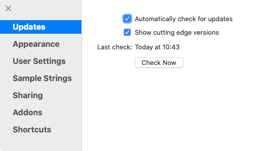
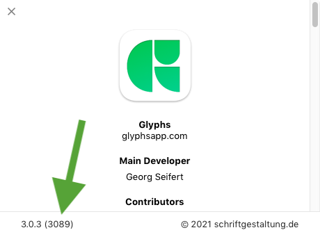
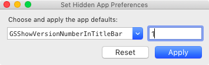

原文: [Older versions of Glyphs](https://glyphsapp.com/learn/older-versions-of-glyphs)
# Glyphsの古いバージョン

チュートリアル

[ インストール ](https://glyphsapp.com/learn?q=installation) [ トラブルシューティング ](https://glyphsapp.com/learn?q=troubleshooting)

執筆者: Rainer Erich Scheichelbauer

[ en ](https://glyphsapp.com/learn/older-versions-of-glyphs) [ zh ](https://glyphsapp.com/zh/learn/older-versions-of-glyphs)

2022年4月18日更新（初版公開：2012年8月31日）

時には、最新版ではない、異なるバージョンのGlyphsが必要な状況に陥ることがあります。ここでは、それらを入手する方法を紹介します。

ほとんどの場合、古いバージョンに戻すことは推奨しません。新しいバージョンがあるのには、通常理由があります。しかし、もし最新のベータビルドで問題が発生した場合は、最新の安定バージョンに戻したいと思うかもしれません。

## 最新の安定版とベータ版

Glyphsの各メジャーバージョンの最新の安定版ビルドを入手するには、以下のリンクを使用します。

| バージョン | リンク |
| --- | --- |
| Glyphs 1 | [latest.php](https://updates.glyphsapp.com/latest.php) |
| Glyphs 2 | [latest2.php](https://updates.glyphsapp.com/latest2.php) |
| Glyphs 3 | [latest3.php](https://updates.glyphsapp.com/latest3.php) |
| Glyphs Mini 1 | [latestMini.php](https://updates.glyphsapp.com/latestMini.php) |
| Glyphs Mini 2 | [latestMini2.php](https://updates.glyphsapp.com/latestMini2.php) |

そこから、最新のベータビルドにアクセスできます。そのためには、「Glyphs > 環境設定 > アップデート」に進み、**両方の**チェックボックスを有効にして、「今すぐ確認」ボタンをクリックします。

Glyphsは、最新であると伝えるか、最新の最先端ビルドをダウンロードして再起動するように提案します。

待ってください。**「ビルド」とは何ですか？**良い質問です。

アプリの特定のバージョンは、複数の*ビルド*で構成されることがあります。通常これらはベータ版で、そのうちの1つ、通常はバージョンの最後のビルドが「安定」リリース版になります。ベータビルドは、まだ安定版アップデートに含まれていないバグ修正が含まれている可能性があるため、役立つことがあります。ベータリリースははるかに頻繁に行われます。最先端のバージョンが十分にテストされたと判断したら、それを「安定」リリースに変えます。その後、次のバージョン番号に進みます。

### 注意
この文脈での「安定版」とは、環境設定で「最先端のバージョンを表示」を有効にしていない人にも利用可能であることを意味するだけで、必ずしもベータ版よりクラッシュが少ないとは限りません。

各ビルドは、その*ビルド番号*によって一意に識別されます。実行中のアプリのビルド番号は、メニューから「Glyphs > Glyphsについて…」を選択することで確認できます。「バージョン情報」ウィンドウの下部にバージョン番号が表示され、その隣の括弧内にビルド番号が表示されます。

したがって、バグレポートを提出する際は、バージョン番号ではなくビルド番号をお知らせください。

## 古いバージョン

一般的に、古いバージョンのGlyphsが必要になるのは、次の3つの状況です。

*   古いハードウェアや古いmacOSバージョンをサポートする必要がある場合、
*   以前は機能していたものが最新バージョンで壊れており、まだバグ修正がない場合、
*   古いバージョンのGlyphsで作成されたレガシーファイルの書き出しを再現する必要がある場合。

一般的に、`updates.glyphsapp.com/GlyphsX.X.X-YYY.zip`というスキームを使用して、どのバージョンでもダウンロードできます。`X.X.X`の部分はバージョン番号を、YYYはビルド番号を表します。したがって、例えばバージョン2.2.2、ビルド827をダウンロードしたい場合は、[updates.glyphsapp.com/Glyphs2.2.2-827.zip](https://updates.glyphsapp.com/Glyphs2.2.2-827.zip)と入力します。

### プロのヒント
Glyphs 2.3から2.5のベータ版では、ダッシュの前に`b`が追加されていました。したがって、バージョン2.5のベータビルド1129は、[updates.glyphsapp.com/Glyphs2.5b-1129.zip](https://updates.glyphsapp.com/Glyphs2.5b-1129.zip)からダウンロードします。

Glyphs Miniの場合は、バージョン番号の直前に`Mini`を追加します。例えば、最後のGlyphs Mini 2.0.2、ビルド94は、[updates.glyphsapp.com/GlyphsMini2.0.2-94.zip](https://updates.glyphsapp.com/GlyphsMini2.0.2-94.zip)からダウンロードできます。

すべてのビルド番号が利用できるわけではありません。一部のビルドは、数時間以内に、より安定したビルドにすぐに置き換えられたため、取り下げられています。欠けているビルドについては私たちに尋ねないでください。私たち自身ももはや持っておらず、信じてください、あなたはそれを欲しくないでしょう。

### Glyphsのビルド番号

しかし、待ってください。どのビルド番号がどのバージョン番号に対応しているかはどうやって知るのでしょうか？簡単ではありませんよね。ここに表があります。

| アプリのバージョン | 最小ビルド番号 |
| :--- | :--- |
| 1.4.5 | 612 |
| 2.2.2 | 826 |
| 2.3 | 875 |
| 2.3.1 | 922 |
| 2.4b | 923 |
| 2.4 | 937 |
| 2.4.1 | 940 |
| 2.4.2 | 986 |
| 2.4.3 | 1064 |
| 2.4.4 | 1075 |
| 2.5b | 1027 |
| 2.5 | 1130 |
| 2.5.1 | 1133 |
| 2.5.2 | 1142 |
| 2.6 | 1192 |
| 2.6.1 | 1193 |
| 2.6.2 | 1231 |
| 2.6.3 | 1269 |
| 2.6.4 | 1272 |
| 2.6.5 | 1287 |
| 2.6.6 | 1343 |
| 3.0 | 3032 |
| 3.0.1 | 3033 |
| 3.0.2 | 3040 |

**例：** バージョン2.6.1のビルド番号は1193から始まります。したがって、それに続くビルド番号1194、1195、1196なども、2.6.1のURL（例：`updates.glyphsapp.com/Glyphs2.6.1-1196.zip`）でアクセスできます。もしビルド番号が404エラーを返す場合は、おそらくそれは取り下げられています。

### Glyphs Miniのビルド番号

| アプリのバージョン | 最小ビルド番号 |
| :--- | :--- |
| 2.0 | 53 |
| 2.0.1 | 71 |
| 2.0.2 | 88 |
| 2.1 | 95 |
| 2.1.1 | 97 |
| 2.1.2 | 98 |
| 2.1.3 | 99 |
| 2.1.4 | 101 |

## 変更履歴

各バージョンで何が変更されたかを確認するには、アプリケーションにチェンジログが組み込まれています。「ヘルプ > 変更履歴」に進むだけで、Glyphsがバージョン履歴を含むウィンドウを開いてくれます。

## PowerPC版Glyphs

もしIntel以前のG4またはG5 CPUを搭載した非常に古いMacをお持ちの場合、このリンク[updates.glyphsapp.com/latestPPC.php](https://updates.glyphsapp.com/latestPPC.php)を使用することで、最新のPPCおよびIntelの[ユニバーサルバイナリ](http://en.wikipedia.org/wiki/Universal_binary)を入手できます。この記事の執筆時点で、最新のPPC対応バージョンはバージョン1.2.6です。

## 便利なリンク

GlyphsチームのメンバーであるFlorian Pircher氏は、Glyphs 2.2以降の[すべてのベータバージョンのリンク集](https://florianpircher.com/glyphs/versions/)を管理しています。

## 便利なスクリプト

[mekkablue scripts](glyphsapp3://showplugin/mekkablue%20scripts)には、「App > 現在のアプリバージョンのダウンロードURLをコピー」というスクリプトが含まれています。これは、現在実行中のGlyphsアプリのバージョンのURLをクリップボードにコピーして貼り付けられるようにします。他の人に、あなたが実行しているのと同じGlyphsのダウンロードリンクを素早く送るのに便利です。

また、mekkablueスクリプトには、「App > 非表示のアプリ設定を設定」があり、アプリのバージョンに関連するオプションを提供しています。

*   `GSShowVersionNumberInTitleBar`は、すべてのフォントウィンドウの右上隅に現在のアプリのバージョンとビルド番号を表示します。これは、[フォーラム](https://forum.glyphsapp.com)にスクリーンショットを投稿する際に便利です。
*   `GSShowVersionNumberInDockIcon`は、Mail.appが未読メールの数を表示するのと同じ方法で、アプリのアイコンにビルド番号を表示します。これは、複数のバージョンのGlyphs.appを並行して実行し、Cmd-Tabで切り替える際にそれらを区別する必要がある場合に便利です。

これらのいずれかを有効にするには、それらを`1`に設定して「適用」を押します。設定を無効にするには、値`0`で同じことを行うか、「リセット」をクリックします。

---

更新履歴 2013-07-18: 新しいバージョンでの変更履歴に関する注記を追加。

更新履歴 2016-02-16: Glyphs 2向けに更新し、ベータ版のダウンロードを追加（oneweioranotherさん、ありがとう！）

更新履歴 2020-12-04: リンクを更新・修正し、ビルド番号の表を追加。

更新履歴 2021-06-14: 「便利なスクリプト」を追加。

更新履歴 2021-06-21: 「隠しアプリ設定のセット」を追加、「便利なスクリプト」のリンク切れを修正（Florianさん、ありがとう）。

更新履歴 2021-06-22: 冒頭に「ビルドとは？」を追加。

更新履歴 2022-04-18: Florianのリンクリストを含む「便利なリンク」を追加。