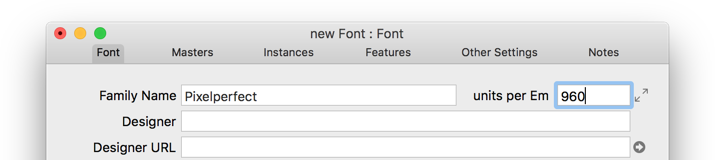
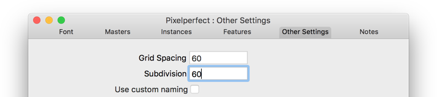
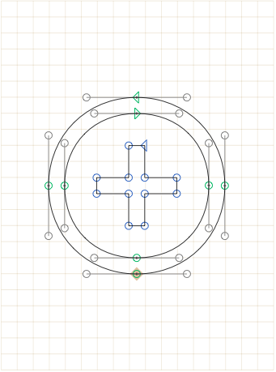
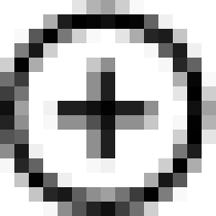

原文: [Pixel perfection](https://glyphsapp.com/learn/pixel-perfection)
# ピクセルパーフェクション

チュートリアル

執筆者: Rainer Erich Scheichelbauer

[ en ](https://glyphsapp.com/learn/pixel-perfection) [ zh ](https://glyphsapp.com/zh/learn/pixel-perfection)

2022年8月17日更新（初版公開：2012年12月19日）

Webフォントを準備していますか？それとも画面上で使用されるアイコンフォントですか？もしそれが表示されるピクセルサイズを制御できるなら、この記事はあなたのためです。

フォントはベクターでできていますが、コンピュータの画面にはピクセルがあります。フォントが画面に表示されるとき、ベクターはラスタライズされます。これは、ベクターをピクセルグリッド上に配置することによって行われます。ベクターの内側に完全に収まるピクセルは黒く、外側にあるピクセルは白く、またはあなたの前景色と背景色が何であれその色になります。アウトライン上のピクセルは、アンチエイリアシングが適用されている限り、何らかのグレーの色合いになります。ヒンティングはいくらか効果がありますが、基本原理は同じです。

## ピクセルサイズの計算

さて、画面上の実効フォントサイズは、PPM（pixels per em）値によって決まります。この値は、驚くべきことに、1emあたりに何ピクセルが使用されるかを教えてくれます。Glyphsはすべてのサイズをユニットで測定します。UPM（units per em）値は、1emあたりに何ユニットがあるかを教えてくれます。

したがって、1ピクセルが何ユニットを表すかを知りたい場合は、フォントが画面上で使用されるサイズ、つまりPPMと、フォントファイルの座標解像度、つまりUPMを知る必要があります。次に、UPMをPPMで割れば、ピクセルのユニットサイズがわかります。それはとても簡単です。もし結果の値がきれいな整数でない場合は、フォント情報（Cmd-I）でUPMを変更したいと思うかもしれません。

*   **例1**
    フォントを20スクリーンピクセルのサイズで使用する場合、PPM=20となります。デフォルトのUPM値は1000です。思い出してください：UPM÷PPM=1ピクセルのサイズ、したがって画面上の1ピクセルは、グリフ内で1000÷20=50ユニットに相当します。

*   **例2**
    フォントを16スクリーンピクセルのサイズで使用する場合、PPM=16となります。デフォルトのUPM値は依然として1000なので、計算すると1000÷16=62.5となり、あまり良い数値ではありません。どうしましょうか？心配しないでください、まずもっと良い数値を見てみましょう。私は62.5の代わりに60を提案します。なぜなら、それに近く、キリの良い数字だからです。さて、フォント情報（Cmd-I）を開き、UPM値を（サイズ×PPM=）60×16=960に変更します。

元の1000という値からあまり離れすぎないように注意してください。アプリケーションによって、許容されるUPMが異なるようです。経験上、3000 UPMあたりから厄介になり始めます。

フォント情報にいるついでに、「その他の設定」に進み、「グリッドステップ」と「細分化」の両方をピクセルサイズに設定すると良いでしょう。

## ピクセル精度での描画

 अब、Glyphsでシェイプを描画すると、背景にグリッドが表示され、指定されたPPMでの実際のスクリーンピクセルを示します。そのグリッドに従えば、選択したPPMとそのすべての倍数で出力がピクセルパーフェクトになります。例えば、PPM=16で描画すれば、32、48、64、80 PPMのサイズでも見栄えが良くなります。

これが、上のシンボルを16 PPMで表示したものです。

もちろん、他のほとんどのサイズではピクセルパーフェクトにはなりません。ネイティブでない画面解像度を選択したユーザーや、ズームを使用するユーザーは、私たちが血と汗と涙を流して費やしたピクセルパーフェクションを見ることはありません。ですから、例えばこれが同じ描画を21 PPMで表示したものです。

しかし、人々に私たちのベクターに好ましい設定を使うよう強制することはできないので、ピクセルパーフェクションはここまでです。残念ながら。

## Retinaディスプレイを使っている方へ

[AppleのRetinaディスプレイ](http://en.wikipedia.org/wiki/Retina_Display)のような高解像度スクリーンの登場により、画面に最適化する必要性は薄れつつあります。いずれにせよ、HDモニターにはこれ以上の最適化は必要ありません。そして、デスクトップディスプレイでは、高ピクセル解像度だけが重要ではありません。フォントは[サブピクセルレンダリング](http://en.wikipedia.org/wiki/Subpixel_rendering)も利用しており、これにより実質的に水平解像度が3倍になることを覚えておいてください。3倍です！

しかし、これは私たちにとって何を意味するのでしょうか？ピクセルパーフェクトなGIFやPNGがRetinaディスプレイでどのように見えるか、気づいたことはありますか？[そう、ぼやけて見えますよね](http://coding.smashingmagazine.com/2012/08/20/towards-retina-web/)。それらをSVGやWebフォントに置き換えることで、ピクセル化されたアイコンの必要性をなくし、実質的にRetinaディスプレイ用と非Retinaディスプレイ用の余分なバージョンを作成する手間を省くことができます。さらに、ウェブサイトで多くのアイコンを使用する場合、Webフォントは多くの帯域幅を節約できます。ダブルウィン、ハイタッチ！

---

更新履歴 2012-12-19: いくつかの誤字を修正し、「at any other size」を「at most other sizes」に変更。

更新履歴 2022-08-16: 軽微なフォーマット変更。