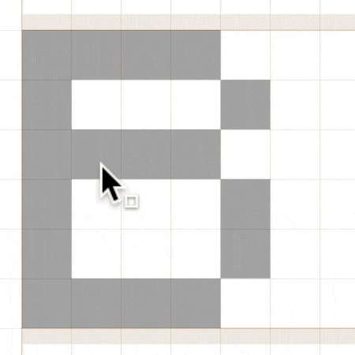
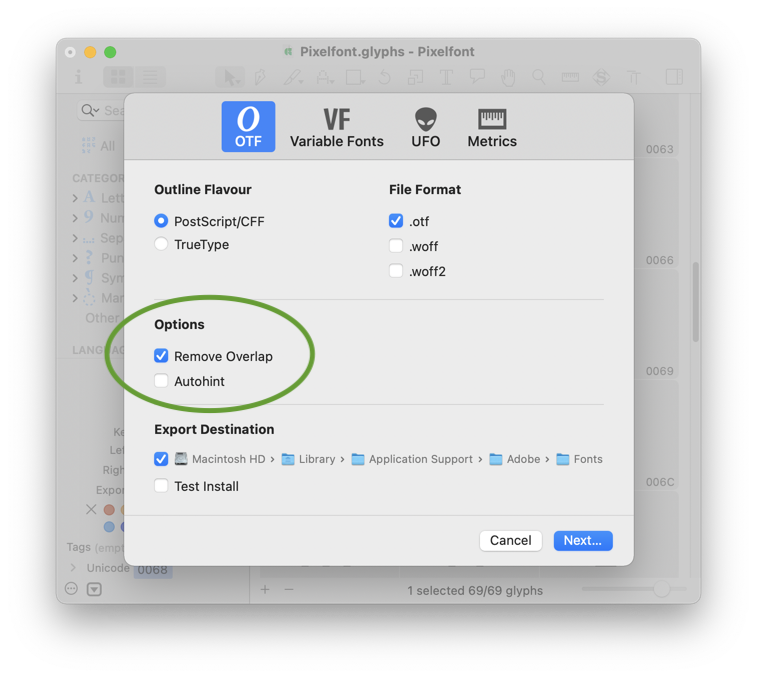

原文: [Creating a pixel font](https://glyphsapp.com/learn/pixelfont)
# ピクセルフォントの作成

チュートリアル

[ シェイプの再利用 ](https://glyphsapp.com/learn?q=reusing+shapes)

執筆者: Rainer Erich Scheichelbauer

[ en ](https://glyphsapp.com/learn/pixelfont) [ fr ](https://glyphsapp.com/fr/learn/pixelfont) [ zh ](https://glyphsapp.com/zh/learn/pixelfont)

2022年7月27日更新（初版公開：2016年4月19日）

ピクセルフォントの作成は、書体デザインを始めるのにとても楽しい方法です。それに、コツをつかめば本当に簡単です。

## 新しいフォントを始める

まず、Glyphsを開き、「ファイル > 新規（File > New）」（Cmd-N）を選択して、新しいフォントドキュメントを作成します。さて、文字の作成を始める前に、「ファイル > フォント情報（File > Font Info）」（Cmd-I）に進み、フォントに何か印象的な名前を付けましょう。私たちはとてもクリエイティブなので、「Pixelfont」と名付けます。

次に、「その他」タブを選択すると、「グリッドの間隔（Grid Spacing）」のオプションがあります。「グリッドの間隔」の値は、座標がどのように丸められるかを定義します。デフォルト値は1です。ピクセルフォントの場合、すべてのツールとすべての変更が常にグリッドにスナップするようにしたいため、より高い値を設定します。これにより、フォント内の「ピクセル」が自動的に正しい位置に配置されるようになります。「グリッドの間隔」を50フォントユニットに設定しましょう。

なぜグリッドステップを50にするのでしょうか？要するに、50は1000（UPM、units per emとも呼ばれる）という全体のタイプサイズをうまく割り切ることができ、特定のサイズでピクセルパーフェクトなレンダリングを提供するため、50を選びます。これについては私を信じるか、計算してみてください。

> *タイプスクリーンのサイズ計算：* スクリーンのサイズはPPM（pixels per em）で測定されます。1emに1000ユニットが含まれている場合、これはデフォルトのUPM（units per em）値ですが、（1000÷50=）20ピクセルが1emに収まります。言い換えれば、1フォントピクセルは20 PPMで正確に1スクリーンピクセルになります。72 ppi（pixels per inch）のスクリーン解像度の場合、（20 PPM ÷ 72 ppi × 72 points in an inch =）20ポイントです。これはMacやAdobeアプリで想定されるデフォルトの解像度です。Windowsでは、96 ppiで計算するため、（20÷96×72=）15ポイントで20 PPMに達します。

## ピクセルを描く

フォントビュー（Cmd-Opt-1）で、ウィンドウの左下にあるプラスボタンをクリックして新しいグリフを追加します。名前（*newGlyph*）をダブルクリックして単語全体を選択し、`pixel`に名前を変更します。

グリフエリアをダブルクリックして、新しい編集タブでグリフを開きます。グリッド設定に応じたグリッドが表示されます。ツールバーから「長方形」ツール（FまたはShift-F）を選択し、グリッドの1マスとまったく同じ幅と高さの長方形を描きます。パスが自動的にグリッドにスナップすることに気づくでしょう。ベースラインが左サイドベアリングと交差する原点に正方形を描きます。

キャンバスのどこかを右クリックしてコンテキストメニューを開きます。「書き出し（Export）」オプションのチェックを外します。私たちの`pixel`は、いずれにせよ入力できないし、最終的なフォントで帯域幅を無駄にするだけなので、書き出したくありません。

ピクセルフォントに必要なパスは、文字通りこれだけです。さて、本題に移りましょう。

## グリフを作成する

作成した`pixel`グリフの編集タブを閉じ、フォントタブに戻ります。すぐに表示されない場合は、Cmd-Opt-1を押してください。さて、文字までスクロールアップし、編集したい文字をダブルクリックします。私は、`A`から始めることにします。上部のツールバーで、「ピクセル」ツールを選びます。これは「鉛筆」ツールの後ろに隠れているので、それを1秒間クリックし続け、表示される選択肢から「ピクセル」ツールを選びます。

### 旧バージョン
Glyphs 2を使用している場合は、「ウインドウ > プラグインマネージャ」からピクセルツールをインストールする必要があります。

さて、キャンバスをクリックしてピクセルを追加するか、ピクセルツールをクリック＆ドラッグして一度に多くのピクセルを追加します。既存のピクセルをクリック（またはクリック＆ドラッグ）すると、再び削除できます。

ベースライン、つまり下から2番目の水平線上に文字を描きます。もし水平線が見えない場合は、「表示 > メトリクスを表示（View > Show Metrics）」（Cmd-Shift-M）をオンにしてください。表示されるプレースホルダーの文字のサイズは気にしないでください。それは大きすぎます。ピクセルに集中してください。Cmd-プラスまたはマウスでOpt-スクロールしてズームインすることを検討してください。

Aの形に満足しましたか？それでは、ツールバーの最初のツールである「選択」ツール（V）に切り替え、「編集 > すべてを選択（Edit > Select All）」（Cmd-A）ですべてのピクセルを選択し、情報パネルで選択範囲の*高さ*を確認します。

私の場合は300です。あなたの数字は違うかもしれません。測定した高さが何であれ、「ファイル > フォント情報（File > Font Info）」（Cmd-I）に進み、「マスター」タブに切り替え、「メトリクス > キャップハイト」にその値を入力します。

「フォント情報」ウィンドウを閉じ、編集ビューのAに戻ります。文字の上部に、キャップハイトを表すメトリクスラインが表示されているのがわかります。これは、後続のすべての大文字を正しい高さに作成するのに役立ちます。他の文字といえば、「表示 > ナビゲーション > 次のグリフを表示（View > Navigation > Show Next Glyph）」（Endキーまたはfn-右矢印）で次のグリフに切り替えます。もし戻る必要がある場合は、同じサブメニューから「前のグリフを表示（Show Previous Glyph）」（Homeキーまたはfn-左矢印）を選びます。

小文字にたどり着いたら、エックスハイト、アセンダー、ディセンダーでこのプロセスを繰り返します。

## 編集する

ピクセルグリフを編集するために、「選択」ツール（ショートカットV）を使うこともできます。ピクセルをクリック＆ドラッグするだけで、移動させることができます。

ピクセルがグリッドにスナップすることに注意してください。Optionキーを押しながらピクセルを動かすと、複製できます。

技術的には、ピクセルはいわゆる、元のパスベースのグリフ`pixel`のコンポーネントです。つまり、「選択」ツールでの通常のドラッグ選択は機能しません。なぜなら、アウトラインのノードしかドラッグ選択できず、コンポーネントはできないからです。しかし、ドラッグ選択中にOptionキーを押し続けると、選択矩形に触れたコンポーネントが選択されます。

ちなみに、投げ縄選択でも同様です。もしクリップボード操作の方が好きなら、カット、コピー、ペーストもでき、マウスの代わりに矢印キーでコンポーネントを移動させることもできます。

## スペーシングを一括編集する

これまでに作成したものを見てみましょう。「テキスト」ツール（ショートカットT）に切り替えて、アルファベットを入力します。うーん、何かがおかしいですね。

正直に言うと、デフォルトのグリフ幅は600ユニットで、あまり見栄えがよくありません。「編集 > すべてを選択」（Cmd-A）ですべてを選択すると、グレーの情報パネルで左サイドベアリング（LSB）は0ですが、各グリフの幅（アドバンス幅とも呼ばれる）と右サイドベアリング（RSB）は「複数値」と表示されます。これは「Multiple Values」を意味するはずです。右サイドベアリングをピクセル1つ分の幅、この場合は50で上書きしましょう。

### ヒント
幅とサイドベアリングに関する詳細は、[スペーシングに関する詳細なチュートリアル](spacing.md)で読むことができます。

Returnキーを押して入力を確定すると、ずっと見栄えが良くなります。選択したすべてのグリフのスペーシングを一度に修正したのがわかりますか？かなりクールです。フォントビュー（Cmd-Opt-1）でも、左下の情報パネルを使って一括編集できます。

ここに入力したものは、選択されたすべてのグリフに適用されます。

## ピクセルのバリエーション

ピクセルとして正方形ではなく円が欲しいとします。それも可能です。フォントビュー（Cmd-Opt-1）に戻り、ピクセルグリフを複製しましょう。それには、それを選択して「グリフ > グリフを複製」（Cmd-D）を選びます。`pixel`と`pixel.001`ができ、後者が自動的に選択されます。Returnキーを押すと…

…その名前を`pixel.square`に変更し、再度Returnキーを押して確定します。

これが私たちの正方形ピクセルのバックアップになります。さて、元の`pixel`を編集できます。それをダブルクリックして新しい編集タブで開き、「円」ツール（FまたはShift-F、これは「長方形」ツールの後ろに隠れているかもしれません）で円を押し込んでみましょう。おっと。

何が起こったのでしょうか？論理的に考えてみてください。私たちはグリッドを定義し、すべてのアウトライン上のすべてのノードがそのグリッドにスナップするようにしました。ですからもちろん、私たちの円のノードもグリッドにスナップし、円はこの面白い形に変形してしまいました。一つ明らかなことは、グリッドを調整する必要があるということです。しかし、どうやって？

正方形はグリッドユニットの角にノードがありますが、円はグリッドのエッジの*中間*にノードがあります。言い換えれば、各グリッドステップを2つの半分に細分化する必要があります。偶然にも、私たちのフォントにまさにそれをさせる方法があります。「ファイル > フォント情報」（Cmd-I）を開き、「その他」タブに切り替えます。そこで、「細分化（Subdivision）」の値を2に変更します。

 अब、その円をもう一度描いてみましょう。そして、見てください。

これです。（オンカーブ）ノードは細分化されたグリッド上に保たれ、（オフカーブ）ハンドルはグリッドに縛られません。円の曲率を「カーブをフィット」パレット（Ctrl-Opt-1から8）で調整し、より四角っぽくしたり、より菱形っぽくしたりすることもできます。いずれにせよ、その隣に単語を入力すれば、すぐに結果を見ることができます。

クールですね。もし形を決められない場合は、それらをすべて保持できます。単に`pixel`グリフを複製し、説明的な接尾辞を付けるだけです。しかし、待ってください、どうやってすべての異なるピクセルシェイプを持ち、プレビューし、書き出すのでしょうか？簡単です、「ファイル > フォント情報」（Cmd-I）でインスタンスを設定しますが、今回は「書き出し」タブに切り替えます。新しいインスタンスを追加します。

### 旧バージョン
Glyphsの古いバージョンでは、フォント情報の「書き出し」タブは「インスタンス」と呼ばれていました。

…そして、その「スタイル名」を「Circle」に変更します。別のインスタンスを追加し、「Square」と名付けます。すでにもっと多くのピクセルがある場合は、ピクセルシェイプごとに1つのインスタンスを追加し、以下の手順を同様に行ってください。私は今のところ、この2つに留めておきます。

私の場合、「Circle」という名前のインスタンスは、デフォルトの`pixel`を使用しており、その中には円のシェイプが入っているため、すでに正しいシェイプになっています。しかし、「Square」インスタンスでは、正方形のピクセルであるべきところに同じ円があります。そこで、そのインスタンスに2つのピクセルシェイプを交換するように指示しましょう。そのためには、新しいカスタムパラメータを追加し、「Rename Glyphs」というパラメータを探します。

クールですね、ドキュメントがすぐに手に入ります。自由に読んでみてください。（あるいは、今言われていることをやるだけです。読みたくない人々の運命ですね、はっはっは。）「追加」ボタンを押すか、Returnキーを押してパラメータを確定します。さて、お察しの通り、「値を編集するにはここをクリック」と表示されているカスタムパラメータをクリックすると、テキスト入力フィールドが表示されます。そこに、`pixel=pixel.square`と入力します。

これが、Glyphsに2つのピクセルシェイプを交換するように指示するコードです。OKを押して確定します。おめでとうございます、2つのインスタンスが設定されました。テストの時間です。読み進めてください。

## サイズを調整する

「ウインドウ > テキストプレビュー」を開き、「Square」インスタンスと好きなフォントサイズを選んで、タイピングを始めましょう。

うわっ、これは何だ！行の間に1キロメートルも空いているようで、文字が小さすぎます。これは、私たちがピクセルフォントを、通常のフォントがデフォルトとするサイズよりもはるかに小さいサイズでデザインしているためです。しかし、ファイルに異なるサイズであることを伝えることができます。「ファイル > フォント情報」（Cmd-I）に進み、「フォント」タブを選びます。そこで、「Units per Em」（UPM）の値を調整します。私の場合、デザインは通常のフォントのサイズの約30%を占めるので、UPM値を1000から300に変更します。

もう一度Returnキーを押して入力を確定するのを忘れないでください。さて、「ウインドウ > テキストプレビュー」をもう一度試してみましょう。

ずっと良くなりました。もしかしたら少し大きすぎるかもしれませんが。でも急ぐ必要はありません。後で他のフォントと比較しながら、UPM値を微調整できます。

## フィルタで後処理する

> **ヒント：** これから続くクールなことのために、デフォルトの`pixel`が正方形であり、「Circle」インスタンスに`Rename Glyphs`カスタムパラメータがあることを前提とします。しかし、円をデフォルトのピクセルとして保持したい場合は、以下で説明するインスタンスに上記と同じ`Rename Glyphs`パラメータを追加する必要があります。

もしフォントで少し実験したいなら、「フィルタ」メニューにある内蔵のフィルタをいくつか試すことができます。さて、まずはピクセルフォントのグランジバージョンから始めて、「フィルタ > 荒らす」を選びましょう。（もし文字のいずれかを選択していた場合、それらが突然消えるのが見えるかもしれません。心配しないでください、それはフィルタがパスにしか機能しないという一時的な副作用です。今は無視してください。）しかし、今やるべきことは、ダイアログにいくつかの数値を入力し、OKを**押さない**ことです。代わりに、左下のボタンで小さなメニューを開き、「カスタムパラメータをコピー」を選びます。

次に、「キャンセル」ボタンを押します。これで、フィルタがクリップボードに、カスタムパラメータの形でコピーされました。では、これをどうするのでしょうか？そうです、ペーストします。「ファイル > フォント情報」（Cmd-I）に進み、「書き出し」タブを開き、プラスボタンで新しいインスタンスを追加し、「Grunge」のような説明的な「スタイル名」を付けて、ペースト（Cmd-V）します。

そして、ほら、「カスタムパラメータ」の下に、先ほどフィルタUIで構築したものが、`Filter`パラメータのコードとして表現されているのがわかります。カスタムパラメータとは、書き出し時にフォントに加えられる変更のことです。あらゆる種類のパラメータが利用可能です。そして、`Filter`パラメータは、通常はメニューコマンド経由で選択範囲に適用するようなアクションを、書き出し時にフォント全体に適用します。

### プロのヒント
`Filter`パラメータは、すべてのコンポーネントがアウトラインに分解された*後*に適用されます。もしフィルタを分解前に適用したい場合は、代わりに`PreFilter`パラメータを使用してください。

期待通りに機能するかどうか、プレビューパネルまたは「ウインドウ > テキストプレビュー」で見てみましょう。

初めにしては悪くありません。各ピクセルが個別に荒らされているのがわかります。これは、各ピクセルコンポーネントが別々のアウトラインに分解され、その後「荒らす」フィルタが適用されるためです。

もしフィルタをシェイプ全体に適用したい場合は、ピクセル間の境界線を削除する必要があります。これはオーバーラップの削除として知られています。言い換えれば、別のカスタムパラメータを挿入する必要がありますが、今回は「パス > オーバーラップを削除」に対応するフィルタです。簡単です。「フォント情報 > 書き出し」で、インスタンスを選択した状態で、別のパラメータを追加するためにプラスボタンを押し、「フィルタ」を選び、パラメータ値として`RemoveOverlap`と入力（またはフィルタの説明からコピーしてペースト）します。最後に、「オーバーラップを削除」フィルタが「荒らす」フィルタの前に来るようにしてください。

### 旧バージョン
Glyphs 2以前では、「オーバーラップを削除」は「フィルタ」メニューにありました。

結果を見てみましょう。

ずっと良くなりました。でも…あなたはどうかわかりませんが、斜めの部分が気になります。KやCの右側のピクセルは、まだつながっていません。ピクセルが先端で触れているだけなので、オーバーラップ除去のアルゴリズムはそこでシェイプを接続しませんでした。

もっとパラメータを使えば、これを解決できるでしょうか？もちろんです。私たちが必要なのは、オーバーラップ除去アルゴリズムに何か材料を与えること、つまり実際にオーバーラップを作成することです。パスを少しオフセットさせてピクセルを大きくし、互いに重なるようにしてから、オーバーラップを削除し、その後「荒らす」フィルタを適用する前に、パスを再び元のサイズに戻すことで、それができます。今、私と同じくらい混乱していますか？恐れることはありません、ここに概要があります。

左側は上記で行ったことで、結果は分離したピクセルです。右側は、これから試す戦略です。そして、やり方はこうです。「フィルタ > パスをオフセット」を選び、パスを5ユニットオフセットするように設定します。

…そして再び、**適用しないでください。** 左下の小さなメニューからカスタムパラメータをコピーし、ダイアログをキャンセルするだけです。

さて、もうやり方はお分かりですね。「パスをオフセット」パラメータをインスタンスにペーストし、「オーバーラップを削除」パラメータの直前に移動させます。そして今、私を信じてください。もう一度ペーストし、2番目の「パスをオフセット」パラメータを「オーバーラップを削除」パラメータの直後に移動させ、そのコードをクリックして`5;5`と書かれている部分を`-5;-5`に変えます。だいたいこんな感じです。

何をしたのでしょうか？最初の「パスをオフセット」ディレクティブは、すべてのピクセルを少し膨らませ、フォントを太くしますが、現時点ではそれは望んでいません。したがって、オーバーラップ除去の後に、同じ量だけ、ただし逆方向に、再び縮小させる必要があります。それが、2回目にマイナス5がある理由です。

うまくいったか見てみましょう。

はい。ハイタッチ！ご存知の通り、「荒らす」だけが使えるフィルタではありません。「角を丸める」フィルタも非常に人気があります。そこで、「ファイル > フォント情報 > 書き出し」で、「Rounded」という別のインスタンスを作成しましょう。そして、上記で学んだことから、シェイプを適切に丸めるために何をすべきかはすでにわかっています。したがって、私たちの戦略は次のいずれかになります。

繰り返しになりますが、斜めの線が切断されたくないので、右側の方法を選びます。そこで、「フィルタ > 角を丸める」を呼び出し、ピクセルサイズの半分より小さい半径を入力し（ピクセルは連続する角で丸められる可能性があるため）、「視覚補正」をオンにし、小さなメニューからパラメータをコピーし、ダイアログをキャンセルして、そのパラメータを「Rounded」インスタンスにペーストします。他のパラメータ、「オーバーラップを削除」と「パスをオフセット」は、「Grunge」インスタンスからコピー（Cmd-C）し、「Rounded」インスタンスにペースト（Cmd-V）します。その後、パラメータを正しい順序にドラッグします。したがって、カスタムパラメータに変換すると、私たちの丸めプロセスは次のようになります。

理にかなっていますよね？それでは、私たちの努力の成果を収穫し、プレビューで結果を確認しましょう。

うんうん。待てよ。内側の角はどうなっているんだ？フィルタは外側の角しか丸めていない。どうして？さて、あなたはGlyphsの隠れた宝石の一つに遭遇しました。ダイアログとは異なり、カスタムパラメータは内側と外側の角を区別します。正の半径値は外側の角にのみ適用され、負の半径値は内側の角用です。

クールですね。では、最後に負の半径を持つ別の「角を丸める」パラメータを追加するだけです。そして、ヒントですが、内側の半径が実際には少し小さい方が見栄えが良くなります。

そして、それをテストにかけてみましょう。

これだよ、うんうん、うんうん、これが好きなんだ、うんうん、うんうん。OK、これで火がつきました。フィルタで他に何ができるだろう？たくさんあります。そして、内蔵のフィルタだけでなく、「ウインドウ > プラグインマネージャ」にはサードパーティのフィルタもたくさんあります。時間をかけて、利用可能なものを閲覧してみてください。しばらく前にフィルタを見たことがある場合でも、常に新しいフィルタがプラグインマネージャに追加されているので、もう一度見る価値があります。

私のお気に入りの例を一つ挙げます。「Cut and Shake」フィルタです。

そうです、まるであなたのグリフのためのサムライの刀です、シュッシュッ！素晴らしい。もしフィルタの説明を見る気があるなら、実際には他にもいくつかできることがあります。実際には3つの操作が1つになっています。ランダムなスライス、スライスされたグリフ粒子のランダムな回転、そして最後に粒子のランダムな移動です。これらのうち1つだけを行うこともできます。例えば、ピクセルを*動かす*だけで、切ったり回転させたりはしないように。

そして、このようになります。

はは、すべてのピクセルが揺さぶられていますね。クールです。 अब、追加のパラメータや、異なる値を持つ複数のインスタンスの可能性をすべて考えてみてください。はは、今夜は眠れなくなりますよ。

もちろん、内蔵のフィルタとサードパーティのフィルタを組み合わせることもできます。これは、内蔵の「ハッチアウトライン」フィルタと、「プラグインマネージャ」の「小さいパスを削除」を組み合わせた設定です。

ハッチング後に最も小さいパスを削除するのは良い考えです。なぜなら、「ハッチアウトライン」フィルタは、非常に小さいビットやピースをいくつか作成する可能性があるからです。そして、それらはあまりにも気を散らすので、削除してしまえば、きれいにハッチングされたシェイプが得られます。

そして今、上でピクセルに使ったのと同じ「Cut and Shake」パラメータを持ち込んでみましょう、はは。

とてもクールですね。さて、何時間でも続けられますが、この時点で、自分で探求する方がずっと楽しいと思います。楽しんでください！

## 書き出し

「ファイル > 書き出し」でフォントを書き出す際は、OTFオプションを選び、「オーバーラップを削除」を選択しますが、「オートヒント」オプションは無効にします。

後処理されたインスタンスのほとんどは、[複雑なアウトライン](creating-fonts-with-complex-outlines.md)を持つフォントとしてカウントされることを覚えておいてください。つまり、特定のフォントテクノロジーは機能しません。なぜなら、それらは通常の可読性の高い書体に最適化されており、私たちが作成したのはまさにそれではないからです。要するに、ヒンティングを避け、サブルーチン化を無効にします。「ファイル > フォント情報 > フォント」に「サブルーチンを無効にする」パラメータを追加することをお勧めします。

最も重要なことは、**未完成のフォントをmacOSにインストールしないこと**です。フォントキャッシュの問題に*必ず*直面します。まだ読んでいない場合は、今すぐ[フォントキャッシュの問題を解消するチュートリアル](eliminating-font-cache-problems.md)を読んでください。Adobeアプリでテストする場合は、代わりに[Adobe Fontsフォルダを使用する](testing-your-fonts-in-adobe-apps.md)ことを検討してください。

## 便利なプラグインとスクリプト

「ウインドウ > プラグインマネージャ」には、「Pixelate」フィルタもあります。これは、ピクセルコンポーネントを挿入し、幅をリセットし、アウトラインを背景に移動させることで、アウトライングリフをピクセルグリフに変えます。

Glyphsには、ピクセルフォントに役立つ便利なスクリプトがいくつかあります。[mekkablue scripts](glyphsapp3://showplugin/mekkablue%20scripts)には、ピクセルフォント専用のサブメニューがあります。詳細とインストール手順については、[リポジトリのreadme](https://github.com/mekkablue/Glyphs-Scripts#pixelfonts)をご覧ください。

いつものように、インストールするプラグインやスクリプトでは、必要なすべてのモジュールもインストールされていることを確認してください。[「Glyphsを拡張する」チュートリアルでそれについて読んでください](extending-glyphs.md)。

---

更新履歴 2016-09-05: プラグインマネージャーを追加。

更新履歴 2020-02-17: ピクセルフォント用のプラグインを追加。

更新履歴 2021-09-21: Glyphs 3向けに更新。

更新履歴 2022-01-02: Glyphs 3向けに新しいスクリーンショットを使い書き直し。

更新履歴 2022-01-03: 「書き出し」の章を追加。

更新履歴 2022-07-27: タイトルの大文字小文字の扱いを更新。

## 関連記事

[すべてのチュートリアルを見る →](https://glyphsapp.com/learn)

*   ### [Glyphs Miniでピクセルフォントを作る](creating-a-pixel-font-in-glyphs-mini.md)

チュートリアル

[ Glyphs Mini ](https://glyphsapp.com/learn?q=glyphs+mini)