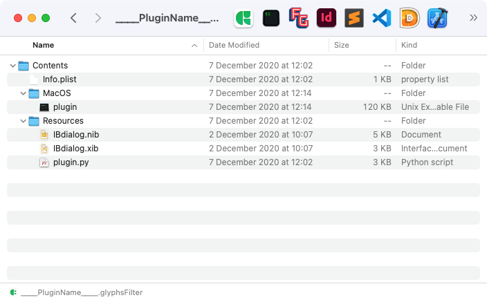
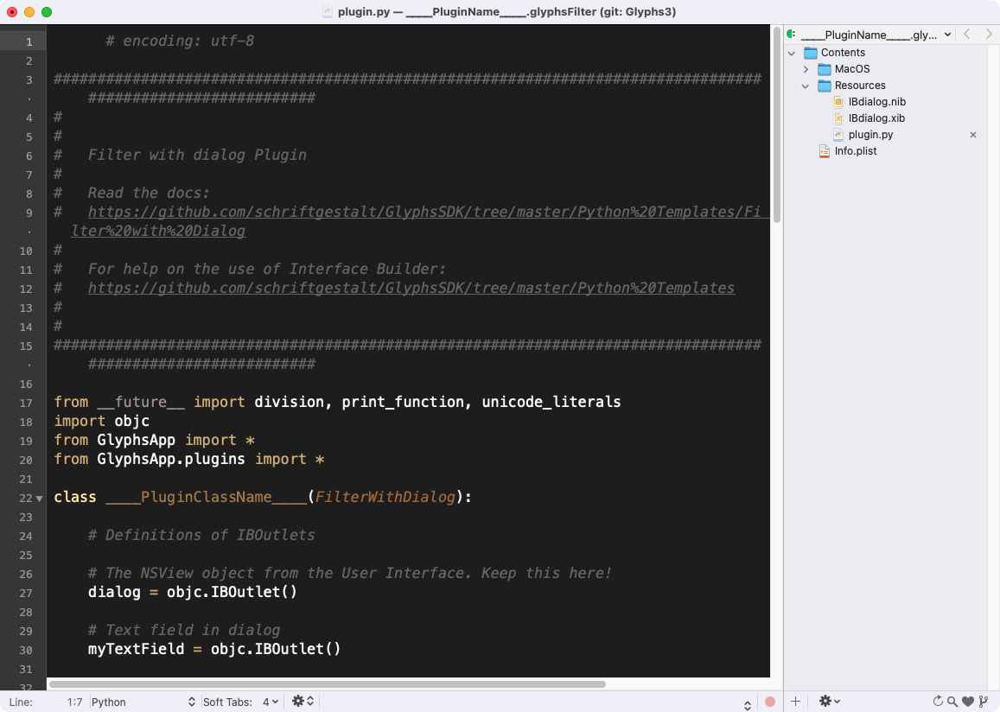
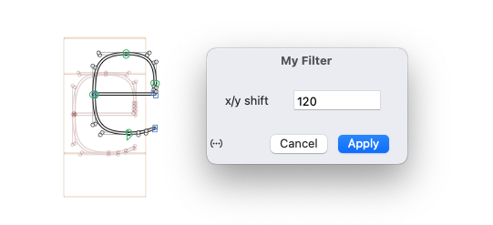
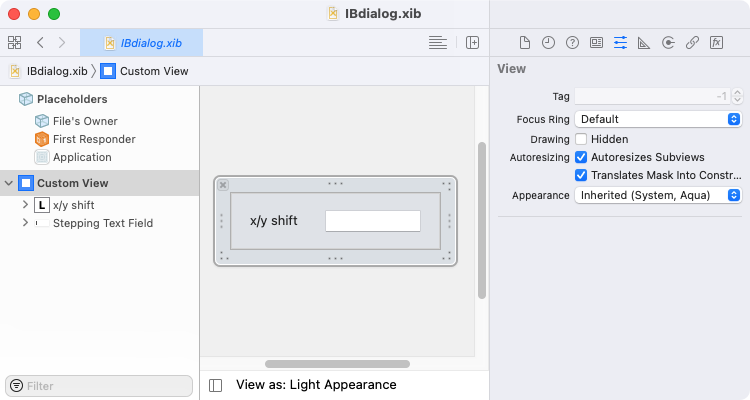

原文: [Writing plug-ins](https://glyphsapp.com/learn/plugins)
# プラグインを作成する

チュートリアル

[ スクリプト ](https://glyphsapp.com/learn?q=scripting)

執筆者：

[ en ](https://glyphsapp.com/learn/plugins) [ zh ](https://glyphsapp.com/zh/learn/plugins)

2025年1月30日更新（初版公開：2016年1月11日）

プラグインは、通常サードパーティから提供される、ソフトウェアアプリケーションに追加機能を提供します。この概要では、Glyphs 2.3以降のプラグイン開発について説明します。恥ずかしがらずに、美味しいコーヒーを一杯用意して、リラックスしてください。あなたより先に、他の人もやっているのですから。

プラグインは、通常サードパーティから提供される、ソフトウェアアプリケーションに追加機能を提供します。このチュートリアルでは、プラグイン開発の進め方の概要を説明します。詳細な説明は、[GlyphsSDKリポジトリ](https://github.com/schriftgestalt/GlyphsSDK)の`Readme.md`ファイルにあります。

恥ずかしがらずに、美味しいコーヒーを一杯用意して、リラックスしてください。あなたより先に、他の人もやっているのですから。

## ステップ1：プラグインのテンプレートを入手する

私たちは、様々な目的（ファイル書き出し、カスタムアウトラインフィルタなど）のためのプラグインの骨組みをGitHubページで提供しています。もしすでにGitに慣れているなら、お気に入りのバージョン管理アプリ（[Git自身のもの](https://desktop.github.com)や、[他にも多くのアプリがあります](http://www.slant.co/topics/465/~git-client-for-mac-os-x)）でフォルダ構造をチェックアウトすると良いでしょう。*Subversion*クライアントですが、[Versions.app](http://versionsapp.com)はこのチュートリアルの著者の推薦です）。

### プロのヒント
コードのバージョン管理システムに慣れておきましょう。後で仕事の様々な分野で役立ちます。

もしコードバージョン管理の概念にあまり慣れていない場合でも、他の人のコードの購読者としてだけでも、[Glyphs SDKメインページ](https://github.com/schriftgestalt/GlyphsSDK)からGlyphs SDK（ソフトウェア開発キット）全体を含むZIPファイルをダウンロードすることもできます。

さて、私たちのSDKページはこちらです：[https://github.com/schriftgestalt/GlyphsSDK/tree/Glyphs3](https://github.com/schriftgestalt/GlyphsSDK/tree/Glyphs3)、そしてプラグインのテンプレートは[Python Templates](https://github.com/schriftgestalt/GlyphsSDK/tree/Glyphs3/Python%20Templates)というサブフォルダにあります。そこには、あなたが生命を吹き込むのを待っているプラグインの骨組みがあります。これらのプラグインテンプレートにはそれぞれ、理解を深めるための完全に機能するサンプルコードが含まれています。

*   *File format:* 独自のフォントフォーマットを書き出す
*   *Filter without dialog:* フィルタメニューまたは書き出し時にフォントを変更する
*   *Filter with dialog:* 上記と同じですが、ユーザーインターフェースダイアログを使用します
*   *General plug-in:* 特別な目的はありません。何が起こるか見てみましょう
*   *Palette:* サイドバーにパレットビューを追加する
*   *Reporter:* 編集ビューとプレビューに描画して、グリフの特徴を説明する
*   *Select Tool:* 選択ツールを独自の機能で強化する

Glyphs.appでは、プラグインはMacのいわゆる*パッケージ*の形で提供され、Glyphsの*Plugins*フォルダ（`~/Library/Application Support/Glyphs/Plugins`にあります。`~`はユーザーアカウントのホームフォルダを表します）に入れる必要があります。アプリのアイコンにドラッグするか、ダブルクリックすると、Glyphsが自動的にそこに配置します。これらのパッケージはFinderでは単一のファイルのように見え、動作しますが、実際にはフォルダであり、その内容はFinderでそのようなパッケージを右クリックし、「パッケージの内容を表示」を選択することでアクセスできます。

このようなプラグインのフォルダ構造は次のようになります。あなたの主なコードは`Contents/Resources/plugins.py`ファイルに入ります。他に注目すべきファイルは、プラグインに関する様々な情報を保持する`Info.plist`と、ダイアログを持つプラグインでは、ユーザーインターフェースダイアログビューを含む2つの`.nib`/`.xib`ファイルです。



多くの現代的なテキストエディタは、フォルダ全体を一度に開くこともでき、サイドパネルに編集するファイルのツリービューを提供します。したがって、`.glyphsFilter`ファイルパッケージ全体をテキストエディタで一度に開くことができます。



現在、この目的で最も人気のあるテキストエディタは、[TextMate](http://macromates.com)、[SublimeText](http://www.sublimetext.com)、または[Visual Studio Code](https://code.visualstudio.com/)です。

## ステップ2：いくつかの`____Names____`をリネームする

GitHubリポジトリの[Python Templates](https://github.com/schriftgestalt/GlyphsSDK/tree/Glyphs3/Python%20Templates)ページには、プラグイン内のファイル構造の設定方法に関する詳細情報が含まれています。4つのアンダースコアを含むすべてのもの（`____PluginClassName____`など）を、最大3つのファイルでリネームする必要があります。

プラグイン名については、2つの異なる名前のバリエーションを扱います。

*   `____PluginName____`は、人間が読める名前で、Glyphsの「環境設定」ウィンドウの「プラグイン」タブのような場所に表示されます。この名前には、スペースやUnicode文字を含めることができます。
*   `____PluginClassName____`は、あなたのコード内のPythonクラスの機械が読める名前で、いくつかの場所に配置する必要があります。これは一意である必要があります。同じクラス名を持つ2つのプラグインを隣り合わせてインストールすることはできません。「機械が読める」と書きましたが、プラグインのユーザーがこのクラス名を目にする相互作用が1つあります。ファイル書き出し時にカスタムパラメータを介してフィルタを呼び出す場合です。ですから、親しみやすくユニークな名前にしてください。ここではASCII文字のみが許可され、スペースは許可されません。`PascalCaseNames`（先頭が大文字のキャメルケース）をお勧めします。

`Info.plist`のセクションは、Glyphsにあなたのプラグインの更新場所を知らせ、プラグインが古くなったときにユーザーに通知できるようにします。これが機能するためには、現在のバージョン番号を含むオンラインの`Info.plist`へのURLを入力する必要があります。これは手動で編集されたファイルでも、オンラインショップから自動生成されたファイルでも、ダウンロード可能なプラグイン内のまさにその`Info.plist`でも構いません。

もし配布に[GitHub](https://github.com/)を使用している場合、あなたの`Info.plist`へのディープリンクは次のようになります：`https://raw.githubusercontent.com/*user*/*plugin*/master/*filename*/Contents/Info.plist`。`*user*`をあなたのGitHubユーザー名に、`*plugin*`をGitHubリポジトリの名前に、`*filename*`をサフィックスを含むあなたのプラグインの名前に置き換えてください（例：`MyPlugin.glyphsFilter`）。

今こそ、[Python Templates](https://github.com/schriftgestalt/GlyphsSDK/tree/Glyphs3/Python%20Templates)ページで詳細を読む良い機会です。

## ステップ3：インターフェースビルダーでダイアログを作成する

一部のプラグインタイプは、Glyphs.app内でダイアログを開くことができます。



Glyphsアプリケーション全体と同様に、私たちはダイアログを作成するためにApple自身のCocoa、具体的にはInterface Builderを使用しています。このためには、AppleのXcodeをインストールする必要があります。これはAppStoreで無料で入手できます。まだ持っていない場合は、今すぐ高速インターネット接続を見つけて、ダウンロードを開始する良い機会です。それはかなりの4ギガバイトです。

> もし代わりにTal Leming氏の[Vanilla](https://github.com/typesupply/vanilla)ライブラリを使いたい場合は、ダイアログを持つすべてのプラグインの*Readme*ファイルに有用な情報があります。

あなたのPythonコードとCocoaユーザーインターフェースは、*IBOutlets*（あなたのコードがユーザーインターフェースに話しかける）と*IBActions*（ユーザーインターフェースがあなたのコードに話しかける）を使って互いに通信します。

これらはPythonコードで次のように定義されます。*IBOutlets*はクラス変数として次のように定義されます。
```python
class CSVFileExport (FileFormatPlugin):
    textField = objc.IBOutlet() # ユーザーインターフェースのテキストフィールド
```
そして、*IBActions*は`@objc.IBAction`で始まるクラスメソッドです。
```python
    @objc.IBAction
    def buttonClicked_(self, sender):
        # ボタンがクリックされたときに何かをする
```
そして、XcodeのInterface Builderでダイアログを作成すると、次のようになります。



必要な詳細はすべて、[Python Templates](https://github.com/schriftgestalt/GlyphsSDK/tree/Glyphs3/Python%20Templates)ページに記載されています。ステップバイステップガイドを進んで、その時々で橋を渡ってください。

## ステップ4：ステップバイステップガイド

各プラグインの扱い方は、それぞれのプラグインのGithubページで詳しく説明されています。

*   [File Format](https://github.com/schriftgestalt/GlyphsSDK/tree/Glyphs3/Python%20Templates/File%20Format)
*   [Filter with Dialog](https://github.com/schriftgestalt/GlyphsSDK/tree/Glyphs3/Python%20Templates/Filter/dialog%20with%20xib)
*   [Filter without Dialog](https://github.com/schriftgestalt/GlyphsSDK/tree/Glyphs3/Python%20Templates/Filter/without%20dialog)
*   [General Plugin](https://github.com/schriftgestalt/GlyphsSDK/tree/Glyphs3/Python%20Templates/General%20Plugin)
*   [Palette](https://github.com/schriftgestalt/GlyphsSDK/tree/Glyphs3/Python%20Templates/Palette)
*   [Reporter](https://github.com/schriftgestalt/GlyphsSDK/tree/Glyphs3/Python%20Templates/Reporter)
*   [Select Tool](https://github.com/schriftgestalt/GlyphsSDK/tree/Glyphs3/Python%20Templates/SelectTool)

## ステップ5：プラグインマネージャ

作業が終わったら、「ウインドウ > プラグインマネージャ」経由で簡単にインストールできるように、プラグインを利用可能にすることができます。[Glyphs Packages gitリポジトリ](https://github.com/schriftgestalt/glyphs-packages/tree/glyphs3)の指示に従い、あなたのプラグインに必要な行を追加し、プルリクエストを作成してください。

注意：リポジトリにはGlyphsの異なるバージョン用のブランチがあります。マスターブランチにはGlyphs 2.x用のプラグインマネージャの内容が保存されており、`glyphs3`ブランチにはGlyphs 3用の内容を追加できます。

## おめでとうございます

これだけです！これでGlyphsプラグインを始めるのに十分なはずです。どこかで行き詰まったら、遠慮なく[フォーラム](https://forum.glyphsapp.com)で質問してください。

---
執筆者：Jan Gerner (Yanone)、編集者：Rainer Erich Scheichelbauer & Rafał Buchner

---

更新履歴 2018-11-18: 軽微な誤字を修正。

更新履歴 2020-12-14: プラグインマネージャのセクションを更新。

更新履歴 2020-12-15: Glyphs 3向けに更新。

更新履歴 2022-08-01: タイトル、関連記事、軽微なフォーマットを更新。

更新履歴 2025-01-30: いくつかのリンクを更新（Thierry氏に感謝）、*camelCase*を*PascalCase*に変更。

## 関連記事

[すべてのチュートリアルを見る →](https://glyphsapp.com/learn)

*   ### [プラグインをローカライズする](localize-your-plug-in.md)

    チュートリアル

    [ スクリプト ](https://glyphsapp.com/learn?q=scripting)

*   ### [スクリプト：Python 3へのアップグレード](scripting-upgrading-to-python3.md)

    チュートリアル

    [ スクリプト ](https://glyphsapp.com/learn?q=scripting)

*   ### [Glyphsを拡張する](extending-glyphs.md)

    チュートリアル

    [ トラブルシューティング ](https://glyphsapp.com/learn?q=troubleshooting)