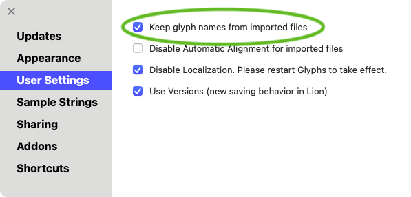
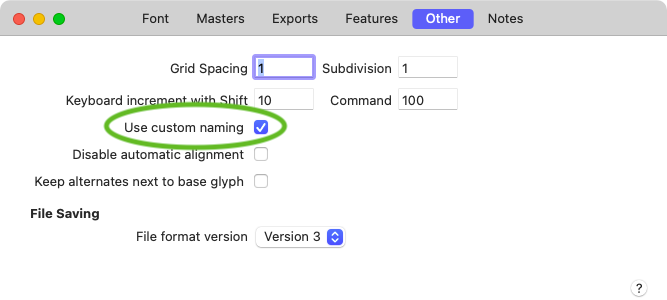
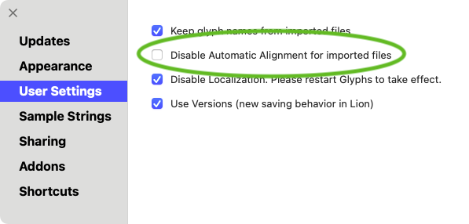
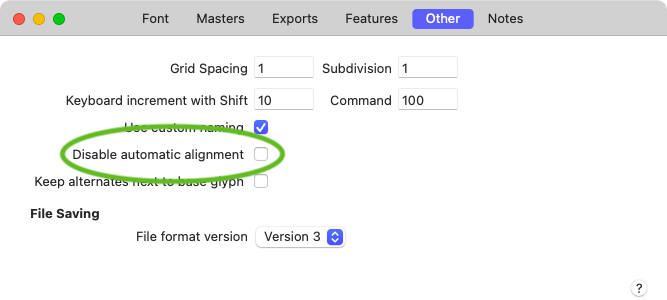
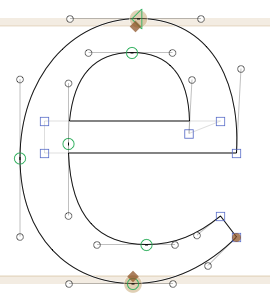
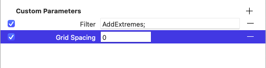

原文: [Porting to Glyphs](https://glyphsapp.com/learn/porting-to-glyphs)
# Glyphsへの移行

チュートリアル

執筆者: Rainer Erich Scheichelbauer

[ en ](https://glyphsapp.com/learn/porting-to-glyphs) [ zh ](https://glyphsapp.com/zh/learn/porting-to-glyphs)

2022年8月8日更新（初版公開：2013年5月20日）

別のワークフローからGlyphsに切り替えると、多くのことが簡単になります。しかし、慣れ親しんだ方法とは異なる点について言及することが重要です。ここでは、非常に便利なヒントをいくつか紹介します。

フォントプロジェクトをGlyphsに移行することを検討していますね。知っておくべき、微妙なワークフローの違いがいくつかあります。以前、[既存フォントの開き方](importing-existing-fonts/.md)について説明しました。この記事では、特に書体デザインプロジェクトをGlyphsのワークフローに移行することについて扱います。

## ファイルをGlyphsに移動する

GlyphsはUFOファイルを読み書きします。VFBファイルについては、[FontLab 5で最前面のファイルをGlyphsファイルで保存するマクロ](https://github.com/schriftgestalt/Glyphs-Scripts/blob/master/Glyphs%20Export.py)がダウンロード可能です。FontLabの新しいバージョンは、すでに直接.glyphsに書き出すことができます。

Fontographerファイルは、まずFontLabファイルに変換し、その後同じスクリプトで書き出す必要があります。または、PFBを生成し、それをGlyphsで開きます。PFBの場合、カーニングデータは別のメトリクスファイルに保持されます。GlyphsはAFMファイルの読み込みに対応しています。「ファイル > 読み込み > メトリクス…」を選択し、表示されるダイアログでAFMファイルを選べば、Glyphsは選択されたすべてのグリフに対してカーニングペアを読み込み、適用します。

## グリフの命名規則

Glyphsは、人間が読みやすいグリフ名を持つ、洗練されたグリフ命名規則を採用しています。これには多くの利点があります。「カスタム命名」を使えば、フィーチャーコードの記述がはるかに簡単になります。命名規則に従えば、Unicode値の管理や一部のOpenTypeフィーチャーコードの自動化が可能です。これで心配事がいくつか減ります。[グリフ名について詳しくはこちら](getting-your-glyph-names-right/.md)。

アプリケーションは、ファイルを開く際にグリフ名を再解釈しようとします。これはあなたのウィッシュリストの最優先事項ではないかもしれません。Glyphsにグリフ名をいじられたくない場合は、「Glyphs > 環境設定 > ユーザー設定」に進み、「読み込んだファイルのグリフ名を維持」オプションをチェックしてください。



このオプションが行うことは、「カスタム命名規則を使用」オプションをチェックすることです。このオプションは、「ファイル > フォント情報 > その他」に隠されています。そこでフォントごとに無効化したり、再有効化したりできます。



カスタム命名規則を使用すると、上記で述べた利点を失うことになるので、覚えておいてください。もし命名規則の一部に同意できないだけなら、[独自のグリフ情報を設定する](roll-your-own-glyph-data/.md)方が賢明です。

## 自動アラインメント

私はかつて、何百もの小さなFontLabスクリプトを持っていました。Glyphsに切り替えたとき、それらすべてを新しい環境に移植できないのではないかと心配でした。結果として、10本のうち9本のスクリプトは必要ありませんでした。それは、スクリプトが解決していた問題がGlyphsでは発生しなかったからです。考えてみてください。

その一つが、ベースグリフとダイアクリティカルマークの幅とサイドベアリングを同期させることでした。Glyphsでは、特にそうしないように指示しない限り、デフォルトでこれを行います。同じ原則が、複合グリフ内のアクセントの位置決めにも適用されます。これは、デフォルトで、ベースコンポーネントとマークコンポーネントの両方にある対応するアンカーを通じて行われます。[Glyphsでのダイアクリティカルマークについて詳しくはこちら](diacritics.md)。

プロジェクトがどれだけ進んでいるかによって、これは天の恵みにも、厄介なことにもなり得ます。「Glyphs > 環境設定 > ユーザー設定」で、「読み込んだファイルで自動アラインメントを無効にする」をチェックすれば、最初から無効にできます。



繰り返しになりますが、「ファイル > フォント情報 > その他」でフォントごとに無効にすることもできます。そこには「自動アラインメントを無効にする」オプションがあります。



## 心配ご無用

さて、「もう心配ない」カテゴリで言及すべきいくつかのことをすでにカバーしました。Unicode値、いくつかのフィーチャーコード、そしてサイドベアリングの同期です。もちろん、他にもたくさんあります。実際、Glyphsは、可能な限り技術的な決定を容易にし、あるいは自動化するようにゼロから設計されており、デザインの問題に集中できるようにしています。もちろん、ここですべてのGlyphsの機能を言及する場所ではありません（[ハンドブック](/learn/)がその役割を果たします）。それでも、いくつかハイライトを紹介します。

## オーバーラップ、大歓迎

一つには、もはやパスのオーバーラップについて心配する必要はありません。実のところ、シェイプのデザインや補間用のマスターの設定を容易にするため、図形にオーバーラップを残しておくことさえ推奨されます。



もちろん、最終的なOTFでは、これらのオーバーラップや交差はなくなっている必要があります。しかし、それらについて心配する必要はありません。ただリラックスしてください。Glyphsは、書き出し時にオーバーラップを削除する処理を自動で行ってくれます。必要なのは、フォントを書き出す際に「オーバーラップを削除」オプションがチェックされていることを確認するだけです。それだけです。

## 極値点の自動追加

常にカーブの極値にノードを置くように言われてきたのを覚えていますか？Glyphsはこれも処理できます。「ファイル > フォント情報 > 書き出し」に進み、インスタンスにカスタムパラメータを追加します。
```
Property: Filter
Value: AddExtremes;
```
もちろん、「パス > 極値点を追加」コマンドや、描画ツール（ショートカットP）でカーブをShiftキーを押しながらクリックすることで、自分で制御することも自由です。結局のところ、ほとんどの場合、極値ノードを使って作業する方がカーブのデザインが簡単です。しかし、時には自由なカーブの方が簡単な場合もあります。そして、そのような場合には、この小さなパラメータが役立ちます。そして、オートヒンターが必要とする極値点を見つけられないのではないかと心配しないでください。なぜなら、書き出し時には、すべてのパラメータが実行された*後*にヒンティングが適用されるからです。



## 簡単なグループカーニング

さて、いくつかの単独のカーニングペアがあるとします。もちろん、[カーニングについてもっと言うべきこと](kerning.md)はたくさんありますし、[見せるべきこと](/http://vimeo.com/44454636)もたくさんあります。しかし、カーニングをグループレベルに引き上げる手っ取り早い方法は、[mekkablue scripts](glyphsapp3://showplugin/mekkablue%20scripts)コレクションにある「Kerning > Set Kerning Groups」スクリプトをダウンロード、インストール、実行することです。そして、「ウインドウ > カーニング」の歯車メニューでカーニングを圧縮します。だいたいこんなところです。

## 古いUnicodeの問題

最後のアドバイスです。時々、フォントに同じグリフのコピーが2つあることがあります。ほとんどの場合、それはもはや必要ありません。

歴史的な理由から、一部の文字はUnicodeで重複しています。例えば、アラビア文字には、孤立形、語頭形、語中形、語末形の4つの形に対応する古いエンコーディングがあります。しかし、実際に使うべきなのは、Unicodeが提供する、位置によって区別しないデフォルトのエンコーディングです。なぜなら、位置による形はとにかくOpenTypeフィーチャーによって行われるからです。そのため、1つのアラビア文字に対して5つの可能なコードが存在することになります。例えば、`beh-ar`を見てみましょう。
```
U+0628 ARABIC LETTER BEH
U+FE8F ARABIC LETTER BEH ISOLATED FORM
U+FE90 ARABIC LETTER BEH FINAL FORM
U+FE91 ARABIC LETTER BEH INITIAL FORM
U+FE92 ARABIC LETTER BEH MEDIAL FORM
```
一部のデザイナーは、5つの文字すべてに対応するグリフを持ち、孤立形を`U+0628`と`U+FE8F`の両方に配置します。すると、Glyphsは`U+FE8F ARABIC LETTER BEH ISOLATED FORM`を`U+0628`にリダイレクトし、結果として`U+0628`というUnicode値を持つグリフが2つ存在することになります。もしそうなった場合は、アラビア文字のグリフをざっと見ていき（編集ビューでグリフを*Home*キーと*End*キー、またはMacBookでは*Fn*キーと左右の矢印キーで順に見ることができます）、重複したグリフを単に無効化するか削除してください。

---

更新履歴 2021-06-14: Glyphs 3向けの軽微な調整。

更新履歴 2022-08-08: 軽微なフォーマット、タイトルを更新。

## 関連記事

[すべてのチュートリアルを見る →](https://glyphsapp.com/learn)

*   ### [既存のフォントを読み込む](importing-existing-fonts.md)

チュートリアル

[ トラブルシューティング ](https://glyphsapp.com/learn?q=troubleshooting)

*   ### [Illustratorから読み込む](importing-from-illustrator.md)

チュートリアル

*   ### [IllustratorからGlyphs Miniに読み込む](importing-from-illustrator-into-glyphs-mini.md)

チュートリアル

[ Glyphs Mini ](https://glyphsapp.com/learn?q=glyphs+mini)

*   ### [UFOでの作業](working-with-ufo.md)

旧チュートリアル

[ インストール ](https://glyphsapp.com/learn?q=installation)