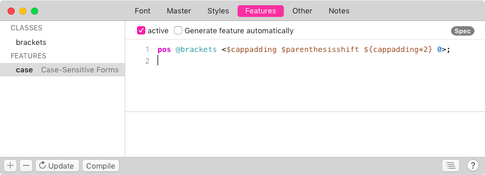

原文: [Positioning with number values](https://glyphsapp.com/learn/positioning-with-number-values)
# 数値を使った位置調整

チュートリアル

[ OpenTypeフィーチャー ](https://glyphsapp.com/learn?q=opentype+features)

執筆者: Rainer Erich Scheichelbauer

[ en ](https://glyphsapp.com/learn/positioning-with-number-values) [ es ](https://glyphsapp.com/es/learn/positioning-with-number-values) [ fr ](https://glyphsapp.com/fr/learn/positioning-with-number-values)

2022年8月3日

フォントマスターで*数値*を定義できるようになりました。それらは補間され、OpenTypeフィーチャーコードで変数として使用できます。

オールキャップス組版での括弧の問題を解決したいとします。簡単です、`case`フィーチャーに入れればよいのです。しかし、`parenleft.case`や`parenright.case`のような代替グリフでそれを行いたくないと気づきます。なぜなら、あなたの括弧のシェイプは、大文字と小文字の両方にとって全く問題ないからです。ただ、正しい場所にずらす必要があります。解決策：位置調整でそれを行いましょう。「待て待て」とあなたが言うのが聞こえます。「位置調整って何だ？」

## 置換 vs. 位置調整

原則として、OpenTypeフィーチャーには2種類のルールが可能です。*置換*と*位置調整*です。どちらの方法でも、「ファイル > フォント情報 > フィーチャー」でフィーチャーを定義します。フォントがコンパイルされると、置換ルールは`GSUB`というOpenTypeテーブルに、位置調整コードは`GPOS`というテーブルにそれぞれ格納されます。`GSUB`は*glyph substitution*（グリフ置換）、`GPOS`は*glyph positioning*（グリフ位置調整）の略です。

フィーチャーコードでは、*置換*ルールは次のようになります。

```
sub parenleft by parenleft.case;
```
…これは`parenleft`というグリフを`parenleft.case`という代替グリフに置換します。通常、接尾辞はそれが意図されているOpenTypeフィーチャーを表します。この場合、`case`は[Case-Sensitive Forms](https://docs.microsoft.com/de-at/typography/opentype/spec/features_ae#case)フィーチャーを指します。これは「様々な句読点を、オールキャップスのシーケンスやライニング数字のセットにより良く機能する位置にずらす」ものです。上記の例では、括弧の一方のバージョンをもう一方に置き換えることで、ずらしが行われます。

### ヒント
Microsoftが管理している[OT specで、すべてのフィーチャーを調べることができます](https://docs.microsoft.com/de-at/typography/opentype/spec/featurelist)。

対照的に、同じフィーチャー内のグリフ*位置調整*ルールは次のようになります。

```
pos parenleft <10 40 20 0>;
```
これは`parenleft`グリフを上に40ユニット移動させ、両側に10ユニットの余分なスペースを追加します。

説明しますと、この種のフィーチャーコードの構文が定義されているAFDKO仕様によれば、これは[single adjustment positioning](https://adobe-type-tools.github.io/afdko/OpenTypeFeatureFileSpecification.html#6.a)と呼ばれます。`<`と`>`の間の構造は値レコードと呼ばれ、4つの数値で構成されます。最初の2つは*xとyの配置調整*で、左括弧の画像の移動を意味します。この場合、括弧は右に10ユニット、上に40ユニット移動します。


括弧を右に動かすと、後に続く大文字と衝突する可能性があるため、右端にもより多くのスペースが必要です。そのため、3番目と4番目の数値があります。*xとyの送り調整*です。これは、括弧の*後*のカーソルの位置、または次のグリフが接続する場所を指します。括弧の左右に10ユニットずつの余分なスペースを追加したい場合、括弧の後のカーソル、したがって次のグリフは右に（10+10=）20ユニット移動する必要があります。言い換えれば、*送り*が20ユニット増加します。4番目の数値がゼロなのは、もちろん、次のグリフを同じ行に留めておきたいためです。

位置調整ソリューションの利点は明らかです。追加のグリフを管理する必要がなくなり、そうでなければ同期が取れなくなる可能性があります。エラーの原因が一つ減ります。もちろん、欠点も明らかです。`pos`ソリューションは、デザインがそもそもそれを許す場合にのみ使用できます。簡単に言えば、この方法では括弧を動かすことしかできず、その形を適応させることはできません。

## クラス

言うまでもなく、これは左括弧だけでなく、右括弧や、中括弧、角括弧にも適用したいでしょうから、行は次のようになります。
```
pos [parenleft parenright bracketleft bracketright braceleft braceright] <10 40 20 0>;
```
このように複数のグリフ名を角括弧で囲むと、それは「OpenTypeクラス」と呼ばれます。後で別のフィーチャーで再利用したい場合は特に、クラスを定義して名前を付けることもできます。
```
@brackets = [parenleft parenright bracketleft bracketright braceleft braceright];
pos @brackets <10 40 20 0>;
```
ご覧の通り、単なるグリフ名と区別するために、クラス名はアットマーク（`@`）で始まります。さて、もう一つひねりを加えます。「フォント情報 > フィーチャー」ウィンドウのUIで、同じクラスを設定できます。


…そして、そこにクラスコードを追加します。


これは、`case`フィーチャーには`pos`行だけが残る必要があることを意味します。


すべて正しく行っているか確認するには、「コンパイル」ボタンをクリックします。エラーメッセージが表示されなければ、問題ありません。もしエラーメッセージが表示された場合は、その内容を理解しようとしてください。コードエディタは、コードに隠れている可能性のある間違いを修正するのを助けてくれます。

## 数値

位置調整ソリューションが選択肢となるデザインがあるが、Lightマスターでは40ユニット上にずらす必要があるものの、Boldマスターでは20ユニットしかずらす必要がないということが判明したとします。これは、ここに入力したコードが軽いスタイルには良いが、ウェイトスペクトラムの反対側の端にあるスタイルには十分ではないことを意味します。

*数字を入力します。*「ファイル > フォント情報 > マスター > 数値」で、変数を定義して名前を付けることができます。良い点は？そのような数値を定義すると、それらは*すべての*マスターに表示されます。言うまでもなく、各マスターで異なる値を与えることができます。そして言うまでもなく、値は私たちが望むようにうまく補間されます。

そこで、`parenthesisshift`という名前の数値を追加し、Lightマスターで40の値を指定しましょう。


…そして、Boldマスターでその値を20に変更します。

ここまで順調です。しかし、その数値をフィーチャーコードにどうやって入れるのでしょうか？簡単です。`$`接頭辞を使います！私たちの`case`フィーチャーコードは次のようになります。
```
pos @brackets <10 $parenthesisshift 20 0>;
```
これで、「フォント情報 > フィーチャー」ウィンドウは、多かれ少なかれこのようになります。


さて、フォントスタイルを書き出すと、コードは数値の適切な補間とともに書き出され、括弧は各スタイルで常に正しい場所に移動します。クールですね。

## 計算

ここまでは順調です。しかし、*水平*方向の配置と送りの数値はどうでしょうか？「フォント情報 > マスター > 数値」で新しい数値を導入し、`cappadding`と名付けることができます。そこで、例えばBoldマスターでは次のように記述します。


通常、この数値はBoldウェイトでは小さく、Lightウェイトでは大きくなります。これは、Boldウェイトでは元々白い部分が少ないため、少しの余分な白でも大きな意味を持つからです。同じ量の余分な白は、すでに白い部分が多いLightウェイトでは無視できるほどです。したがって、Lightウェイトで余分なパディングを目立たせるには、より多くする必要があります。そのため、Lightマスターではより高い値を設定します。


左右に均等にパディングしたい場合、送りは配置値の2倍である必要があることを覚えておいてください。したがって、単に数値を（再）利用するだけでなく、2を掛ける必要があります。どうすればよいでしょうか？簡単です、計算を使います。
```
pos @brackets <$cappadding $parenthesisshift ${cappadding*2} 0>;
```
OpenTypeフィーチャー構文内での計算には、ドル記号`$`で始め、計算を波括弧で囲みます：`${...}`。もし`cappadding`を2倍にしたい場合は、単に`${cappadding*2}`と書きます。



これですべてです。すべての数値名が利用可能で、任意の数値と基本的な数学演算子（加算と減算には`+`と`-`、乗算と除算には`*`と`/`）も使えます。波括弧の間にあるものはすべて、その補間に応じて個々のフォントスタイルごとに計算されます。

---

更新履歴 03-08-06: 軽微なフォーマット変更。

## 関連記事

[すべてのチュートリアルを見る →](https://glyphsapp.com/learn)

*   ### [トークン](tokens.md)

チュートリアル

[ OpenTypeフィーチャー ](https://glyphsapp.com/learn?q=opentype+features)