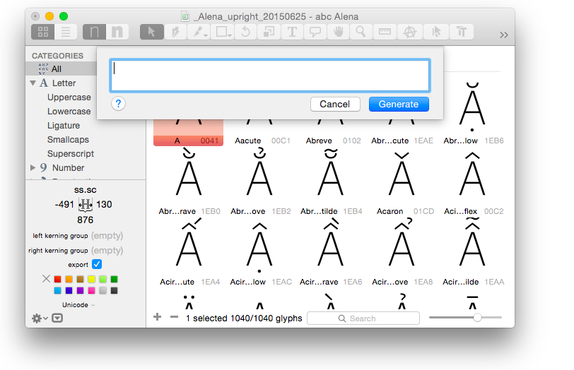
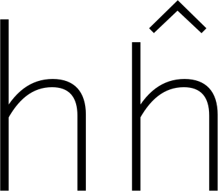
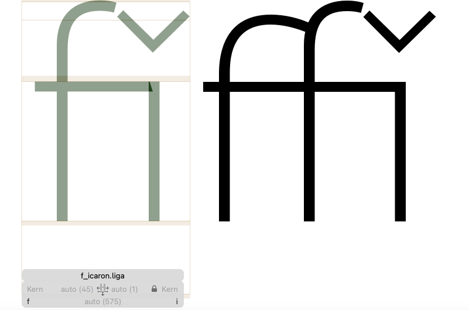
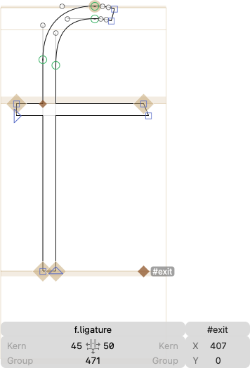
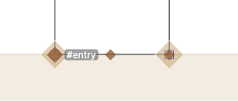
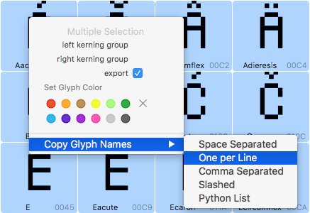
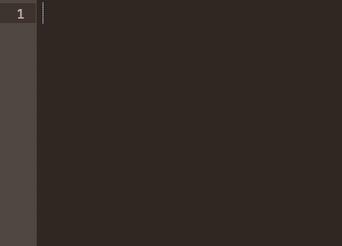

原文: [Recipes](https://glyphsapp.com/learn/recipes)
# レシピ

チュートリアル

[ シェイプの再利用 ](https://glyphsapp.com/learn?q=reusing+shapes)

執筆者: Rainer Erich Scheichelbauer

[ en ](https://glyphsapp.com/learn/recipes) [ fr ](https://glyphsapp.com/fr/learn/recipes) [ zh ](https://glyphsapp.com/zh/learn/recipes)

2022年8月5日更新（初版公開：2013年1月14日）

コンポーネントでグリフを調理しましょう。優しくかき混ぜ、数分間煮立たせ、熱いうちにお召し上がりください。どうぞお楽しみに。

おそらく「グリフ > グリフを追加…」（Cmd-Shift-G）コマンドはご存知でしょう。これは次のようなテキスト入力シートを表示します。



ここに、グリフ情報パネルに表示されるようなグリフ名、例えば`germandbls`、`five`、`guillemetleft`などを入力できます。あるいは、実際の文字、例えば`ä`や`à`を入力すると、Glyphsは適切なグリフ名を持つグリフ、この場合は`adieresis`と`agrave`を追加します。このコマンドは合字も認識するので、`t_t`と入力すると、2つの`t`コンポーネントを持つ`t_t`という名前の合字グリフが得られます。スペースや改行で区切って、一度に多くのグリフ名を入力できます。この方法で、テキストファイルに保存しているグリフリスト全体をコピー＆ペーストして、一度に多くのグリフを作成できます。

## 単一コンポーネントのレシピ

しかし、本当にクールなのはレシピです。レシピとは、等号を含む文字列のことで、例えば`six.numr=six.sups`です。Glyphsは、等号の左側にあるものをコンポーネントにしようとします。等号の右側にあるものは、結果として得られるグリフ名です。したがって、`six.numr=six.sups`の例では、Glyphsは`six.sups`という名前のグリフを作成し、`six.numr`コンポーネントを挿入します。

その可能性を考えてみてください。大文字だけのフォントを作りたいとします。次のように入力できます。

```
A=a B=b C=c D=d E=e F=f G=g H=h I=i J=j K=k L=l M=m
N=n O=o P=p Q=q R=r S=s T=t U=u V=v W=w X=x Y=y Z=z
```
これにより、小文字のaからzまでが作成され、その中に大文字のAからZまでがコンポーネントとして挿入されます！この方法なら、大文字と小文字は常に同期したままです。クールですね。

### プロのヒント
オールキャップスフォントを作成するには、もっと良い方法があります。[オールキャップスフォントの作成](creating-an-all-caps-font.md)チュートリアルをご覧ください。

## 複数コンポーネント

### オプション1：マークのアタッチメント

プラス記号を入力します。このレシピを見てください。
```
h.short+circumflexcomb.case=hcircumflex
```
このレシピは、`h.short`という文字コンポーネントを取り、`circumflexcomb.case`というマークコンポーネントを追加し、`hcircumflex`というグリフを作成します。コンポーネントは、[ダイアクリティカルマークの場合のように](diacritics.md)、それぞれの`top`と`_top`アンカーで接続されます。新しいグリフを追加して`h.short`と名付ける必要があるかもしれません。これで、バーを短くして`top`アンカーを再配置し、より美しい`hcircumflex`を得ることができます。



ほとんどの場合、内蔵のレシピで十分です。グリフ名を入力するだけで、Glyphsが残りを解決してくれます。例えば、`edieresis`と入力すると、Glyphsは`e`と`dieresiscomb`コンポーネントからそれを構築します。内蔵のレシピは、「ウインドウ > グリフ情報」の「コンポーネント」列で見ることができます。もし事前に調理されたレシピに同意できない場合は、プラス記号を使って独自のレシピを作成できます。

### オプション2：合字のアタッチメント

もう一歩進んでみましょう。レシピにマークを追加しないとどうなるでしょうか？
```
f.ligature+icaron=f_icaron.liga
f.ligatureLow+f.ligature+icaron=f_f_icaron.liga
```
これらのケースでは、2番目と3番目のグリフはダイアクリティカルマークではなく、通常の文字です。合字に適した`f`のバリエーションです。これは、この例では、Glyphsがそれぞれの文字のコンポーネントを互いに隣接して挿入し、合字を形成することを意味します。



コンポーネントは、文字が隣り合って入力された場合と同じように合字内に配置されます。配置はカーニングを尊重します。あるいは、`#exit`と`#entry`アンカーで配置を正確に制御することもできます。`f`の部分では、キャンバスを右クリックし、コンテキストメニューから「アンカーを追加」を選択し、アンカーの名前を`#exit`に変更することでアンカーを配置します。



そして、`icaron`のベースコンポーネントである`idotless`には、対応する`#entry`アンカーを配置します。



要するに、レシピを使って2つのグリフを追加し、ダイアクリティカルマークまたはダイグラフを作成できます。そして何よりも良いのは、結果として得られるグリフがコンポーネントで構成されることです。`#exit`と`#entry`アンカーで接続の正確なポイントを制御できます。このようなトリックについては、[コンポーネントのテクニック](reusing-shapes-component-tricks.md)チュートリアルで詳しく説明しています。

## 範囲

コロンを2つのグリフ名の間に挟むことで、Unicodeの完全な*範囲*を追加できます。このように。
```
uni2500:uni257F
```
これは、例えば、すべての罫線文字をグリフとしてフォントに追加します。要するに、構造は`glyphname1:glyphname2`で、`glyphname1`のUnicode値は`glyphname2`のそれより小さいです。すると、これら2つの間にUnicodeでリストされているすべての文字が追加されます。

ちなみに、どのグリフ名の構造に従うかは問題ではありません。ナイスネームでも、uniXXXX名でも構いません。したがって、これは上記の例と同等です。
```
boxLightHorizontal:boxHeavyUpAndLightDown
```

## 複数行編集

似たような構造のレシピの行がいくつかあり、それを扱う状況に直面するでしょう。そしてその時、ロボットのように、すべての行で似たようなことを何度も繰り返し入力している自分に気づくでしょう。うげぇ。

幸いなことに、複数行編集を可能にするテキストエディタがあります。すなわち、[Sublime Text](https://www.sublimetext.com)と[TextMate](https://macromates.com)です。TextMateでは、Optionキーをタップして通常の選択と列選択を切り替えます。列選択モードに入ると、行う編集はすべての行で行われます。Sublime Textでは、Cmd-Shift-Lを押すことで同じことができます。

これと、選択したすべてのグリフ名をコピーする機能を組み合わせます。フォントタブでグリフを選択し、右クリックしてコンテキストメニューを表示し、「グリフ名をコピー > 1行に1つ」を選択します。



次に、TextMateまたはSublime Textにペーストし、複数行編集を行います。



かなりクールですね。

---
サンプルフォント：[Alena](https://www.allegra-alena-type-documentary.ch)、Roland Stieger氏提供。

更新履歴 2017-10-05: 範囲と複数行編集に関する注記と段落を追加。

更新履歴 2019-08-05: 誤字を修正（Nathalieさん、ありがとう！）。

更新履歴 2022-08-05: 「複数コンポーネント」の章を書き直し、ヒントを追加、スクリーンショットを更新、軽微なフォーマット。

更新履歴 2022-09-11: 誤字を修正（Curtisさん、ありがとう！）。

## 関連記事

[すべてのチュートリアルを見る →](https://glyphsapp.com/learn)

*   ### [ダイアクリティカルマーク](diacritics.md)

    チュートリアル

    [ シェイプの再利用 ](https://glyphsapp.com/learn?q=reusing+shapes)

*   ### [シェイプの再利用：コンポーネントのテクニック](reusing-shapes-component-tricks.md)

    チュートリアル

    [ シェイプの再利用 ](https://glyphsapp.com/learn?q=reusing+shapes)

*   ### [オールキャップスフォントの作成](creating-an-all-caps-font.md)

    チュートリアル