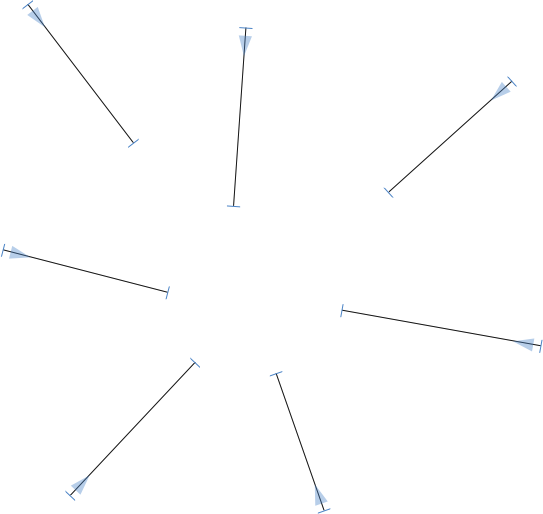

原文: [Reusing shapes: brushes](https://glyphsapp.com/learn/reusing-shapes-brushes)
# シェイプの再利用：ブラシ

チュートリアル

[ シェイプの再利用 ](https://glyphsapp.com/learn?q=reusing+shapes)

執筆者: Rainer Erich Scheichelbauer

[ en ](https://glyphsapp.com/learn/reusing-shapes-brushes) [ fr ](https://glyphsapp.com/fr/learn/reusing-shapes-brushes) [ zh ](https://glyphsapp.com/zh/learn/reusing-shapes-brushes)

2020年5月31日

ブラシは、単なるパスセグメントを本格的なシェイプに拡張するための素晴らしい方法です。矢印を描いてみましょう。

## ブラシグリフを作成する

「グリフ > グリフを追加…」（Cmd-Shift-G）を選び、ブラシグリフの名前を入力します。名前は`_brush`で始まり、ドット接尾辞が続く必要があります。この例では、`_brush.arrow`を試してみます。

必ず*1つの閉じたパス*だけを含めるようにしてください。それ以降のシェイプは無視されます。「グリフ > アンカーを設定」（Cmd-U）または「すべてのマスターにアンカーを設定」（Cmd-Opt-U）を選び、`start`アンカーと`end`アンカーを追加します。

シェイプは、これらのアンカーをサイズ参照として使用し、受け側のパスセグメント上に引き伸ばされます。アンカーの外側にあるものは固定されたままで、アンカーの間にあるものは必要なサイズに引き伸ばされたり縮められたりします。

また、アンカー間の水平セグメントにあるカーブハンドルにも注目してください。これらは、ブラシが引き伸ばされるだけでなく、受け側のセグメントに沿って*曲がる*ことも可能にします。これについては、後ほどお見せします。

## ホストパスに適用する

さて、新しいグリフを作成し、いくつかのパスを描きます。通常は、開いたアウトライン、あるいは単一セグメントのパスが好ましいでしょう。

セグメントにブラシを適用するには、それらを選択し、コンテキストメニューから「ブラシを追加」を選びます。

これで、できあがりです。

## 複数のセグメントに適用する

ブラシは、より長いパスの（複数の）セグメントに適用することもできます。通常は、どのセグメントにブラシを適用し、どのセグメントには適用しないかを選択的に行うことになります。そうしないと、このようになってしまいます。

ここで必要なのは、セグメントではなく*個々のノード*にブラシを適用することです。したがって、セグメントの代わりに、各セグメントの*最後の*ノードを選択し、先ほどと同じようにコンテキストメニューからブラシを追加します。すると、`end`アンカーが選択したノードと一致するようにブラシが追加されます。

## 複雑なブラシ

もう少し複雑にしてみましょう。例えば、パスにハイライトが入った*ヴルスト*（ソーセージ）ブラシが欲しいとします。

それも可能ですが、前述の通り、ブラシは*単一の*アウトラインしか持てず、追加のパスは無視されます。しかし、それは実際には問題ではありません。ヴルスト全体が*1つの*単一アウトラインであることを確認するだけでよいのです。そして、それは簡単です。まず、可能な限りアウトラインを統合します。次に、カウンタシェイプ（私たちのヴルストのハイライトのような）については、両方のアウトライン上の対向する2つの点を選択し、必要であれば両方を青いコーナーポイントに変え（Returnキーを押すか、ノードをダブルクリック）、コンテキストメニューから「ノードを再接続」を選びます。

この方法で、アウトラインに隠れた隙間を作成します。

しかし、もっと重要なのは、外側のパスとカウンターを1つのアウトラインに統合したことです。これで、ヴルストをどのホストパスにも適用でき、フォント全体で好きなだけヴルストを持つことができます。

---
免責事項：このチュートリアルの作成において、動物は一切傷つけられていません。