原文: [Reusing shapes: component tricks](https://glyphsapp.com/learn/reusing-shapes-component-tricks)
# シェイプの再利用：コンポーネントのテクニック

チュートリアル

[ シェイプの再利用 ](https://glyphsapp.com/learn?q=reusing+shapes)

執筆者: Rainer Erich Scheichelbauer

[ en ](https://glyphsapp.com/learn/reusing-shapes-component-tricks) [ fr ](https://glyphsapp.com/fr/learn/reusing-shapes-component-tricks) [ zh ](https://glyphsapp.com/zh/learn/reusing-shapes-component-tricks)

2022年7月26日更新（初版公開：2016年1月12日）

[セリフコンポーネント](serif-components.md)、[スマートコンポーネント](smart-components.md)、[コーナーコンポーネント](reusing-shapes-corner-components.md)についてはご存知かもしれませんが、それでももっとコンポーネントを使いたいと思っていませんか？これらのヒントとテクニックは、あなたを幸せにするでしょう。

## Qを作る

基本的には、一部のデザインでは`Q`は`O`に尾を付けただけのものです。したがって、物事を簡単にするために、そしてあなたのデザインがそれを許すなら、`Q`のコンポーネントとして`O`を使用できます。フォントビューで`Q`をダブルクリックするか、テキストモードで入力して編集ビューで開きます。「グリフ > コンポーネントを追加」（Shift-Cmd-C）に進み、`O`を選択します。次に、素敵な尾を描きます。これが私たちのものです。

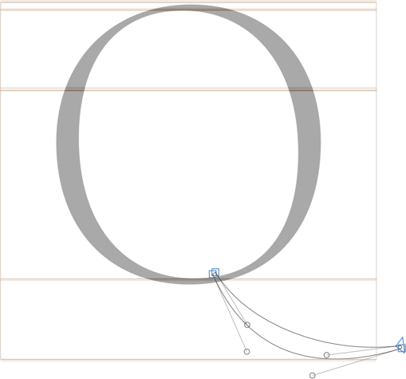

しかし、コンポーネントとパスを混ぜるべきではありません。なぜなら、そうすると自動整列が無効になるからです。つまり、Oをずらすと、尾とOがずれてしまいます。そこで、尾もコンポーネントにします。そのためには、Cmd-Aを一度押してすべてのパスを選択し、右クリックしてコンテキストメニューを表示し、「選択部分からコンポーネントを作成」を選択します。新しいグリフの名前は任意ですが、あなたにとって意味があり、最初にアンダースコアがあることを確認してください。そうすれば、グリフはすぐに書き出し対象外に設定されます。私たちは`_tail.Q`と名付けます。

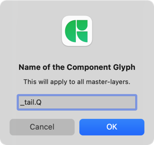

Oの特定の場所に尾をくっつけるには、Oにアンカーを追加するだけです。コンテキストメニューを開き、「アンカーを追加」を選択することでこれを行うことができます。名前は自動的に選択され、名前を変更できるようになります。

`qtail`のような印象的な名前にします。それを選択し、尾を付けたい場所にドラッグします。次に、`_tail.Q`にアンカーを追加し、Oのアンカーと同じ名前を付けますが、前にアンダースコアを付けます。アンダースコアは、アンカーが`qtail`アンカーにリンクされていることを示します。

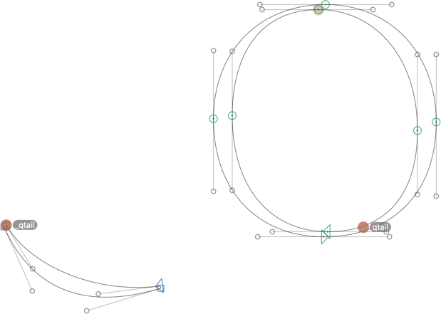

じゃじゃーん！これがあなたのオールコンポーネントQです。

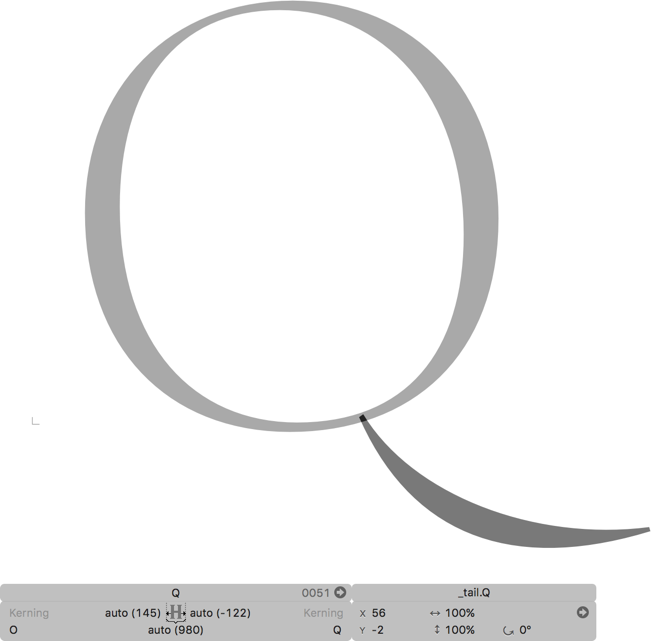

## yを作る

Qと同じように、yも尾とvで構成することができます。もしあなたのデザインやワークフローにとってそれが意味のあることなら、です。私の経験では、モジュール化された、幾何学的な、軽い、高コントラストの、または低解像度スクリーン向けのフォントデザインが、このようなアプローチの候補になり得ます。もちろん、それが本当に機能するかどうかは、あなたの目で判断する必要があります。しかし、他のデザインでも、この構成は初期のデザイン段階で役立つことがあります。最終的には分解して視覚的な調整を適用することになるでしょう。しかし、その段階に達するまでは、コンポーネントと自動整列を利用することで、まだ多くを変更している段階での一貫性を保つのに役立ちます。

フォントビューでvをダブルクリックするか、テキストモードで入力して編集ビューで開きます。再び、「グリフ > コンポーネントを追加」（Shift-Cmd-C）に進み、`v`を選択します。`v`に合う素敵な尾を描きます。尾がvに合うように、ここにちょっとしたトリックがあります。vのステムにある2つのノードを選択します。さて、右クリックしてコンテキストメニューを開き、「ガイドを追加」を選択します。

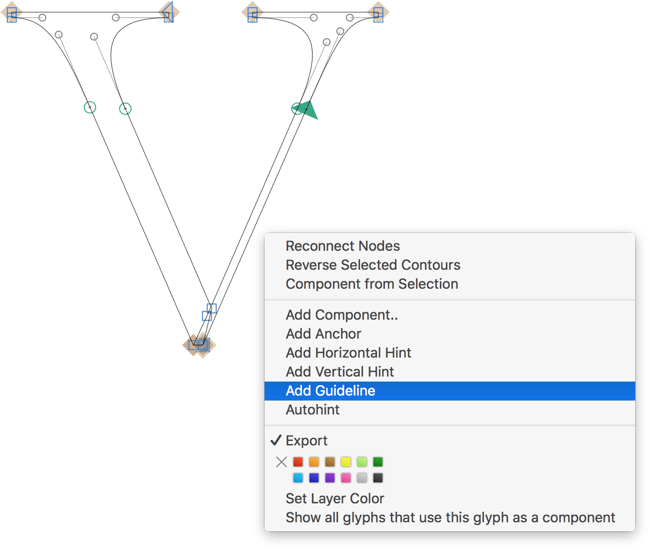

さて、選択した2つの点の上に青いガイドが表示されるはずです。

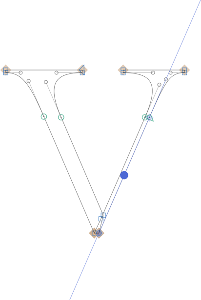

ガイドを選択し、Cmd-Cを押してコピーします。次に、`_tail.y`を開き、Cmd-Vを押してガイドをペーストします。この方法で、尾の角度をステムに簡単に合わせることができます。単位グリッドでのずれを避けるために、アンカーと点が同じ座標上にあることを確認してください。

尾はvにくっつくべきなので、vにアンカーを追加します。今回は、`ytail`と名付けますが、名前は任意です。Cmd-Cを押してアンカーをコピーできます。`_tail.y`を開き、Cmd-Vでアンカーをペーストし、ダブルクリックして名前を変更します。繰り返しになりますが、これは`v`のアンカーと同じ名前であるべきですが、先頭にアンダースコアが付いています。

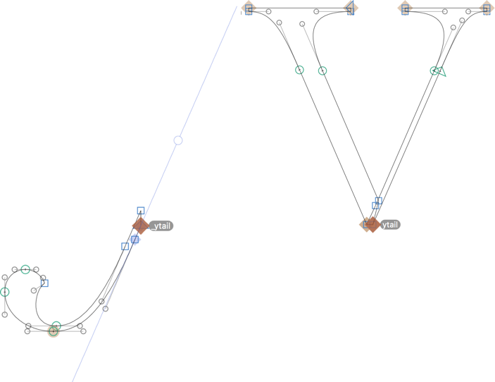

この方法で、両方のコンポーネントが同じy座標を共有するため、アンカーは同じ高さになります。同じ高さにすることで、複合グリフ`y`での垂直方向のずれのリスクを避けることができます。

Qと同じように、尾をコンポーネントにします。Cmd-Aを押してすべてのパスを選択し、右クリックして「選択部分からコンポーネントを作成」を選択します。繰り返しになりますが、新しいグリフの名前は任意ですが、書き出されないように、先頭にアンダースコアが付いている必要があります。私たちのものは`_tail.y`と名付けます。

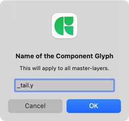

これだけです。やった！

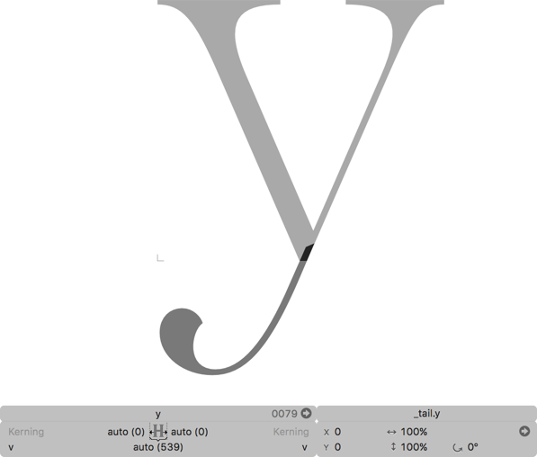

## その他のグリフ

あなたのデザインに応じて、他のグリフもコンポーネントから構築できます。例えば、`Eng`は`N`とディセンダー部分から、`ae`はaの部分と`e`から、`oe`はoの部分と`e`から、`w`はwの部分と`v`から作ることができます。そして、サンセリフフォントの場合は、`eng`を`n`とディセンダー部分から、または`thorn`を`p`とステム部分から構築することもできます。

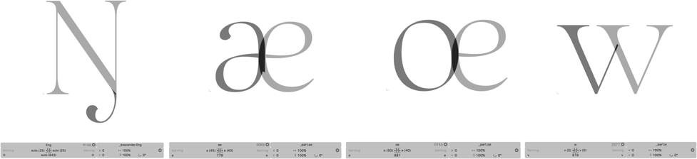

しかし、待ってください…スクリーンショットの`ae`、`oe`、`w`をよく見てください。これらは上記の例とは少し異なります。

## 合字の複合グリフ

実際には、これらは複数のシェイプの合字です。したがって、自動整列を最大限に活用するために、特別な合字用の文字を作成し、必要に応じてサイドベアリングを調整し、それらをコンポーネントとして追加することで合字を簡単に構築できます。この方法なら、アンカーさえ必要ありません。

例えば、`ae`を特別な`a.ae`と`e`から構築できます。`a.ae`には、aのパスをコピーし、スパー（脚）を取り除き、おそらくステムの幅を少し調整します。`a.ae`にはLSBに`=a`というメトリクスキーが必要で、RSBは負の値、ちょうど`e`と美しい合字を形成するのに十分なだけです。`ae`を開き、`a.ae`、次に`e`をコンポーネントとして追加します。それらは自動的に整列するはずです。

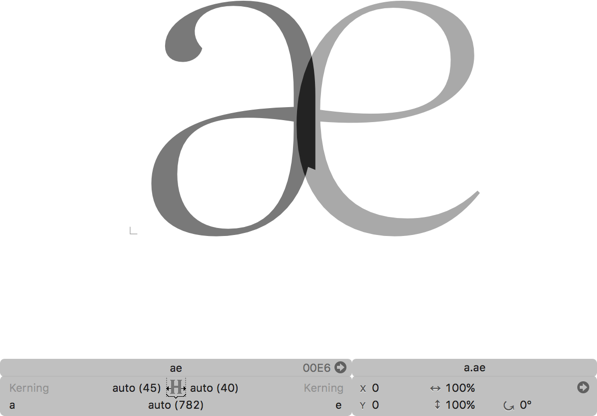

そして、`a.ae`は書き出すべきではないので、グリフに入り、右クリックしてコンテキストメニューを開き、「書き出し」を選択してチェックマークを外します。

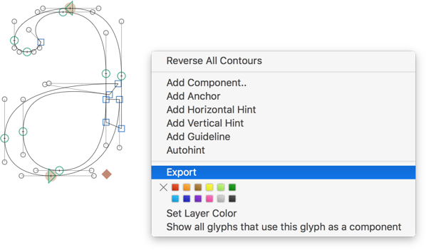

グリフ名`a.ae`は、文字名に接尾辞が付いたものです。この名前構造は、合字の複合グリフでの自動整列を可能にしますが、この最後のステップである書き出しの無効化が必要です。バージョン2.3以降では、逆の方法も可能です。`_a.ae`を作成します。これは、先頭のアンダースコアのために書き出し対象外として作成されます。そして、`ae`内で、それを右クリックしてコンテキストメニューから「自動整列を有効にする」を選択することで、整列を強制できます。

## 合字のためのカーシブ接続の転用

実際には、`AE`や`OE`のようなグリフで本当に必要なのは、最初の部分のLSBと、右の部分のRSBです。残りは、2つの部分が正しい場所で互いに接続する限り、実際には問題ではありません。垂直方向のマーク接続ですでにやっているように、水平方向の接続のためのスポットを定義できたら素晴らしいと思いませんか？そして、欲しい文字のパーツを数珠つなぎにし、複合グリフが最初の部分のLSBと最後の部分のRSBを継承するようになれば？

さて、アラビア文字にはすでにこれがあります。これは*カーシブ接続*と呼ばれ、Glyphsではいわゆる`exit`と`entry`アンカーによって実装されています。アラビア文字にこれらのアンカーを配置すると、アンカーの位置が、文字同士を動的にリンクするための位置指定OpenTypeフィーチャーを構築するために使用されます。クールですね。

幸いなことに、ラテン文字のような非アラビア文字にもこれを使用できます。唯一必要ないのはOpenTypeフィーチャーです。なぜなら、私たちが気にするのは複合グリフをくっつけることだけだからです。Glyphsがフィーチャーコードを構築するのを防ぐために、アンカー名の*前に非文字を付ける*ことができます。絵文字を使うのが好きな人もいますが（例：`🤓exit`）、私はタイピングが簡単で（それでも目立つ）ハッシュタグを使うのが好きです：`#exit`と`#entry`です。サンプルワークフローは次のようになります。

1.  `A.AE`、つまりAEのA部分を作成します。
2.  書き出さないように設定します：右クリックしてコンテキストメニューの「書き出し」オプションを無効にします。
3.  パスを描き、ベースライン上に`#exit`アンカーを、おおよそEが接続するであろう場所に追加します。
    > 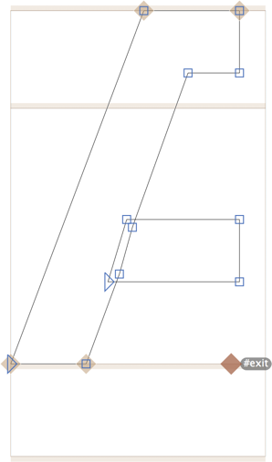

4.  `E`に、ベースライン上の左端に`#entry`アンカーを追加します。
    > 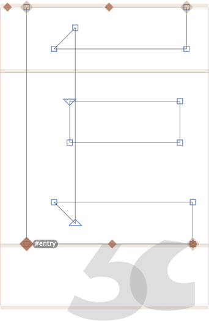

5.  `AE`で、「グリフ > コンポーネントを追加」（Cmd-Shift-C）を2回選択します。1回目は`A.AE`を、次に`E`をコンポーネントとして追加します。ほら！
    > 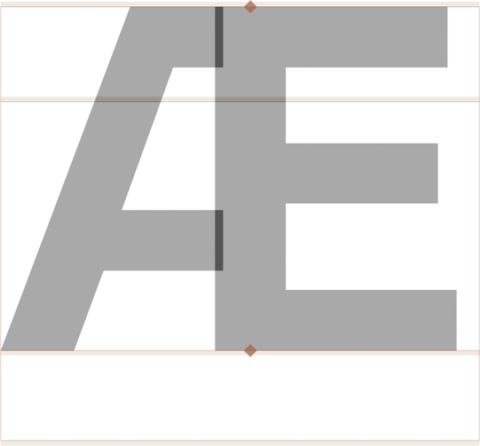

アンカーの位置を調整することで、`AE`を微調整できます。そして何よりも良いのは、その右半分（RSBを含む）が実際の`E`と決してずれないことです。なぜなら、それは真の`E`コンポーネントだからです。そして、ハッシュタグの接頭辞は、フォントファイルが不要な`curs` OpenTypeフィーチャーで肥大化しないようにしてくれます。

素晴らしい。アラビア文字よ、カーシブ接続をありがとう！

---
*サンプルフォント：Sephora Serif by[ Mucca/Schriftlabor ](http://mucca.com/case-studies/sephora-custom-type-system/) and Funktional Grotesk by Davide Rossetto.*

更新履歴 2016-01-18: いくつかの説明的な行を追加。Benedikt Bramböck氏および他の多くの方々からの貴重なご意見に感謝します。

更新履歴 2017-12-28: #exit/#entryのトリックを追加。

更新履歴 2019-01-21: 誤字を修正。

更新履歴 2022-07-26: タイトル、関連記事、軽微なフォーマットを更新。

## 関連記事

[すべてのチュートリアルを見る →](https://glyphsapp.com/learn)

*   ### [ハングルフォントの作り方](creating-a-hangeul-font.md)

チュートリアル

[ 言語 ](https://glyphsapp.com/learn?q=languages)

*   ### [シェイプの再利用：コーナーコンポーネント](reusing-shapes-corner-components.md)

チュートリアル

[ シェイプの再利用 ](https://glyphsapp.com/learn?q=reusing+shapes)

*   ### [シェイプの再利用：スマートコンポーネント](smart-components.md)

チュートリアル

[ シェイプの再利用 ](https://glyphsapp.com/learn?q=reusing+shapes)