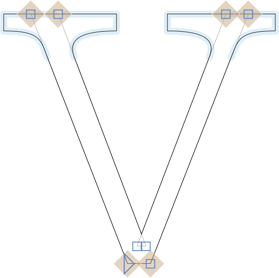

原文: [Reusing shapes: corner components](https://glyphsapp.com/learn/reusing-shapes-corner-components)
# シェイプの再利用：コーナーコンポーネント

チュートリアル

[ シェイプの再利用 ](https://glyphsapp.com/learn?q=reusing+shapes)

執筆者: Rainer Erich Scheichelbauer

[ en ](https://glyphsapp.com/learn/reusing-shapes-corner-components) [ fr ](https://glyphsapp.com/fr/learn/reusing-shapes-corner-components) [ zh ](https://glyphsapp.com/zh/learn/reusing-shapes-corner-components)

2023年7月8日更新（初版公開：2016年2月23日）

コーナーコンポーネントは、セリフを作成するための魔法のようなものです。そして、セリフだけではありません。

コーナーコンポーネントは、コーナーノードにアタッチできる小さなシェイプです。セリフに最適ですが、丸い角やインクトラップにも使え、これらの部分的なシェイプを多くのグリフ間で同期させるのに最適な方法です。何よりも、これらは補間され、バリアブルフォントで書き出されます。例えば、このnを見てください。

すべてのセリフはコーナーコンポーネントであり、Glyphs 3以降では、青い粒子として表現されます。

## コーナーコンポーネントを作成する

これに必要なのは、特別な名前を持つ2つの新しいグリフだけです。コーナーコンポーネントは`_corner`で始まり、任意のドット接尾辞を持つ必要があります。名前の先頭にあるアンダースコアは、グリフが書き出し対象外として作成されることを保証します。2つの新しいグリフを追加し、例えば左セリフには`_corner.leftSerif`、右セリフには`_corner.rightSerif`と名付けます。これを行う最善の方法は、メニューコマンド「グリフ > グリフを追加」（Cmd-Shift-G）を呼び出し、`_corner.leftSerif _corner.rightSerif`と入力し、「生成」ボタンを押すことです。

しかし、まずはセリフを描くことから始めましょう。私たちの左セリフは次のようになります。

ご覧の通り、セリフは垂直に始まり、反時計回りに曲がり（閉じたパスと同じように）、最後の部分はベースライン上にあります。右下の最後の点は、最初の点に対して少し右にある必要があります。最初の垂直方向の動きと最後の水平方向の動きが互いに補完し合って、垂直なシェイプの角を形成します。

3つのアンカーもあります。デフォルトのアンカー`left`、`right`、`origin`は、「グリフ > アンカーを設定」（Cmd-U）または「すべてのマスターにアンカーを設定」（Cmd-Opt-U）で追加できます。

### プロのヒント
アンカーとパスノードの両方を選択し、「パス > 選択範囲を整列」（Cmd-Shift-A）を選ぶことで、アンカーをノードの上に素早く整列させることができます。最初のノードと`left`、`origin`の両方のアンカーを選択し、Cmd-Shift-Aを押すと、アンカーは開始点の上に整列します。

`origin`アンカーは、ホストパスの角（後でコーナーコンポーネントが挿入される場所）を表します。このアンカーがない場合は、セリフを左サイドベアリングの上に移動させ、それが原点（x=0, y=0）、つまりベースラインが左サイドベアリングと交差する点を中心に曲がるようにする必要があります。

`left`アンカーと`right`アンカーは、非垂直な角での視覚的な調整のためのピボットポイントです。これについては後で詳しく説明します。

## コーナーコンポーネントを追加する

さて、セリフをグリフにくっつけるにはどうすればよいでしょうか？簡単です。グリフに進み、パスで構成されたコーナーノードを選択し、それを右クリックしてドロップダウンメニューを開き、「コーナーコンポーネントを追加」を選択します。

続くダイアログで、`_corner.leftSerif`を選択すると、ほら、セリフがパスに挿入されます！クールですね。

他の角については、角を選択してコピーし、ターゲットノードを選択してペーストできます。あるいは、コンテキストメニューから再度追加することもできます。

### プロのヒント
コーナーコンポーネントの追加とペーストは、複数のコーナーノードが選択された状態でも機能します。これにより、作業を大幅に高速化できます。

しかし、おっと、ここで何が起こったのでしょうか。

ええと、これは左セリフで、右の角には左セリフがこのように収まります。でも、絶望しないでください。回転がおかしいセリフを選択し、「変形」パネルのミラーボタンのいずれかを使って反転させることができます。

もちろん、これはセリフのデザインがそもそもミラーリングに適している場合に限られます。そうでない場合は、`_corner.rightSerif`が必要になり、アンカーを次のように配置する必要があるかもしれません。

`right`アンカーはパスの終わりに近く、`left`アンカーは最初のセグメント上にあります。繰り返しになりますが、パスの方向に注意してください。反時計回りです、他のほとんどのパスと同じように。

## 斜めのステム

斜めのステムの角は自動的に調整されます。コーナーコンポーネントの最も外側のセグメントを、ステムの角度に合わせて傾けることで調整されます。

あなたのコーナーコンポーネントは垂直に描かれましたが、vの角にある2つのセグメントは垂直ではありません。そこで問題となるのは、コーナーコンポーネントがどちらのセグメントに整列し、どちらのセグメントを歪ませるかです。Glyphsは多くの場合正しく推測しますが、常にそうとは限りません。その場合は、グレーの情報ボックス（Cmd-Shift-I）にある4つの小さなボタンを使って、手動で整列を調整できます。

*   **左矢印：** 左セリフまたは反転した右セリフの整列用。コーナーコンポーネントのパスの*始まり*がホストパスの角度に合わせて傾き、パスの*終わり*は直線のままです。
*   **右矢印：** 右セリフまたは反転した左セリフの整列用。コーナーコンポーネントのパスの*終わり*がホストパスの角度に合わせて傾き、パスの*始まり*は直線のままです。
*   **二重矢印：** コーナーコンポーネントは、入ってくるパスセグメントと出ていくパスセグメントの中間にフィットします。インクトラップに最適です。曲げは、コーナーコンポーネントのパスの始まりと終わりの両方に沿って、3つのアンカーに沿って行われ、originアンカーがピボットになります。
*   **x：** 整列なし。コーナーコンポーネントはそのまま強制的に挿入されます。特殊なケース専用で、通常は面白い結果になります。

つまり、コーナーコンポーネントの一方の側は整列され、もう一方の側は斜めに曲げられます。その方法を制御できるでしょうか？はい、できます！それぞれ`left`または`right`アンカーの位置で制御します。

アンカーがピボットポイントとして機能します。実質的に、`origin`アンカーからアンカーを離すほど、より多くの視覚補正が得られます。結果は様々です。

## コーナーコンポーネントをスケーリングする

スラブセリフでは、簡単にスケールを変更できます。水平または垂直スケールに別のパーセンテージを入力するだけです。あるいはもっと良いのは、スケールフィールドにカーソルを置き、キーボードの上下矢印キーで値を変更することです。Shiftキーを追加すると10単位ずつ、Cmdキーで100単位ずつ変更できます。

しかし、ここで問題があることにも気づきます。コーナーコンポーネントは単純なスケールで歪んでしまいます。丸みがその特徴を失い、ブラケット付きのセリフはスケーリングすると影響を受けます。がっかりです。より良い結果を得るには、補間のようなものが必要になります…待ってください…実はそれができるのです。読み進めてください。

コーナーコンポーネントに戻ります。「レイヤー」パネルでマスターレイヤーを複製し、次にレイヤーのコピーを右クリックしてコンテキストメニューを表示し、それを「中間」として再定義します。マスターレイヤーが水平100%、垂直100%のスケールであると仮定し、中間レイヤーを幅150%、高さ100%として定義します。

そして今、本来あるべき姿の、幅広のセリフを描きます。曲率を適宜調整し、もしかしたら特定の角度を同じに保ちたいかもしれません。あなたのデザインに必要なものは何でも。私の場合、もう少しシンプルです。

これで、異なるスケールパーセンテージを入力すると、セリフは適切に補間されます。

あるいは、高さ150%、幅100%の中間点を追加すると、セリフの太さを失うことなく、セリフを垂直にスケーリングできます。例えば、高コントラストのVの右セリフの古典的な例のようにです。

## インクトラップ

インクトラップの場合、終点、ハンドル、左右のアンカーがoriginアンカーに向かって整列していることを確認してください。複雑に聞こえますか？確かに、千の言葉よりも一つの絵の方が分かりやすいでしょう。

明確にするためにガイドを追加しました。左右のアンカーを省略すると、originアンカーがピボットになります。ガイドに沿って点とアンカーの位置を試してみてください。繰り返しになりますが、パスの方向に注意してください。ご覧の通り、点とアンカーの配置は必ずしも垂直・水平である必要はありません。点とアンカーの関係が重要なのです。

次のステップでは、コーナーコンポーネントが2つのパス間の予測される交差点である「余分なノード」にも機能することを覚えておいてください。これにより、オーバーラップを削除することなくインクトラップが可能になります。そのためには、まず「表示 > ノードを表示 > 余分なノードを表示」をオンにしてください。

Shiftキーを押しながらそれぞれをクリックして選択します。次に、再びコンテキストメニューからコーナーコンポーネントを追加します。そして、各コーナーコンポーネントの整列とスケールを試してみてください。

そして何よりも良いのは、クロスバーを上下に動かしても、インクトラップが適切に整列したままであることです！

## 複雑なコーナーコンポーネント

`_corner`グリフには、開いたコーナーパスを補完するために、任意の数の閉じたパスを追加できます。ついに、長らく待たれたページカールの復活の時です。

閉じたパスのパス方向は、反転しても保持されます。

## ヒント

時には、コーナーコンポーネントでさえ、その柔軟性の限界に達することがあります。その場合は、個別の調整を行うために分解する必要があります。青い線をクリック（またはShiftキーを押しながらクリック）して1つ以上のコーナーコンポーネントを選択し、次にコンテキストメニューから「コーナーコンポーネントを分解」を選択すれば、準備完了です。一括分解については、以下の「コーナーコンポーネントを分解」スクリプトを参照してください。

`_corner`グリフと、それを含むグリフの間を移動できます。配置されたコーナーコンポーネントを選択し、グレーの情報ボックスにある、コーナーコンポーネントの名前の隣の小さな丸い矢印をクリックすると、`_corner`コンポーネントが開きます。

ついでに、名前を直接クリックしてコーナーコンポーネントを置き換えることもできます。通常のコンポーネントと同じようにです。

`_corner`グリフ内で、コンテキストメニューから「このグリフをコンポーネントとして使用するすべてのグリフを表示」を選択できます。

Cmd-Aを繰り返し押してすべてを選択することで、すべてのコーナーコンポーネントに一度にアクセスできます。

この場合、「すべて選択」は、すべてのパス、すべてのパスとアンカー、すべてのコーナーコンポーネント、すべてのアンカーを順に切り替えます。すべてのコーナーコンポーネントに到達したら、Deleteキーを押すことで、それらすべてを一度に便利に削除できます。

`_corner`グリフでは、必ずしも最初または最後のパスポイントをピボットアンカーの外側に保つ必要はありません。例えば、nの上部セリフはこのようにして作成できます。

挿入されると、欠けているセグメントは自動的に補完されます。

## 便利なスクリプト

[mekkablue scripts](glyphsapp3://showplugin/mekkablue%20scripts)には、コーナー（およびキャップ）コンポーネント用のスクリプトがいくつかあります。

*   *Propagate Corner Components*: 現在のマスターのコーナーコンポーネント設定を、選択されたグリフ内の他の互換性のあるすべてのレイヤーに適用します。この方法なら、コンポーネントを一度設定するだけで済み、その後スクリプトを実行します。コーナーコンポーネントを持つグリフを補間用に互換性を持たせるのにも役立ちます。
*   *Remove Detached Corners*: 時々、コーナーコンポーネントがもはやノードにアタッチされていないことがあります。このスクリプトはそのような状況を見つけ、マクロウィンドウに報告し、孤立したコーナーコンポーネントを削除します。
*   *Find and Replace Corner and Cap Components*および*Find and Replace Corner and Cap Components at Certain Angles*: コーナーコンポーネントを一括で置き換えるためのユーザーインターフェースを提供します。
*   *Decompose Corner and Cap Components*: 多くのグリフのコーナーコンポーネントを一度に一括で分解できます。

---

更新履歴 2022-07-26: タイトル、関連記事、軽微なフォーマットを更新。

更新履歴 2023-07-07: Glyphs 3.2向けに書き直し。

## 関連記事

[すべてのチュートリアルを見る →](https://glyphsapp.com/learn)

*   ### [シェイプの再利用：コンポーネントのテクニック](reusing-shapes-component-tricks.md)

チュートリアル

[ シェイプの再利用 ](https://glyphsapp.com/learn?q=reusing+shapes)

*   ### [シェイプの再利用：セグメントコンポーネント](reusing-shapes-segment-components.md)

チュートリアル

[ シェイプの再利用 ](https://glyphsapp.com/learn?q=reusing+shapes)

*   ### [シェイプの再利用：ブラシ](reusing-shapes-brushes.md)

チュートリアル

[ シェイプの再利用 ](https://glyphsapp.com/learn?q=reusing+shapes)

*   ### [シェイプの再利用：スマートコンポーネント](smart-components.md)

チュートリアル

[ シェイプの再利用 ](https://glyphsapp.com/learn?q=reusing+shapes)