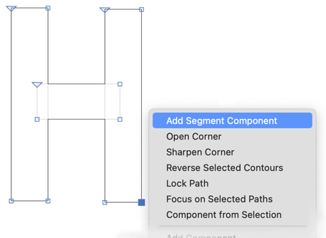

原文: [Reusing shapes: segment components](https://glyphsapp.com/learn/reusing-shapes-segment-components)
# シェイプの再利用：セグメントコンポーネント

チュートリアル

[ シェイプの再利用 ](https://glyphsapp.com/learn?q=reusing+shapes)

執筆者: Rainer Erich Scheichelbauer

[ en ](https://glyphsapp.com/learn/reusing-shapes-segment-components) [ fr ](https://glyphsapp.com/fr/learn/reusing-shapes-segment-components) [ zh ](https://glyphsapp.com/zh/learn/reusing-shapes-segment-components)

2022年7月27日更新（初版公開：2020年5月31日）

セグメントコンポーネントは、繰り返し現れるシェイプのエッジを統一するのにとても便利な方法です。カップセリフや先細りのステム、トスカーナ様式の書体の装飾などを思い浮かべてみてください。

要するに、セグメントグリフとは、開いたパスを含む特別な名前のグリフで、それをセグメントコンポーネントとしてホストパスに挿入することができます。

## ステップ1：セグメントグリフを作成する

「グリフ > グリフを追加…」（Cmd-Shift-G）を選び、新しいセグメントグリフの名前を入力します。この例では、`_segment.spike`という名前にします。セグメントグリフの名前は、`_segment`で始まり、その後に任意のドット接尾辞が続く必要があります。

ベースラインに沿って開いたアウトラインを描き、最初のノードに`start`アンカーを、最後のノードに`end`アンカーを配置します。例えば、このようになります。

「グリフ > アンカーを設定」（Cmd-U）を選ぶと、セグメントグリフに2つのアンカーを追加できます。`start`アンカーと`end`アンカーが、最初の点と最後の点に正確にスナップするようにしてください。そして、それらを水平な線上に保つようにしてください。正確な高さは重要ではありませんが、ベースライン上またはその周辺に保つと扱いやすくなるでしょう。

## ステップ2：セグメントコンポーネントを挿入する

セグメントの設定ができたので、これを活用する時が来ました。文字のいずれか、例えばHを表示させ、セグメントを選択して右クリックし、コンテキストメニューから「セグメントコンポーネントを追加」を選びます。

フォント内のすべてのセグメントコンポーネントが表示されます。もしセグメントコンポーネントの作成に夢中になってすでにたくさんある場合は、検索語を入力してグリフ名を素早く検索できます。

すると、このようになります。

これを適用したい他のセグメントでも繰り返し、もしマルチプルマスター設定がある場合は、すべてのマスターに追加するのを忘れないでください。おめでとうございます、これでセグメントコンポーネントが有効になりました！

## 知っておくと便利：セグメントコンポーネントの挙動

この機能の優れた点は、セグメントコンポーネントは受け側のセグメントの長さに合わせて伸縮されることです。したがって、セグメントグリフが具体的にどのような形をしているかによりますが、サイズごとに異なるバージョンを用意するのが良い考えかもしれません。例えば`_segment.spike.xHeight`や`_segment.spike.capHeight`のようなものです。お分かりですね。一方、カップセリフや先細りのステムのような単純な曲がりである場合は、すべての用途に1つのセグメントコンポーネントだけで済むかもしれません。

そして、ある程度までは、セグメントコンポーネントは曲線に沿って曲げることさえできます。じゃーん！

### 注意
Glyphsは、シェイプの曲がり方をできるだけ忠実に保つためにノードを追加することはありません。むしろ、アウトラインの互換性をできるだけ保つために、ノードの数は同じに保たれます。（そうしないとバリアブルフォントでは機能しないためです。）そのため、*各ノード*はセグメントに対して個別の垂直オフセットを保ちます。つまり、3つの点の組（例：ハンドル-ノード-ハンドル）は、曲がりによって角度が変わる可能性があります。なぜなら、3つの点のそれぞれが（3つの点の組全体としてではなく）カーブからの独自の距離を保ち、曲率が各ノードに対して異なる非線形なズレを引き起こすからです。

したがって、セグメントコンポーネントをカーブセグメントにも適用する予定がある場合は、3つの点の組は避けた方が良いかもしれません。複雑に聞こえますか？ええ、でも心配しないでください。少し試してみれば、すぐにコツをつかめますよ。

---

更新履歴 2022-07-27: タイトル、関連記事、軽微なフォーマットを更新。

## 関連記事

[すべてのチュートリアルを見る →](https://glyphsapp.com/learn)

*   ### [シェイプの再利用：コンポーネントのテクニック](reusing-shapes-component-tricks.md)

    チュートリアル

[ シェイプの再利用 ](https://glyphsapp.com/learn?q=reusing+shapes)

*   ### [シェイプの再利用：コーナーコンポーネント](reusing-shapes-corner-components.md)

    チュートリアル

[ シェイプの再利用 ](https://glyphsapp.com/learn?q=reusing+shapes)

*   ### [シェイプの再利用：ブラシ](reusing-shapes-brushes.md)

    チュートリアル

[ シェイプの再利用 ](https://glyphsapp.com/learn?q=reusing+shapes)

*   ### [シェイプの再利用：スマートコンポーネント](smart-components.md)

    チュートリアル

[ シェイプの再利用 ](https://glyphsapp.com/learn?q=reusing+shapes)