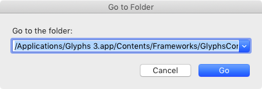
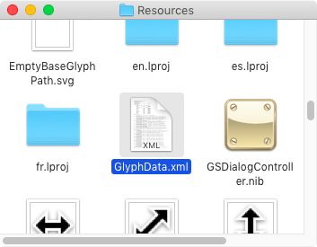
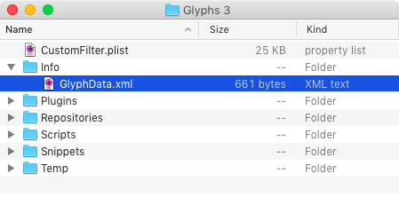
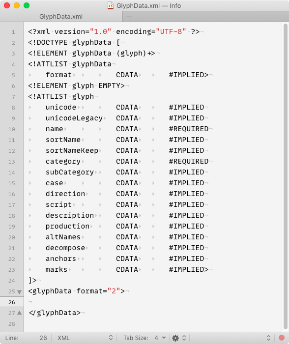
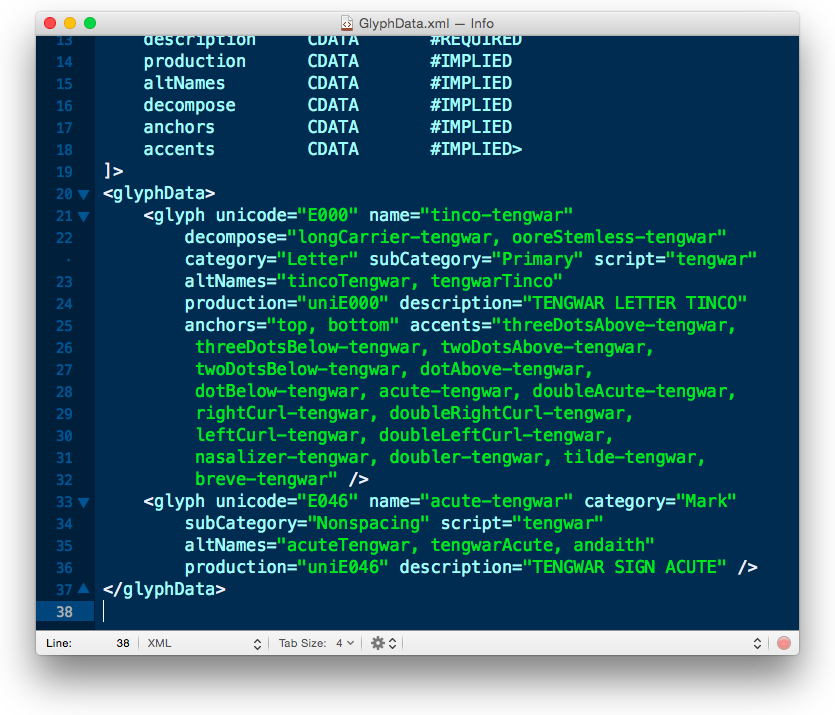
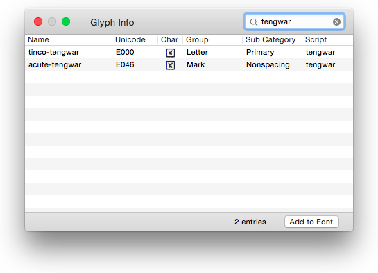
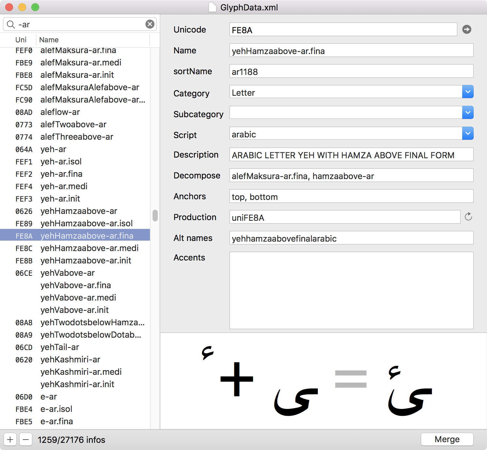

原文: [Roll your own glyph data](https://glyphsapp.com/learn/roll-your-own-glyph-data)
# 独自のグリフデータを作成する

チュートリアル

執筆者: Rainer Erich Scheichelbauer

[ en ](https://glyphsapp.com/learn/roll-your-own-glyph-data) [ zh ](https://glyphsapp.com/zh/learn/roll-your-own-glyph-data)

2022年8月8日更新（初版公開：2013年1月26日）

各グリフ名には、Unicode値から分類やソート順に至るまで、多くの情報が関連付けられています。これらすべては、内部のグリフデータベース、略して「グリフデータ」に保存されています。

Glyphsが、作成するグリフについてなぜこれほど多くのことを知っているのか、不思議に思ったことはありませんか？例えば、グリフ名を入力するとUnicodeが設定され、「グリフ > アンカーを設定」（Cmd-U）または「グリフ > アンカーをリセット」（Cmd-Shift-U）を選択すると、正しいダイアクリティカルアンカーが設定されます。その情報をどこに保存しているのでしょうか？

## GlyphData.xml

Glyphsアプリケーションの奥深くには、`GlyphData.xml`というファイルが隠されています。アプリ内のファイルを直接触るべきではありませんが、Application Supportフォルダにそのコピーを作成し、個人的なカスタマイズをそこに保存することができます。Glyphsは、内蔵の設定を上書きするためにあなたのグリフ情報を使用します。

さて、アプリケーションの中を掘り進んでXMLファイルを掘り出す必要があります。そのためには、まずGlyphsアプリケーションが「Glyphs 3.app」という名前で「アプリケーション」フォルダにあることを確認してください。次に、この行をクリップボードにコピーします。

```
/Applications/Glyphs 3.app/Contents/Frameworks/GlyphsCore.framework/Versions/A/Resources/GlyphData.xml
```

### 旧バージョン
Glyphs 2以前のユーザーの場合、アプリ名は「Glyphs.app」である必要があり、コピーするパスは次のようになります。
_/Applications/Glyphs.app/Contents/Frameworks/GlyphsCore.framework/Versions/A/Resources/GlyphData.xml_

次に、Finderで、「移動 > フォルダへ移動…」（Cmd-Shift-G）を選択します。先ほどコピーした行を、表示されるダイアログにペーストします。



「移動」を押すと、FinderはGlyphsアプリケーションの奥深く、どこかに埋もれているGlyphData.xmlというファイルを表示します。



XMLファイルが選択されている状態で、「編集 > GlyphData.xmlをコピー」（Cmd-C）を選択します。Finderウィンドウはもう閉じて構いません。

さて、「Application Support」フォルダに移動する必要があります。そこへ行く最も簡単な方法は、Glyphsで「スクリプト > スクリプトフォルダを開く」（Cmd-Shift-Y）を選択することです。これにより、「Application Support」フォルダ内の「Scripts」フォルダに移動します。必要なのは、その親フォルダにいることを確認することだけです。「Scripts」フォルダの隣には、「Temp」や「Plugins」フォルダ、そして`CustomFilter.plist`ファイルが見えるかもしれません。もしそこに「Info」フォルダがまだなければ、作成する時です（Cmd-Shift-N）。その「Info」フォルダ内に、`GlyphData.xml`をペーストします。



## XMLの編集

お気に入りのXMLまたはプレーンテキストエディタでXMLファイルを開きます。個人的には[TextMate](https://macromates.com)をお勧めしますが、多くの人は[SublimeText](http://www.sublimetext.com)や[Atom](https://atom.io)も好んで使いますし、[BBEdit](http://www.barebones.com/products/bbedit/)でも満足できるかもしれません。

アプリ内に埋もれているXMLファイルと、先ほど「Info」フォルダにコピーしたXMLファイルの両方に、関連するすべてのグリフ情報が含まれています。これらは互いに補完し合うので、XMLファイルのコピーを必要な文字だけに限定することができます。そのためには、`<glyphData>`（25行目あたりにあるはずです）と`</glyphData>`（最後の行）の間にあるものをすべて削除します。すると、次のようになります。



さて、文字のエントリは特定の形式に従わなければなりません。例を挙げてみましょう。お気に入りの文字体系[Tengwar](http://freetengwar.sourceforge.net/mapping.html)の文字をエンコードしたいとします。`U+E000 TENGWAR LETTER TINCO`はどうでしょう。そして、ついでに`U+E046 TENGWAR SIGN ACUTE`も加えてみましょう。`GlyphData.xml`のコピーに、これらの行を追加します。

```xml
<glyph unicode="E000" name="tinco-tengwar" decompose="longCarrier-tengwar, ooreStemless-tengwar" category="Letter" subCategory="Primary" script="tengwar" altNames="tincoTengwar, tengwarTinco" production="uniE000" description="TENGWAR LETTER TINCO" anchors="top, bottom" accents="threeDotsAbove-tengwar, threeDotsBelow-tengwar, twoDotsAbove-tengwar, twoDotsBelow-tengwar, dotAbove-tengwar, dotBelow-tengwar, acute-tengwar, doubleAcute-tengwar, rightCurl-tengwar, doubleRightCurl-tengwar, leftCurl-tengwar, doubleLeftCurl-tengwar, nasalizer-tengwar, doubler-tengwar, tilde-tengwar, breve-tengwar"  />
<glyph unicode="E046" name="acute-tengwar" category="Mark" subCategory="Nonspacing" script="tengwar" altNames="acuteTengwar, tengwarAcute, andaith" production="uniE046" description="TENGWAR SIGN ACUTE" />
```

 अब、次のようになるはずです（ここでインデントを少しごまかしたことは認めます）。



保存して、Glyphsを再起動し、「ウインドウ > グリフ情報」を見て、`tengwar`で検索し、Glyphsがあなたの追加を受け入れたかどうか確認してください。そして、すべて正しく行っていれば、次のようなものが表示されます。



ミッション完了。いや、待ってください、まだ完全ではありません。[他のすべてのTengwarグリフ](http://freetengwar.sourceforge.net/mapping.html)がまだ欠けています。しかし、無理はしないでください。[Toshi Omagari氏がすでに先を越しています](https://github.com/Tosche/Glyphs-custom-XMLs)。

## XML仕様

ご覧の通り、データベースに新しいグリフを追加したい場合は、`glyph`という名前のXML要素を追加する必要があります。その基本的な構造は次のとおりです。

```xml
<glyph attribute="value" />
```

各`glyph`要素は、`attribute="value"`という構造の様々な属性を取ることができます。そして、すべてのグリフエントリには、これらの*必須*属性が*必要*です。

*   `name`はグリフの名前です。Glyphsは名前によってグリフを認識するため、これは[有効なグリフ名](getting-your-glyph-names-right/.md)に設定する必要があり、また、グリフデータ全体で*一意でなければなりません*。
*   `category`はグリフのカテゴリまたはグループです。可能な値は次のとおりです。
    *   `Letter`: xやä、ن、घなどの文字
    *   `Number`: 3や३、۳などの数字
    *   `Mark`: スペーシングマークと結合マークの両方（例：アキュートアクセント）
    *   `Punctuation`: 疑問符、ピリオド、コンマなどの句読点、引用符、スラッシュ、アスタリスクなども含む
    *   `Separator`: スペースや`.notdef`グリフなど
    *   `Symbol`: ©@§&などの記号、通貨記号、数学演算子（+−÷×=など）、矢印、絵文字など

### 旧バージョン
Glyphs 2では、descriptionフィールドも必須でした。現在はオプションです（下記参照）。

これらの*オプション*属性を利用することができます（可能な場合は*すべき*です）。

*   `description`は、Unicodeスタイルの、グリフの説明的な名前です。エンコードされたグリフがある場合、公式の名前は[Unicode Checker](http://earthlingsoft.net/UnicodeChecker/)で、非公式の名前は[ConScript Unicode Registry](http://www.evertype.com/standards/csur/)で見つけることができます。

*   `unicode`は、16進数のUTF16値です。合字のようなエンコードされていないグリフを作成する場合は、省略してください。

*   `subCategory`は、グリフの種類をさらに定義するのに役立ちます。これは、もちろん`category`に依存します。

*   `case`は、ラテン文字、ギリシャ文字、キリル文字、グルジア文字、アルメニア文字などのケースフォールディングスクリプトの文字ケースを定義します。該当しない場合は省略してください。可能な値は次のとおりです。
    *   `upper`: 大文字
    *   `lower`: 小文字
    *   `smallCaps`: スモールキャップ
    *   `minor`: 下付き・上付き文字、および科学的な上付き・下付き文字や分数用の数字を含む小さな数字

*   `script`は、グリフが属する書記体系を定義します。どの書記体系にも属さない場合（例：数学記号）は省略してください。可能な値には`latin`、`arabic`、`cyrillic`、`devanagari`、`ethiopic`、`greek`、`han`などがあります。お分かりですね。

*   `anchors`は、グリフに設定可能なダイアクリティカルアンカーのカンマ区切りリストです。よくあるのは`top`、`bottom`、`center`、`ogonek`、`topleft`、`topright`、`bottomleft`、`bottomright`、`left`、`right`です。対応するマークアンカーには、先頭にアンダースコアが必要です（例：`_top`）。積み重ね可能な結合マークは、両方の種類のアンカーを持つことができます。グリフがダイアクリティカルマークのベースになれない、またはその逆の場合は、この属性を省略してください。

*   `marks`（Glyphs 2では`accents`）は、グリフが取ることができるアクセントを定義します。これは主に、アンカーをクリックしたときにGlyphsがマークの雲を描くのに役立ちます。

*   `altNames`は、アプリケーションによって認識される代替グリフ名のカンマ区切りリストです。これにより、グリフを正しくソートしたり名前を変更したりできます。例えば、`oslash`はかつて`ostroke`と呼ばれていました。この奇妙な名前を使用する古いフォントを開いたとき、Glyphsは「グリフ > グリフ情報を更新」を実行すると、それを`oslash`に更新できます。

*   `production`は、書き出し時にグリフがリネームされる名前です。通常、レガシーな[Adobe Glyph List](http://partners.adobe.com/public/developer/en/opentype/glyphlist.txt)名を記述します。AGLが4桁のUnicodeの前に`uni`、5桁のコードの前に`u`を使用している場合は、この属性を利用したいと思うでしょう。例えば、ルーマニア語とモルドバ語の`Tcommaaccent`のグリフ要素には、`name="Tcommaaccent"`と`production="uni021A"`の両方の属性があります。

*   `decompose`は、複合グリフのコンポーネントを定義します。言い換えれば、グリフを構成するパーツです。この情報は、「グリフ > 複合グリフを作成」（Ctrl-Cmd-C）コマンドを使用してそのような文字を構築する際に使用されます。コンポーネントが正しい順序でリストされていることを確認してください。例えば、ベースとなる文字が最初に来て、すべてのアクセントがそれに続きます。これは合字にも役立ちます。その場合、合字を構成するグリフの名前を追加します。例えば、`f_f_k`という合字の場合は`decompose="f, f, k"`のようにします。

*   `sortName`: デフォルトでは、Glyphsはグリフをカテゴリ内でアルファベット順に並べます。表示順を操作したい場合は、この属性を追加します。例えば、`AE`が`Adieresis`と`Agrave`の間ではなく、すべての`A`のダイアクリティカルマークの後に来るようにするために、`sortName="Az"`という属性があります。これは数字にとって非常に重要で、`sortName`は`Number.dnom.4`などのようになります。

*   `sortNameKeep`: `sortName`と同じですが、「ファイル > フォント情報 > その他 > 代替グリフをベースグリフの隣に保持」がオンの場合に優先されます。

*   `direction`は、グリフの書字方向を明示的に設定します。コンポーネントの配置やカーニングの挙動に影響を与えることがあります。ある程度、書字方向は、スクリプトごとに方向を設定するアプリ内部のリストによってすでに処理されています。例えば、グリフがヘブライ語に属すると定義されている場合、通常はその方向を明示的に設定する必要はありません。
    *   `LTR`: 左から右へ
    *   `RTL`: 右から左へ
    *   `BIDI`: 双方向グリフ、つまりLTRとRTLの両方のテキストで使用できるグリフ。通常、句読点、引用符、ダッシュに適用されます。

*   `unicodeLegacy`: `unicode`と同じですが、その文字はもはや使用されるべきではないため、フォントには書き込まれません。有名な例は、ラテン文字の表現形（`f_f`のような合字がほとんど）で、これは廃止されたエンコーディングとのラウンドトリップ変換のためだけにUnicodeに存在しますが、フォントでは何の目的も果たしません。（唯一の例外として、フォント情報のカスタムパラメータ*Use Arabic Presentation Form Unicodes*を使って、アラビア文字の位置指定形のレガシーUnicode値を強制的に書き出すことができます。しかし、製品版のフォントでこれを*決して*行わないでください。テキスト処理を*壊す*からです。これはベータテスト目的のみで、他には何もありません。警告はしましたよ。）

### 旧バージョン
Glyphs 2にはcase属性はありません。小文字、大文字、スモールキャップはサブカテゴリと見なされていました。

## EditGlyphDataアプリ

グリフデータを編集するための、よりスマートで便利な方法があります。それは[EditGlyphData](/tools/editglyphdata)と呼ばれ、私たちのウェブサイトの「ツール」セクションで見つけることができます。これを使って、複数のXMLファイルからのデータを1つにマージしたり、おそらく何よりも良いことに、データをタブ区切りのテキストファイルに書き出して、お気に入りのスプレッドシートアプリで編集したりできます。さらに、すべてのXMLの不整合問題（下記参照）を回避できます。クールですね。



## 潜在的な落とし穴

注意深く、正確に行ってください。もしグリフデータをめちゃくちゃにすると、*必ず*問題に直面します。よくある問題をいくつか紹介しますので、最初からそれらを避けることができます。

まず、必須の属性は必ずすべて記入してください。*常に*です。

第二に、このトリックを使って独自の命名規則を作成するのは魅力的です。しかし、GlyphsはOpenTypeフィーチャーを自動的に構築するために特定の名前を期待していることを覚えておいてください。したがって、独自のグリフデータを作成したら、独自のフィーチャーコードも書く必要があるかもしれません。

第三に、そしてこれが重要ですが、`GlyphData.xml`に壊れたXMLが含まれていると、Glyphsはあなたのカスタムグリフデータを無視します。ですから、時々XMLを適切に検証するようにしてください。TextMateのような多くのツールには、内蔵のバリデーターがあります。もちろん、XMLをコピーして[W3 Markup Validation Service](http://validator.w3.org/#validate_by_input)のようなウェブベースのバリデーターにペーストすることもできます。あるいは、EditGlyphDataアプリ（上記参照）を使用してください。

カスタム情報をGlyphsに注入するためのすべてはこれだけです。もし他の人もあなたの追加から利益を得られると感じるなら、`GlyphData.xml`ファイルをGithubに置くことができます。そうする場合は、[GlyphsInfo GitHubリポジトリ](https://github.com/schriftgestalt/GlyphsInfo)で行ってください（手順はreadmeにあります）。あるいは、gitに慣れていない場合は、[Glyphsフォーラム](https://forum.glyphsapp.com/)で提案を投稿するか、あなたの変更がすべてのGlyphsユーザーのデフォルトになるべきだと考えるなら、フォーラムで機能リクエストを提出するか、他の方法で私たちに連絡してください。

---

更新履歴 2013-02-03: 10.6でのGlyphData.xmlへのナビゲート方法に関する注記を追加（@typefacts氏に感謝）、2つの軽微なテキスト改善。

更新履歴 2013-02-12: 「潜在的な落とし穴」を追加。

更新履歴 2013-03-25: XMLファイル名の誤字を修正（George Thomas氏に感謝）。

更新履歴 2014-12-11: ドットなしグリフの新しい表記法に更新、sortNameの例をAEに変更。

更新履歴 2015-07-08: 部分的に書き直し。Glyphs 2に更新、新しいリンクと更新されたリンク。古い部分を削除。Tengwarとリンクを追加（@Tosche_E氏に感謝）。

更新履歴 2017-05-30: EditGlyphDataアプリへの参照を追加、廃止されたバグレポートリンクを削除。

更新履歴 2018-09-25: GlyphsInfoリポジトリへのリンクを追加。Dave氏に感謝。

更新履歴 2021-12-10: Glyphs 3向けの軽微な更新。

更新履歴 2022-01-19: 欠落していた属性`unicodeLegacy`と`direction`を追加。Deluge氏に感謝。

## 関連記事

[すべてのチュートリアルを見る →](https://glyphsapp.com/learn)

*   ### [フォントビューのサイドバーにカスタム項目を追加する](custom-sidebar-entries-in-font-view.md)

チュートリアル