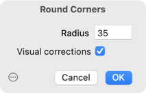
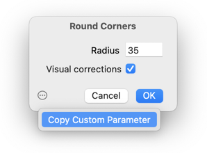
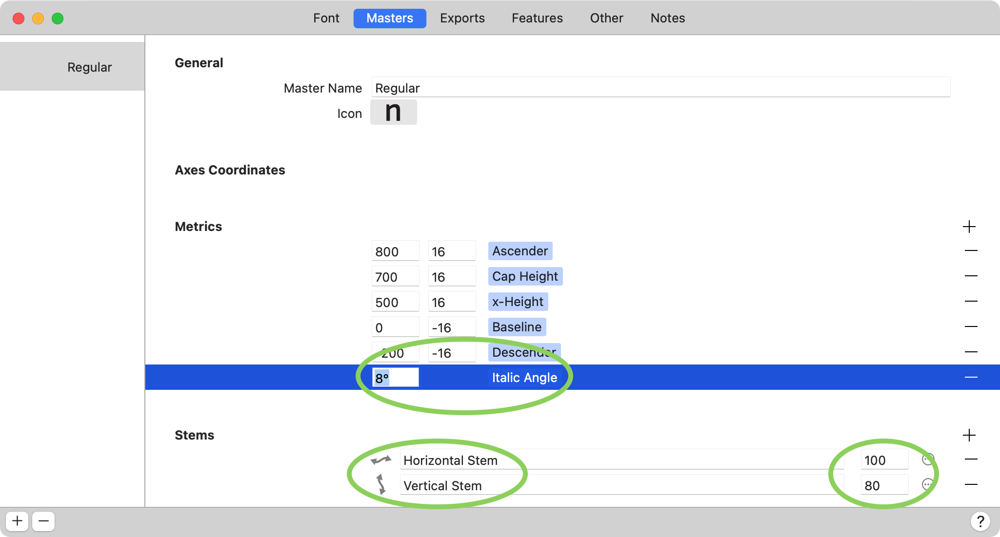
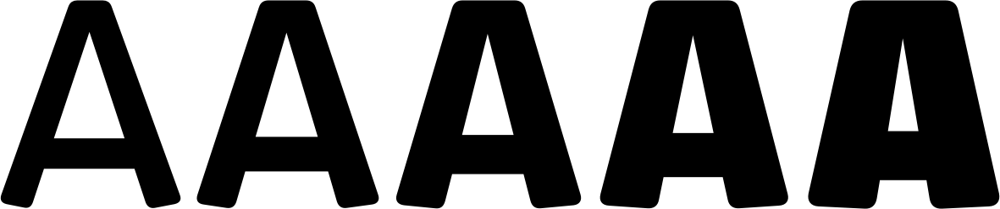
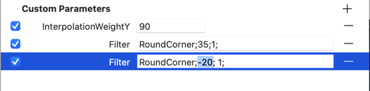
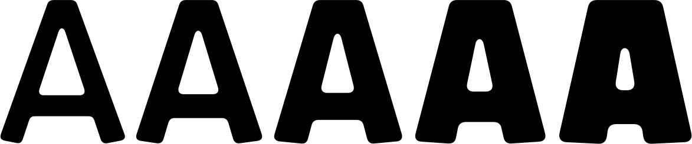
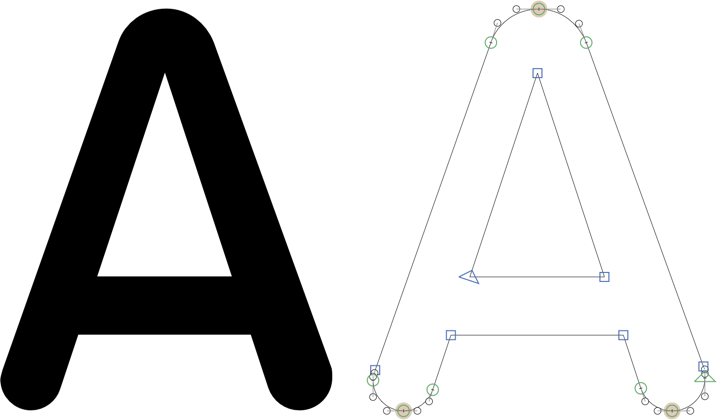

原文: [Rounded corners](https://glyphsapp.com/learn/rounded-corners)
# 角を丸める

チュートリアル

[ シェイプの再利用 ](https://glyphsapp.com/learn?q=reusing+shapes)

執筆者: Rainer Erich Scheichelbauer

[ en ](https://glyphsapp.com/learn/rounded-corners) [ fr ](https://glyphsapp.com/fr/learn/rounded-corners) [ zh ](https://glyphsapp.com/zh/learn/rounded-corners)

2022年10月18日更新（初版公開：2012年6月10日）

おそらく「角を丸める」フィルタはご存知でしょう。グリフ全体または選択範囲に適用できます。一度に複数のグリフに適用することさえできます。素晴らしい。しかし、それだけではありません。

フィルタを手動で適用する際の問題は、元のパスが失われることです。しかし、非破壊的に角を丸める方法があります。方法は次のとおりです。

まず、「フィルタ > 角を丸める」でフィルタを選択し、半径の値を入力します。すぐにプレビューが表示されます。

### プロのヒント
「視覚補正」オプションを使用すると、より自然な見た目の角丸を作成できます。このオプションは、鈍角で角の半径を大きくし、鋭角で半径を小さくすることで、より自然なシェイプを生み出します。

**OKをクリックしないでください。** 代わりに、アクションメニューを開き、「カスタムパラメータをコピー」を選択します。

さて、「キャンセル」を押し、「ファイル > フォント情報 > 書き出し」（Cmd-I）を開きます。次に、フォント情報ウィンドウの左下にあるプラスボタンで新しいインスタンスを追加します。お好みの設定を選びます。スタイル名に「Rounded Regular」などを付けたいかもしれません。さて、先ほどコピーしたパラメータを、「カスタムパラメータ」フィールドにまずクリックし、次にCmd-Vで貼り付けて追加します。すると、ほら。

「フィルタ」パラメータが追加され、その値として`RoundCorner;`に続いてセミコロンで区切られた2つの数値が設定されているのがわかります。最初の数値は丸める半径、2番目の数値は0（視覚補正オフ）または1（視覚補正オン）のいずれかです。例えば、`RoundCorner; 30; 1`は、半径30ユニットで、上記で説明した視覚補正を適用して角を丸めることを意味します。

次にフォントファミリーを書き出すと、角が丸い追加のフォントが手に入ります！これはクールです。

## 内側の角を丸める

おそらく、シェイプの外側の角だけが丸められ、カウンターやクロスバーの「白い」角はそのままになっていることにお気づきでしょう。

その通りです。「角を丸める」は外側、つまり「黒い」角にのみ丸めを適用します。内側の「白い」角も丸めるには、まずオーバーラップを削除し、次にポイントを選択してフィルタを適用する必要があります。

しかし、上で示したようにカスタムパラメータで丸めを自動化している場合、どうすればよいのでしょうか？カスタムパラメータで内側の丸めを適用するための特別なトリックがあります。

1.  パラメータをコピー＆ペーストします。
2.  パラメータの値の文字列で、丸める半径の値を負に変更します。

内側の丸めは実際よりも大きく見えるため、半径の値も調整することを検討してください。したがって、ほとんどの場合、半径を少し小さくしたくなるでしょう。値を試してみて、どれが最適か自分で確かめてみてください。以下は、内側と外側の角に同じ丸め半径を適用したAの列です。

## 角丸フォント vs. 角を丸める

「フィルタ」メニューに別の項目があることにお気づきかもしれません。「角丸フォント」です。これにはオプションがなく、シェイプ全体をすぐに丸めるようです。

違いは、角だけでなく*ステム（縦画）*にも楕円形の丸めを適用することです。これを実現するために、この機能は「ファイル > フォント情報 > マスター」で入力した標準のステムに依存します。マスターの*最初の垂直ステム*を読み取り、選択したグリフにオーバーシュート付きの適切な角丸を適用しようとします。

もちろん、これをカスタムパラメータとして適用することもできます。対象のインスタンスに「フィルタ」パラメータを追加し、値の文字列として`RoundedFont`を追加するだけです。このパラメータでは、セミコロンの後にステムの値を加えることで、異なるステムの太さを指定することもできます。例えば、`RoundedFont; 36`は、入力された、または補間された最初の垂直標準ステムの代わりに、丸めに36をステムの太さとして使用します。

## カスタムパラメータについてさらに詳しく

[カスタムパラメータのチュートリアル](custom-parameters.md)で、他にできるトリックを読んでください。例えば、パラメータ文字列に`include`ディレクティブを使って、パラメータの効果を特定のグリフにのみ限定することができます。

---

更新履歴 2016-02-19: フィルタの簡単な追加方法を追加し、Glyphs 2向けに更新。

更新履歴 2018-10-16: 「内側の角を丸める」と「角丸フォント」フィルタを追加。

更新履歴 2022-08-03: タイトル、関連記事、軽微なフォーマットを更新、誤字を修正、スクリーンショットを更新。

更新履歴 2022-10-18: パラメータ文字列の誤字を修正（Stewart氏に感謝）。

## 関連記事

[すべてのチュートリアルを見る →](https://glyphsapp.com/learn)

*   ### [カスタムパラメータ](custom-parameters.md)

    チュートリアル

*   ### [シェイプの再利用：コーナーコンポーネント](reusing-shapes-corner-components.md)

    チュートリアル

[ シェイプの再利用 ](https://glyphsapp.com/learn?q=reusing+shapes)