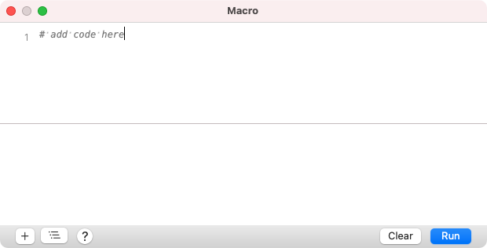
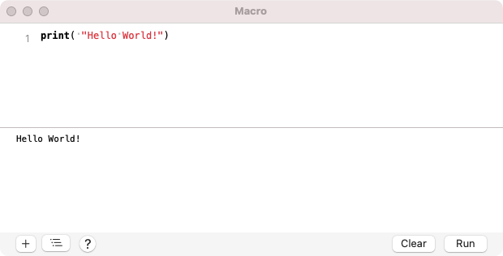
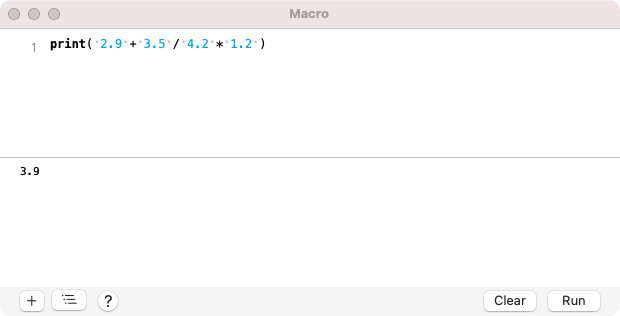
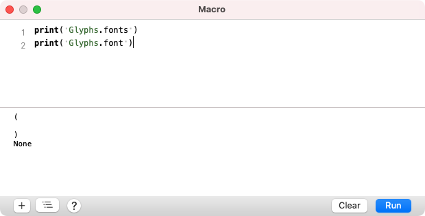

原文: [Scripting Glyphs](https://glyphsapp.com/learn/scripting-glyphs-part-1)
# スクリプトでGlyphsを動かす、パート1

チュートリアル

[ スクリプト ](https://glyphsapp.com/learn?q=scripting)

執筆者: Rafał Buchner & Rainer Scheichelbauer

[ en ](https://glyphsapp.com/learn/scripting-glyphs-part-1) [ zh ](https://glyphsapp.com/zh/learn/scripting-glyphs-part-1)

2022年8月18日更新（初版公開：2012年6月22日）

これはPythonチュートリアルシリーズの第一弾です。事前の知識は必要ありません。この最初のパートでは、マクロウィンドウで最初の一歩を踏み出します。

この複数パートからなるチュートリアルで、Pythonを始めましょう。朝のうちに全部読み通して、昼食をとり、同じ日の午後に最初のスクリプトを書くことができます。楽しんでください！

## マクロパネル

「ウインドウ」メニューに行き、「マクロパネル」（Opt-Cmd-M）を選択します。次のようなウィンドウが表示されます。



上半分はPythonコードを書くためのものです。下半分では、Glyphsがあなたのコードに反応して答えを返すことができます。水平の区切り線をドラッグして、自分が快適な位置に調整できます。さて、Glyphsに反応させるものを与えてみましょう。上半分にこの行を入力することから始めます。

```python
print( "Hello World!" )
```
大文字と小文字は重要ですので、`Print`ではなく`print`と書いてください。
`print`コマンドの後に括弧を開くことが重要です。引用符はまっすぐなもの（タイポグラフィ的に言えばインチ記号）で、曲がった引用符ではありません。`print`とまっすぐな引用符の間のスペースは必要ありませんが、閉じる引用符は必要です。単一引用符`'...'`または二重引用符`"..."`を使用できます。

「実行」ボタン（Cmd-Return、fn-Return、または拡張キーボードのEnter）をクリックすると、次のように表示されるはずです。



## 文字列、整数、浮動小数点数、オブジェクト

さて、`print`コマンドはPythonに結果エリアに何かを出力させます。このコマンドの括弧の間にあるものが何であれ、出力されます。テキストは引用符で囲む必要があります。プログラマーはこれを数値と対比して文字列と呼びます。

数値といえば、どんな計算の結果もPythonに出力させることができます。Pythonは整数（「integers」）と小数（「floats」）を区別し、入力されたものに応じて結果を整数または小数で保持します。5を2で割ると2になりますが、5.0を2.0で割ると2.5になります。



「実行」（Cmd-Return）を数回クリックすると、結果エリアがすぐに散らかっていくのがわかります。「クリア」（Cmd-K）をクリックして、きれいにしましょう。

## オブジェクト

さて、Pythonに他のものをいくつか出力させてみましょう。これを試してみてください。
```python
print( Glyphs )
```
結果はそれほど驚くべきものではありません。しかし、`Glyphs`は文字列でも数値計算でもなく、私たちがオブジェクトと呼ぶものです。さて、`Glyphs`は他のオブジェクトを含むオブジェクトです。それらのサブオブジェクトを参照するには、`Glyphs`にピリオドと、そのサブオブジェクトの名前を追加します。これを試してみてください。
```python
print( Glyphs.fonts )
print( Glyphs.font )
```
そしてPythonは、現在開かれているフォントのリストを括弧内に出力し（`print Glyphs.fonts`の結果）、さらに最前面のフォントを出力します（`print Glyphs.font`の結果）。もしフォントを何も開いていなければ、空のリスト（括弧の間に何もない）と`None`が答えとして返されます。



## リスト

いくつかのフォントを開き、マクロパネルに戻って「クリア」（Cmd-K）と「実行」（Cmd-Return）をもう一度クリックします。異なるフォントを最前面に持ってきて、コードを再度実行すると何が起こるか見てみましょう。

`Glyphs.fonts`はフォントのリストを返します。リスト内の個々のフォントにアクセスするには、0から始まる数字を角括弧で追加します。このように。
```python
print( Glyphs.fonts[0] ) # 1番目に開かれたフォント、Glyphs.fontと同じ
print( Glyphs.fonts[1] ) # 2番目に開かれたフォント
```
ああ、そうです。シャープ記号`#`はコメントを示します。それに続くものはすべて無視されます。コードに説明的なコメントを挿入するのは良い考えです。何年か後にスクリプトを修正または適応させようとするとき、自分のコメントに感謝するでしょう。本当に。

そして、すでにお察しの通り、`Glyphs.font`は`Glyphs.fonts[0]`のショートカットとして使えます。

そしてご想像の通り、フォントでさえもサブオブジェクトを持っています。繰り返しになりますが、ピリオドとオブジェクト名を追加することで、それらにアクセスできます。これを試してみてください。
```python
print( Glyphs.font.glyphs )
```
個々のグリフには、インデックス番号または名前を角括弧で追加することでアクセスできます。これらを試してみてください。
```python
print( Glyphs.font.glyphs[7] )
print( Glyphs.font.glyphs["a"] )
```
繰り返しになりますが、ピリオドを追加して、グリフが含むどんな情報にもアクセスできます。これらを試してみてください。
```python
print( Glyphs.font.glyphs["a"].name )
print( Glyphs.font.glyphs["a"].category )
print( Glyphs.font.glyphs["a"].subCategory )
print( Glyphs.font.glyphs["a"].unicode )
```
コピー＆ペーストが使えることを覚えておいてください。すべての行を再入力する必要はありません。

## 変数

確かに、これはグリフ情報にアクセスするのに非常に非効率な方法です。もしbについて同じ情報が欲しいなら、4行すべてでaをbに変更しなければなりません。そこで、変数を導入しましょう。
```python
glyphname = "b"
print( Glyphs.font.glyphs[glyphname].name )
print( Glyphs.font.glyphs[glyphname].category )
print( Glyphs.font.glyphs[glyphname].subCategory )
print( Glyphs.font.glyphs[glyphname].unicode )
```
`print`コマンドの最後にコンマの後に`end=" "`を追加すると、改行を避け、すべての情報を1行にまとめることができます。
```python
glyphname = "b"
print( Glyphs.font.glyphs[glyphname].name, end=" " )
print( Glyphs.font.glyphs[glyphname].category, end=" " )
print( Glyphs.font.glyphs[glyphname].subCategory, end=" " )
print( Glyphs.font.glyphs[glyphname].unicode, end=" " )
```
さて、プログラミングとは、すべてを再入力しなくて済むようにすることです。反復的な作業はPythonにやらせるべきです。すべての行で同じ部分が見えますか？そのために別の変数を追加し、明確にするために空白行を加えましょう。
```python
glyphname = "b"
myGlyph = Glyphs.font.glyphs[glyphname]

print( myGlyph.name, end=" " )
print( myGlyph.category, end=" " )
print( myGlyph.subCategory, end=" " )
print( myGlyph.unicode )
```
これで変更する必要があるのは、最初の行のグリフ名だけです。

## ループ処理

しかし、フォント内のすべてのグリフについてその情報が欲しい場合、どうすればよいでしょうか？もちろん、ブロック全体を100回コピー＆ペーストして、すべてのグリフ名を変更することもできます。しかし、それはロボット以外には退屈な作業なので、Pythonにやらせましょう。
```python
for myGlyph in Glyphs.font.glyphs:
    print( myGlyph.name, end=" " )
    print( myGlyph.category, end=" " )
    print( myGlyph.subCategory, end=" " )
    print( myGlyph.unicode )
```
`print`の行がすべてインデントされていることに注意してください。一定数のスペースまたはタブのどちらかを使用できますが、すべての行が同じようにインデントされている限り問題ありません。Pythonはインデントの仕方にかなりうるさいので、一つのスタイルを決めて*それを貫いてください*。私はタブが好きなので、今後の例ではそのように続けます。

Pythonはすべてのグリフを順に処理し、毎回情報行を出力します。すごい！これは、このチュートリアルで実際に何かに使える最初の結果のようなものです。例えば、コピーしてステータスレポートのためにメールに貼り付けることができます。もう少し多用途にして、`print`コマンドを1つだけにして、コードを2行にまとめてみましょう。
```python
for myGlyph in Glyphs.font.glyphs:
    print( myGlyph.name, myGlyph.category, myGlyph.subCategory, myGlyph.unicode )
```
 अब、開いているすべてのフォントについてグリフ情報レポートが欲しいとします。幸いなことに、インデントをネストさせることができます。これはどうでしょう。
```python
for myFont in Glyphs.fonts:
    print()
    print( "Report for:", myFont.familyName )
    for myGlyph in myFont.glyphs:
        print( myGlyph.name, myGlyph.category, myGlyph.subCategory, myGlyph.unicode )
```
レポートに他の情報を含めたいですか？[Glyphs Pythonドキュメント](http://docu.glyphsapp.com/#gsglyph "Glyphs.app Python Scripting API Documentation — Glyphs.app Python Scripting API 0.3 documentation")にアクセスして、Glyphオブジェクト（「GSGlyph」）とFontオブジェクト（「GSFont」）が他に何ができるか見てみましょう。

[次のパート](scripting-glyphs-part-2.md)では、GSGlyphをもう少し深く掘り下げ、ノードまで掘り下げていきます。

---

更新履歴 2014-10-04: ショートカットGlyphs.fontを追加、パート2へのリンクを追加。

更新履歴 2015-07-30: Glyphs 2のスクリーンショットを更新。

更新履歴 2016-12-08: スクリーンショットを更新、フォーマットを修正、Glyphs.currentDocumentの代わりにGlyphs.fontを使用。

更新履歴 2016-12-09: 最初の段落を追加。

更新履歴 2020-12-02: Python3向けに更新。

更新履歴 2022-18-08: タイトル、軽微なフォーマット変更、関連記事を更新。

更新履歴 2022-09-23: 誤字を修正（Kaliata氏に感謝）。

## 関連記事

[すべてのチュートリアルを見る →](https://glyphsapp.com/learn)

*   ### [Glyphsのスクリプト、パート2](scripting-glyphs-part-2.md)

チュートリアル

[ スクリプト ](https://glyphsapp.com/learn?q=scripting)

*   ### [Glyphsのスクリプト、パート3](scripting-glyphs-part-3.md)

チュートリアル

[ スクリプト ](https://glyphsapp.com/learn?q=scripting)

*   ### [Glyphsのスクリプト、パート4](scripting-glyphs-part-4.md)

チュートリアル

[ スクリプト ](https://glyphsapp.com/learn?q=scripting)