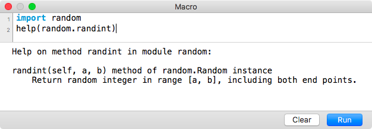

原文: [Scripting Glyphs](https://glyphsapp.com/learn/scripting-glyphs-part-2)
# スクリプトでGlyphsを動かす、パート2

チュートリアル

[ スクリプト ](https://glyphsapp.com/learn?q=scripting)

執筆者: Rafał Buchner & Rainer Scheichelbauer

[ en ](https://glyphsapp.com/learn/scripting-glyphs-part-2) [ zh ](https://glyphsapp.com/zh/learn/scripting-glyphs-part-2)

2022年8月18日更新（初版公開：2012年6月28日）

最初のパートでは、フォントとグリフの情報を出力する方法を学びました。今回は、一歩進んで、実際にフォントを操作してみたいと思います。お気に入りのフォントのコピーを作成し、Pythonの筋肉を温めておいてください。

このチュートリアルは、「[スクリプトでGlyphsを動かす、パート1](scripting-glyphs-part-1.md)」を先に読んでいることを前提としています。

## グリフレイヤー

まず、Glyphsが文字をどのように整理しているかを思い出しましょう。文字を描いたり編集したりするときに扱うパス、アンカー、ガイドラインなど、これらすべては単に*グリフ*のプロパティではありません。むしろ、それらはグリフが持つことができる*レイヤー*の1つに属しています。レイヤーには、手動で挿入したレイヤーとマスターレイヤー（補間に使用されるもの）の両方があります。

## 選択されたレイヤー

さて、何かをする前に、どのレイヤーが選択されているかを判断する必要があります。方法はこうです。マクロパネルを表示し、次のように入力します。

```python
print( Glyphs.font.selectedLayers )
```
すると、次のようなものが表示されます。
```
(
    "GSLayer <0x7fe471526320>: [Bold Italic] (A)",
    "GSLayer <0x7fe47152fbb0>: [Bold Italic] (B)",
    "GSLayer <0x7fe471530d30>: [Bold Italic] (C)"
)
```
ここで何をしたのでしょうか？まず、`Glyphs`オブジェクトを取り、その`font`プロパティを要求しました。これは現在の、つまり最前面にあるフォントを返すはずです。フォントが開かれていない場合はエラーが出ます。確かに、結果（「GSLayer…」）はあまり情報量が多くありませんが、これがGlyphsがレイヤーを呼ぶ方法です。16進数の識別コード、それに続くレイヤー名、そしてそれぞれのグリフ名です。

幸いなことに、私たちはこれらのことを直接扱う必要はあまりありません。Pythonにその仕事をさせることができます。そこで、最初の行はこうなります。

```python
myLayers = Glyphs.font.selectedLayers
```

## パスへのアクセス

これを少し拡張してみましょう。
```python
myLayers = Glyphs.font.selectedLayers
for thisLayer in myLayers:
    print( thisLayer.parent.name )
    print( thisLayer.paths )
```
これをマクロパネルで実行すると、次のような答えが得られます。
```
A
(<GSPath 57 nodes and 29 segments>, <GSPath 10 nodes and 4 segments>)
B
(<GSPath 53 nodes and 23 segments>, <GSPath 42 nodes and 16 segments>)
C
(<GSPath 57 nodes and 23 segments>)
```
何が起こったのでしょうか？`font`から`selectedLayers`を取得したので、ユーザーが選択したすべてのレイヤーが得られ、それを`myLayers`という変数に渡しました。

2行目では、`myLayers`にあるすべてのレイヤーをループ処理しています。レイヤーを1つずつ、まず`thisLayer`と名付け、次に`thisLayer`にその`parent`の名前を尋ねてマクロパネルに出力し、最後に`thisLayer`にそのパスを尋ねてその答えもマクロパネルに出力します。その後、ループは`myLayers`の次のレイヤーに進み、全体が再び始まります。これは`myLayers`の最後のレイヤーが処理されるまで続きます。

ここでこっそり入れたものがあります。`parent`です。オブジェクトのサブオブジェクトにアクセスするには、ピリオドとそのサブオブジェクトの名前を追加すればよかったのを覚えていますか？Glyphsで現在開かれているすべてのフォントを知りたい場合は、`Glyphs.fonts`と入力します。最初に開かれているフォントのファミリー名を知りたい場合は、`Glyphs.fonts[0].familyName`と入力します。この方法で、オブジェクトツリーを下に掘り下げることができます。しかし、時にはすでにオブジェクトがあり、オブジェクト階層を1つ*上に掘り上げる*必要がある場合があります。これを行うには、オブジェクトの`parent`を参照します。

この場合、`thisLayer`に格納されているレイヤーがあり、そのレイヤーがどのグリフに属しているかを知りたいので、レイヤーにその親を尋ねます。`thisLayer.parent`です。そして最後に、その親グリフに名前を尋ね、`thisLayer.parent.name`とし、その結果を`print`コマンドに渡します。

最後の行も同様に重要です。なぜなら、私たちは聖杯、つまり私たちのフォントを構成するまさにそのパスにたどり着いたからです。次のステップでパスにひどいことをするので、フォントのコピーで作業していることを願っています。警告はしましたよ。

## パスとノード

さて、選択したレイヤーに何かクレイジーなことをしたいと思います。すべてのノードをランダムに左右に散らしてみましょう。そこで行うことはこれです。Pythonにランダムな正または負の数値を生成させ、それを最初の選択されたレイヤーの最初のパスの最初のノードのx座標に加えます。そして、これを他のすべてのノード、パス、レイヤーで繰り返します。

Pythonには乱数生成器がありますが、私たちのパーティーには特別な招待が必要です。これを*モジュールのインポート*または*ライブラリのインポート*と呼びます。そこで、乱数生成器をインポートすることから始めます。

```python
import random
```
そして、ここだけの話ですが、`import random`するたびに、randomの*seed*関数を呼び出すのが良い考えです。

```python
random.seed()
```
`seed`という単語の後ろにある括弧に気づきましたか？括弧は、いわゆる*メソッド*を示します。そうです、オブジェクトは他のオブジェクトを持つことができますが、メソッド（または「関数」）も持つことができます。メソッドは、それが付随しているオブジェクトに対して何かをします。`seed()`関数は、乱数生成器に*本当に*ランダムであること、そしてそれについてぐずぐずしないように伝えます。これをしないと、乱数生成器が同じ結果を2回返す可能性があり、それは絶対に避けたいことです。

さて、それではすべての選択されたレイヤー、そのすべてのパス、そしてすべてのノードを順に処理し、それらに必要なことをしていきましょう。

```python
import random
random.seed()

myLayers = Glyphs.font.selectedLayers
for thisLayer in myLayers:
    for thisPath in thisLayer.paths:
        for thisNode in thisPath.nodes:
            thisNode.x += random.randint( -50, 50 )
```
最後の行を除いて、すべてが明確なはずです。変数`thisNode`は、パス上のオンカーブまたはオフカーブの点を保持しています。前の行ですべてのノードを反復処理しています。プロパティ`x`は、もちろん、その点のx座標です。

演算子`+=`は、「右側にあるものを左側の変数に加える」という意味です。例えば、`x+=5`はxを5だけ増やします。そのため、`+=`は*インクリメント演算子*とも呼ばれます。これは`x=x+5`と言うよりも短く、効率的な方法です。

### プロのヒント
クラスがどのメソッドやオブジェクトをサポートしているかを確認するには、Pythonの組み込み`help()`関数をそれに実行します。例えば、`import random`した後に、`help(random)`を実行できます。`help()`関数は、その括弧の間に置いたものの技術的な説明を出力します。

`help(random)`からの出力の膨大な量に圧倒された場合は、`randint`について具体的なヘルプを得るために、代わりに`help(random.randint)`を実行してみてください。



さて、ランダムな部分です。まず、数行前にインポートしたモジュール`random`を取ります。次に、そのメソッドの1つ、すなわち*ランダムな整数*の略である`randint()`を取得します。すべてのメソッドと同様に、`randint()`の最後には括弧があります。その括弧の中に、入力値を渡すことができ、その入力に基づいて結果が得られます。メソッド`randint()`は、コンマで区切られた2つの値、*最小値*と*最大値*を取り、最小値と最大値の間のランダムな整数を返します。私たちは`randint()`に最小値として`-50`、最大値として`50`を渡し、ランダムな数が返されることを期待します。

つまり、要するに、最後の行はこれを行います。それぞれの点のx座標を取り、それに-50から50の間のランダムな数を加えます。理にかなっていますか？

ここまですべて明確ですか？はい？では、次は何でしょうか？このスクリプトを「スクリプト」メニューの項目に変えて、いつでも好きなときにアクセスできるようにしましょう。どうやって？「[スクリプトでGlyphsを動かす、パート3](scripting-glyphs-part-3.md)」でそのすべてを読んでください。

---

更新履歴 2014-10-04: パート1と3へのリンクを追加。

更新履歴 2016-12-08: いくつかのフォーマットを修正、古い警告を削除、help()に関するプロのヒントを追加。

更新履歴 2019-02-06: テキストとフォーマットの軽微な調整。

更新履歴 2019-02-12: 誤字を修正。

更新履歴 2020-12-02: Python3向けに更新。

更新履歴 2022-18-08: タイトル、関連記事、軽微なフォーマットを更新。

## 関連記事

[すべてのチュートリアルを見る →](https://glyphsapp.com/learn)

*   ### [Glyphsのスクリプト、パート1](scripting-glyphs-part-1.md)

チュートリアル

[ スクリプト ](https://glyphsapp.com/learn?q=scripting)

*   ### [Glyphsのスクリプト、パート3](scripting-glyphs-part-3.md)

チュートリアル

[ スクリプト ](https://glyphsapp.com/learn?q=scripting)

*   ### [Glyphsのスクリプト、パート4](scripting-glyphs-part-4.md)

チュートリアル

[ スクリプト ](https://glyphsapp.com/learn?q=scripting)