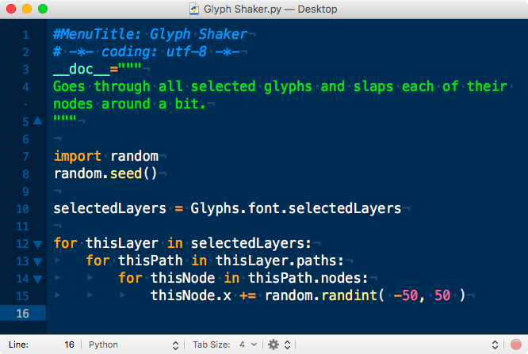

原文: [Scripting Glyphs](https://glyphsapp.com/learn/scripting-glyphs-part-3)
# スクリプトでGlyphsを動かす、パート3

チュートリアル

[ スクリプト ](https://glyphsapp.com/learn?q=scripting)

執筆者：

[ en ](https://glyphsapp.com/learn/scripting-glyphs-part-3) [ zh ](https://glyphsapp.com/zh/learn/scripting-glyphs-part-3)

2024年10月30日更新（初版公開：2012年7月17日）

さて、オブジェクトモデルを理解したところで、今度は自分たちのスクリプトで「スクリプト」メニューを拡張していきましょう。

このチュートリアルは、まず「[スクリプトでGlyphsを動かす、パート1](scripting-glyphs-part-1.md)」と「[スクリプトでGlyphsを動かす、パート2](scripting-glyphs-part-2.md)」を読んでいることを前提としています。

Glyphsのメニューバーにある「スクリプト」メニューにお気づきかもしれません。これからスクリプトを書いて、そのメニューに配置していきます。まず、良いテキストエディタが必要です。個人的には、[TextMate](http://macromates.com/)（無料）と[SublimeText](https://www.sublimetext.com)（80ドル）が好きです。この2つは、コーディングがとても簡単で楽しくなる特別な機能があるからです。Macのベテランは[BBEdit](https://www.barebones.com/products/bbedit/index.html)（50ドル）、[Smultron](https://www.peterborgapps.com/smultron/)（15ドル）、[Coda](https://www.panic.com/coda/buy.html)（100ドル）も好んで使います。これらのいずれかのライセンスをすでにお持ちの可能性もあり、その場合は、そのエディタをPythonコーディングに引き続き簡単に使用できます。しかし、予算に限りがある、あるいは、とりあえずコーディングを試してみてから投資を判断したいという場合は、無料の[TextWrangler](http://www.barebones.com/products/TextWrangler/)、[SubEthaEdit](https://subethaedit.net)、または最近人気のある[Visual Studio Code](https://code.visualstudio.com/)を使うことができます。

## .pyファイルを作成する

どのエディタを選んでも、Cmd-Nで新しいドキュメントを作成し、次のフォルダに保存してください。

`~/Library/Application Support/Glyphs/Scripts/`

チルダ（`~`）はあなたのホームフォルダを表します。ヒント：保存ダイアログでCmd-Shift-Gを押すと、「フォルダへ移動」機能が有効になり、上記の一行をペーストできます。スクリプトには`Glyph Shaker.py`のような名前を付けましょう。前回からのPythonコードを、本格的なスクリプトにしていくからです。そう、`.py`という拡張子はPythonスクリプト用です。さて、コーディングに移りましょう…

## ヘッダーを追加する

何よりもまず最初に。メニュータイトルを入力し、ファイルのエンコーディングを宣言し、簡単な説明を追加することから始めます。

```python
#MenuTitle: Glyph Shaker
# -*- coding: utf-8 -*-
__doc__="""
Goes through all selected glyphs and slaps each of their nodes around a bit.
"""
```

最初の行は、実際にはコメントです。Pythonでは、シャープ記号（`#`）で始まる行はコメントだからです。しかし、Glyphsは`#MenuTitle:`で始まるコメントを、スクリプトのメニュー名として解釈します。もしスクリプトにこのような行がない場合、Glyphsは代わりにファイル名を使用します。しかし、私たちのスクリプトは、「スクリプト」メニューに「Glyph Shaker」として表示されます。

2行目もコメントで、今回は`.py`ファイルの[エンコーディングをUTF-8と宣言](https://peps.python.org/pep-0263/)しています。通常、UTF-8がデフォルトと見なされるため、これは本来不要なはずです。ですから、念のために追加する程度で構いません。絵文字を含む文字列で問題が発生した場合、エンコーディングを宣言することで解決するかもしれません。また、` -*- `という記述も本来は不要ですが、これがあることでエンコーディング宣言の互換性が高まります。特に、スクリプトがウェブサイトや別のコンテキストで表示される場合に有効です。

続く行では、`__doc__`という特別な変数を宣言しています。これはいわゆる*doc string*、つまりPythonオブジェクト、この場合はスクリプトに関する短いドキュメントテキストを格納します。三重引用符は複数行にわたる文字列を表すので、もし必要なら数段落にわたる説明を追加することもできます。Glyphsはこのdoc stringを、「スクリプト」プルダウンメニューでスクリプト名の上にマウスポインタを置いたときに表示されるツールチップに使います。

## コードを追加する

次に、[前回と同様](scripting-glyphs-part-2/.md)、ランダマイザを起動させる必要があります。

```python
import random
random.seed()
```

そして、現在選択されているすべてのレイヤーを取得し、`selectedLayers`という変数に格納します。（私たちはすべての文字のすべてのレイヤー/マスターをいじるのではなく、実際に見ているものだけを対象にしたいのです。）こうします。

```python
selectedLayers = Glyphs.font.selectedLayers
```

これで、`selectedLayers`を使って何かをすることができます。例えば、各レイヤーの各パスの各ノードを順に処理し、それを`-50`から`50`の間のランダムな量だけ動かします。

```python
for thisLayer in selectedLayers:
    for thisPath in thisLayer.paths:
        for thisNode in thisPath.nodes:
            thisNode.x += random.randint( -50, 50 )
```

すべて正しく行っていれば、おおよそ次のようになるはずです。



## 保存して使う

これだけです。スクリプトを保存し、Glyphsに戻って「スクリプト」メニューを見てみましょう。あれ？！「Glyph Shaker」スクリプトがありません！それは、まずGlyphsにスクリプトフォルダを再スキャンするように指示する必要があるからです。方法はこうです。メニューを開きながら*Option*キーを押し続けると、「スクリプトフォルダを開く」項目が「スクリプトを再読み込み」に変わります。その後、スクリプトは`#MenuTitle:`の後に指定した名前で表示されます。

これで、一番気に入らないフォントを開き、最も嫌いな文字を選択し、「スクリプト」メニューから「Glyph Shaker」を選んで、ついにふさわしいお仕置きをすることができます。Cmd-Opt-Rのショートカットで、このひっぱたきを何度も繰り返しましょう。思い知ったか、Helvetica！

さあ、頑張ったご褒美にコーヒーとアイスクリームで休憩しましょう。そして、次のステップへの準備ができたら、このPython入門の[パート4](scripting-glyphs-part-4.md)を読み進めてください。

---

更新履歴 2014-10-04: エンコーディング行を追加、docstringの説明を更新。

更新履歴 2016-12-08: スクリーンショットを修正（Friedrich Althausen氏に感謝）。

更新履歴 2017-05-24: パート4への参照を追加。

更新履歴 2018-12-26: より多くのテキストエディタへのリンクを追加。

更新履歴 2020-12-02: Python3向けに更新。

更新履歴 2021-02-17: エンコーディングに関する部分を削除（Python 3には無関係）。

更新履歴 2022-18-08: タイトル、関連記事、軽微なフォーマット変更。

更新履歴 2024-10-30: セクションタイトル、エンコーディング宣言の説明を追加、軽微な表現の修正（Janus氏に感謝）。

## 関連記事

[すべてのチュートリアルを見る →](https://glyphsapp.com/learn)

*   ### [スクリプトでGlyphsを動かす、パート1](scripting-glyphs-part-1.md)

    チュートリアル

[ スクリプト ](https://glyphsapp.com/learn?q=scripting)

*   ### [スクリプトでGlyphsを動かす、パート2](scripting-glyphs-part-2.md)

    チュートリアル

[ スクリプト ](https://glyphsapp.com/learn?q=scripting)

*   ### [スクリプトでGlyphsを動かす、パート4](scripting-glyphs-part-4.md)

    チュートリアル

[ スクリプト ](https://glyphsapp.com/learn?q=scripting)