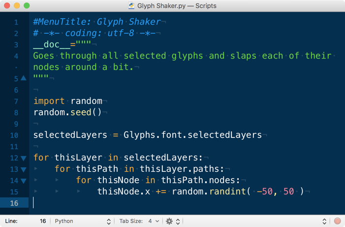

原文: [Scripting Glyphs](https://glyphsapp.com/learn/scripting-glyphs-part-4)
# スクリプトでGlyphsを動かす、パート4

チュートリアル

[ スクリプト ](https://glyphsapp.com/learn?q=scripting)

執筆者: Rafał Buchner & Rainer Scheichelbauer

[ en ](https://glyphsapp.com/learn/scripting-glyphs-part-4) [ zh ](https://glyphsapp.com/zh/learn/scripting-glyphs-part-4)

2023年2月27日更新（初版公開：2017年5月24日）

関数は、スクリプトを拡張しつつ、全体像を把握し正気を保つための効率的な方法です。今回は、それらを使ってフォントに悪さをする方法を紹介します。フフフ。

このチュートリアルはシリーズのパート4であり、したがって[パート1](scripting-glyphs-part-1.md)、[パート2](scripting-glyphs-part-2.md)、および[パート3](scripting-glyphs-part-3.md)を読んでいることを前提としています。これまでのコードはこうです。



```python
#MenuTitle: Glyph Shaker
# -*- coding: utf-8 -*-
__doc__="""
Goes through all selected glyphs and slaps each of their nodes around a bit.
"""

import random
random.seed()

selectedLayers = Glyphs.font.selectedLayers

for thisLayer in selectedLayers:
    for thisPath in thisLayer.paths:
        for thisNode in thisPath.nodes:
            thisNode.x += random.randint( -50, 50 )
```

### プロのヒント
2行目の`coding: utf-8`の指定は、このスクリプトをGlyphs 3以降専用に書く場合はもはや必要ありません。しかし、この行を残しておいても害はなく、スクリプトが古いバージョンのGlyphsとの互換性を保つことができます。

ここまでは順調です。コードを読み通して何をしているか理解するのは、かなり簡単だと思います。結局のところ、それほど複雑ではありません。それでも、スクリプトの全体像を把握するために、いくつかの点に注意を向けたいと思います。まず、この行を見てください。

```python
selectedLayers = Glyphs.font.selectedLayers
```
これは、以下と同等です。

```python
currentFont = Glyphs.font
selectedLayers = currentFont.selectedLayers
```
最初のバージョンはすべてを1行にコンパクトにまとめていますが、2番目のバージョンは内容を2行に分割しています。パフォーマンス的には、両者の間に実質的な違いはありません。したがって、どちらの方法でも問題ありません。しかし、2番目の解決策にはいくつかの利点があります。

*   第一に、後で`currentFont`を何度も*再利用*したいと思うかもしれません。
*   第二に、*デバッグ*が簡単になります。タイプミスがありGlyphsがエラーを報告した場合、短い行の方が間違いを見つけやすくなります。エラーメッセージは常にエラーのある行番号を報告することを覚えておいてください。この例では、問題は現在のフォントへのアクセスか、その選択されたレイヤーへのアクセスかのどちらかにあります。最初の解決策では、どちらが問題かわからず、自分で探す必要があります。2番目の解決策では、報告された行番号が*直接*問題の部分を指し示し、何が起こっているかすぐにわかります。
*   第三に、2番目の解決策はコードをより*読みやすく*保ちます。これは、バグを探すときに非常に重要になります。

そうです。コードは読みやすく保ちましょう。後でそれに対処することに*なります*。あるいはもっと悪いことに、他の誰かにコードを見てもらう必要があり、その場合はコードを読みやすく保つのが非常に、非常に良い考えです。コードの可読性を高めるためには、インターネット上に多くのヒントがありますが（Googleはあなたの友達です）、私たちの目的のためには、常にこれらのことを覚えておいてください。

*   *変数名は明確で読みやすいものにしましょう。*`f`や`currF`ではなく、`currentFont`のような分かりやすい名前を使いましょう。
*   上記で説明したように、*1行につき1つのアクション*を心がけましょう。3つのステップを1行に詰め込まないでください。
*   区別できる一連のアクションは*関数*に移動しましょう。長い一連のステップ、いわゆる「スパゲッティコード」を作成するのは避けましょう。

## 関数

え？自分の関数を作るだって？このチュートリアルの[パート2](scripting-glyphs-part-2.md)でPythonの*組み込み関数*について少し話しましたが、まだ自分の関数は作っていません。確かに、私たちのスクリプトでは、まだそれほど必要ではありませんでした。

しかし、ノードを水平に叩くだけでなく、もっと多くのことをしたいと思うようになり、スクリプトを拡張したい可能性を考えてみてください。例えば、グリフを少し回転させたり、ランダムに上下に動かしたり、歪ませたり、ランダムにいくつかの余分なパスを追加または削除したりすることもできます。私たちのループを見てみましょう。
```python
for thisLayer in selectedLayers:
    slapNodesRandomly(thisLayer)
    rotateLayerRandomly(thisLayer, 5)
    randomVerticalMove(thisLayer, 100)
```
きれいで明確に見えますよね？括弧の中の数字が何であるかはあまりはっきりしませんが、それ以外はクールです。`selectedLayers`内の各`thisLayer`をループ処理し、次にノードをランダムに叩き、次にレイヤーを最大5度ランダムに回転させ、最後にグリフ全体を最大100ユニットランダムに上下に動かします。まだこれに対するコードは書いていませんが、`slapNodesRandomly()`、`rotateLayerRandomly()`、`randomVerticalMove()`といった関数名を見るだけで、何をしているかわかります。

では、どうやって新しい関数を作るのでしょうか？簡単です、`def`文を使います！関数は、初めて*呼び出される前に定義*されていなければなりません。そこで、ループの直前に、私たちの関数定義を挿入します。
```python
def slapNodesRandomly(thisLayer):
    for thisPath in thisLayer.paths:
        for thisNode in thisPath.nodes:
            thisNode.x += random.randint( -50, 50 )
```
`def`の後の単語が関数名で、この場合は`slapNodesRandomly`です。その後に括弧`()`が続き、その中には変数名、いわゆる*引数*（この場合は`thisLayer`）を含めることができます。括弧は非常に重要です。なぜなら、それによって変数名と関数名が区別されるからです。言い換えれば、この関数を参照するとき、単に`slapNodesRandomly`と呼ぶのではなく、より具体的に`slapNodesRandomly()`と呼びます。そうすれば、誰もがそれが関数であり、他のものではないとわかります。

この場合、関数には`thisLayer`という1つの引数が含まれており、これはそれに渡される値を参照します。この変数は*ローカル*であり、つまり関数の*内部*でのみ有効でアクセス可能です。これは、`thisLayer`という単語が関数の*内部*（ローカル関数変数）と*外部*（グローバルスクリプト変数）で異なる意味を持つことを意味します。この区別をより明確にするために、一部のプログラマーは関数内で異なる変数名の慣習を適用することを好みます。例えば、`thisLayer`の代わりに`myLayer`などです。

さて、`selectedLayers`をループ処理する際に必要なのは、単に関数を*呼び出す*ことだけです。
```python
for thisLayer in selectedLayers:
    slapNodesRandomly(thisLayer)
```
これは関数を*呼び出し*、括弧内でグローバル変数`thisLayer`を引数として関数に渡します。そして、`slapNodesRandomly()`関数は、以前ループ内に記述していたのと同じことを行います。しかし今、私たちはより多くの機能でスクリプトを拡張する準備ができており、全体像を把握し続けることができます。

これを行う前に、要点をまとめましょう。現在のコードの全体像はこうです。
```python
#MenuTitle: Glyph Shaker
# -*- coding: utf-8 -*-
__doc__="""
Goes through all selected glyphs and slaps each of their nodes around a bit.
"""

import random
random.seed()

selectedLayers = Glyphs.font.selectedLayers

def slapNodesRandomly(thisLayer):
    for thisPath in thisLayer.paths:
        for thisNode in thisPath.nodes:
            thisNode.x += random.randint( -50, 50 )

for thisLayer in selectedLayers:
    slapNodesRandomly(thisLayer)
```

## 抽象化

コーディングの世界では、抽象化とは、関数をより設定可能にし、より多くの目的やアプリケーションに適合させることを意味します。現在のコードを見ると、`slapNodesRandomly()`はすべてのノードのx座標を最大50ユニットしか変更しません。y座標の変更も提供し、50以外の最大値を許可することで、関数をより抽象的にすることができます。早速やってみましょう。まず、括弧内に*追加の引数*を追加し、ついでに*デフォルト値*も指定します。
```python
def slapNodesRandomly(thisLayer, maxX=50, maxY=0):
```
これについて覚えておくべきことは2つあります。引数はコンマで区切る必要があり、デフォルト値を持つ引数（別名「キーワード引数」）は通常の引数の後に来ます。デフォルト値は等号の後に指定します。

これまで通り`slapNodesRandomly()`を呼び出すこともできますが、新しい値を指定してデフォルトを上書きすることもできます。関数を呼び出す際のすべての選択肢は次のとおりです。

*   `slapNodesRandomly(thisLayer)`：キーワード引数はデフォルト値にフォールバックできるため、指定する必要はありません。`maxX`は50、`maxY`は0です。
*   `slapNodesRandomly(thisLayer, 100)`：`maxX`は100になりますが、`maxY`は依然としてデフォルトの0の値を取ります。
*   `slapNodesRandomly(thisLayer, 90, 80)`：`maxX`に90、`maxY`に80を指定して関数を呼び出します。
*   `slapNodesRandomly(thisLayer, maxY=70)`：`maxX`をスキップするのでデフォルトの50になりますが、`maxY`は70に設定されます。キーワード引数は、*名前なしで定義済みの順序で*（上記の2つの例のように）、または*名前付きで任意の順序で*、必要な通常の引数（この場合は`thisLayer`）の後に来る限り、指定できます。

もちろん、抽象化を利用するためには、まだいくつかの行を変更する必要があります。まず、ノードをランダムに動かす行を2行に拡張し、固定値の代わりにキーワード引数を挿入します。
```python
                thisNode.x += random.randint( -maxX, maxX )
                thisNode.y += random.randint( -maxY, maxY )
```
したがって、完全な関数は次のようになります。
```python
def slapNodesRandomly(thisLayer, maxX=50, maxY=0):
    for thisPath in thisLayer.paths:
        for thisNode in thisPath.nodes:
            thisNode.x += random.randint( -maxX, maxX )
            thisNode.y += random.randint( -maxY, maxY )
```
おめでとうございます、関数の抽象化に成功しました。 अब、呼び出し元の行を変更できます。
```python
for thisLayer in selectedLayers:
    slapNodesRandomly(thisLayer, maxX=70, maxY=70)
```
気に入らないフォントを開き、すべてのグリフを選択し、スクリプトにその魔法をかけさせてみましょう。フフフ。

## アフィン変換：移動

さて、ループを整理したので、新しい関数を追加するのは簡単なはずです。すでに述べた`randomVerticalMove()`から始めましょう。これはグリフ全体をランダムに上下に動かすべきです。したがって、2つの引数が必要なことがわかります。レイヤーと、最大の移動距離です。すると、関数の最初の行はこうなるでしょう。
```python
def randomVerticalMove(thisLayer, maxShift=100):
```
次に、負のmaxShiftと正のmaxShiftの間のランダムな数値を取得する必要があります。
```python
        shift = random.randint( -maxShift, maxShift )
```
そして今、その移動をノード、アンカー、コンポーネントを含むレイヤー全体に適用する必要があります。[docu.glyphsapp.com](https://docu.glyphsapp.com)で`GSLayer`が持つメソッドをよく見ると、`GSLayer.applyTransform()`という関数が見つかります。これは[アフィン変換](https://en.wikipedia.org/wiki/Affine_transformation)行列の6つの数値を引数として取ります。高校の数学が遠い昔のことである場合のために、6つの数値の意味は次のとおりです。

1.  原点からの水平方向の拡大・縮小：1.0 *（変更なしを意味する）*
2.  原点からの水平方向のせん断（スキュー）：0.0
3.  原点からの垂直方向のせん断（スキュー）：0.0
4.  原点からの垂直方向の拡大・縮小：1.0
5.  水平方向の移動：0.0
6.  垂直方向の移動：0.0

言い換えれば、何もしない行列は`[1, 0, 0, 1, 0, 0]`のようになり、レイヤーを垂直に移動させたい場合は、最後の数値を変更する必要があります。この場合、単に変数`shift`を挿入するだけです。つまり、`[1, 0, 0, 1, 0, shift]`が私たちの行列です。それだけです。したがって、関数の残りの部分は次のようになります。
```python
        shiftMatrix = [1, 0, 0, 1, 0, shift]
        thisLayer.applyTransform( shiftMatrix )
```
OK、要点をまとめましょう。私たちの関数は次のようになります。
```python
def randomVerticalMove(thisLayer, maxShift=100):
    shift = random.randint( -maxShift, maxShift )
    shiftMatrix = [1, 0, 0, 1, 0, shift]
    thisLayer.applyTransform( shiftMatrix )
```
そして、私たちのループは今、これに拡張されました。
```python
for thisLayer in selectedLayers:
    slapNodesRandomly(thisLayer, maxX=70, maxY=70)
    randomVerticalMove(thisLayer, maxShift=200)
```
最後の行で、`randomVerticalMove()`関数を呼び出し、2つの引数を渡しています。ループ処理中のレイヤーと、許可する最大の移動距離です。もっと楽しくするために、デフォルトの100ではなく200を選びました。

## アフィン変換：回転

回転はどうでしょうか？クールに聞こえますが、行列に回転はありませんよね？高校の最後の年の数学を覚えていれば問題ありません。回転は、水平方向と垂直方向のせん断（スキュー）と、いくつかの補正的な拡大・縮小の組み合わせによって実現できます。もしよろしければ、三角法の計算に再び飛び込むこともできますが、話を短くして、行列を教えます。原点を中心に角度aで回転させるには、行列 *cos(a), -sin(a), sin(a), cos(a), 0, 0* が必要です。

さて、これで準備は万端ですよね？角度を計算し、その行列に埋め込み、アフィン変換を適用すれば完了です。まあ…そう簡単ではありません。すべての変換は*原点*を中心に行われることを覚えておいてください。レイヤーの境界の中心のような、より良い回転中心で回転させたい場合は、レイヤーの内容全体を原点に移動させ、その後回転させ、最後にすべてを元の位置に戻す必要があります。理にかなっていますか？OK、では始めましょう。
```python
def rotateLayerRandomly(thisLayer, maxAngle=5):
```
最初に行う必要があるのは、レイヤーの中心を見つけ、それを原点に移動させることです。幸いなことに、レイヤーには`bounds`という属性があり、`bounds`には`origin`と`size`という2つの属性があります。さらに深く掘り下げると、`origin`には`x`と`y`という属性があり、`size`には`width`と`height`の両方があることがわかります。中心を計算するには、原点から始め、幅の半分と高さの半分を加える必要があります。次の2行がそれを行います。
```python
        xCenter = thisLayer.bounds.origin.x + thisLayer.bounds.size.width * 0.5
        yCenter = thisLayer.bounds.origin.y + thisLayer.bounds.size.height * 0.5
        shiftMatrix = [1, 0, 0, 1, -xCenter, -yCenter]
        thisLayer.applyTransform( shiftMatrix )
```
そして、その後の2行は、レイヤーの内容を原点の上に移動させるための変換行列を構築します。

 अब、回転する時間です。言い換えれば、まず負と正の最大値の間のランダムな角度を計算し、次にその角度のサインとコサインで別の変換行列を構築して適用する必要があります。ランダムな数値の部分は簡単です。
```python
        angle = random.randint( -maxAngle, maxAngle )
```
さて、その角度のコサインとサインをどうやって得るのでしょうか？Pythonでは、最も基本的な数学を超えるものについては、ほとんどの場合モジュールがあり、それは`math`と呼ばれています。以前`random`をインポートしたようにインポートでき、その後その関数にアクセスできます。まず、`import`行を拡張して`math`モジュールも含める必要があります。
```python
import random, math
```
`math`が三角関数に関して何を持っているか見てみましょう。TextEditやSublimeTextの新しいPythonウィンドウ、またはGlyphsのマクロパネルで、これを入力して実行してください。
```python
import math
help(math)
```
多くの出力が表示され、その中に`sin()`と`cos()`という2つの関数の定義があります。ヘルプの出力を絞り込むには、これを実行してください。
```python
import math
help(math.sin)
help(math.cos)
```
すると、次のような出力が得られるはずです。
```
Help on built-in function sin in module math:

sin(...)
    sin(x)

    Return the sine of x (measured in radians).

Help on built-in function cos in module math:

cos(...)
    cos(x)

    Return the cosine of x (measured in radians).
```
OK、つまり、xがラジアンで測定されている場合に限り、`math.cos(x)`と`math.sin(x)`を実行できるということです。待ってください、私たちの角度は度で測定されているので、まずそれをラジアンに変換する必要があります。幸いなことに、`math`モジュールには`radians()`関数もあります。それについて詳しく知るには、`help(math.radians)`を実行できます。
```
Help on built-in function radians in module math:

radians(...)
    radians(x)

    Convert angle x from degrees to radians.
```
ふう。では、`rotateLayerRandomly()`関数を続けましょう。まず、ラジアンへの変換を行い、次に行列を構築して適用する必要があります。
```python
        angleRadians = math.radians( angle )
        rotationMatrix = [math.cos(angleRadians), -math.sin(angleRadians), math.sin(angleRadians), math.cos(angleRadians), 0, 0]
        thisLayer.applyTransform( rotationMatrix )
```
何か忘れましたか？もちろん！全体を原点から元の位置に戻す必要があります！言い換えれば、前に行ったことの逆です。
```python
        shiftMatrix = [1, 0, 0, 1, xCenter, yCenter]
        thisLayer.applyTransform( shiftMatrix )
```
しかし、それで終わりだと思います。要点をまとめましょう。私たちの関数は次のようになります。
```python
def rotateLayerRandomly(thisLayer, maxAngle=5):
    # 原点の上に移動：
    xCenter = thisLayer.bounds.origin.x + thisLayer.bounds.size.width * 0.5
    yCenter = thisLayer.bounds.origin.y + thisLayer.bounds.size.height * 0.5
    shiftMatrix = [1, 0, 0, 1, -xCenter, -yCenter]
    thisLayer.applyTransform( shiftMatrix )

    # 原点を中心に回転：
    angle = random.randint( -maxAngle, maxAngle )
    angleRadians = math.radians( angle )
    rotationMatrix = [ math.cos(angleRadians), -math.sin(angleRadians), math.sin(angleRadians), math.cos(angleRadians), 0, 0 ]
    thisLayer.applyTransform( rotationMatrix )

    # 元の位置に戻す：
    shiftMatrix = [1, 0, 0, 1, xCenter, yCenter]
    thisLayer.applyTransform( shiftMatrix )
```
明確にするためにコメントを追加しました。そして、私たちのループは今、このようになっています。
```python
for thisLayer in selectedLayers:
    slapNodesRandomly(thisLayer, maxX=70, maxY=70)
    randomVerticalMove(thisLayer, maxShift=200)
    rotateLayerRandomly(thisLayer, maxAngle=15)
```
そして、今のところ最後の要点まとめとして、スクリプト全体は次のようになります。
```python
#MenuTitle: Glyph Shaker
# -*- coding: utf-8 -*-
__doc__="""
Goes through all selected glyphs, slaps their nodes around, rotates them a little, and shifts them up or down a little.
"""

import random, math
random.seed()

def slapNodesRandomly(thisLayer, maxX=50, maxY=0):
    for thisPath in thisLayer.paths:
        for thisNode in thisPath.nodes:
            thisNode.x += random.randint( -maxX, maxX )
            thisNode.y += random.randint( -maxY, maxY )

def randomVerticalMove(thisLayer, maxShift=100):
    shift = random.randint( -maxShift, maxShift )
    shiftMatrix = [1, 0, 0, 1, 0, shift]
    thisLayer.applyTransform( shiftMatrix )

def rotateLayerRandomly(thisLayer, maxAngle=5):
    # 原点の上に移動：
    xCenter = thisLayer.bounds.origin.x + thisLayer.bounds.size.width * 0.5
    yCenter = thisLayer.bounds.origin.y + thisLayer.bounds.size.height * 0.5
    shiftMatrix = [1, 0, 0, 1, -xCenter, -yCenter]
    thisLayer.applyTransform( shiftMatrix )

    # 原点を中心に回転：
    angle = random.randint( -maxAngle, maxAngle )
    angleRadians = math.radians( angle )
    rotationMatrix = [ math.cos(angleRadians), -math.sin(angleRadians), math.sin(angleRadians), math.cos(angleRadians), 0, 0 ]
    thisLayer.applyTransform( rotationMatrix )

    # 元の位置に戻す：
    shiftMatrix = [1, 0, 0, 1, xCenter, yCenter]
    thisLayer.applyTransform( shiftMatrix )

# すべての選択されたレイヤーをループ処理：
selectedLayers = Glyphs.font.selectedLayers
for thisLayer in selectedLayers:
    slapNodesRandomly(thisLayer, maxX=70, maxY=70)
    randomVerticalMove(thisLayer, maxShift=200)
    rotateLayerRandomly(thisLayer, maxAngle=15)
```
OK、もう少し整理したことを認めます。doc stringを更新し、`selectedLayers`の代入をループの直前に移動させ、あちこちにコメントを追加しました。

そして、括弧や角括弧とその内容の間に余分なスペースを入れることについて、少し一貫性がなかったことに気づいたかもしれません。それは実際には問題ではありません。コーディングスタイルの問題で、読みやすさを高めるために時々余分なスペースを入れることがあります。しかし、このせいでずさんだと非難されたこともあるので、私よりも一貫性を持たせたいと思うかもしれません。

さて、それがフォントに何をするか見てみましょう。スクリプトを保存し、あまり好きではなかったフォントを開き、いくつかのグリフを選択して、「スクリプト」メニューから「Glyph Shaker」スクリプトを再度実行します。すると、こうなります。


はっ、クール。関数に渡す値をいろいろ試して、そのフォントを地獄に突き落としてやりましょう。情けは無用です。

---

更新履歴 2017-06-19: 2つのサンプルでsin()とcos()の呼び出しを修正（Jeff Kellem氏に感謝）。

更新履歴 2018-12-26: `slapNodesRandomly()`の説明で数値の値を修正：`maxX`のデフォルトは100ではなく50です。

更新履歴 2022-18-08: タイトル、関連記事、軽微なフォーマットを更新。

更新履歴 2023-02-27: 軽微なフォーマット、UTF8のヒントを追加。

## 関連記事

[すべてのチュートリアルを見る →](https://glyphsapp.com/learn)

*   ### [Glyphsのスクリプト、パート3](scripting-glyphs-part-3.md)

チュートリアル

[ スクリプト ](https://glyphsapp.com/learn?q=scripting)

*   ### [Glyphsのスクリプト、パート2](scripting-glyphs-part-2.md)

チュートリアル

[ スクリプト ](https://glyphsapp.com/learn?q=scripting)

*   ### [Glyphsのスクリプト、パート1](scripting-glyphs-part-1.md)

チュートリアル

[ スクリプト ](https://glyphsapp.com/learn?q=scripting)