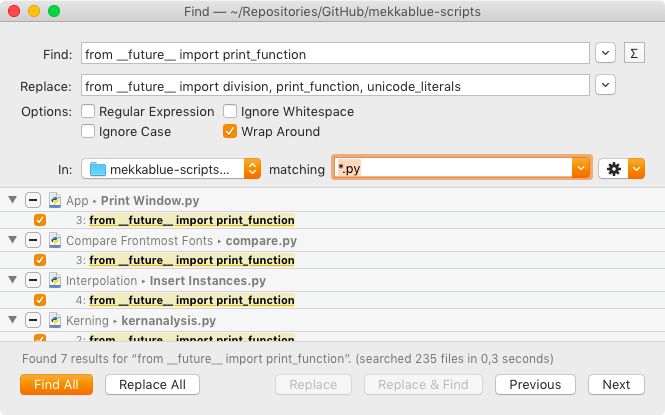
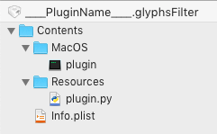

原文: [Scripting: upgrading to Python 3](https://glyphsapp.com/learn/scripting-upgrading-to-python3)
# スクリプト：Python 3へのアップグレード

チュートリアル

[ スクリプト ](https://glyphsapp.com/learn?q=scripting)

執筆者: Rainer Erich Scheichelbauer

[ en ](https://glyphsapp.com/learn/scripting-upgrading-to-python3) [ zh ](https://glyphsapp.com/zh/learn/scripting-upgrading-to-python3)

2022年8月7日更新（初版公開：2019年11月26日）

Glyphs 3が登場し、Python 2は終焉を迎えようとしています。このチュートリアルでは、あなたのスクリプトやプラグインのコードを、Glyphs 2と3、そしてPython 2と3の両方で動作させる方法について解説します。これにより、ユーザーがスムーズに移行できるようになります。

さて、ここではコードをアップグレードして、*両方の*環境で動作するようにする方法について説明します。そうです、それは可能です。そして、それはかなりクールで、あなたが思うより少ない労力で済みます。2つのステップで行います。まず、既存のコードをすべてPython 3に移行し、後のステップで新しいAPIに適応させます。

### 注意
新しいAPIはまだ開発中です。このチュートリアルは継続的に更新していきます。ですので、このページをブックマークして、今後数週間の間に時々訪れることをお勧めします。まもなく、Glyphs 3のアルファ版が提供されますので、2番目のステップを始めることができます。[Glyphsフォーラム](https://forum.glyphsapp.com)に登録していることを確認してください。開発者向けのダウンロードリンクはここで公開します。

では、コードの変更を始めましょう。読み進めてください。

## クイックガイド

まず、*Glyphs 2のまま*で作業を進めますが、コードをPython 3にアップグレードし、同時にPython 2との互換性を保ちます。これを達成するために、すべてのスクリプトで以下のことを行う必要があります。

1.  スクリプトの先頭に、以下の`__future__`インポートが含まれていることを確認してください。
    ```python
    #MenuTitle: SCRIPTNAME
    # -*- coding: utf-8 -*-
    from __future__ import division, print_function, unicode_literals
    ```

2.  `print x`文をすべて`print(x)`関数に変更します。（`futurize`スクリプトがこれに役立ちます。詳細は後述。）

3.  `Foundation`（基本的なもの）または`AppKit`（UI関連のもの）から、すべての`NS`オブジェクトを明示的にインポートします。どちらか分からない場合は`AppKit`からインポートしてください。`AppKit`は`Foundation`を含んでいるからです。例：`from Foundation import NSPoint`など。

さて、スクリプトをGlyphs 2でも動作させ続けたい場合は、Glyphs 2でスクリプトがまだ機能するかどうかを確認してください。

## 詳細

### Python 3の入手

すでにPython 3がインストールされているか確認してください。Terminal.appで、次のように入力します。
```
python3 --version
```
…そしてReturnキーを押します。結果として次のようなものが表示されるはずです。
```
Python 3.7.5
```
もしそうなっていれば、準備完了です。次の章に進んでください。

しかし、`command not found`というエラーが返ってきた場合は、Python 3をインストールする必要があります。最も良い方法は、良好なインターネット接続を確認し、Terminal.appで次のように入力することです。
```
brew install python3
```
もしパーミッションエラーが出た場合は、先頭に`sudo`を付けて再試行してください。
```
sudo brew install python3
```
`sudo`を使用する必要がある場合、Macのパスワードの入力を求められます。パスワードの文字が表示されなくても驚かないでください。これはターミナルがパスワードを扱う方法です。パスワードを「見えない状態で」入力し、Returnキーを押して続行してください。

もし受け取ったエラーが`brew`が不明であることに関するものであれば、まず[Homebrewをインストールする](https://docs.brew.sh/Installation)必要があるかもしれません。

これが完了したら、`python3 --version`コマンドを再度試してください。

まだエラーが出ますか？もしhomebrewの扱いに慣れているなら、`brew install python3`または`sudo brew install python3`を試してから、再度挑戦してください。それでもエラーが出る場合は、フォーラムでお知らせください。そちらでサポートします。

**
更新履歴 2020-01-21: ** Tim Ahrens氏が、特定の条件下での困難を報告しています。`python3 --version`を実行すると、*command not found*エラーが表示されることがあります。しかし、`brew install python3`を実行すると、formulaは変更されなかったと表示され、おそらくPython 3はすでにインストールされているがリンクされていないと付け加えられるでしょう。`brew link python`を使用するように提案されます。もしそれでうまくいくなら、結構です。しかし、特にシンボリックリンクのエラーメッセージなど、まだ問題に遭遇する可能性があります。その場合は、`brew link --overwrite python`でシンボリックリンクを強制するか、問題のディレクトリを削除して再度`brew link python`を試してみてください。

繰り返しになりますが、`python3 --version`で、すべてが完了したか確認してください。

### 一括置換

すべてのモダンなコードエディタ（Sublime Text, TextMate, Atom, BBEditも）は、複数ファイルにまたがる検索と置換、または.pyファイルのフォルダを反復処理することをサポートしています。お好みのエディタの検索ダイアログのオプションをよく見てください。簡単です。



### print()

これは、はるかに大きな変更点となるでしょう。実際、ほとんどのスクリプトにとって、これがコードにおける*唯一の*重要な変更点となります。

Python 2では、`print`は*文*でした。つまり、`print`という単語の後にスペースを置き、その後に評価して表示させたい式を続けるという書き方でした。Python 3では、`print()`は*関数*です。つまり、末尾に括弧が付き、評価して表示させたい式はその括弧内の引数でなければなりません。言い換えれば、以前は`print "hello"`だったものが、今では`print("hello")`になります。それ以外は、以前とほぼ同じように動作します。これには、`print("Error in glyph %s."%glyphname)`のような文字列のフォーマットや、`print("a","b","c")`のような引数の連結も含まれます。

コードの先頭、`#MenuTitle`行よりも前に、このインポートを追加するだけで、コードをPython 2と3の両方と互換性を持たせることができます。
```python
from __future__ import print_function
```
…そして、すべての`print "..."`のインスタンスを`print("...")`に変換します。

Python 2での特殊なケースの一つに、行末にカンマを付けたprint文がありました。これにより、各文の実行時に暗黙的に付加される改行が抑制されました。これをPython 3で再現するには、次のように書く必要があります。
```python
print(letter, end='')
```
しかし、それくらいです。ですから、そのインポートを一番上に追加し、`print`文に括弧を付ければ、準備は万端です。

### 文字列

これについては、おそらく問題になることはないでしょう。しかし、これが違いを生むかもしれないエッジケースがあるかもしれません。Python 2では、文字列はデフォルトで7ビットASCIIでした。Python 3では、デフォルトでUTF-8です。この方法でコーディングを始め、かつPython 2との互換性を保ちたい場合は、`.py`ファイルの先頭にこのインポートを追加できます。
```python
from __future__ import unicode_literals
```
そうすれば、すべての文字列がUTF-8文字列になります。しかし、これについてあまり心配しないでください。`u"..."`という構文はPython 3でもまだ受け入れられるからです。しかし、もしよろしければ、これらの余分なuを今から整理し始めることができます。

まだ整理が必要かもしれないことの一つに、`str()`の呼び出しがあります。これはエラーを投げやすいからです。可能な限りそれらを取り除き、フォーマット文字列で置き換えてください。ですから、`str(myNum)`の代わりに、`"%i"%myNum`のような構文を使う方が良いでしょう。

あるいは、気にせずに文字列をそのままにしておき、「Non-ASCII」エラーが出た場合にのみ、これらのインポートを追加するという手もあります。

### 除算

Python 2では、関与するすべての数が`int`である場合、計算全体も`int`のみで行われました。通常、これは除算で驚くべき結果を生み出し、`3/2`は`1.5`ではなく`1`になりました。言い換えれば、デフォルトで整数除算（floor division）が行われていました。

これはPython 3では異なります。`3/2`は`1.5`になります。何らかの理由でまだ整数除算が必要な場合は、二重スラッシュ`3//2`を使用すれば、結果として`1`を得ることができます。

Python 3の挙動に切り替え、常に新しい除算演算子をインポートすることをお勧めします。
```python
from __future__ import division
```
そして、Python 2で整数除算を防ぐために整数に投げていた`float()`変換は、遠慮なく取り除いてください。

### 例外処理

`try`文を使うとエラーを捕捉でき、実際にエラーが発生した場合は、続く`except`の後に書いたものが実行されます。しかし、Python 2でこの構文を使用していた場合：
```python
except Exception, e:
```
…今度はこれを次のように変える必要があります。
```python
except Exception as e:
```
コンマの代わりに`as`という単語があることに注意してください。

### Futurize

`print`文と`except`文を更新するためのスクリプトがあります！すでにお持ちのはずですが、もしなければ、ターミナルで`pip install future`（エラーが出た場合は`sudo pip install future`）を実行し、`.py`ファイルのあるフォルダ内でこの行を試してみてください。
```
futurize -1 -w *.py
```
そして、それはすべての`.py`ファイル内で上記の変更をすべて行い、それらをファイルに保存し直します。じゃじゃーん！

> **ヒント1：** futurizeスクリプトは`.py`ファイルの`.bak`コピーも作成します。念のため、しばらくはそれを残しておくと良いでしょう。しかし、これらのバックアップファイルは絶対にgitリポジトリに入れたくありません。ですから、`.gitignore`に`*.bak`を含めるようにしてください。

> **ヒント2：** スクリプトは`from builtins import str`という行を挿入することがありますが、これはユーザーが`pip`から`future`をインストールしていない場合に問題を引き起こす可能性があります。ですから、その行を（一括で）再度削除したいと思うかもしれません。上記を参照してください。

### Glyphs 3のインポート

Glyphs 3の大きな変更点の一つは、`Foundation`と`AppKit`が最初のスクリプト実行時に自動的にインポートされなくなったことです。なぜでしょうか？なぜなら、それはセッションでユーザーが最初に実行するスクリプトを*大幅に*遅くするからです。

必要なものだけをインポートする方がはるかに良いです。例えば、このように。
```python
from AppKit import NSPoint, NSRect
```
その方法なら、スクリプトが必要とするサブモジュールだけがロードされ、最初のスクリプトがはるかに速く実行されます。そしてユーザーは喜びます。それが私たち全員が望むことですよね。

ですから、あなたがしなければならないことは、コードを調べて、`NS`で始まるオブジェクトへの*すべての*参照を探すことです。これには、`NSPoint`、`NSRect`などの基本的なものも含まれます。しかし、クリップボード処理のための`NSPasteboard`や`NSStringPboardType`のような、より高度なものも含まれます。

良いニュース：私は[Python for Glyphs](https://github.com/mekkablue/Python-for-Glyphs)のスニペットをすでに対応するように更新しました。各スニペットは、それが必要とするインポートを含み、該当する場合はPython 2/3互換性のための`__future__`インポートも含まれています。

> **ヒント：** Python 3では、`from Foundation import *`を使用するのはかなり安全（で高速）です。しかし、これはGlyphs 3をPython 2で使用している人々を置き去りにします。ですから、常に必要なものだけを正確にインポートする方が良いでしょう。それは、いずれにせよより良いプラクティスと見なされています。

### Objective-Cデコレータ

Glyphsの[プラグインを書いたこと](plugins.md)がありますか？そのコードも更新する必要があるかもしれません。しかし、心配しないでください、やることはそれほど多くありません。

もしあなたが(a)プラグインクラスに自作のメソッドを追加し、かつ(b)そのメソッド名が`doStuffWithArg_andWithArg_(self, A, B)`のようなPyObjCスタイルのアンダースコアとキャメルケースの構造に従って*いない*場合、python-methodデコレータを先頭に付ける必要があります。これはこのようになります。
```python
@objc.python_method
def updateView(self, view=None):
    if view:
        view.update()
    return True
```
`@objc.python_method`を追加しないと、そのメソッドに対してセレクタオブジェクトが作成されます。それは必ずしも悪いことではありませんが、それはプラグインの外部からメソッドにアクセスしたい場合にのみ望むことでしょう。そして、引数にアンダースコアを追加し、キャメルケースを使用することで、Objective-Cと互換性を持たせる必要があります。さもなければ、多くのエラーが投げられます。あるいは、[PyObjCのドキュメント](https://pyobjc.readthedocs.io/en/latest/api/module-objc.html)の言葉を借りれば：

> これは、Cocoaクラスから継承しているクラスに「通常の」Pythonメソッドを追加するために使用され、Objective-Cの世界と対話する必要のないクラスの部分で通常のPythonイディオムを使用することを可能にします。

もしすでにメソッドの前にデコレータがある場合（稀なケース）、`@objc.python_method`をその別のデコレータの*前*にさらに追加します。例えば、`@property`の場合：
```python
@objc.python_method
@property
def updateView(self, view=None):
    if view:
        view.update()
    return True
```
しかし、繰り返しになりますが、これはGlyphsプラグインの領域ではかなりありそうにないシナリオなので、あなたには影響しない可能性が高いです。

### 更新されたSDK

もしプラグインマネージャにプラグインがあるなら、更新されたSDKをチェックアウトしたいと思うかもしれません。それは今やPython 3と互換性があります。そして、テンプレートには更新された「MacOS」フォルダがあります。



**
更新履歴 2020-04-18: ** 言い換えれば、もしあなたのプラグインが最近のものでないなら、`plugin`バイナリが現在のバージョンに更新されていることを確認してください。`Info.plist`をSDKのものに更新し、もはや必要のないキーは捨ててください。

#### プラグインをアップグレードするためのステップバイステップガイド

1.  **以下のファイルをプラグインから削除してください**（もしあれば）。（ヒント：TextMateやSublimeTextのファイルナビゲーター内のコンテキストメニューでこれを行うことができます）：
    *   /Content/**PkgInfo**
    *   /Content/MacOS/**main.py**
    *   /Content/MacOS/**python**
    *   /Content/Resources/**__boot__.py**
    *   /Content/Resources/**__error__.sh**
    *   /Content/Resources/**site.py**
2.  **/Content/MacOS/pluginバイナリを**、[現在のSDKテンプレート](https://github.com/schriftgestalt/GlyphsSDK/tree/master/Python%20Templates)の対応するファイルに**置き換えてください**。繰り返しになりますが、ファイルナビゲーター内や間でのOptキーを押しながらのドラッグ＆ドロップも機能します。
3.  **/Content/Info.plistを**、[SDKの現在のテンプレート](https://github.com/schriftgestalt/GlyphsSDK/tree/master/Python%20Templates)の構造に**更新してください**。違いがすぐにわかるように、それらを並べておくのが最善です。
    *   ヘッダーに以下があることを確認してください。
        *   `<?xml version="1.0" encoding="UTF-8"?>`
        *   `<!DOCTYPE plist PUBLIC "-//Apple//DTD PLIST 1.0//EN" "http://www.apple.com/DTDs/PropertyList-1.0.dtd">`
    *   `CFBundleDisplayName`と`CFBundlePackageType`があれば削除してください。`NSMainNibFile`と`CFBundleSignature`がまだ残っている場合も同様です。
    *   キー`PyMainFileNames`は、`<array><string>plugin.py</string></array>`を持ち、それ以外のものはないはずです。古いバージョンはmain.pyファイルを指していました。
    *   `PyMainFileNames`配列の後のすべてを削除してください。閉じるタグ`</dict>`と`</plist>`だけが続くべきです。
    *   `CFBundleVersion`、`CFBundleShortVersionString`、`productReleaseNotes`の更新を検討してください。
    *   あなたの`<key></key>`要素をSDKテンプレートのものと比較してください。テンプレートにないキーは捨てることを検討してください。**必要なのはこれらだけです：** `CFBundleDevelopmentRegion`、`CFBundleExecutable`、`CFBundleIdentifier`、`CFBundleInfoDictionaryVersion`、`CFBundleName`、`CFBundleShortVersionString`、`CFBundleVersion`、`UpdateFeedURL`、`productPageURL`、`productReleaseNotes`、`NSHumanReadableCopyright`、`NSPrincipalClass`、`PyMainFileNames`。
4.  **/Resources/plugin.pyを更新してください**：
    *   `# encoding: utf-8`行の*直後*、2行目にfutureインポートを追加してください：`from __future__ import division, print_function, unicode_literals`。ヒント：[Python for Glyphsリポジトリ](https://github.com/mekkablue/Python-for-Glyphs)の`fut⇥`スニペットが役立ちます。
    *   その後、これらのインポートがあることを確認してください。
        *   `import objc`
        *   `from GlyphsApp import *`
        *   `from GlyphsApp.plugins import *`
        *   …そして、あなたのコードに必要な他のインポート。よく`math`を見かけます。
        *   *不要なレガシーインポートを削除してください。*古いテンプレートでは、`sys`と`os`のインポートがありました。これらはもはや必要ありません。もし不確かであれば、それらをコメントアウトして、プラグインがそれらなしで動作するかどうか確認してください。
        *   もしライブラリから1つか2つの関数しか必要ない場合は、`from ... import ...`スタイルのインポートを検討してください。例えば、`from math import tan, hypot`として、`math.tan()`や`math.hypot()`の出現箇所を単に`tan()`や`hypot()`などに変更します。
    *   PyObjC互換の名前（小文字で始まり、キャメルケース、各引数にアンダースコア）を持たないすべての関数（クラス定義の*内外*）を`@objc.python_method`で*デコレート*してください（これはデコレータと呼ばれます。この概念に不慣れな場合は、*pyobjc decorator*でググってください）。つまり、単に`def`文の前の行に、`def`文と同じインデントでデコレータを置きます。ヒント：[Python for Glyphsリポジトリ](https://github.com/mekkablue/Python-for-Glyphs)の`dec⇥`スニペットが役立ちます。
    *   *上記の例外：*メニュー項目やコールバックによって呼び出される関数は、**必ず**PyObjC互換でなければなりません。つまり、小文字で始まり、キャメルケースで、各引数にアンダースコアを含み、そして*デコレータなし*でなければなりません。
    *   すべての`print`文を`print()`関数に変えてください。
    *   `layer.paths.append()`と`layer.components.append()`を`layer.shapes.append()`に変えてください。try/except文を検討してください。ヒント：[Python for Glyphsリポジトリ](https://github.com/mekkablue/Python-for-Glyphs)の`g23⇥`スニペットが役立ちます。
    *   `if customParameters.has_key(x):`を`if x in customParameters:`に変えてください。
    *   これで、あなたが行う変更の99%はカバーされるはずです。これらや他のPython 3の変更に関する詳細は、以下を読み進めてください。
5.  **プラグインをテストしてください：** Glyphs 3を強制再起動し、あなたのプラグインのバンドル名をConsole.appの検索フィールドに入れ、何が起こるか見てください。`!PrincipalClass`が最も頻繁なエラーです。もし発生したら：
    *   Info.plistの`NSPrincipalClass`がplugin.pyのクラス名と一致していることを確認してください。
    *   *必要なデコレータがすべて*配置されていることを確認してください。
    *   メニュー項目やコールバックによって呼び出されるすべての関数が、*デコレートされておらず、PyObjC互換の名前を持っている*ことを確認してください。
    *   本当に/Contents/MacOS/pluginバイナリを現在のものに置き換えたか確認してください。

幸運を祈ります。もしそれでも問題がある場合は、フォーラムで報告してください。[Upgrading Plug-insスレッド](https://forum.glyphsapp.com/t/upgrading-your-plug-ins/14372/)が最適です。

## 主要なAPIの変更点

そして、もう一つ大きなことがあなたを待ち受けています。内部の変更により、[スクリプティングAPI](https://docu.glyphsapp.com)も変更されました。ほとんどの部分は同じに保つことができましたが、いくつかの領域では、違いは大きいです。

*   **フォント情報：** Glyphs 3での整理方法は、Glyphs 2とは大きく異なります。これは、バリアブルフォントの制作を容易にするための変更に対応するためだけではありません。
*   **レイヤー上のシェイプ：** コンポーネントやパスを含む、レイヤー上の何かにアクセスするためには、将来的に`GSLayer.shapes`をループ処理することになるでしょう。

### シェイプ：パスとコンポーネント

レイヤー上で見えるものはすべて、今や`GSLayer.shapes`に集約されています。それでも、`GSLayer.paths`と`GSLayer.components`はまだ存在します。しかし、それらは今や単なるラップされたショートカットであり、`[s for s in GSLayer.shapes if type(s)==GSPath]`（および`GSComponent`、それぞれ…お分かりですね）と同等です。つまり、これはまだ機能します。
```python
for path in Layer.paths:
    print(path)
    for node in path.nodes:
        print(node)
```
しかし、もはや*できない*ことが一つあります。インデックス番号によってパスやコンポーネントを削除することです。Glyphs 3では、`del Layer.paths[2]`は`TypeError: 'GSProxyShapes' object doesn't support item deletion`を発生させます。これは、今や`shapes`だけが適切に列挙されているからです。以下は、`del`文を使ってパスを再帰的に削除する方法を示すサンプルスニペットです。
```python
# 4ノード未満のすべてのパスを削除する：
for i in range(len(Layer.shapes)-1,-1,-1):
    shape = Layer.shapes[i]
    if type(shape) == GSPath: # NEW: パスをチェック
        if len(shape.nodes) < 4:
            del Layer.shapes[i]
```
もしこれを行ったことがない方のために：`range(...-1, -1, -1)`という構文が見えますか？これは、すべてのインデックス番号を逆順に与えます。この方法なら、実際にアイテムを削除しても、ループ内の次のシェイプのインデックス番号は変わりません。

もはやできないもう一つのことは、新しい`GSComponent`オブジェクトを`GSLayer.components`に、または`GSPath`オブジェクトを`GSLayer.paths`に*追加*することです。代わりに`GSLayer.shapes`に追加します。このように。
```python
newComp = GSComponent("A")
try:
    # GLYPHS 3:
    Layer.shapes.append(newComp)
except:
    # GLYPHS 2:
    Layer.paths.append(newComp)
```
`shapes`の再構築は、今やこのようなことができることを意味します。`shapes`を反復処理し、適切な`if`文で`type`によって分類します。つまり、シェイプが`GSPath`か`GSComponent`かを確認し、それに応じて処理を進めます。例えば、レイヤー上のすべてのシェイプをループ処理する方法は次のようになります。
```python
for i, shape in enumerate(Layer.shapes):
    print(i, shape)
    if type(shape) == GSPath:
        for node in shape.nodes:
            print(node)
    elif type(shape) == GSComponent:
        print(shape.position)
```
同様に、レイヤー上にあるかもしれないすべてのパスを保持しつつ、*すべての*コンポーネントを削除したい場合、以前は`Layer.components=None`のようなことをしていたかもしれません。しかし、それはもはや機能しません。ですから、列挙された`shapes`を逆順に反復処理し、`GSComponent`としてチェックされたものを`del`する必要があります。
```python
for i in range(len(Layer.shapes)-1, -1, -1):
    if type(Layer.shapes[i]) == GSComponent:
        del Layer.shapes[i]
```
すべての`GSPath`オブジェクトを削除し、`GSComponent`オブジェクトを保持したい場合も同様です。もちろん、`GSComponent`ではなく`GSPath`をテストします。

これは、あなたのスクリプトやプラグインにおける最も大きな変更点の一つになるでしょう。

### GSGuide

ガイドは、今ではガイドと呼ばれています。言い換えれば、もはや末尾に「Line」は付きません。つまり、`GSGuide`が新しいクラス名であり、`GSLayer.guides`と`GSFontMaster.guides`にアクセスすることになります。それ以外は、すべて同じです。

### Glyphs 2と3の両方をサポートする

さて、Glyphs 3へのコード移行において、アプリのバージョン2もサポートしたいと思うかもしれません。そして幸いなことに、2つのリポジトリを維持することなくそれを行う方法があります。簡単です。`Glyphs.versionNumber`をチェックします。以下は、上記の例の一つです。
```python
if Glyphs.versionNumber >= 3:
    # GLYPHS 3:
    for shape in Layer.shapes:
        if type(shape) == GSPath:
            print(shape)
            for node in shape.nodes:
                print(node)
else:
    # GLYPHS 2:
    for path in Layer.paths:
        print(path)
        for node in path.nodes:
            print(node)
```
それはとても簡単で、バージョン2*と*3の両方でうまく機能します。

## リソース

さらに読むための資料ですか？どうぞ。

*   [Glyphs API](https://docu.glyphsapp.com/)
*   [Python Future](http://python-future.org/)、特にその[チートシート](http://python-future.org/compatible_idioms.html)はPython 2と3の互換コードを書くのに役立ちます
*   python.org: [Python 2のコードをPython 3に移植する](https://docs.python.org/3/howto/pyporting.html)
*   [PyObjCブリッジ](https://pyobjc.readthedocs.io/en/latest/api/module-objc.html)ドキュメント
*   [Homebrew](https://brew.sh)
*   [pipのインストール](https://pip.pypa.io/en/stable/installing/)と[クイックスタート](https://pip.pypa.io/en/stable/quickstart/)
*   TextMateとSublimeText用の[Python for Glyphs](https://github.com/mekkablue/Python-for-Glyphs)スニペット
*   フォーラムの[Devカテゴリ](https://forum.glyphsapp.com/c/Dev)：アクセスできない場合は、@mekkablueに依頼してください。
*   フォーラムの[Beta Testカテゴリ](https://forum.glyphsapp.com/c/betatest)でユーザーからフィードバックを得る、特に[Plug-insスレッド](https://forum.glyphsapp.com/t/glyphs-3-0b-plug-ins/14370)で。

---

更新履歴 2022-08-07: G2とG3のコードで、try…exceptの代わりにif…elseを使用。古いコードサンプルをいくつか削除。

## 関連記事

[すべてのチュートリアルを見る →](https://glyphsapp.com/learn)

*   ### [Glyphsのスクリプト、パート1](scripting-glyphs-part-1.md)

チュートリアル

[ スクリプト ](https://glyphsapp.com/learn?q=scripting)

*   ### [Glyphsのスクリプト、パート2](scripting-glyphs-part-2.md)

チュートリアル

[ スクリプト ](https://glyphsapp.com/learn?q=scripting)

*   ### [Glyphsのスクリプト、パート3](scripting-glyphs-part-3.md)

チュートリアル

[ スクリプト ](https://glyphsapp.com/learn?q=scripting)

*   ### [Glyphsのスクリプト、パート4](scripting-glyphs-part-4.md)

チュートリアル

[ スクリプト ](https://glyphsapp.com/learn?q=scripting)