原文: [Sketching](https://glyphsapp.com/learn/sketching)
# スケッチ

チュートリアル

執筆者: Rainer Erich Scheichelbauer

[ en ](https://glyphsapp.com/learn/sketching) [ fr ](https://glyphsapp.com/fr/learn/sketching) [ zh ](https://glyphsapp.com/zh/learn/sketching)

2022年7月19日更新（初版公開：2014年5月8日）

文字の形を見つけるには多くの方法があります。多くのデザイナーは、まず手描きのスケッチをして、それをデジタル化することを好みます。すべての方法ではないにしても、ほとんどの方法は、特定の道具にその形を遡るという共通点があります。ここでは、フォントのスケッチを始めるための2つの人気のある方法を紹介します。

ラテン文字の書体デザイン理論では、通常、私たちの文字を作る上で最も大きな役割を果たすのは幅広ペンです。尖ったペン先を持つものや、ブラシのような全く異なる道具も可能です。あるいは、抽象的な方法を取り、完全に幾何学的なアプローチを試すこともできます。

しかし、多くの理論家は、異なる道具を用いて抽象化を試みたとしても、それは依然として幅広ペンから抽象化しているのだと主張します。そこで、このチュートリアルでは、幅広ペンに焦点を当てます。

## nから始める

aから始めないでください。何か特別なことを考えているのでない限り、nから始めましょう。アルファベットの最初の文字ではないかもしれませんが、その形は他の文字に多く再登場します。nをh、i、m、r、uなどの文字に変えるのに、大した想像力は必要ありません。ですから、nは始めるのに最適な文字です。

## 幅広ペンのシミュレーション

自分で幅広ペンを作ることもできます。例えばガチョウの羽から、あるいは購入することもできます。現代的なバリエーションもいくつかあるので、滴るインクで手を汚す必要はありません。少し練習すれば、幅広ペンでかなり上手に書けるようになります。

しかし、その文字の素晴らしいアイデアが浮かんだときに、手元に幅広ペンがない可能性もあります。そこで、それを模倣する必要があります。幅広ペンで書くことの特徴は単純です。ペン先の幅（「前面」）は固定されており、ベースラインに対するその角度はほとんど変わりません。

## スケッチ方法1：ダブルペンシル

筆記する手に2本の鉛筆を持ち、輪ゴムで結びつけて書き始めます。ストロークを描く間、角度を多かれ少なかれ同じに保つようにしてください。

## スケッチ方法2：ウィグリング

もし鉛筆が1本しかない場合は、手をストロークに沿って動かしながら、左右にゆるく揺らすことができます。

この揺れが幅広ペンをシミュレートします。紙を目の前にまっすぐに置き、前腕の自然な角度を使うだけで、良いペン先の角度が得られます。この方法は、一定の幅と角度で揺らすのに少し練習が必要なため、習得するのは少し難しいです。もし初めてのスケッチを描いたことがない場合は、

## スケッチにディテールを追加する

最初のラフなスケッチを得るためにどの方法を使っても、基本的な構造ができれば、太い部分と細い部分がどこに行くべきかすぐにわかります。今度は、1本の鉛筆を使い、アウトラインを描き、ディテールを追加します。

## スケッチのデジタル化

繰り返しになりますが、さまざまなアプローチがあります。ここでは、ほとんどの人にとってうまくいく方法を紹介します。要するに、まず直線から始め、最初は非常に大雑把にポイントを配置します。精度と曲線は後で追加します。

まず、スケッチで、角、極値点、そして曲線が直線に変わる点をマークします。極値点とは何かと尋ねるかもしれませんが、これらはすべての曲線上で、完全に水平または垂直な接線を持つすべての点です。これで、スケッチは次のようになります。

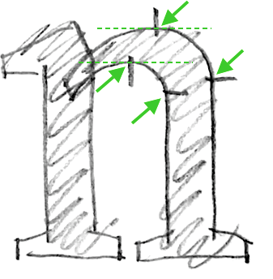

## ノードの概算配置

そして今、Glyphsに入り、「ファイル > 新規」（Cmd-N）で新しいフォントを作成します。nをダブルクリックし、描画ツール（P）を選びます。そして、クリックして直線を、一度に1点ずつ追加していきます。この段階では非常に大雑把で構いません。精度を追求するのは時間の無駄です。ベースライン（下から2番目の線）とエックスハイト（下から3番目の線）の間に、おおよそノードを配置するだけです。

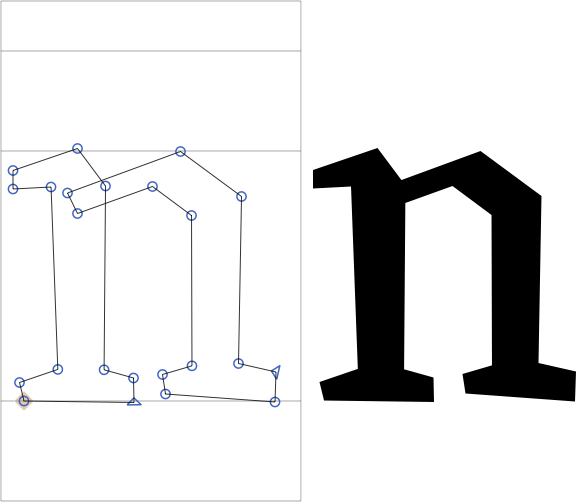

ノードの相対的な位置を概算します。例えば、内側のアーチの極値点は、2つのステムのちょうど中央ではなく、少し右にあるように見えます。「上のノードは右のステムの上にあるか？」といった質問を自問自答してください。それに応じてノードを配置します。繰り返しになりますが、非常に正確である必要はなく、概算で十分です。

最初の点を再度クリックしてパスを閉じます。オーバーラップはそのままにしておきます。繰り返しになりますが、まだ曲線も精度もありません。このステップを「パス > パスの方向を修正」（Cmd-Shift-R）で終えます。パスの方向は、オーバーラップが白く見えるか黒く見えるかを決定します。このコマンドは、パスを並べ替え、開始点（三角形で示される）も設定します。

## ポイントの整列と移動

さて、同じx座標またはy座標にあるべきポイントを整列させることで、精度を追加し始めます。選択ツール（V）で、整列させるべきポイントを選択し、「パス > 選択範囲を整列」（Cmd-Shift-A）を選びます。これはよく使うので、キーボードショートカットを覚えておくと良いでしょう。

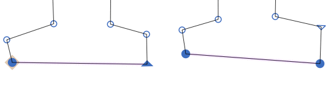

Glyphsは、水平に整列させたいのか垂直に整列させたいのかを判断するのに十分賢いようです。内部的には、最も変化の少ない整列方法を選びます。

さて、キーボードの矢印キーを使って、ポイントを所定の位置に移動させます。Shiftキーを追加すると10単位ずつ、Cmdキーを追加すると100単位ずつ移動します。nの最も低いノードをベースラインに置きます。それらが線に達すると、ダイヤモンド形のインジケーターでマークされます。

上のアーチの極値点は、デフォルトで500ユニットに設定されているエックスハイトより少し上にある必要があります。これをオーバーシュートと呼び、アーチが後でエックスハイトの水平なものと同じ高さに見えるようにするための視覚的な補正です。ほとんどのオーバーシュートは10から15ユニットの間です。デザインがディスプレイサイズ向けなら約10、小さいサイズ向けならもう少し多めにします。

私たちのnは今、このようになっています。

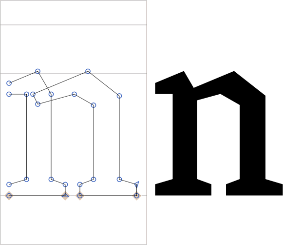

## ステムの幅を均等にする

次に、ノード間の距離を同期させる必要があります。私たちのnの場合、これは両方のステムが同じ幅であることを確認する必要があることを意味します。一度に1つのステムで、ステムを構成する4つのノードを選択します。次に、グレーの情報ボックス（「表示 > 情報を表示」、Cmd-Shift-I）を見て、ロックが開いていることを確認します。これにより、幅と高さを互いに独立して編集できます。

グレーの情報ボックスの水平二重矢印の隣にある数字で制御される、ステムの幅に適した、キリの良い値を見つけます。両方のステムに同じ幅を適用します。

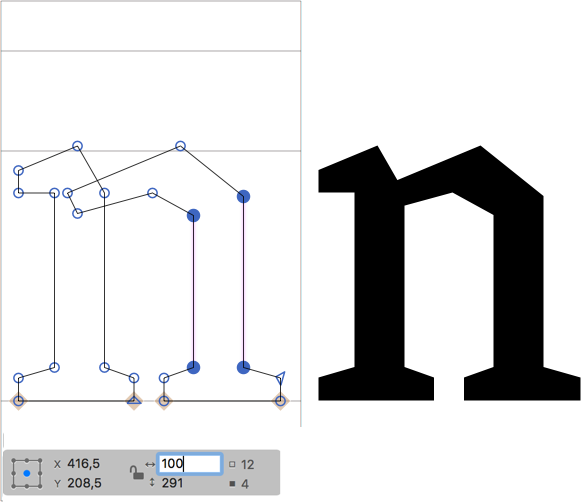

## カーブを追加する

もう直線はたくさんです！選択ツール（V）に切り替え、Option（Alt）キーを押しながら、セグメントをクリックしてセグメントにグレーのハンドルを追加します。もしハンドルを追加しすぎた場合は、ハンドルを選択してバックスペースキーで削除でき、セグメントは再び直線になります。

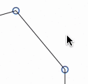

### プロのヒント
パスセグメントには、*2つのハンドル*（カーブセグメントになる）を持つか、あるいは*ハンドルなし*（ラインセグメントになる）のどちらかです。Adobe Illustratorのような他のベクターアプリケーションに慣れている方は、ハンドルが1つだけのセグメントも可能だと信じているかもしれません。その場合、がっかりするかもしれませんが、長年にわたりそれらのアプリがあなたに嘘をつき、2番目のハンドルを周囲のノードの後ろにこっそり隠していたことをお伝えしなければならないのは、本当に心苦しいです。技術的に、それは非常に悪いことなので、Glyphsがハンドルを異なる方法で扱う理由がそこにあります。[良いパスを描く方法について詳しくはこちら](drawing-good-paths.md)を読んでください。

曲線にしたいすべてのセグメントにハンドルが付いたら、それらをドラッグして所定の位置に移動させるだけです。ハンドルは、水平または垂直になるとスナップします。これは、極値点の周りではいずれにせよそうあるべきです。

おそらく、左のステムのオーバーラップ部分にも2つのハンドルがあるでしょう。通常、これら2つは水平または垂直である必要はなく、角度が付いています。両方が*おおよそ*同じ角度を持つようにしてください。これにより、次のステップが容易になります。

あなたのnは今、このようになっているかもしれません。

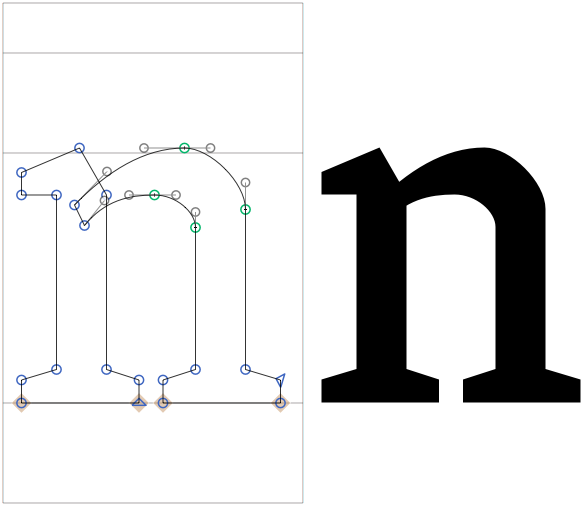

## 曲率の調整

外側のカーブセグメントのいくつかのハンドルを選択し、パレットのサイドバーを表示します（「ウインドウ > サイドバーを表示」またはCmd-Opt-P）。パレットの「カーブをフィット」セクションで、ボタンをクリックします（またはCtrl-Opt-1から8を押します）。

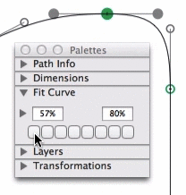

セグメントの曲率は、*相対的なハンドルの長さ*で測定されます。0%は完全に引き込まれたハンドルを意味し、100%はセグメントの2つのハンドルが交差する点です。0%の曲率は、ハンドルなしのラインセグメントでより良く表現できるため、意味がありません。55%の曲率は楕円形であり、つまり幾何学的な円に必要なハンドルの長さです。書体デザインの世界では、通常それよりも高いものが必要です。非常に幾何学的なデザインでも、曲率は少なくとも57%または58%です。スペクトルのもう一方の端では、通常80%弱の曲率で終わります。ここだけの話ですが、個人的には最も外側の値を58%と76%に設定するのが好きです。

### ヒント
100%を超える曲率も意味がありません。なぜなら、それは二重に巻かれたカーブセグメント、つまり時計回りと反時計回りの両方に曲がり、おそらく望ましくない新しい極値点を生み出すからです。したがって、最小値は0%より大きく、最大曲率は100%でなければなりません。「カーブをフィット」パネルは、その範囲に収まらない値を拒否します。

しかし、内側と外側のカーブをどうやって合わせるのでしょうか？簡単です。秘密は、*内側のカーブセグメントは、それに対応する外側のカーブよりも高い曲率を持つ*ことです。そして、やり方はこうです。内側（小さい方）のカーブのハンドルを選択し、*高い*パーセンテージ（例：Ctrl-Opt-5）を与え、次に外側（大きい方）のカーブのハンドルを選択し、*低い*パーセンテージ（例：Ctrl-Opt-4）を与えます。

満足がいくまで値を試してみてください。曲率の違いは、通常、内側と外側のカーブの間の距離が大きい非常に太いデザインでより顕著になり、内側のカーブは外側のカーブよりも著しく短くなります。一方、非常に細いヘアラインのデザインでは、両方のカーブが実質的に同じであるため、両方の対応するカーブで全く同じ曲率になる可能性があります。

## カーブの凸凹をならす

カーブに小さなこぶのようなものが見えるかもしれません。それは、2つのカーブセグメントが極値ノードで出会うまさにその場所です。これは、実際の曲率が一方のセグメントから他方へ急激に変化する場合に起こり得ます。さて、よく見てください。極値点の一方の側ではカーブがかなり平らに見え、反対側に向かっては急に曲がっています。

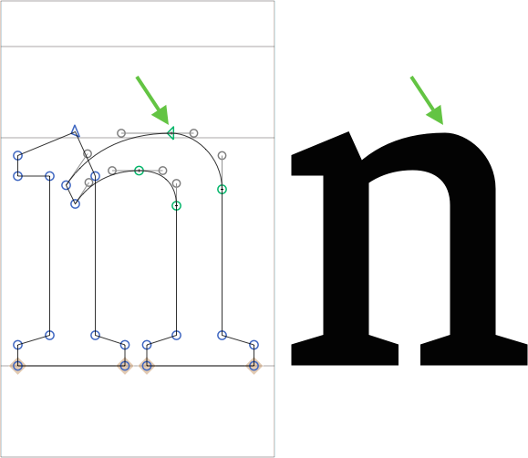

中央の緑色のノードを選択し、Optionキーを押しながら、ノードを平らな部分に向かって移動させます。これは矢印キーまたはマウスのどちらでも行えます。Optionキーを押しながら行うことで、ハンドルを元の位置に保ち、実質的に隣接するハンドルの間でノードを移動させることができます。

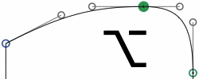

実質的に、平らな部分を圧縮してより曲線的にし、同時に曲線的な部分を伸ばして平らにします。その途中で、両方の曲率が一致し、こぶがなくなるスイートスポットに当たるでしょう。これが、人々が時々「G2連続性」と呼ぶものです。

もしあなたがGlyphsのフルバージョンをお持ちなら、凸凹したカーブを滑らかなアウトラインに変えるのに役立つサードパーティのプラグインが利用可能です。まず、Tim Ahrens氏の[Remix Tools](http://remix-tools.com/glyphsapp)をお勧めします。これには[Harmonizer](http://remix-tools.com/harmonizer)というフィルターが含まれており（インストール後、「フィルタ > Harmonizer」を選択）、このようなこぶをならすようにノードを再配置しようとします。

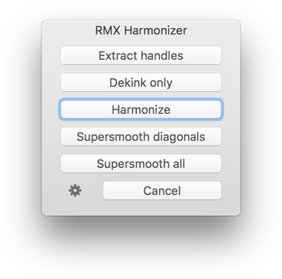

次に、Yanone氏のサイケデリックな[SpeedPunk](http://www.yanone.de/typedesign/code/speedpunk/)ツールがあります。これは曲率の問題を見つけるのに役立ちます。これは曲率を*視覚化*するだけで、カーブの制御はあなた自身が行います。

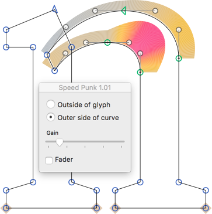

SpeedPunkは「ウインドウ > プラグインマネージャ」から無料で利用できます。

### じゃじゃーん！

おめでとうございます。最初のnが完成しました。

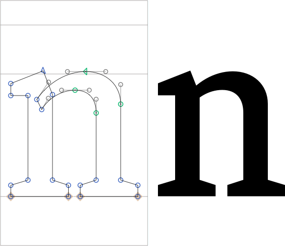

ここから、次のグリフを描くか、文字の[サイドベアリングを調整する](spacing.md)か、[Adobeアプリでフォントをテストする](testing-your-fonts-in-adobe-apps.md)ことができます。「ファイル > フォント情報 > フォント」でフォントファミリー名を設定するのを忘れないでください。

---
鉛筆スケッチ by [Stefan Willerstorfer](http://www.willerstorfer.com/)

---

更新履歴 2020-10-16: Glyphs 3向けの調整。

更新履歴 2022-07-19: 軽微なフォーマット。

## 関連記事

[すべてのチュートリアルを見る →](https://glyphsapp.com/learn)

*   ### [きれいなパスを描く](drawing-good-paths.md)

    チュートリアル

*   ### [ビデオ：パスの描画](video-drawing-paths.md)

    チュートリアル