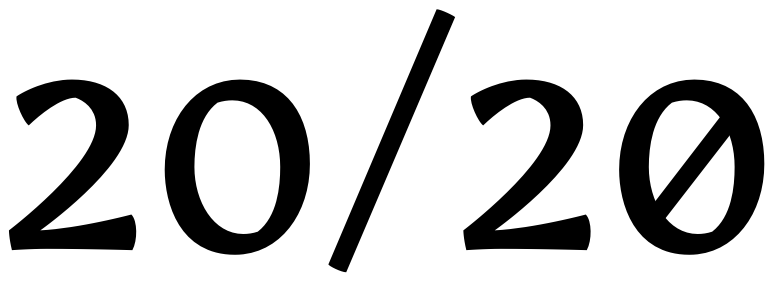
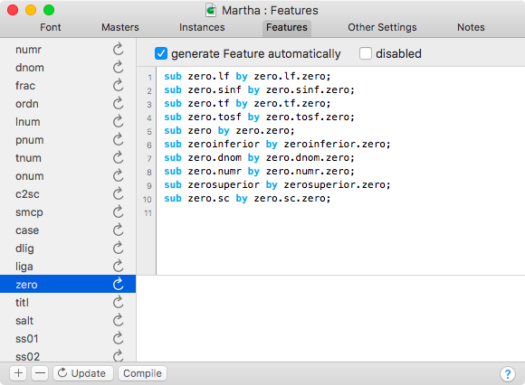
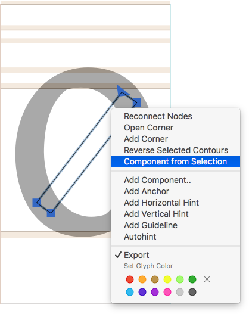
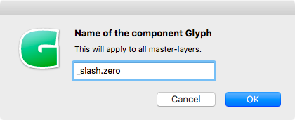
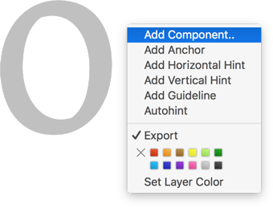
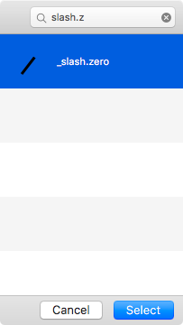
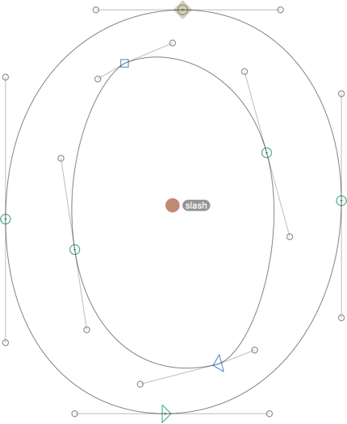
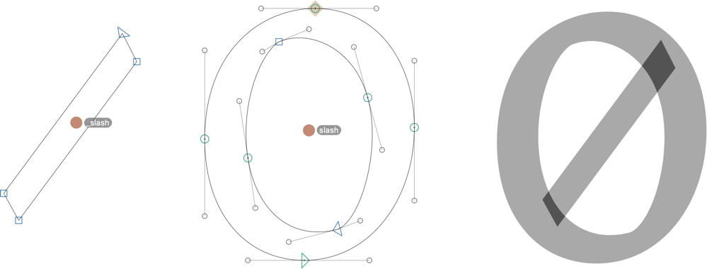

原文: [Figures: slashed zero](https://glyphsapp.com/learn/slashed-zero)
# 数字：スラッシュ付きゼロ

チュートリアル

[ OpenTypeフィーチャー ](https://glyphsapp.com/learn?q=opentype+features)

執筆者: Rainer Erich Scheichelbauer

[ en ](https://glyphsapp.com/learn/slashed-zero) [ fr ](https://glyphsapp.com/fr/learn/slashed-zero) [ zh ](https://glyphsapp.com/zh/learn/slashed-zero)

2022年7月29日更新（初版公開：2013年7月10日）

この簡単なGlyphsのヒントで、フォントにスラッシュ付きゼロを追加しましょう。

明確さのために、あなたの数字にスラッシュ付きのゼロのバリエーションを追加するのは良い考えです。これにより、ユーザーはOpenTypeフィーチャーを有効にすることでゼロの形を変更でき、小文字のoとの潜在的な混同を最小限に抑えることができます。



必要なのは、`zero`のコピーで、グリフ名の末尾に`.zero`という接尾辞が付いているものだけです。そうすれば、「ファイル > フォント情報 > フィーチャー」で「更新」ボタンを押すと、Glyphsが自動的に`zero` OpenTypeフィーチャーを作成してくれます。



> ヒント：`zero`フィーチャーについてもっと知りたいですか？[MicrosoftのOpenType Layout Tag Registryにある仕様](https://www.microsoft.com/typography/otspec/features_uz.htm#zero)を読んでください。注：仕様には、オールドスタイル数字には適用されないと書かれています。私たちはこれに同意しません。

スラッシュ付きゼロを素早く作成する方法は、ゼロの複合コピーを作成することです。「グリフ > グリフを追加」を選択し、以下の適切な行を入力することでこれを行うことができます。

```
zero=zero.zero
zero.lf=zero.lf.zero
zero.tf=zero.tf.zero
zero.osf=zero.osf.zero
zero.tosf=zero.tosf.zero
zero.sc=zero.sc.zero
```

複数のドット接尾辞についての注意：グリフ名のドット接尾辞の順序（`.zero`が最後）は、`zero`フィーチャーが他の数字フィーチャー（`onum`、`lnum`、`pnum`、`tnum`）およびスモールキャップフィーチャー（`smcp`、`c2sc`）の後に順序付けられることを前提としています。これは、内蔵のフィーチャージェネレーターによって作成される推奨されるデフォルトの順序です。何らかの理由でフィーチャーを並べ替える必要があるが、自動フィーチャー生成を維持したい場合は、接尾辞の順序を変更することを検討するとよいでしょう。「編集 > 検索 > 検索と置換」（Cmd-Shift-F）で、選択したグリフの名前を簡単に変更できます。

さて、ゼロのスラッシュを描き、それをコンポーネントにします。Cmd-Aでスラッシュを選択し、右クリックしてコンテキストメニューを開きます。



「選択範囲からコンポーネントを作成」を選択し、スラッシュに名前を付けます。例えば、`slash.zero`や`_slash.zero`などです。先頭のアンダースコアは、グリフをすぐに書き出し対象外として作成します。または、スラッシュを作成した後にコンテキストメニューで「書き出し」を無効にします。スラッシュはそれぞれのスラッシュ付きゼロの中にのみ表示されるべきなので、書き出されるフォントに別のグリフとして表示されるのは意味がありません。そしてもちろん、異なるゼロには異なるスラッシュを検討し、適切に名前を付けます。例えば、ライニング数字に収まるスラッシュには`slash.lf.zero`などです。



そして、各`.zero`グリフに入り、コンポーネントの上にスラッシュを追加します。右クリックしてコンテキストメニューを開き、「コンポーネントを追加」を選択します。



表示されるダイアログで、ゼロスラッシュを検索し、「選択」を押します。



あとは、ゼロとスラッシュが接続する正確な位置を定義するだけです。これを行うには、ゼロとスラッシュに相関するアンカーを追加します。アンカーは、コンポーネントが互いにリンクされる場所をGlyphsに伝える位置マーカーとして機能します。

コンテキストメニューから「アンカーを追加」を選択して、各ゼロにアンカーを追加します。アンカーに分かりやすい名前を付けます。例えば、`slash`などです。スラッシュをリンクさせたい場所にドラッグします。例えば、ゼロの中央などです。

> ヒント：アンカーを2つのパスノードの間で水平方向に中央揃えにするには、アンカーを選択し、Shiftキーを押しながら2つのノードを選択し、「パス > 選択範囲を整列」（Cmd-Shift-A）を選択します。ノードはそのままですが、アンカーはそれらの間の水平方向の中央に移動します。



次に、スラッシュに対応するアンカーを追加します。このアンカーは、ゼロのアンカーと同じ名前であるべきですが、先頭にアンダースコアが付いています。この方法で、2つのアンカーはリンクされます。つまり、この場合、適切なアンカー名は`_slash`です。アンカーの位置を調整すれば、完了です。



左から右へ：`slash.zero`、`zero`、そして`zero.zero`です。やった、スラッシュ付きゼロ！

---
サンプルフォント：[MARTHA](http://cargocollective.com/lisaschultz/Martha)、LISA SCHULTZ氏提供。

---

更新履歴 2017-02-23: OT Tag Registryへのリンクを追加、接尾辞の順序、アンダースコア付きグリフの命名、アンカーの中央揃えに関するヒントを追加。いくつかのスクリーンショットを更新。テキストの軽微な改善。関連記事を追加。

更新履歴 2019-11-18: 誤字を修正。

更新履歴 2020-03-25: タイトルに「Figures」を追加。

更新履歴 2022-07-29: タイトルを更新。