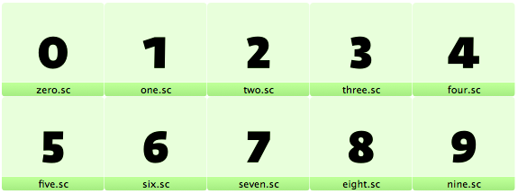

原文: [Figures: small-cap figures](https://glyphsapp.com/learn/small-cap-figures)
# 数字：スモールキャップ用の数字

チュートリアル

[ OpenTypeフィーチャー ](https://glyphsapp.com/learn?q=opentype+features)

執筆者: Rainer Erich Scheichelbauer

[ en ](https://glyphsapp.com/learn/small-cap-figures) [ fr ](https://glyphsapp.com/fr/learn/small-cap-figures) [ zh ](https://glyphsapp.com/zh/learn/small-cap-figures)

2022年8月8日更新（初版公開：2013年7月12日）

フォントに美しいスモールキャップ用の数字を追加したいですか？Glyphsならとても簡単です！

ライニング数字もオールドスタイル数字も、スモールキャップとあまり相性が良くないため、スモールキャップ用の数字をフォントに追加することで、タイポグラファーを喜ばせることができるかもしれません。Glyphsでは簡単です。ライニング数字のコピーを作成し、スモールキャップの高さに合わせて編集し、それらすべてに`.sc`という接尾辞が付いていることを確認するだけです。

これだけです。「ファイル > フォント情報 > フィーチャー」で「更新」ボタンを押すと、Glyphsが`smcp`と`c2sc`フィーチャーに適切な置換を追加します。

複数の接尾辞は、「フォント情報 > フィーチャー」に表示されるフィーチャーの順序で追加すべきです。そうすれば、Glyphsはまだフィーチャーを自動生成できます。したがって、フォントに`zero.zero`があり、そのスモールキャップのバリエーションも欲しい場合は、スモールキャップフィーチャーがスラッシュ付きゼロフィーチャーの前に来ると仮定して、単に`zero.sc.zero`と名付けます。

同様に、`three.ss01`がある場合、対応するスモールキャップ数字は`three.sc.ss01`という名前になります。なぜなら、スタイリスティックセットはスモールキャップの後に適用されるからです。ただし、フィーチャーの順序を変更した場合は、接尾辞の順序もそれに合わせる必要があります。

## 等幅とプロポーショナルのスモールキャップ数字

これは、あなたの中の超フォントマニア専用です。話はこうです。スモールキャップのバリエーションは、ライニング数字とオールドスタイル数字に加えて、垂直方向の差別化しか提供しないため、等幅とプロポーショナルの差別化はどうなるのかという疑問が生じます。私たちは等幅とプロポーショナルの*オールドスタイル*数字、そして等幅とプロポーショナルの*ライニング*数字の両方を持っています。では、等幅とプロポーショナルの*スモールキャップ*数字はどうでしょうか？

さて、普通の人々は皆、正当に「一体誰がこんなものを必要とするんだ？！」と尋ねるでしょう。結局のところ、スモールキャップ数字の唯一の目的は、スモールキャップの文字に添えることです。したがって、それらを必要とするのは、おそらく表ではないでしょう。ですから、これらの等幅数字は安全に省くことができます。これが論理的だと思われるなら、ここで読むのをやめてください。さもないと、約1分で頭がおかしくなります。

私たちの密かな深い願いであるスモールキャップの数字表を最終的に可能にするために、すでにある`.sc`数字のバリエーションを追加する必要があります。再び、接尾辞を追加する必要がありますが、どれでしょうか？

答えは、あなたのデフォルトの数字に依存します。あなたの*等幅*スモールキャップ数字は、あなたの*主要な*等幅数字の`.sc`バリエーションである必要があるので、それらはその接尾辞に`.sc`を追加したものになります。そして、あなたの*プロポーショナル*スモールキャップ数字は、あなたの*主要な*プロポーショナル数字のバリエーションなので、それらはその接尾辞に`.sc`を追加したものを継承します。主要な（等幅またはプロポーショナルの）数字は、デフォルトの数字か、それぞれ`tnum`と`pnum`フィーチャーで変換されるものです。

繰り返しになりますが、「ファイル > フォント情報 > フィーチャー」でフィーチャーを更新すると、Glyphsは2つのスモールキャップフィーチャーに適切な置換を自動的に追加します。

例を挙げましょう。デフォルトの数字（つまり、`one`、`two`、`three`など）がプロポーショナルライニング数字であると仮定します。これは、あなたの*主要なプロポーショナル*数字がデフォルトの数字であり、あなたの*主要な等幅*数字が`.tf`という接尾辞を持つものであることを意味します。したがって、あなたのプロポーショナルスモールキャップ数字は単に`.sc`という接尾辞を持ち、一方、等幅スモールキャップ数字は`.tf.sc`という接尾辞を持ちます。念のため、ユーザーがレイアウトアプリケーションで「等幅オールドスタイル数字」と「スモールキャップ」の両方を選択する可能性のあるケースをカバーするために、`.tosf.sc`のコピーを追加することさえできます。

これがあなたにとってあまり複雑に聞こえないなら、あなたは公式にタイプギークです。クラブへようこそ。

---

更新履歴 2020-03-25: タイトルに「Figures」を追加。「assuming that the small-cap features come before the slashed-zero feature」を追加。

更新履歴 2020-03-26: ボタン名を「Refresh」から「Update」に更新。

更新履歴 2022-08-01: タイトル、関連記事、軽微なフォーマットを更新。