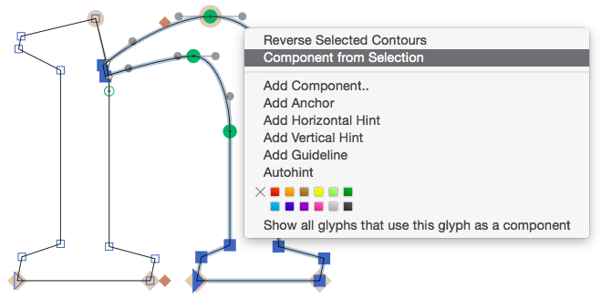

原文: [Reusing shapes: smart components](https://glyphsapp.com/learn/smart-components)
# シェイプの再利用：スマートコンポーネント

チュートリアル

[ シェイプの再利用 ](https://glyphsapp.com/learn?q=reusing+shapes)

執筆者: Rainer Erich Scheichelbauer

[ en ](https://glyphsapp.com/learn/smart-components) [ fr ](https://glyphsapp.com/fr/learn/smart-components) [ zh ](https://glyphsapp.com/zh/learn/smart-components)

2022年7月26日更新（初版公開：2015年3月30日）

スマートコンポーネントは、グリフのシェイプの一部を再利用するための素晴らしい方法で、特にCJKの部首に有効ですが、ラテン文字のパーツにも使えます。そのスマートな使い方を、ぜひここで学んでください！

例えば、小文字nのショルダー（肩）の部分を、小文字のmやhで再利用したいとします。もちろん、[スラブセリフで行ったように](serif-components.md)、コンポーネントでそれを行うこともできます。しかし、通常のコンポーネントを使うには一つ問題があります。それらは静的だからです。

しかし、mではショルダーを調整する必要があります。ほとんどの人は、それを少し狭くすることを好みます。なぜなら、2つのショルダーが1文字に収まると、空白部分が大きくなりすぎるからです。

また、小文字のhでは、ほとんどのデザイナーがクロッチ（内側の角）を下にドラッグして、nと同じくらい深く白い切り込みが見えるようにします。これは、hのステム（縦画）が、nの上部セリフほど簡単には調整できないためです。

そのため、通常の静的なコンポーネントはここでは役に立ちません。より良い解決策が必要です。

## スマートグリフの設定

私たちはショルダーを*スマートコンポーネント*に変えます。nのショルダーをダブルクリックして選択します。次に右クリックしてコンテキストメニューを表示し、「選択部分からコンポーネントを作成」を選びます。

「コンポーネントグリフの名前」を尋ねられたら、`_part`で始まる名前を入力します。なぜなら他のグリフで再利用できるパーツだからです。また、アンダースコアで始まるグリフはデフォルトで書き出し対象外に設定されるため、私たちにとって好都合です。フォント内に複数のスマートコンポーネントがあると仮定して、ドットで終わる接尾辞を付けるべきです。この場合は、`.shoulder`を提案します。

`_part.shoulder`という名前の別のグリフが作成されます。ショルダー部分が他の部分と接続できるように、アンカーを追加しましょう。まず、後続のパーツが接続するためのアンカーを追加できます。これでmも作れるようになります。これを`connect`と名付け、ステムの右端に揃えます。

### プロのヒント
スマートコンポーネントの接頭辞には、`_part`の代わりに`_smart`を使うこともできます。

次に、`_part.shoulder`が先行するパーツに接続するためのアンカーが必要です。先行するパーツに`connect`アンカーがあると仮定すると、対応するアンカーは先頭にアンダースコアを付けた`_connect`という名前にする必要があります。それらはすべて同じ高さ（つまりy座標）にあるべきなので、アンカーをベースライン上に保つことをお勧めします。完了すると、次のようになります。

`_part`で始まるため、これは*スマートグリフ*として認識されます。しかし、追加のレイヤーがない限り、まだそれほどスマートではありません。そこで、現在のレイヤーを2回コピーし、レイヤーに`NarrowShoulder`と`LowCrotch`という名前を付けます。これはパネルサイドバー（Cmd-Opt-P）の「レイヤー」セクションで行うことができます。

さて、`NarrowShoulder`レイヤーを有効にして、少し詰めていきます。ショルダーの右半分を選択し、ControlキーとOptionキーを押しながら、左矢印キーを押します。選択した部分が左に移動し、周囲のハンドルが比例して調整されます。Shiftキーを追加すると10ユニット単位で移動します。

`LowCrotch`レイヤーでも同じことをしますが、今度は左端の2つのノードを選択し、下にずらしてクロッチを低くします。まずは単純な移動で十分です。後でシェイプを調整できます。

さて、`_part.shoulder`がまだアクティブな状態で、キャンバスを右クリックしてコンテキストメニューを表示し、「スマートグリフの設定を表示」を選択します。または、同様の効果で、「編集 > 選択グリフの情報を編集」（Cmd-Opt-I）を選択します。

表示されるダイアログシートで、プラスボタンで`shoulderWidth`という名前のプロパティを追加し、「下限」と「上限」に`0`と`100`を入力します。名前と数値は多かれ少なかれ任意ですが、「下限」は「上限」より小さい必要があります。そして、値はあなたにとって意味のあるものであるべきです。私はショルダーの最小幅を表すのに0を、最大幅に100を選びました。

次に、`crotchDepth`という2番目のプロパティを追加し、下限と上限に`-100`と`0`を入力します。私にとって、`-100`は最も低いクロッチを、0は通常のクロッチを最もよく表しています。

次に、ダイアログシートの「レイヤー」タブに切り替えます。ここで、どのプロパティ値がどのレイヤーに適用されるかをGlyphsに伝えます。この場合は、次のようになります。

*   Regular: `crotchDepth 0` と `shoulderWidth 100`
*   NarrowShoulder: `crotchDepth 0` と `shoulderWidth 0`
*   LowCrotch: `crotchDepth -100` と `shoulderWidth 100`

すべてのレイヤーのすべてのプロパティを設定したら、「OK」ボタンをクリックしてダイアログを確定できます。

## スマートコンポーネントの調整

さて、h、m、nのようなグリフに戻り、ベクターのショルダーを削除し、「グリフ > コンポーネントを追加」（Cmd-Shift-C）で`_part.shoulder`をコンポーネントとして挿入します。

コンポーネントを右クリックし、コンテキストメニューから「スマートコンポーネントの設定を表示」を選択するか、あるいはコンポーネントを選択して「編集 > 選択グリフの情報を編集」（Cmd-Opt-I）を選択すると、スライダーダイアログが表示されます。スライダーを使って、その場でスマートコンポーネントを補間します。

アンカーを利用するためには、*ステム*も`connect`アンカーを持つスマートグリフにすると理にかなっています。そして、上部セリフの曲がり具合を変えるための追加レイヤーを加えて、様々な度合いの切り込みを実現するのも良いでしょう。いずれにせよ、`_part.stem`は次のようになります。

アンカーによる自動アラインメントは、グリフの*すべて*のパーツがコンポーネントである場合にのみ機能します。グリフに通常のパスが存在するとすぐに、自動アラインメントはキャンセルされ、アンカーは無視されます。

さて、例えば小文字のmでは、最初のコンポーネントとして`_part.stem`を配置し、続いて`_part.shoulder`を2回配置します。アンカーでうまく接続されているのがわかります。そして再び、スマートコンポーネントのパラメータを調整できます。

## CJKの部首としてのスマートコンポーネント

スマートコンポーネントの本来の目的は、CJKグリフをより良くデザインするための方法でした。中国語、日本語、韓国語では、一部の文字が他のより複雑な表意文字で再利用されます。これらの文字は、他の文字の根（ラテン語で「radix」）を形成するため、*部首*と呼ばれます。

そのため、`_part`で始まるグリフだけでなく、すべてのCJKの部首もスマートグリフとして扱われます。当然ながら、スマートコンポーネントの設定がより複雑になりがちなのも、この分野です。

## バウンディングボックスによるスマートなスケーリング

`Height`と`Width`（先頭が大文字）という名前のプロパティがある場合、「表示 > バウンディングボックスを表示」（Cmd-Opt-Shift-B）をオンにすると、ボックスのハンドルが`Height`と`Width`プロパティを操作するようになります。

これは、あの面倒なスライダーよりも、スマートコンポーネントのサイズを操作するのに便利で直感的な方法です。

## スマートハンドル

さて、高さと幅については、あの醜いスライダーを使わずに済むようになりました。しかし、他のすべてのパラメータはどうでしょうか？もう探す必要はありません。Glyphs 2.5以降、スマートコンポーネントに*独自のハンドルを追加*できるようになったのです！その方法は次の通りです。

各スマートグリフのレイヤーに、プロパティの名前を含むアンカーを追加します。そして、最も意味のある場所に配置します。CJKの部首の2つのスマートレイヤーを見て、*Right Arm*アンカーの位置に注目してください。

アンカー名がプロパティ名と完全に一致することを確認してください。すべてのプロパティをアンカー名として追加する必要はありません。しかし、追加するものはすべてのレイヤーに存在する必要があります。そうすると、スマートコンポーネント内で、Glyphsは（プロパティスライダーの代わりに）ドラッグできるハンドルを表示します。

かなりクールですよね？

---
サンプルフォント：VESPER、ROB KELLER氏およびKIMYA GANDHI氏提供

更新履歴 2017-12-11: 代替名として`_smart`が使用可能であることについての注記を追加。スマートスケーリングとスマートハンドルを追加。

更新履歴 2018-12-07: 誤字を修正、WeightではなくHeightでした。失礼。

更新履歴 2022-04-05: 軽微なフォーマットとURLの更新。

更新履歴 2022-07-26: タイトル、関連記事、軽微なフォーマットを更新。

## 関連記事

[すべてのチュートリアルを見る →](https://glyphsapp.com/learn)

*   ### [ハングルフォントの作成](creating-a-hangeul-font.md)

    チュートリアル

[ 言語 ](https://glyphsapp.com/learn?q=languages)

*   ### [シェイプの再利用：コンポーネントのテクニック](reusing-shapes-component-tricks.md)

    チュートリアル

[ シェイプの再利用 ](https://glyphsapp.com/learn?q=reusing+shapes)