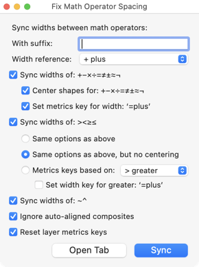

原文: [Spacing](https://glyphsapp.com/learn/spacing)
# スぺーシング

チュートリアル

執筆者: Rainer Erich Scheichelbauer

[ en ](https://glyphsapp.com/learn/spacing) [ fr ](https://glyphsapp.com/fr/learn/spacing) [ zh ](https://glyphsapp.com/zh/learn/spacing)

2022年7月25日更新（初版公開：2013年3月4日）

サイドベアリング、つまりグリフの左右にある重要なスペースを決めることをスペーシングと呼びます。スペーシングは、デザイン全体の品質にとって非常に重要です。ここでは、Glyphsでスペーシングをうまく行うための最良のヒントを紹介します。

## はじめに

ラテンアルファベットのスペーシングを行うときは、nとoから始めるのが良い方法です。この2つの文字が適切なサイドベアリングを持てば、残りは比較的簡単です。そこで、`noononno`のように入力し、満足がいくまでこれらのサイドベアリングをいじってみることをお勧めします。この文字列には、2つのoの間のn、2つのnの間のo、oo、nnが含まれています。これらすべてが、あなたの目にとって等間隔に見えるようにできれば、あなたの勝ちです。

### プロのヒント
スペーシングは必ず適切なサイズで行うようにしてください。ズームインしすぎると、きつくしすぎる傾向があります。ウィンドウ左下の目のシンボルで、下部のプレビューエリアを開くことを検討してください。区切り線をドラッグして、意図した可読サイズに合わせることができます。プレビューエリアには、テキストをぼかしたり反転させたりするオプションがあり、デザインを新鮮な目で見続けることができます。

グレーの情報パネル（「表示 > 情報を表示」、Cmd-Shift-I）を見れば、どのグリフのサイドベアリングと幅も確認できます。

同じ値は、フォントタブの左下にあるグリフ情報エリアからもアクセスできます。または、リストモードのLSBとRSBの列からも可能です。リストヘッダーのコンテキストメニューから、まず列を有効にする必要があるかもしれません。列ヘッダーをドラッグすることで、列の順序を並べ替えることができます。

どの方法でも構いませんが、サイドベアリングを変更するには、数字をクリックして新しい値を入力するだけです。ちなみに、左下の情報エリアでは、複数のグリフを選択して一度に編集することもできます。

よほど変わったことをしていなければ、oには左右同じサイドベアリングが必要です。カウンターの幅の3分の1が良い出発点です。フォントの用途に応じて、小さいサイズ用なら少し多めに、ディスプレイサイズ用なら少し少なめにします。ボウルが比較的平らな場合（したがって側面により少ない空白が残り、それを補う必要があります）は少し多めに、非常に丸い場合は少し少なめにします。ヒント：きついスペーシングより、ゆったりしたスペーシングの方が簡単です。

Glyphsは、現在のグリフのサイドベアリングを変更するための直感的なショートカット一式を採用しています。oの前にカーソルを置き、**左**サイドベアリングには**Control**キーを、**右**サイドベアリングには**Command**キーを押しながら、**左右の矢印キー**でそれぞれの値を増減させます。さらに**Shift**キーを押しながらだと、10単位ずつ増減します。

## ショートカットの競合

注意：デフォルトでは、Control-矢印キーはmacOSのSpaces（操作スペース）の切り替えに予約されています。したがって、GlyphsでControl-矢印キーを解放するためには、Spacesのショートカットを無効にするか、別のものに設定する必要があります。macOS Mountain Lion以降でこれを行うには、「システム環境設定 > キーボード > ショートカット」に進み、左のリストから「Mission Control」を選び、「左の操作スペースに移動」と「右の操作スペースに移動」をダブルクリックして新しいショートカットを入力します。個人的には、4本指のスワイプジェスチャでSpaces間を移動できるので、ショートカットは完全に無効にしています。

次に、nです。nは通常、角の空白がはるかに少ないので、サイドベアリングを大きくしてそれを補う必要があります。セリフを考慮しない場合、oのサイドベアリングの約1.5倍が良い出発点です。セリフは空白に伸びて、実質的にLSBとRSBの値を減らします。

また、nは対称ではありません。右上の角はショルダーになっており、左側よりも右側により多くの空白が残ります。これを何とかして補う必要があります。ここで、とっておきの方法があります。**ControlキーとCommandキー**を組み合わせると、左右両方のサイドベアリングを同時に変更でき、実質的に文字をその幅の*内側*で移動させることができます。

この方法で、nがoの間に中央揃えに見えるまで、nを数回右に少しずつずらすことができます。`noononno`のすべての文字間の距離が同じサイズに見え、意図したサイズで問題なく見えるようになれば、nとoの作業は完了です。

## プレースホルダー

さて、他の文字に進みましょう。私がよくやるのは、2行目を追加して次に作業したい文字、例えばhを入力することです。しかし、その文字を以前のnのようにoの間で見たいですよね。Glyphsではそれが可能です。文字列を調べて、nのすべての出現箇所をプレースホルダーに置き換えるだけです。「編集 > プレースホルダーを追加」（Cmd-Opt-Shift-P）コマンドでプレースホルダーを「入力」できます。

プレースホルダーは、*常に現在のグリフ*、つまりカーソルの直後にあるグリフを表示します。

注意してください。カーソルが入力したテストテキストの一番最後にあると、プレースホルダーが奇妙な動作をすることがあります。その場合は、カーソルを別の文字の前に戻してください。

## サイドベアリングの計算

しかし、待ってください。もしnがすでにあるなら、hは簡単なはずです。多くの場合、nと同じサイドベアリングを持つことができます。なぜなら、アセンダーを除けば、hとnは少なくともサンセリフではほぼ同じように見えるからです。したがって、例えば、nをチェックしてサイドベアリングをhのグレーの情報エリア（Cmd-Shift-I）にコピーすることもできます。しかし、それは最適ではありません。なぜなら、後でnのサイドベアリングを再び変更したらどうなるでしょうか？すべてのサイドベアリングを手動で追跡したいですか？とんでもない。

私たちが行うのはこれです。サイドベアリングの距離を示す数値を入力する代わりに、別のグリフの名前を入力します！するとGlyphsは、現在の文字に他の文字のサイドベアリングを複製します。これは幅についても機能します。RSBと幅を設定するとLSBが再計算され、LSBと幅を設定すると計算されたRSBが得られます。したがって、hのLSBとRSBの両方に`n`と入力すると、hはnのサイドベアリングを動的に引き継ぎます。

ただし、100パーセント動的ではありません。時々、「グリフ > メトリクスを更新」（Ctrl-Cmd-M）を選択して、選択したグリフのサイドベアリングを強制的に更新するのが良い考えです。Optキーを押しながらメニューコマンドを選択するか、Ctrl-Opt-Cmd-Mを押すことで、*すべて*のマスターのメトリクスを一度に更新することさえできます。選択したすべてのグリフが更新されます。その方法で、すべてのグリフのメトリクスも一度に更新できます。

しかし、それだけではありません。簡単な計算もできます。その場合、LSB、RSB、または幅のエントリを等号（`=`）で始め、そこに計算式を記述します。したがって、グリフのLSB値として`=a+20`を使用すると、GlyphsはaのLSB値を取得し、それに20ユニットを加算します。代わりに`=|a+20`を使用する、つまりグリフ名の前にパイプ文字（`|`）を置くと、Glyphsはaの反対側のサイドベアリングを計算の基礎として使用します。加算だけでなく、減算もできます：`=b-10`。そして乗算：`=c*1.1`。そして除算：`=d/2`。私たちの経験では、ほとんどの状況で固定値の単純な加算と減算が最も効果的です。

もし、LightのnがBoldのnと同じサイドベアリングや幅を持つことを望まない場合は、単に2番目の等号を追加します。例えば`==n+15`のようにすると、それは1つのマスターにのみ影響します。

繰り返しになりますが、「グリフ > メトリクスを更新」コマンド（Ctrl-Cmd-M）、またはすべてのマスターに対してはCtrl-Opt-Cmd-Mを定期的に実行することを忘れないでください。したがって、文字の形の類似点を探し、文字間の関連性を確立し、それを次のようなサイドベアリングの計算に変えてみてください。

*   `=o`: c, d, e, g, qのLSB
*   `=o`: b, pのRSB
*   `=n`: b, h, i, k, l, m, p, rのLSB
*   `=n`: a, h, mのRSB

などなど。ただし、最終的にはグリフをどのようにデザインするかによるので、結果は大きく異なる場合があります。

## 大文字のスペーシング

大文字のスペーシングでは、基本となる文字は通常HとOです。基本的には上記の小文字と同じ話です。この2つを正しく設定すれば、あとは順調です。しかし、今回は小文字にも合わせる必要があります。これに気をつければ、サイドベアリングの値を他の文字に簡単に移すことができます。

*   `=H`: B, D, E, F, I, K, L, M, N, P, RのLSB
*   `=H`: I, M, NのRSB
*   `=O`: C, G, QのLSB
*   `=O`: D, QのRSB

などなど。お分かりですね。

## 自動アラインメント

コンポーネントをベースにした文字は、ベースコンポーネントからスペーシングを継承します。例えば、フォントにäが欲しいとします。そこで、aコンポーネントとdieresiscombコンポーネントで`adieresis`を構築します。実際、フォントにaとdieresiscombがすでにある場合、`adieresis`を生成するとGlyphsが自動的にそれを行います。さて、`adieresis`グリフに入り、2つのコンポーネントのいずれかをクリックします。それはロックされているように見えます。私たちはこれを「自動でアラインメント」されていると言います。ほとんどの場合、それはまさにあなたが望むことでしょう。信じてください、すべてのダイアクリティカルマークのスペーシングを手動で同期させることほど退屈なことはありません。

しかし、時にはそれが望ましくない場合もあります。そのような場合は、再配置したいコンポーネントのコンテキストメニューを開き、「自動アラインメントを無効にする」を選択します。もし気が変われば、同じメニューから再び「自動アラインメントを有効にする」ことができます。

数字のような一部のグリフは、そもそもデフォルトではアラインメントされません。この方法で、プロポーショナル数字と等幅数字を一度に素早く簡単に作成できます。

## 一括処理

多くのグリフのメトリクスを一度に変更したいですか？「グリフ > メトリクスを変形」に進むと、選択したグリフのLSBとRSBの値を設定することもできます。「相対的」チェックボックスをクリックすると、以前の値に加算されます。値を減らすには負の値を使用します。

### 旧バージョン
Glyphs 2以前では、この機能は「フィルタ > 変形 > メトリクス」にありました。

## カーニングはまだです

カーニングなしで、できるだけ遠くまで進んでみてください。ある時点で、サイドベアリングをいじるだけではスペーシングを改善できなくなることに気づくでしょう。そのときからカーニングを始めることができますが、それより早く始めるべきではありません。なぜなら、より良いスペーシングの方法を見つけたら、カーニングを最初からやり直さなければならなくなるからです。

## 便利なスクリプトとプラグイン

「ウインドウ > プラグインマネージャ」には、スペーシングに関する拡張機能がいくつか見つかります。いくつかハイライトを紹介しますが、もちろん、自分で探してみることをお勧めします。

### スクリプト

[Huerta Tipografica Letterspacer](glyphsapp3://showplugin/Huerta%20Tipografica%20Letterspacer)は、グリフを自動的にスペーシングするためのツールです。ラテン語/ギリシャ語/キリル文字のタイポグラフィに最適化されており、習得には少し時間がかかります。しかし、設定方法を一度知ってしまえば、非常に多くの時間を節約できます。[短いチュートリアルビデオ](https://www.youtube.com/watch?v=secaaoidYI0)と、アルゼンチンのフォントファウンドリHuerta TipograficaのメンバーだったSol Matasによる[Letterspacerに関する講演](https://www.youtube.com/watch?v=nsGbUA-9E3I)の録画があります。

[Sebastian Careweのスクリプト](glyphsapp3://showplugin/eweracs%20Scripts)には、Huerta Tipografica Letterspacerの設定をマスター間で補間するための*Letterspacer Interpolator*が含まれています。多くのマスターを持つファイルでLetterspacerを使用している場合に便利です。

[mekkablue scripts](https://github.com/mekkablue/Glyphs-Scripts/)には、*Spacing*セクションがあり、とりわけ以下のものが含まれています。

*   *Freeze Placeholders*: プレースホルダーを現在表示されているグリフに戻します
*   *Metrics Key Manager*: メトリクスキーを一括設定するためのスクリプト
*   *Fix Math Operator Spacing*: 計算記号のスペーシングを同期・管理するためのスクリプト

*   *Spacing Checker*、*Tabular Checker*、*Monospace Checker*: 特に等幅グリフや等幅フォントにおける、潜在的なスペーシングの間違いを見つけ（そして修正する）ためのスクリプト
*   *Steal Metrics*: あるフォントマスターから別のフォントマスターへスペーシングを転送するためのスクリプト

*   *Components > Alignment Manager*: コンポジットグリフの自動アラインメントを一括設定します

[Toshi Omagariのスクリプト](glyphsapp3://showplugin/Toshi%20Omagari%E2%80%99s%20Scripts)には、*Metrics & Kerning*サブメニューに、メトリクスキーを賢く一括設定・報告するための2つのスクリプトが含まれています。

[Filipe Negrãoのスクリプト](glyphsapp3://showplugin/Filipe%20Negrão%E2%80%99s%20Scripts)には、すべての結合マークのLSBとRSBを一括設定するためのスクリプトが含まれています。

[Wei Huangのスクリプト](glyphsapp3://showplugin/Wei%20Huang%E2%80%99s%20Scripts)には、編集タブのコンテンツを管理するためのいくつかのスクリプトが含まれています。

*   *Add Placeholder Between Each Selected Glyph*
*   *Add Space Between Each Selected Glyph*
*   *Add String Between Each Selected Glyph*: 選択した各グリフの間にユーザー定義の文字列を追加します

## プラグイン

Mark Frömbergの[Blindfold](glyphsapp3://showplugin/Blindfold)プラグインは、特定のエリア（例えば、ベースラインからエックスハイトまたはキャップハイトまで）の外側をすべて覆い隠し、スペーシング時にそのエリア内のリズムに集中できるようにします。

Yanoneの[Space Bar](glyphsapp3://showplugin/Space%20Bar)は、複数のマスター間でスペーシングを比較するのに役立ちます。これは、あるマスターで適切にスペーシングするのを忘れたか、またはあるマスターが他のマスターと比べて非常に珍しいスペーシングをしているかを確認するのに便利です。

---

更新履歴 2015-07-30: 「一括処理メトリクス」を追加し、Glyphs 2向けに更新。

更新履歴 2020-03-21: 「ショートカットの競合」セクションを改善、古い部分（二重アンダースコア）を削除、修飾キーの画像を追加、テキスト全体を一度見直し。

更新履歴 2020-09-06: 誤字を修正。

更新履歴 2022-01-16: 画像タイプJP2をPNGに変更（JP2はChromeと非互換）、Glyphs 3のメニューコマンドを更新、「便利なスクリプト」セクションを追加、「メトリクスを変形」のスクリーンショットを更新。

更新履歴 2022-07-25: タイトル、関連記事、軽微なフォーマットを更新。

## 関連記事

[すべてのチュートリアルを見る →](https://glyphsapp.com/learn)

*   ### [カーニング](kerning.md)

チュートリアル

*   ### [文脈依存のカーニング](contextual-kerning.md)

チュートリアル

[ OpenTypeフィーチャー ](https://glyphsapp.com/learn?q=opentype+features)