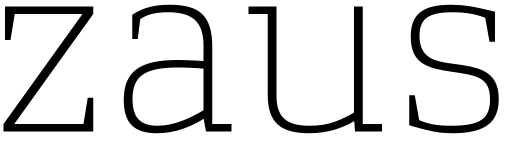
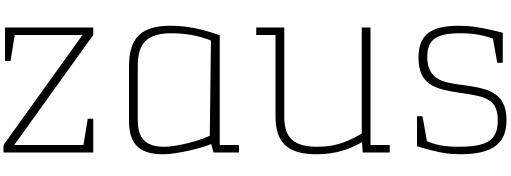
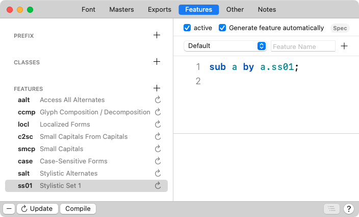
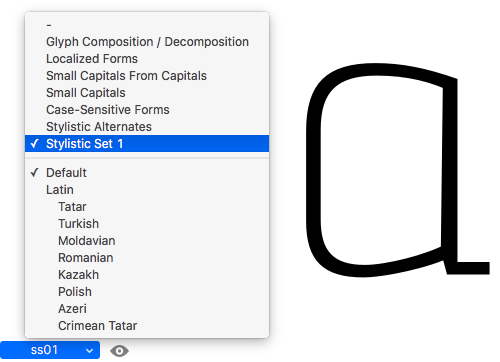
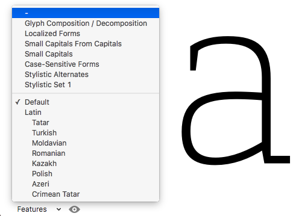
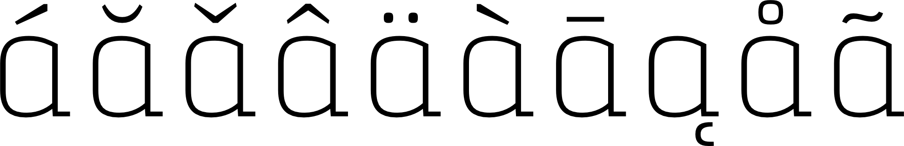
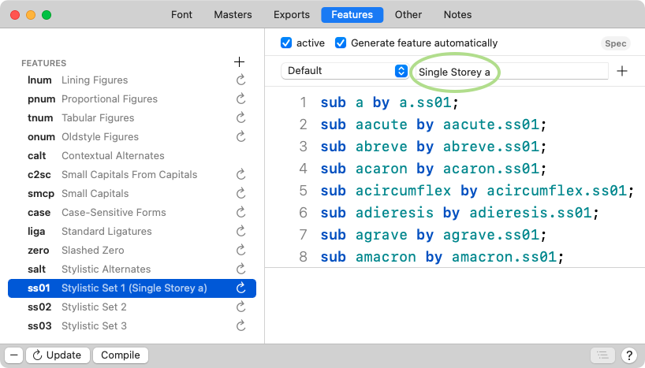
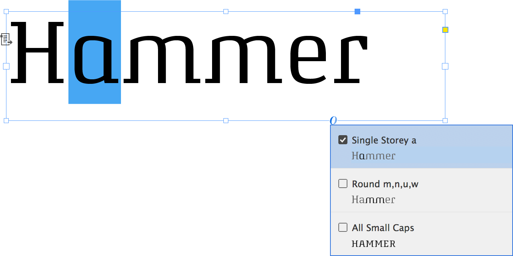

原文: [Stylistic sets](https://glyphsapp.com/learn/stylistic-sets)
# スタイリスティック・セット

チュートリアル

[ OpenTypeフィーチャー ](https://glyphsapp.com/learn?q=opentype+features)

執筆者: Rainer Erich Scheichelbauer

[ en ](https://glyphsapp.com/learn/stylistic-sets) [ fr ](https://glyphsapp.com/fr/learn/stylistic-sets) [ zh ](https://glyphsapp.com/zh/learn/stylistic-sets)

2024年10月30日更新（初版公開：2012年10月8日）

同じ文字に対して気に入ったデザインが複数ありますか？それらをスタイリスティック・セットに入れましょう！

例えば、aの形を決められない、あるいは2つのバリエーションを作り、両方を残したいとします。しかし、どうすればよいのでしょうか？キーボードにはaのキーは1つしかありません。





このようなケースのために、OpenTypeは「スタイリスティック・セット」と呼ばれるものを提供しています。最大で20種類のアルファベットのバリエーションを定義し、フォントに入れることができます。スタイリスティック・セットは必ずしも互いに排他的ではありません。複数のセットを同時に有効にすることができます。例えば、あるスタイリスティック・セットは代替のディセンダーを持つ文字で構成され、別のセットは（私たちの例のaのように）代替のシェイプで構成され、3つ目のセットはRとKの代替の斜めの脚で構成される、といった具合です。あなたのデザインに最も合うものなら何でも構いません。

私たちのaのバリエーションの話に戻りましょう。スタイリスティック・バリエーションの鍵はグリフ名です。1つのデフォルトのaは、もちろん`a`という名前です。代替のバリエーションは`a.ss01`という名前にすべきです。`.ss01`という接尾辞は、それが最初のスタイリスティック・セットのaであることを意味します。

もしもっと多くのスタイリスティック・セットが必要な場合は、グリフ名に適切な接尾辞を追加するだけです。`.ss02`は2番目のスタイリスティック・セットに、`.ss03`は3番目に対応します。セットの最大数は20なので、接尾辞は`.ss20`まで使用できます。

この命名規則に従えば、Glyphsはフィーチャーコードを自動で作成してくれます。必要なのは、フォント情報（Cmd-I）を開き、「フィーチャー」タブに移動して、左下の丸い矢印ボタンをクリックすることだけです。



Glyphsが`ss01`という名前のフィーチャーを追加し、そこには`a`が`a.ss01`に置き換えられるという単純な置換が含まれているのがわかります。編集タブの左下にあるフィーチャーポップアップから`ss01`フィーチャーを選択することで、Glyphs内で直接テストできます。



最初のメニュー項目、ダッシュの付いたものを選択すると、すべてのフィーチャーがリセットされます。



最後に一つ注意点です。スタイリスティック・セットについて知っているユーザーは多くありません。したがって、そこにどんなバリエーションを詰め込んでも、それらは稀な例外でしか使われないことを意識してください。

## ダイアクリティカルマーク

`a.ss01`があり、それと一緒にダイアクリティカルマークも使いたい場合は、簡単な方法があります。

1.  まず、`adieresis`、`aacute`、`abreve`など、すべてのダイアクリティカルマーク付きのaを選択します。（または、小文字のaを入力し、右クリックしてコンテキストメニューから「このグリフをコンポーネントとして使用するすべてのグリフを表示」を選択します。）
2.  「グリフ > グリフを複製」（Cmd-D）でそれらを複製します。新しく複製されたグリフはデフォルトで選択されており、すべて`.001`という接尾辞が付いています。
3.  次に、Cmd-Shift-F（または「編集 > 検索 > 検索と置換」）を押し、`.001`を`.ss01`に置き換えます。
4.  そして最後に、それらの`.ss01`グリフを選択し、「グリフ > コンポジットを作成」（Ctrl-Cmd-C）を選択します。
    そして、出来上がりです。



## スタイリスティック・セットの名前

スタイリスティック・セットに適切な名前を付けるのは良い考えです。そうすれば、ユーザーはOpenType対応アプリケーションで賢く選択できます。「ファイル > フォント情報 > フィーチャー」に進み、ssXXフィーチャーのいずれかを選択します。Glyphsは自動的に名前のフィールドを表示します。より良いアイデアがない限り、言語ポップアップは「デフォルト」のままにしておきます。次に、ユーザーのために分かりやすい説明的な名前を追加します。フォントのユーザーにとって最も理にかなった共通語で書くのがベストです。多くの場合、必ずしもそうとは限りませんが、それは英語になるでしょう。

### 旧バージョン
Glyphs 2では、代わりに右下のウィンドウペイン（通常は注釈、コメント、コードのバックアップ用に予約されている）に行き、`Name:`と入力し、スペースを空けてから、セットの人間が読みやすい英語名を書きます。



もし他の言語を追加する場合は、常に「デフォルト」のエントリも保持してください。そしてもちろん、ユーザーの中に英語を話す人が誰もいない場合は、「デフォルト」のエントリをユーザーにとって意味のある言語で記述してください。このエントリはUnicodeをサポートしているので、特殊文字について心配する必要はありません。

そして、InDesign CCのようなアプリでは、ユーザーに適切な名前で選択肢が提示されます。



素晴らしい！

## OTコード

これはマニア向けのものです。もしあなたが何をしているか分かっているなら、フィーチャーコード内に完全な`featureNames`を追加することもできます。これにより、より多くの言語（およびプラットフォーム）のバリエーションを持つことができます。[AFDKOの仕様でそのすべてを読む](https://www.adobe.com/devnet/opentype/afdko/topic_feature_file_syntax.html#8.c)ことができます。以下にサンプルを示します。

```
featureNames {
   name "Single Storey a"; # Windows (default)
   name 3 1 0x0407 "Einstöckiges a"; # 3=Windows, 1=Unicode, 0407=German
   name 1 "Single Storey a"; # 1=Mac
   name 1 0 2 "Einst\9fckiges a"; # 1=Mac, 0=MacRoman, 2=German
};
```

プラットフォーム、エンコーディング、言語IDの正しい番号は、[OT Specsのnameテーブル仕様](https://www.microsoft.com/typography/otspec/name.htm#platformIDs)で見つけることができます。

> **注意：** Macの名前は、それぞれの8ビットMacエンコーディングで指定する必要があり、これはすべての非ASCII文字を2桁の16進コードでエスケープする必要があることを意味します。私たちの例では、`1 0`は[MacRoman](https://de.wikipedia.org/wiki/Macintosh_Roman)エンコーディングを指定しているため、最後の行のö（ウムラウト付き小文字o）は、MacRomanでのöの16進コードが0x9Fであるため、`\9f`でエスケープする必要があります。
>
> [AFDKOの仕様](https://www.adobe.com/devnet/opentype/afdko/topic_feature_file_syntax.html#9.d)を引用すると、「128-255の範囲の文字コードは、バックスラッシュ文字（`\`）と、その後に続く正確に2つの16進数（大文字小文字問わず）の特殊なシーケンスを使用して指定できます。これらは両方ともゼロであってはなりません。例：`\83`。ASCIIのバックスラッシュ文字はシーケンス`\5c`または`\5C`として、ASCIIの二重引用符文字はシーケンス`\22`として表現されなければなりません。」

簡単ですよね？いや、真面目な話、必要なのはウィンドウ上部のUIだけです。Glyphsがこのコードを自動的に生成してくれます。これはあなたを怖がらせるためにここに加えただけです。はっはっは。

---
サンプルフォント：[ATTORNEY](https://schriftlabor.at/attorney/) BY VIKTOR SOLT-BITTNER AND SCHRIFTLABOR

更新履歴 2018-02-05: スタイリスティック・セットの名前を追加。ダイアクリティカルマークのセクションを更新。

更新履歴 2019-07-30: スタイリスティック・セットの名前の文を修正し、Attorneyのリンクを更新（Nathalieに感謝）。

更新履歴 2022-08-01: タイトル、関連記事、軽微なフォーマットを更新。

更新履歴 2024-10-30: レガシーエラー（‘Name:’）を修正、Viktor Baltusに感謝。