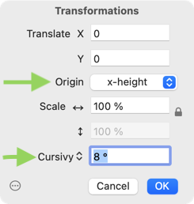

原文: [Figures: superscript (superior) and subscript (inferior) figures](https://glyphsapp.com/learn/superscript-and-subscript-figures)
# 数字：上付き（superior）と下付き（inferior）数字

チュートリアル

[ OpenTypeフィーチャー ](https://glyphsapp.com/learn?q=opentype+features)

執筆者: Rainer Erich Scheichelbauer

[ en ](https://glyphsapp.com/learn/superscript-and-subscript-figures) [ fr ](https://glyphsapp.com/fr/learn/superscript-and-subscript-figures) [ zh ](https://glyphsapp.com/zh/learn/superscript-and-subscript-figures)

2022年8月1日更新（初版公開：2013年7月24日）

数字に関する最後のトピックです：上付き、下付き、そして化学・数学用の下付き数字。この簡単なステップバイステップのチュートリアルで、これらを実装しましょう。

すでに[分数を設定している](fractions.md)ことを前提とします。私たちはそれらを上付き・下付き数字に再利用します。

## 上付き：supsフィーチャー

平方メートルのmの2乗や、xの3乗を想像してみてください。これが上付き数字が持つべき高さです。デザインによっては、分子（numerator）の正確なコピーで十分な場合もあります。しかし、多くのデザインでは、もう少し上にずらす必要があります。


では、どうすればよいのでしょうか？「グリフ > グリフを追加…」（Cmd-Shift-G）に進み、簡単な[レシピ](recipes.md)で分母（denominator）のコンポーネントコピーを作成します。

```
zero.dnom=zerosuperior
one.dnom=onesuperior
two.dnom=twosuperior
three.dnom=threesuperior
four.dnom=foursuperior
five.dnom=fivesuperior
six.dnom=sixsuperior
seven.dnom=sevensuperior
eight.dnom=eightsuperior
nine.dnom=ninesuperior
```

次に、`superior`グリフを選択し（フォントビューでも編集ビューでも構いません）、上にずらします。「パス > 変形」で、一括で上にずらすことができます。「Y座標に平行移動」フィールドに適切な値を入力すれば完了です。

### 旧バージョン
Glyphs 2以前のバージョンでは、この移動は「フィルタ > 変形 > 変形」で行いました。



「ファイル > フォント情報 > フィーチャー」で「更新」ボタンをクリックすると、Glyphsが`sups`（superscript）フィーチャーを生成します。


この方法、つまり`one.sups`のようにフィーチャータグを接尾辞に持つ名前ではなく`onesuperior`を使用する方法では、`superior`グリフは[別々のUnicode値](unicode/.md)を受け取ることに注意してください。したがって、このフィーチャーは単なる*グリフ*ではなく、*キャラクター*に影響を与えます。[公式仕様](https://docs.microsoft.com/en-us/typography/opentype/spec/features_pt#tag-39sups39)によると、これは問題ありません。

> これには意味的な価値の変更が含まれることがあります。元のキャラクターコードに加えて、アプリケーションは新しいキャラクターのコードを保存すべきです。

ここでのマジックワードは「意味的な価値の変更」です。OpenTypeフィーチャーは通常、これを行うべきではありません。つまり、Unicode値を変更し、それによって意味的な価値を変更することです。しかし、いくつかの例外があり、幸いなことに`sups`はその一つです。したがって、私たちのフィーチャーコードは問題なく、この方法を心からお勧めする理由もそこにあります。

## 下付き：subs 対 sinf

えっ？下付き用に2つの異なるOpenTypeフィーチャーがあるのですか？[公式の文言](https://docs.microsoft.com/en-us/typography/opentype/spec/features_pt#subs)では、`subs`（subscript）は次のようになっています。

> 「subs」フィーチャーは、デフォルトのグリフを下付きグリフに置き換えるか、適切な配置のためにグリフの置換と位置調整を組み合わせることがあります。 […] 注：これは意味的な価値の変更です。元のキャラクターコードに加えて、アプリケーションは新しいキャラクターのコードを保存すべきです。

ここでもポイントは、`subs`が「意味的な価値の変更」を引き起こす可能性がある、つまりキャラクターレベルで操作できるという点です。理論的には、OpenTypeフィーチャーはこれを行うべきではありませんが、この場合、Unicodeにはすでに下付き数字がエンコードされていたため、フィーチャーに再利用してもよいでしょう。

そして`sinf`（scientific inferiors）は[科学的な用途を意図しています](https://docs.microsoft.com/en-us/typography/opentype/spec/features_pt#sinf)。

> ライニングまたはオールドスタイルの数字を下付き数字（標準のベースラインより低く配置される小さなグリフで、主に化学や数学の表記のため）に置き換えます。小文字をアルファベットの下付き文字に置き換えることもあります。

したがって、二酸化炭素や水の化学式で下付きの2が必要な場合、これは`sinf`の出番です。


`subs`用の数字を`sinf`用の数字と*同一*にしたいと思うのは、まったく正当なことです。しかし、`sinf`は公式には意味の変更を容認していません。それでも、同じセットの下付き数字を両方に使用することは問題なく、私たちもその方法をお勧めします。

これを実現するには、ドットなしの`inferior`接尾辞を持つ数字を使用します。それらを作成するには、「グリフ > グリフを追加…」を呼び出した後に表示されるダイアログに、これをペーストします。

```
zero.dnom=zeroinferior
one.dnom=oneinferior
two.dnom=twoinferior
three.dnom=threeinferior
four.dnom=fourinferior
five.dnom=fiveinferior
six.dnom=sixinferior
seven.dnom=seveninferior
eight.dnom=eightinferior
nine.dnom=nineinferior
```

「生成」を押すと、Glyphsは新しいグリフを分母のコンポーネントコピーとして作成します。次に、「フィルタ > 変形」で、今度は負の「Y座標に平行移動」値を使って下にずらします。

「ファイル > フォント情報 > フィーチャー」に進み、「更新」ボタンを押すと、Glyphsがそれらを使って`subs`と`sinf`の両方のフィーチャーを生成します。これで完了です、おめでとうございます！

## 便利なスクリプト

上記の手順はすべて、かなり面倒です。これらすべてが自動化できたらいいのに、と思うあなたの気持ちはよくわかります。私も同じ状況でした。だからこそ、[mekkablue script collection](glyphsapp3://showplugin/mekkablue%20scripts)には、*Build Glyphs > Build Small Figures*というスクリプトがあります。これを実行すると、次のようなダイアログが表示されます。


そして、それは書かれている通りのことを行うので、使い方は非常に簡単です。

1.  「デフォルトの接尾辞」フィールドに、「ベース」となる小さい数字の接尾辞を入力します。つまり、`one`、`two`などに続くすべての部分です。通常、これは分母の`.dnom`になります。なぜなら、分母はベースライン上に留まる傾向があるため、良い出発点になるからです。  
    デフォルトの数字はアウトラインベースであるべきです。つまり、他の小さい数字をコンポーネントとして含んでいてはいけません。もし不確かな場合は、「デフォルトの接尾辞を持つ小さい数字を分解」オプションを使用してください。

2.  「派生グリフ」に、派生する小さい数字のすべての接尾辞を、それぞれコロンと垂直方向のオフセット値（ユニット単位）を続けてリストします。複数のエントリはカンマで区切ります。接尾辞にドットがある場合は、ドットを含めるのを忘れないでください。例：`.numr:250, superior:350, inferior:-125`。
3.  「作成」ボタンを押します。スクリプトは、小さい数字をコンポジットとして再構築します。コンポーネントとしては、デフォルトの接尾辞を持つ数字を使用します。

素晴らしい。グリフの作成とコンポジットの変形がすべてワンステップで完了します。そして、節約できた時間で、コーヒーでも飲みに行きましょう。

## エッジケース：意味の変更を避ける

何らかの理由で、上記で述べた意味の変更を*避けたい*場合、または意味的な上付き数字と純粋なOpenTypeの上付き数字を分けておく必要がある場合は、上付き数字に`.sups`という接尾辞を使用してください。なぜなら、ドット接尾辞を持つグリフはUnicode値を持たないからです。そのためのレシピはこちらです。

### 注意
私たちはこの方法を推奨しません。エンコードされた`superior`数字を使用する方法で問題なく、正常に機能します。したがって、技術的な問題を解決する必要がある場合にのみ、この方法を行ってください。

```
zero.dnom=zero.sups
one.dnom=one.sups
two.dnom=two.sups
three.dnom=three.sups
four.dnom=four.sups
five.dnom=five.sups
six.dnom=six.sups
seven.dnom=seven.sups
eight.dnom=eight.sups
nine.dnom=nine.sups
```

同様に、`subs`と`sinf`を区別する必要がある場合や、上記で述べた意味の変更を避けたい場合は、ドットを含む`.sinf`と`.subs`の両方の接尾辞を使用してください。ドットなしの`inferior`数字の代わりです。パーティーを始めるために、こちらが「グリフ > グリフを追加…」（Cmd-Shift-G）用のグリフレシピです。

```
zero.dnom=zero.sinf
one.dnom=one.sinf
two.dnom=two.sinf
three.dnom=three.sinf
four.dnom=four.sinf
five.dnom=five.sinf
six.dnom=six.sinf
seven.dnom=seven.sinf
eight.dnom=eight.sinf
nine.dnom=nine.sinf

zero.dnom=zero.subs
one.dnom=one.subs
two.dnom=two.subs
three.dnom=three.subs
four.dnom=four.subs
five.dnom=five.subs
six.dnom=six.subs
seven.dnom=seven.subs
eight.dnom=eight.subs
nine.dnom=nine.subs
```

次に、「パス > 変形」が、数字を再び正しい位置に移動させるのに役立ちます。フォントを書き出す前に、「ファイル > フォント情報 > フィーチャー」でフィーチャーを更新するのを忘れないでください。

---
サンプルフォント：[MARTHA](http://cargocollective.com/lisaschultz/Martha)、LISA SCHULTZ氏提供。

---

更新履歴 2019-05-06: Glyphs 2.6向けに手順を更新。@madigens氏に感謝。リンクを更新し、意味の変更について説明を追加。

更新履歴 2019-12-10: スクリプトに関するセクションを追加。

更新履歴 2020-01-11: 軽微な誤字を修正。

更新履歴 2020-03-25: タイトルを変更。

更新履歴 2022-08-01: タイトル、関連記事、軽微なフォーマット、Glyphs 3向けの軽微なテキスト更新、すべてのスクリーンショットをライトモードに変更、表現「compound」を「composite」に置き換え。

## 関連記事

[すべてのチュートリアルを見る →](https://glyphsapp.com/learn)

*   ### [数字：スモールキャップ用の数字](small-cap-figures.md)

    チュートリアル

[ OpenTypeフィーチャー ](https://glyphsapp.com/learn?q=opentype+features)

*   ### [数字：プロポーショナル、等幅、ライニング、オールドスタイルの数字セット](figure-sets.md)

    チュートリアル

[ OpenTypeフィーチャー ](https://glyphsapp.com/learn?q=opentype+features)

*   ### [数字：分数](fractions.md)

    チュートリアル

[ OpenTypeフィーチャー ](https://glyphsapp.com/learn?q=opentype+features)

*   ### [数字：スラッシュ付きゼロ](slashed-zero.md)

    チュートリアル

[ OpenTypeフィーチャー ](https://glyphsapp.com/learn?q=opentype+features)

*   ### [レシピ](recipes.md)

    チュートリアル

[ シェイプの再利用 ](https://glyphsapp.com/learn?q=reusing+shapes)

*   ### [Unicode](unicode.md)

    チュートリアル

[ OpenTypeフィーチャー ](https://glyphsapp.com/learn?q=opentype+features) [ スクリプト ](https://glyphsapp.com/learn?q=scripting)