原文: [Switching shapes](https://glyphsapp.com/learn/switching-shapes)
# シェイプを切り替える

チュートリアル

[ インターポレーション ](https://glyphsapp.com/learn?q=interpolation)

執筆者: Rainer Erich Scheichelbauer

[ en ](https://glyphsapp.com/learn/switching-shapes) [ es ](https://glyphsapp.com/es/learn/switching-shapes)

2022年7月23日更新（初版公開：2021年5月25日）

シェイプは、LightからBoldへと補間する際に形を変える必要があることがあります。Glyphsには2つの解決策があります。

### バージョンに関する注意
**この記事はGlyphs 3に関するものです。** Glyphs 2での解決策をお探しの場合は、[Alternating Glyph Shapes: The Bracket Trick](alternating-glyph-shapes.md)および[Alternating Glyph Shapes with Multiple Axes](alternating-glyph-shapes-with-multiple-axes.md)をご覧ください。

多くのストロークを持つシェイプの完全な複雑さを、インターポレーション中に維持するのは難しいことがあります。通常、LightからBoldへ、またはWideからNarrowへと補間する際に、ある時点で問題に突き当たります。これは、簡単に言えば、徐々にスペースがなくなっていき、ある時点でグリフのすべての部分を収めることができなくなるからです。よくある例としては、ストロークやスラッシュ、バーがシェイプ全体を横切る多くの通貨記号が挙げられます。ドル記号を例にとってみましょう。

しかし、これは通貨記号だけではありません。文字が太くなるにつれて、a、e、g、wのような構造的に密な文字など、他のグリフの構造を変更する必要がある場合もあります。

これらのすべての場合において、単純な線形補間では不十分であり、グリフを*構造的に*変更する手段に頼らざるを得なくなります。言い換えれば、グリフを*異なる補間に切り替える*ことになります。Glyphsでは、これを2つの方法で実現できます。同じグリフ内で**代替レイヤー**を使用する方法と、2つの**代替グリフ**を使用する方法です。どちらの方法にも長所と短所があります。

## 1. 代替レイヤー（ブラケット・レイヤー）

「代替レイヤー」アプローチでは、2つのものを含む追加の特殊なレイヤーを設定します。1つ目はもちろん代替シェイプのアウトライン、2つ目はデザイン軸のどの位置でマスターレイヤーの代わりに代替レイヤーを使用するかという追加情報です。理にかなっていますよね。

### 用語
代替レイヤーは「ブラケット・レイヤー」と呼ばれることがあります。これは、その機能を短い表記法で記述する際に角括弧が使われるためです。`[100<wg]`は、ウェイト値が100を超えたところで切り替わる代替レイヤーを表します。この短い表記法は「レイヤー」パレットで使用されているのを見ることができます。

### 代替レイヤーの設定

これが現在の`dollar`記号の様子です。「表示 > マスター間の互換性を表示（View > Show Master Compatibility）」（Ctl-Opt-Cmd-N）をオンにしています。

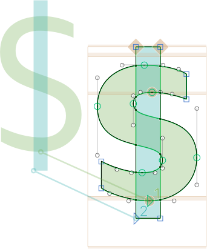

ご覧の通り、うまく補間されています。唯一の問題は、ウェイト軸の太い方の端でシェイプが詰まってしまうことです。したがって、この例では、太い補間によりよく収まるように、「途切れた」縦棒を持つ代替レイヤーを追加する必要があります。

では、`dollar`グリフに代替レイヤーを設定しましょう。

1.  各マスターに対して、レイヤーを複製します：「レイヤー」パレットでマスターを選択し、パレットの左下にあるプラスボタンをクリックします。現在のタイムスタンプを名前として持つレイヤーの複製が作成されます。

2.  各レイヤーの複製に対して、レイヤー名を右クリックし、コンテキストメニューから*代替（Alternate）*を選びます。

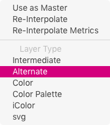

これにより、公式に空の角括弧`[]`を名前に持つ代替レイヤーになります。

3.  各代替レイヤーに対して、その名前をダブルクリックし、デザイン座標で適用範囲を定義します。対応するすべての代替レイヤーが同じ適用範囲を持つようにしてください。例えば、代替デザインを補間値100で有効にしたい場合は、各代替レイヤーの*Weight*軸の最小適用範囲に`100`と入力します。

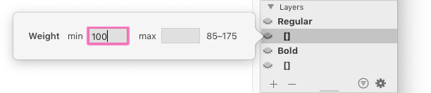

各軸の範囲は、適用範囲設定の右側に表示されます。ここで定義する制限値は、もちろんその範囲内に収まらなければなりません。上のスクリーンショットでは、例えば*Weight*軸は85から175の範囲です。

すべて正しく行っていれば、「レイヤー」パレットは次のようになります。

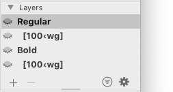

各マスターレイヤーは、ウェイトが100を超えると代替レイヤーに切り替わります。 अब、あとはアウトラインに必要な変更を加えるだけです。この場合、ナイフツール（Shift-E）を使って縦棒に2つの切り込みを入れ、選択ツール（V）で不要な中央部分をダブルクリックしてDeleteキーで削除するだけです。もちろん、代替レイヤー同士の互換性を保つ必要があります。さもないと補間が機能しません。「表示 > マスター間の互換性を表示（View > Show Master Compatibility）」（Ctrl-Opt-Cmd-N）で素早く確認すれば安心です。

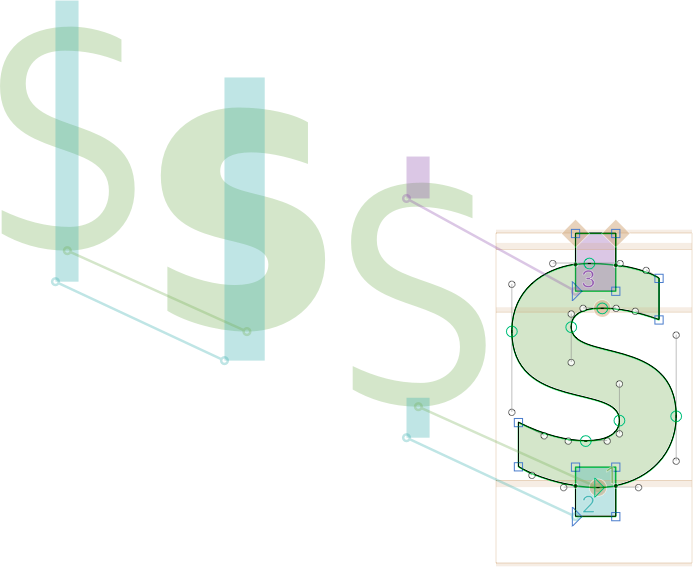

左半分では、マスターレイヤー同士（この場合は85の*Regular*と175の*Bold*）の補間が見られます。しかし、右半分では代替レイヤーが見られます。これらは両方とも、それぞれのマスターレイヤーを補間値100で置き換えます。

さて、実際に機能するかどうか見てみましょう。プレビューエリアでポップアップから*すべてのインスタンスを表示*を選ぶか、バリアブルフォントを書き出して[Samsa](https://www.axis-praxis.org/samsa/)や[Font Gauntlet](https://dinamodarkroom.com/gauntlet/)のようなツールを使うか、私がよくやるのは、書き出し直後に[mekkablue script](glyphsapp3://showplugin/mekkablue%20Scripts)の*Script > mekkablue > Test > Variable Font Test HTML*を実行することです。

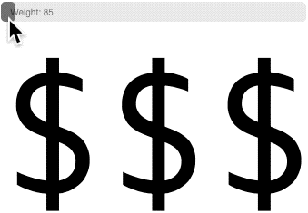

ハイタッチ！

繰り返しになりますが、重要なのは、代替レイヤーのUIに入力する値は*デザイン座標*、つまり「ファイル > フォント情報 > マスター」および「書き出し」でマスターとインスタンスに使用している実際の補間値であるということです。これは、*Axis Position*や*Axis Mappings*パラメータによる補正前の値です。

### リバース・ブラケット・レイヤー

ここまでは順調です。代替レイヤーを設定し、書き出しも機能します。すべて問題なく、私たちは満足です。しかし、フォントビュー（Cmd-Opt-1）に切り替えてドル記号までスクロールすると、まだきれいです。しかし、Cmd-1、Cmd-2などでマスターを切り替えると、気づかされます。太いマスターでは、「間違った」ドル記号が表示されています。


これは、途切れたバーを持つ太いドル記号が2番目のマスターの代替レイヤーであり、実際のマスターレイヤーではないためです。そして、フォントビューでは常にマスターレイヤーしか表示されません。困りましたね。この問題に対処するには、2つの可能なアプローチがあります。

1つ目は、「気にしない」アプローチです。すべて機能しており、作業は完了し、これ以上やることはありません。ありがとうございました、さようなら。このアプローチがあなたにぴったりなら、この章の残りはスキップして構いません。

そして、「リバース・ブラケット・レイヤー」という方法があります。その場合、グリフをダブルクリックするか、選択して「表示 > 新規タブ」（Cmd-T）で編集ビューで開きます。太いマスターに切り替えます。「レイヤー」パレットをよく見て、「正しい」描画のある代替レイヤーを見つけ、それを右クリックして、コンテキストメニューから*マスターとして使用（Use as Master）*を選択します。

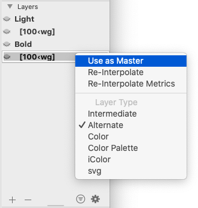

結果：マスターレイヤーとブラケット・レイヤーが入れ替わりました。マスターレイヤーは今や途切れたバーのドル記号を持ち、同時にブラケット・レイヤーでもあります。残った完全なバーのドル記号を持つレイヤーは、現在の日付をインジケーターとして持つ単なるバックアップレイヤーになりました。

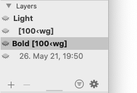

そのバックアップレイヤーを、再び代替レイヤーにする必要があります。やり方はご存知の通りです。右クリックして、コンテキストメニューからレイヤータイプ*代替（Alternate）*を選びます。再び太字の角括弧で表現されます。

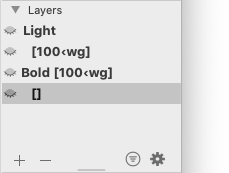

ただし、今回は値を空のままにしておきます。そのロジックが他のブラケット・レイヤーとは逆方向に働くため、これを*リバース*ブラケット・レイヤーと呼びます。そして…フォントビューでマスターを切り替える体験が、少しだけ良くなりました。

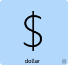

その手間をかける価値があったかどうかは、自分で判断する必要があります。

### フィーチャー・バリエーション

代替レイヤーをどのように設定しても、内部ではGlyphsが代替レイヤーの構造を分析し、それらをいわゆる「フィーチャー・バリエーション」に変換します。これらのフィーチャー・バリエーションは、デザインスペースの特定の位置、言い換えれば特定のスライダーの位置で、一部のグリフを代替バージョンに置き換えるOpenTypeの置換ルールです。

デフォルトでは、これらのフィーチャー・バリエーションは`rlig`（[Required Ligatures、必須の合字](https://docs.microsoft.com/en-us/typography/opentype/spec/features_pt#rlig)）というOpenTypeフィーチャーに入ります。これは常にオンになっているフィーチャーで、通常、ユーザーがOpenTypeフィーチャーにアクセスするのが難しい環境（例えばMicrosoft Wordなど。ただし、次期バージョンではこの点が大幅に改善されることを期待しています）でも機能します。

しかし、フィーチャー・バリエーションが`rlig`に限定される必要はありません。もしあなたが何をしているか分かっているなら、別のOpenTypeフィーチャーに追加することもできます。この目的のためには、「ファイル > フォント情報 > フォント > カスタムパラメータ」に行き、*Feature for Feature Variations*という新しいパラメータを追加し、その中にフィーチャー・バリエーションを入れたいフィーチャーの4文字のタグを書き込みます。

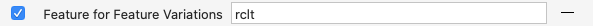

スクリーンショットでは、`rclt`（[Required Contextual Alternates、必須の文脈依存代替字形](https://docs.microsoft.com/en-us/typography/opentype/spec/features_pt#rclt)）が使用されているのがわかります。これはランダムな例ですが、フォントがそれをサポートする環境向けに意図されている場合には意味があるかもしれません。

繰り返しになりますが、本当に正当な理由があり、何をしているか本当に分かっている場合にのみ、フィーチャー・バリエーションのフィーチャーを変更してください。そして、Windows、Mac、あらゆる種類のWebブラウザで広範囲なテストを行ってください。警告はしましたよ。

### rvrnの問題

フィーチャー・バリエーションのより良い場所として、`rvrn`（[Required Variation Alternates、必須のバリエーション代替字形](https://docs.microsoft.com/en-us/typography/opentype/spec/features_pt#rvrn)）について聞いたことがあるかもしれません。本当にそうなのでしょうか？実はそうではありません。一見すると、仕様はそのために意図されているように聞こえますが、実際には違います。ほとんどの場合機能すると主張することもでき、それは正しいでしょう。しかし、すべてのアプリが仕様を正しく実装しているわけではなく、Adobeアプリも影響を受けることをお伝えするのは心苦しいです。

では、問題が起こるとき、具体的に何がうまくいかないのでしょうか？`rvrn`の仕様は非常に複雑で、「デフォルトグリフ」の置換について議論しており、`rvrn`によって置換できるのは*デフォルトグリフのみ*であると述べています。しかし、仕様は（デフォルトでない）置換されたグリフがどのように処理されるべきかについても述べていますが、ここでいくつかのアプリが仕様に従っておらず、結果として、フィーチャー・バリエーションはデフォルトでないグリフに対して機能しません。

Glyphsでは、*デフォルト*グリフは通常、Unicode値が割り当てられており、名前にピリオドやアンダースコアが含まれていません。例えば、`eacute`、`seen-ar`、`alpha`、`soSo-thai`などです。一方、（デフォルトでない）*置換された*グリフは、OpenTypeの置換フィーチャーがそれらを切り替えるため、Unicode値は必要ありません。グリフ名にピリオドやアンダースコアがあることで一目でわかります。例えば、`eacute.sc`、`seen-ar.fina`、`alpha_alpha`、`soSo-thai.ss01`などです。言い換えれば、あなたの代替レイヤーは、置換フィーチャーを必要とするグリフには機能しません。スモールキャップ、位置指定代替字形、合字、スタイルセットなどには機能しないということです。

公平を期すために言うと、この誤った実装の影響を受けるアプリはますます少なくなっていますが、依然として問題は残っています。ですから、`rlig`を選ぶ方が良いでしょう。

## 2. 代替グリフ

このシナリオでは、2つの補間を2つの別々のグリフ、例えば`dollar`と`dollar.bold`に保持します。そして、静的フォントの場合は「ファイル > フォント情報 > 書き出し」で、バリアブルフォントの場合は「ファイル > フォント情報 > フィーチャー」で、2つのシェイプ間の切り替えを制御します。


### 代替グリフの設定

これは簡単です。`dollar`グリフを複製し（「グリフ > グリフを複製」、Cmd-D）、結果としてできた複製の名前を`dollar.001`から`dollar.bold`に変更するだけです。

接尾辞のドットまでのグリフ名を同じにし、ドットの後に意味のある接尾辞を選ぶのが良い考えです。あなたにとって意味のあるものなら何でも構いません。ただし、ある時点で代替グリフを検索したりフィルタリングしたりするかもしれないことを考えると、使用する接尾辞を短く一貫性のあるものにしておくのが良いでしょう。そうすることで、タイプミスのリスクを減らし、カスタムパラメータでのワイルドカード表現（後述）の恩恵を受けることができます。

いずれにせよ、`dollar.bold`が別のグリフとして確立されたら、必要な方法で編集できます。使用しているすべてのマスターで互換性があることを確認してください。

### 静的フォントの設定

「ファイル > フォント情報 > 書き出し」の各インスタンスに対して、以下の作業が必要です。

1.  代替グリフに切り替える必要があるかどうかを判断します。もし必要な場合は、*Rename Glyphs*パラメータを追加し、その値に`dollar=dollar.bold`と記述します。追加のリネームは連続する行に記述します。

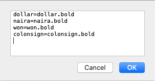

2.  常に、残った代替グリフを*Remove Glyphs*パラメータで除外します。その値に`dollar.bold`と記述し、追加の削除は連続する行に記述します。

言い換えれば、**すべての**インスタンスに*Remove Glyphs*パラメータがあります。しかし、太いインスタンスにのみ*Rename Glyphs*パラメータがあります。左側のサイドバーでそれぞれのインスタンスを選択すれば、複数のインスタンスに対して一度にパラメータを追加・編集できることを覚えておいてください。また、同じパラメータに複数の削除やリネームを複数の行にわたって追加できることも覚えておいてください。つまり、5つのグリフを削除するために5つのパラメータを追加する必要はなく、むしろ5行のグリフ名を持つ1つのパラメータで十分です。

### プロのヒント
*Remove Glyphs*パラメータの値に、別の行で`*.bold`のようなワイルドカード表現を使うことで、`.bold`で終わる*すべての*グリフを削除できます。こうすれば、同じ接尾辞を持つグリフを追加したときにパラメータを更新する必要がありません。

すべて正しく行っていれば、太いインスタンスのパラメータは次のようになります。

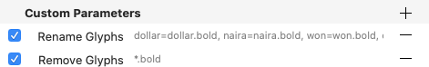

これで、静的フォントの書き出しはすでに機能します。そして、そのグリフセットは「クリーン」になります。つまり、フォント内に未使用の余計な代替グリフは残りません。そして、ユーザーからグリフパレットのこれらの余分なセルは何のためにあるのかと尋ねられることもありません。

### バリアブルフォントの設定

バリアブルフォントでは、デフォルトグリフと代替グリフの両方が書き出しに含まれている必要があります。したがって、「ファイル > フォント情報 > 書き出し」のそれぞれのバリアブルフォント設定で、グリフを削除したり名前を変更したりはしません。OpenTypeフィーチャーが、スライダーが指定したしきい値を超えると、デフォルトを代替に切り替えます。前述の「代替レイヤー」アプローチでは、GlyphsがそのOpenTypeフィーチャーを自動で導き出してくれました。今度は、フィーチャーコードを書くことで、自分でそのフィーチャー・バリエーション用のフィーチャーを作成します。

「うわー、うわー、うわー」と息をのむのが聞こえるようです。「コーディング？私が？」でも心配しないでください。とても簡単で論理的です。

まず、「ファイル > フォント情報 > フィーチャー」で新しいフィーチャーを追加します。どれでしょう？前述と同じ選択肢です。通常は常にオンになっているフィーチャーが必要で、明白な選択肢として`rlig`をお勧めします。もちろん、フィーチャー・バリエーションはどのフィーチャーにも、同時に複数のフィーチャーにさえ追加できます。あなたにとって最も意味のあるものなら何でも構いません。この例では、`rlig`（[Required Ligatures、必須の合字](https://docs.microsoft.com/en-us/typography/opentype/spec/features_pt#rlig)）フィーチャーを追加します。

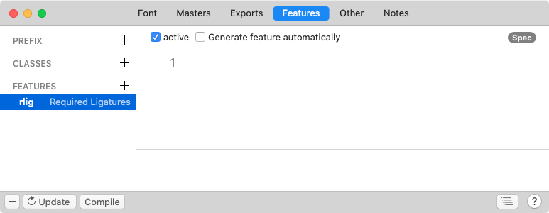

コードでは、「プリプロセッサコード」と呼ばれるものから始めます。

```
#ifdef VARIABLE

#endif
```

これら2行の間に書かれたものはすべてOTVarの書き出し用に予約され、静的な書き出しには影響しません。`ifdef VARIABLE`を「もしフォントがバリアブルフォントとして定義されているなら、以下を実行せよ」と読んでください。お分かりですね。

### プロのヒント
もし機会があれば、`ifdef`の代わりに`ifndef`を使うことで、プリプロセッサの条件を*否定*することもできます。単語に余分な`n`があることに注意してください。「もしフォントが…として*定義されていない*なら」と読むことができます。つまり、`#ifndef VARIABLE`という行を、*静的*フォントの書き出しにのみ適用されるフィーチャーコードの前に使うことができるということです。ただし、再び`#endif`で閉じるのを忘れないでください。

続けましょう。次に、`dollar`を`dollar.bold`に置き換える必要がありますが、それは*Weight*スライダーが特定の領域にあるという条件の下でのみです。そして、驚くべきことに、それはとても簡単です。自分で理解できるか試してみてください。

```
#ifdef VARIABLE

condition 127 < wght < 175;
sub dollar by dollar.bold;

#endif
```

平易な言葉で言えば、これはスライダーがWeight値127を通過すると、以下のすべての置換（または次の`condition`まで）が実行されることを意味します。この場合はドル記号だけです。繰り返しになりますが、*デザイン座標*、つまり*Axis Mappings*や*Axis Location*パラメータによる補正前の、Glyphsで使用する座標を使用します。`condition`文は、軸タグ（この場合は`wght`）を2つの軸値の間に記述する必要があります：`127 < wght < 175`。もしそのうちの1つが軸の実際の*限界値*（この場合は175）であれば、省略することもできます。

```
#ifdef VARIABLE

condition 127 < wght;
sub dollar by dollar.bold;

#endif
```

### 注意
短い表記法（condition文で軸の限界値を省略する）には、Glyphsビルド3085以降が必要です。

条件を複数の軸に依存させる必要がある場合は、カンマで連結します。こちらの2番目のブロックを見てください。

```
#ifdef VARIABLE

condition 127 < wght;
sub dollar by dollar.bold;
sub naira by naira.bold;
sub won by won.bold;
sub colonsign by colonsign.bold;

condition 105 < wght, wdth < 90;
sub dollar by dollar.bold;
sub naira by naira.bold;
sub won by won.bold;
sub colonsign by colonsign.bold;

#endif
```

上記と同様に、置換は*Weight*スライダーが値127を超えると発生します。ただ今回は、最初の`condition`ブロックが、`naira`、`won`、`colonsign`のような、より多くの一般的な通貨記号をカバーしています。

2番目のconditionブロックは、置換が105以上でも発生するが、それは*Width*スライダーが90未満の場合のみであると述べています。この例では、*Width*値100が「通常」の幅を指すと仮定しています。75が下限の幅境界であり、およそ「通常」の幅の4分の3の行長を生成するコンデンス幅を示すと仮定すると、条件付き置換は視覚的に次のように表現できます。


どうでしょう？自分で条件付きコードを書けば、より複雑な設定が可能です。ある程度は代替（ブラケット）レイヤーでこれを再現できますが、より手間がかかり、ある時点で限界に達するでしょう。だからこそ、このアプローチでの追加の制御は貴重なのです。いずれにせよ、すべて正しく行っていれば、「フォント情報 > フィーチャー」ウィンドウは次のようになります。

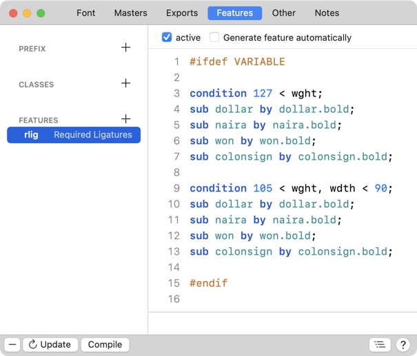

### スニペット

ああ、それから、お楽しみがあります。スニペットです！「OTVAR Feature Variations」というデフォルトのスニペットがあり、編集に便利なサンプルコードを追加してくれます。

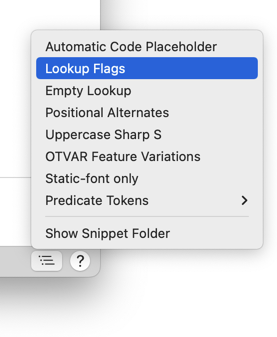

ウィンドウの右下にあるスニペットメニューからアクセスできます。もちろん、独自のスニペットを追加することもできます。

## いつどちらを選ぶか：代替グリフか代替レイヤーか

それはあなたがどのようなタイプの書体デザイナーであるかによると思います。個人的には、代替*グリフ*によるアプローチを好みます。なぜなら、より多くの制御が可能で、フィーチャーコード内で多くのグリフのブレークポイントを一度に変更するのがずっと簡単だからです。各グリフの代替レイヤーに入って作業することを想像してみてください…うげぇ。しかし一方で、代替レイヤーはそもそも設定が簡単です。

まあ、どちらを選ぶかはあなた次第です。以下に、その助けになるかもしれない長所と短所のまとめを挙げます。

| 代替レイヤー | 代替グリフ |
| :--- | :--- |
| **利点** | 💚 単純な切り替えには手早くできる<br>💚 代替グリフでフォントビューが散らからない<br>💚 静的およびバリアブルフォントの両方の書き出しで機能する | 💚 すべてのバリエーションがフォントビューで表示され、管理しやすい<br>💚 複数の軸に沿ったより複雑な切り替えが可能<br>💚 フィーチャー・バリエーションをより細かく制御できる<br>💚 条件のしきい値をより簡単に変更できる |
| **欠点** | 😬 フォントビューでの全体像の把握が難しくなる<br>😬 複数軸の補間には設定が難しすぎるかもしれない | 😬 より多くのグリフを管理する必要がある<br>😬 インスタンス（静的フォント用）とフィーチャーコード（バリアブルフォント用）を別々に扱う必要がある |

---

更新履歴 2021-05-26: リバース・ブラケット・レイヤーを追加。代替レイヤーのテキストを修正。

更新履歴 2021-05-27: すべての例でユーザー座標をデザイン座標に置き換え、rvrnの説明を改善。

更新履歴 2021-06-29: 誤解を招く表現（「レイヤー」ではなく「グリフ」）を修正、Jeffに感謝！

更新履歴 2021-07-29: ハッシュタグと`ifdef`または`endif`の間のスペースを削除、Craigに感謝！

更新履歴 2022-07-23: conditionコードのスクリーンショットを更新（古いものにはタイプミスがありました）。

## 関連記事

[すべてのチュートリアルを見る →](https://glyphsapp.com/learn)

*   ### [マルチプルマスター、パート1：マスターの設定](multiple-masters-part-1-setting-up-masters.md)

    チュートリアル

[ インターポレーション ](https://glyphsapp.com/learn?q=interpolation)

*   ### [マルチプルマスター、パート2：アウトラインの互換性を保つ](multiple-masters-part-2-keeping-your-outlines-compatible.md)

    チュートリアル

[ インターポレーション ](https://glyphsapp.com/learn?q=interpolation)

*   ### [マルチプルマスター、パート3：インスタンスの設定](multiple-masters-part-3-setting-up-instances.md)

    チュートリアル

[ インターポレーション ](https://glyphsapp.com/learn?q=interpolation)