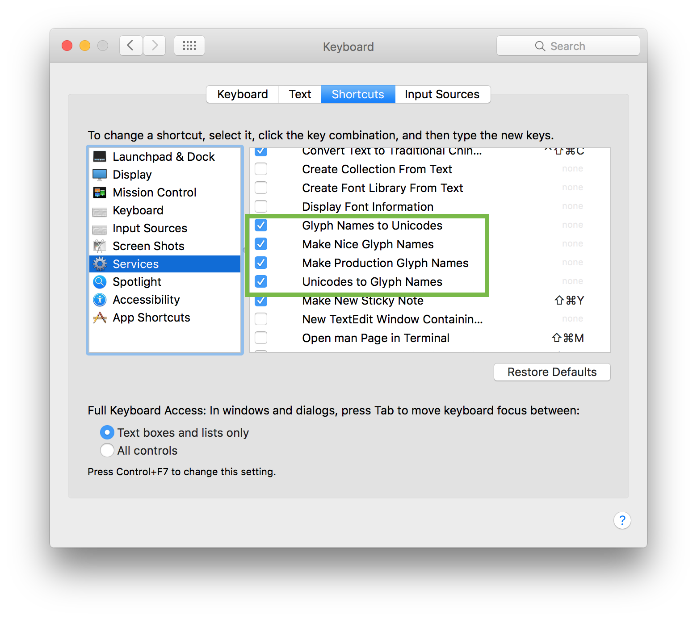
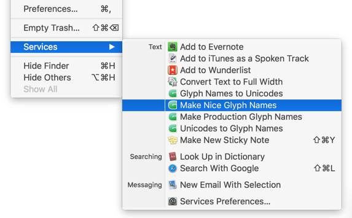
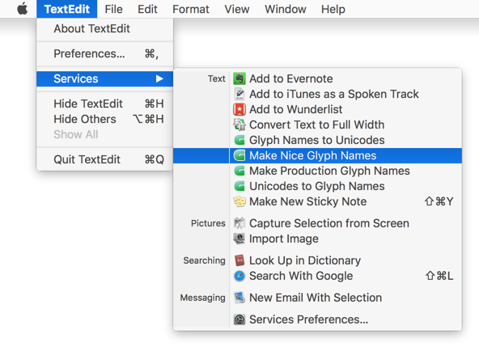

原文: [System services](https://glyphsapp.com/learn/system-services)
# システムサービス

チュートリアル

執筆者: Rainer Erich Scheichelbauer

[ en ](https://glyphsapp.com/learn/system-services) [ fr ](https://glyphsapp.com/fr/learn/system-services) [ zh ](https://glyphsapp.com/zh/learn/system-services)

2022年8月3日更新（初版公開：2013年6月9日）

macOSでは、アプリケーションは自身の範囲外、つまりシステム全体でその機能の一部を提供することができます。これは*システムサービス*と呼ばれます。

Glyphsは、システム上のどこでも使える4つの便利なテキスト機能を提供しています：*Make Nice Glyph Names（グリフ名をナイスネームに変換）*、*Make Production Glyph Names（グリフ名をプロダクションネームに変換）*、*Unicodes to Glyph Names（Unicodeをグリフ名に変換）*、そして*Glyph Names to Unicodes（グリフ名をUnicodeに変換）*です。

これらを有効にするには、以下の3つのステップが完了していることを確認する必要があります：

*   最新バージョンのGlyphsが`/Applications/`フォルダにあること。
*   インストール後、少なくとも一度はログアウトして再度ログインするか、再起動していること。
*   「システム環境設定 > キーボード > ショートカット > サービス」で、上記の4つのサービスがチェックされていること。

Glyphsのサービスを呼び出すには3つの方法があります。1つ目は、システム環境設定で設定したショートカットキーを押す方法。2つ目は、編集可能なテキストを選択し、コンテキストメニューを表示して「サービス」サブメニューを開く方法です。

3つ目は、現在実行中のプログラムのアプリケーションメニューに移動し、その「サービス」サブメニューを開く方法です。

しかし、これらのサービスは何をするのでしょうか？

## 古いグリフ名の変換

*Make Nice Glyph Names*サービスは、現在のテキスト選択範囲内にある古いグリフ名、例えば`afii57427`や`uni0257`などを探し、それらを`seen-ar`や`dhook`のような、Glyphsスタイルで人間が読みやすいナイスネームに変換します。これは、古いグリフ名を含むテキストファイル全体、例えば古いエンコーディングファイルやGlyphsにインポートしたい古いフィーチャーコードなどを、Glyphsのリストフィルタに変換したい場合に非常に便利です。テキスト全体を選択し、一度に変換するだけです。

## 自分で試してみる

もしあなたがこれを読んでいるときにMacを使っているなら、自分で試すことができます。このテキストエリアの内容を選択し、コンテキストメニューを開き（例えば、右クリックまたはCtrlキーを押しながらクリック）、*Services > Make Nice Glyph Names*を選択して、何が起こるか見てみましょう。

afii57427 afii57428 afii57429 uni0122 uni0122.c2sc uni0123 uni0123.smcp uni0136 uni0136.c2sc uni0136.ss01 uni0136.c2sc.ss01 uni0137 uni0137.smcp uni0137.smcp.ss01 uni013B uni013B.c2sc uni013C uni013C.smcp uni0145 uni0145.c2sc uni0146 uni0146.smcp uni0156 uni0156.c2sc uni0157 uni0157.smcp uni0162 uni0162.c2sc uni0163 uni0163.smcp uni0218 uni0218.c2sc uni0219 uni0219.smcp uni021A uni021A.c2sc uni021B uni021B.smcp uni0237 uni1E02 uni1E02.c2sc uni1E03 uni1E03.smcp uni1E0A uni1E0A.c2sc uni1E0B uni1E0B.smcp uni2070 uni2074 uni2075 uni2076 uni2077 uni2078 uni2079 uni2080 uni2081 uni2082 uni2083 uni2084 uni2085 uni2086 uni2087 uni2088 uni2089 uni2116 uni2215

2020-03-13: 「3つのサービス」を「4つのサービス」に置き換えました。
2022-04-11: 軽微なフォーマット変更。

## 関連記事

[すべてのチュートリアルを見る →](https://glyphsapp.com/learn)

*   ### [Glyphs Miniのフォント情報設定](font-info-settings-in-glyphs-mini.md)

    チュートリアル

[ Glyphs Mini ](https://glyphsapp.com/learn?q=glyphs+mini)