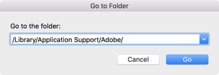
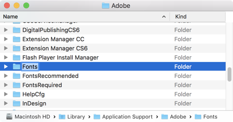
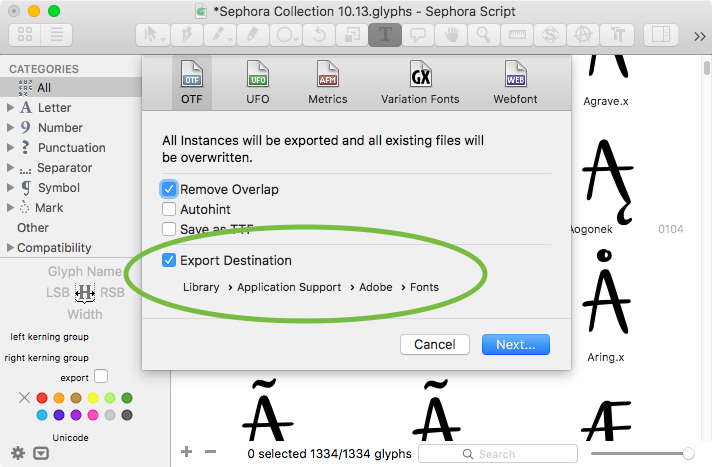
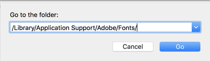
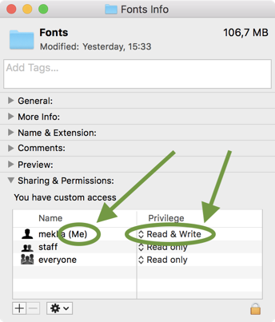
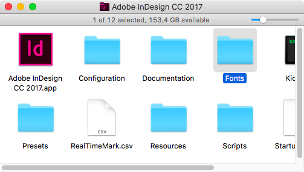
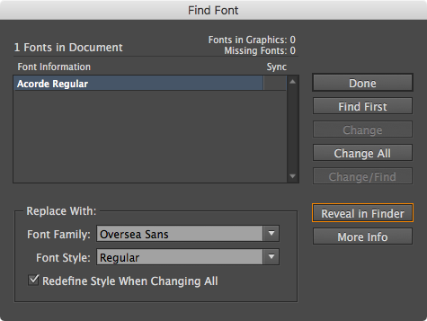
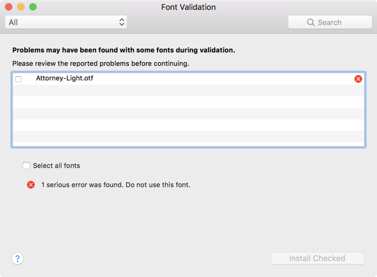

原文: [Testing your fonts in Adobe apps](https://glyphsapp.com/learn/testing-your-fonts-in-adobe-apps)
# Adobeアプリでフォントをテストする

チュートリアル

執筆者: Rainer Erich Scheichelbauer

[ en ](https://glyphsapp.com/learn/testing-your-fonts-in-adobe-apps) [ es ](https://glyphsapp.com/es/learn/testing-your-fonts-in-adobe-apps) [ fr ](https://glyphsapp.com/fr/learn/testing-your-fonts-in-adobe-apps) [ zh ](https://glyphsapp.com/zh/learn/testing-your-fonts-in-adobe-apps)

2022年8月3日更新（初版公開：2012年12月9日）

Adobeは、フォントを素早くテストするための優れた方法を用意しています。とても簡単ですが、正確に行う必要があります。このチュートリアルではその方法を紹介します。

AdobeのCreative SuiteまたはCreative Cloudのいずれかのバージョンがインストールされていますか？フォントを特定のフォルダに書き出すと、それらはAdobeアプリで即座に有効になります。これにより、[フォントキャッシュの問題](eliminating-font-cache-problems.md)を回避できます。再起動も、キャッシュの消去も、再読み込みも必要ありません。

## Adobe Fontsフォルダを作成する

では、その特定のフォルダを作成しましょう。すでにお持ちの場合は、もちろんこのステップをスキップして、次の見出しまでスクロールしてください。しかし、まだそのフォルダがない場合は、以下の方法で作成します。

Finderに切り替え、メニューバーから「移動 > フォルダへ移動…」（Cmd-Shift-G）を選び、ダイアログに、先頭と末尾のスラッシュを含めて、次の行をペーストしてください。

```
/Library/Application Support/Adobe/
```

ダイアログは次のようになります。



「移動」ボタンを押してダイアログを確定します。FinderがAdobeのアプリケーションサポートフォルダに移動します。次に、そのフォルダ内に`Fonts`という名前の新しいフォルダを作成する必要があります。そのためには、「ファイル > 新規フォルダ」（Cmd-Shift-N）を選択し、`Fonts`（つまり、大文字のF、小文字のo, n, t, s）と入力してReturnキーを押します。Macのライブラリ内を変更することになるため、Macのパスワードを求められることがあります。この操作には認証情報が必要です。



> **プロのヒント：** Finderのサイドバーに`Fonts`フォルダを追加しましょう（「表示 > サイドバーを表示」（Cmd-Opt-S）。ただし、ツールバーが表示されている必要があります：「表示 > ツールバーを表示」（Cmd-Opt-T））。`Fonts`フォルダをウインドウのサイドバーの「よく使う項目」の真下にドラッグするだけです。これで、すべての開く/保存ダイアログから素早くアクセスできるようになり、とても便利です！

## Adobe Fontsフォルダに書き出す

Glyphsでフォントを書き出す（Cmd-E）際、「ファイル > 書き出し」ダイアログの下半分、「書き出し先」という部分に注目してください。



1.  「書き出し先」のチェックマークを有効にします。
2.  パスボタンをクリックすると、保存ダイアログシートが表示されます。
3.  ダイアログで、先ほど作成したAdobe Fontsフォルダに移動します。
    *   ヒント1：上で紹介したプロのヒントに従っていれば、左側のサイドバーから快適に`Fonts`を選ぶことができます。
    *   ヒント2：あるいは、Cmd-Shift-Gを押して「移動」ダイアログを呼び出し、そのパスフィールドに次のようにペーストして「移動」をクリックして確定することもできます：  
        `/Library/Application Support/Adobe/Fonts/`
4.  これで、ダイアログでFontsフォルダが選択されているはずです。右下の「開く」ボタンを押してダイアログを確定します。

この後、「書き出し」ダイアログに戻ると、「書き出し先」が「Library > Application Support > Adobe > Fonts」と表示されているはずです。これで「次へ」ボタンをクリックするだけでAdobe Fontsフォルダに書き出すことができます。すると、どうでしょう。そのフォルダに保存されたフォントは、起動中のすべてのAdobeアプリで即座に有効になります。Photoshop、Illustrator、InDesignのいずれであっても、CSやCCのバージョンに関係ありません。

さらに良いことに、Glyphsはこれらの設定を記憶します！ですから、次に書き出すときは、Cmd-Eを押してReturnキーを押すだけで、Adobe Fontsフォルダへのフォント書き出しが完了します。便利ですね。

> **重要な注意：** Adobeアプリがすでに起動中に`Fonts`フォルダを作成した場合は、そのアプリを再起動する必要がありますが、この操作は一度だけでかまいません。これは、Adobeプログラムが起動時にこのフォルダの存在を確認するためです。

同じフォントを再度書き出すと、`Fonts`フォルダ内のファイルは上書きされます。変更は即座に反映されます。したがって、Adobeアプリに切り替えるだけで、運が良ければフォントがリアルタイムで更新されるのを見ることさえできます。

## アクセス権を正しく設定する

先ほど設定したAdobe Fontsフォルダに書き出したはずなのに、選んだAdobeアプリにフォントが表示されない場合は、2つのことを確認してください。

1.  実際に正しいAdobe Fontsフォルダに書き出していることを確認する。
2.  そのフォルダへの*書き込み*権限があることを確認する。

ポイント1について：内部に*Application Support*フォルダを持つ*Library*フォルダは3つもあり、誤って違うものを選んでしまった可能性があるかもしれません。`/System/Library/`（システムライブラリ）、`~/Library/`（ユーザーライブラリ）、そして`/Library/`（ルートライブラリ）があります。あなたが必要なのは最後の、つまりルートライブラリです。確認する最善の方法は、（Finderまたは「ファイル > 書き出し > OTF」のパスダイアログで）Cmd-Shift-Gを押し、表示される「フォルダへ移動」ダイアログにパス`/Library/Application Support/Adobe/`をペーストし、`Fonts`フォルダを探すことです。そこにない場合は、Cmd-Shift-Nで作成してください。

ポイント2について：Finderで、Cmd-Shift-Gを押すか、「移動 > フォルダへ移動…」を選択し、ダイアログにパス`/Library/Application Support/Adobe/Fonts/`をペーストして「移動」ボタンを押すことで、Adobe Fontsフォルダに移動します。



そこに着いたら、「ファイル > 情報を見る」（Cmd-I）を選択してフォルダ情報を表示します。表示される情報ウインドウで、最後のセクション「共有とアクセス権」を探し、`（自分）`とラベル付けされたユーザーが「読み/書き」のアクセス権を持っていることを確認してください。



`（自分）`とラベル付けされたユーザーが見当たらない場合：ウインドウの右下隅にある鍵の記号をクリックすると、パスワードまたはTouch IDを求められます。その後、プラスボタンをクリックし、続くミニダイアログで自分自身をアクセス権を持つユーザーに追加し、「読み/書き」を割り当てます。再度鍵をクリックして変更を確定します。

`（自分）`とラベル付けされたユーザーは存在するが、間違ったアクセス権（「アクセス不可」、「読み出しのみ」、または「書き込みのみ」）が表示されている場合：ウインドウの右下隅にある鍵の記号をクリックし、パスワードまたはTouch IDを求められた後、ユーザーの隣にある「アクセス権」のエントリをクリックし、表示されるポップアップメニューから「読み/書き」を選択します。再度鍵をクリックして変更を確定します。

もう一度試してみてください。

## アプリ専用のFontsフォルダ

*すべて*のAdobeアプリのフォントメニューをテスト書き出しで散らかしたくない場合は、テスト目的でInDesignのみを使用するという選択肢があります。その場合は、InDesignのアプリケーションフォルダ内にある`Fonts`フォルダにフォントを書き出すだけです。



初期状態では、このフォルダを持っているのはInDesignだけです。しかし実際には、このテクニックはほとんどのAdobeアプリで機能します。アプリケーションフォルダ内（アプリ本体の隣）に`Fonts`という名前のフォルダを作成し、そこにフォントを書き出すだけです。繰り返しになりますが、アプリが実行中にそのフォルダを作成した場合は、一度だけ再起動する必要がありますが、その後はずっと問題ありません。

## 問題の特定

それでも問題が発生することがあります。特に、Adobe Fontsフォルダに書き出した後にフォントが更新されないように見える場合です。その場合は、InDesignに切り替えて「書式 > フォント検索…」を選択します。表示されるダイアログで、問題のフォントを選択し、「Finderで表示」ボタンをクリックします。すると、実際に使用されているフォントファイルのFinder上の場所に移動します。この方法で、本当に書き出したフォントが使用されているのか、それとも以前のバージョンか、あるいはシステムのフォントフォルダのいずれかにインストールされている競合するフォントが使用されているのかを確認できます。



残念ながら、Illustratorのような他のAdobeアプリでは、「書式 > フォント検索…」ダイアログにこのボタンがありませんので、そのためにはInDesignを開く必要があります。そして、Illustratorで問題が発生した場合は、Illustratorのアプリ専用の`Fonts`フォルダも確認する必要があります。

それでも問題が見つからない場合は、*Temp*フォルダを空にしてみてください。Glyphsで、「スクリプト > スクリプトフォルダを開く」（Cmd-Shift-Y）を選択すると、GlyphsのApplication Supportフォルダに移動します。*Scripts*フォルダの隣に*Temp*フォルダがあります。それを開き、中のものをすべて選択（Cmd-A）して、選択範囲をゴミ箱に移動（Cmd-Delete）します。その後、Glyphsに戻り、再度書き出し（Cmd-E）を行います。プロジェクトの*Temp*フォルダ内の古いファイルが、書き出しプロセスを妨げることがあります。

## Adobeアプリの更新が遅い

Glyphsからフォントを書き出した後、InDesignやIllustratorに切り替えると、アプリが数秒間フリーズしたり「固まったり」するように感じますか？もしかしたら、Adobeアプリが再びアクティブになり、ウインドウを更新するまでに10～15秒もかかるかもしれません。

この最も可能性の高い理由は単純です。Adobe Fontsフォルダにフォントが多すぎることです。したがって、時々、そこをチェックして、フォントファイルが多すぎないか確認してください。サブフォルダも含まれます。わずか数十個のフォントファイルがあるだけで、顕著なパフォーマンスの低下が見られたことがあります。Finderに切り替え、Adobe Fontsフォルダに移動し、すべてのファイルを選択（Cmd-A）して、それらをゴミ箱に移動（Cmd-Delete）します。

2番目に可能性の高い理由は、アプリ専用とシステム全体のAdobe Fontsフォルダが並行して存在することです。私のアドバイスは、アプリ専用のフォルダを削除することです。Illustrator、Photoshop、またはInDesignのDockアイコンをCmdキーを押しながらクリックすると、それを含むアプリフォルダがFinderで開きます。（Adobeアプリの隣にある）Fontsフォルダをゴミ箱に移動し、アプリを再起動します。

3番目に可能性の高い理由は、フォントの競合です。おそらく`Fonts`フォルダ*内*でさえも：ファイル名が異なるフォントファイルは同じフォルダ内に共存でき、それでも同じファミリー名とスタイル名を持つことができます。フォントの競好は、Adobeアプリがどのフォントを有効にしてフォントメニューに表示すべきか混乱させる可能性があります。これも、Adobeアプリに切り替えるたびに遅延を引き起こす原因になることがあります。良いニュースは、前の2つの段落のアドバイスに従っていれば、これはすでに対処されているはずだということです。

しかし、Adobe Fontsフォルダ内のフォントとシステムにインストールされているフォントとの間で競合を突き止めた場合は、念のため2回のシステム再起動を追加すると良いでしょう。1回目はShiftキーを押しながらで、これによりシステムが「セーフモード」で起動し、フォントキャッシュを含むキャッシュを削除・再構築します。2回目は「セーフモード」なしで再起動し、通常の操作を再開します。注意：キャッシュの再構築には数分余分にかかることがあり、2回目の再起動後しばらくシステムが遅くなることがあります。もっと知りたいですか？詳細は[フォントキャッシュの問題を解消する](eliminating-font-cache-problems.md)チュートリアルですべてを学んでください。

## Adobe Fontsフォルダからの直接インストールは不可

Adobe Fontsフォルダでのフォントのテストが終わり、フォントが本番で使える状態になったとします。それならシステムにインストールしても問題ないはずです。しかし、まだ一つ落とし穴があります。High Sierra 10.13.6より前のmacOSバージョンでは、Adobe Fontsフォルダ内からフォントをインストールすることはできません。フォントファイルをダブルクリックするか、右クリックして「このアプリケーションで開く > Font Book」を選択すると、Font Bookは次のようなメッセージで文句を言ってきます。



心配しないでください、あなたのフォントは正常です。エラーメッセージは誤解を招くだけです。本当の理由は、Font BookがLibrary内からのフォントを受け付けないからです。解決策は簡単です。インストールする前にフォントをデスクトップに移動させてください。するとどうでしょう、今度は同じフォントが何の問題もなくインストールできるのです。不思議ですね。あるいは、macOSをバージョン10.13.6以降にアップグレードしてください。

---
サンプルフォント：SEPHORA COLLECTION SCRIPT BY MUCCA AND SCHRIFTLABOR.

更新履歴 2016-12-19: スクリーンショットを更新、「Finderで表示」のテクニックを追加。

更新履歴 2017-07-16: 「Adobe Fontsフォルダからの直接インストールは不可」を追加。

更新履歴 2018-06-05: 「アクセス権を正しく設定する」セクションを追加。

更新履歴 2018-07-23: 「Adobe Fontsフォルダを作成する」セクションを追加、それに続くセクションに軽微な変更。

更新履歴 2018-08-01: インストールバグが修正されたHigh Sierraに関する注記を追加。

更新履歴 2018-10-21: アプリの更新が遅い問題に関するセクションを追加、冒頭の段落を言い換え、サンプルフォントのクレジットを追加。

更新履歴 2018-12-15: 前回の更新で未完成だった文を修正。

更新履歴 2022-08-03: タイトル、関連記事、軽微なフォーマットを更新。

## 関連記事

[すべてのチュートリアルを見る →](https://glyphsapp.com/learn)

*   ### [フォントキャッシュの問題を解消する](eliminating-font-cache-problems.md)

チュートリアル

[ トラブルシューティング ](https://glyphsapp.com/learn?q=troubleshooting)