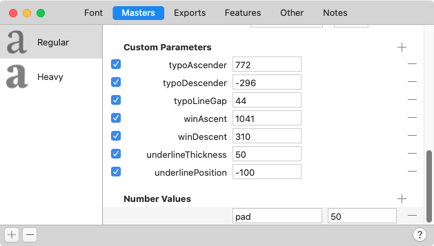
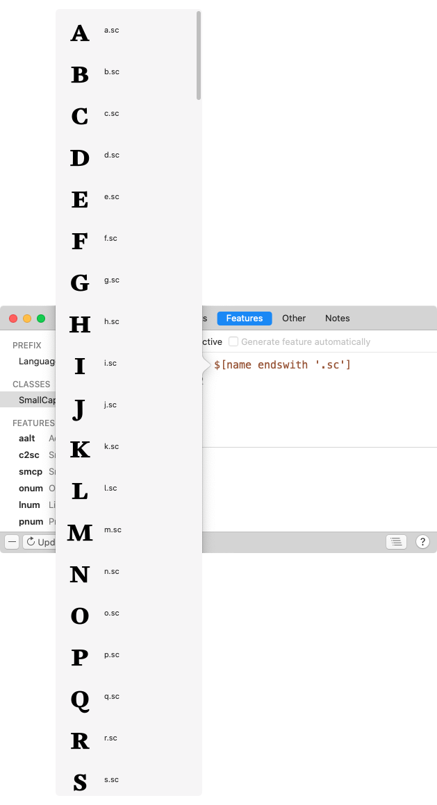

原文: [Tokens](https://glyphsapp.com/learn/tokens)
# トークン

チュートリアル

[ OpenTypeフィーチャー ](https://glyphsapp.com/learn?q=opentype+features)

執筆者: Rainer Erich Scheichelbauer

[ en ](https://glyphsapp.com/learn/tokens) [ fr ](https://glyphsapp.com/fr/learn/tokens)

2024年1月23日更新（初版公開：2020年12月22日）

もちろん、フィーチャーコードをすべて手で入力することもできます。しかし、その必要はありません。トークンは、フィーチャーコードをスマートに自動化するのに役立ちます。

**トークン**を使って動的なフィーチャーコードを追加しましょう。構文的には、トークンは`$`（ドル記号）に続くコードのことです。トークンは、補間される**数値**と、グリフ名を集めるための**グリフクラス述語**という2つの目的で使えます。

## 数値

まず、トークン構文を**数値**のために使うことができます。これは「数値トークン」と呼ばれることもあります。数値は、「ファイル > フォント情報 > マスター > 数値（File > Font Info > Masters > Number Values）」で定義します。簡単に言うと、数値とは補間される変数のことです。例えば、「マスター」で`pad`という名前の数値を、Lightマスターでは50、Boldマスターでは5と定義します。



フィーチャーコードでは、次のような`kern`（[Kerning](https://docs.microsoft.com/en-us/typography/opentype/spec/features_ko#kern)）フィーチャーを追加できます。

```
pos @L @A $pad;
```

そして、生成されるGPOSフィーチャーコードでは、`pad`の補間された値がトークンの位置に挿入されます。便利ですね。しかし、もっと複雑なものが必要な場合はどうでしょう？次のような位置調整ルールを持つ`cpsp`（[Capital Spacing](https://docs.microsoft.com/en-us/typography/opentype/spec/features_ae#tag-cpsp)）フィーチャーを追加してみましょう。

```
pos @brackets <$pad 0 ${pad*2} 0>;
```

そうです。`${...}`という構造の中では、計算式を追加することができます。これは、あらゆる種類の手動GPOSコードにとって非常に便利です。[数値を使った位置調整](positioning-with-number-values.md)のチュートリアルに良い例があります。

## グリフクラス述語

**グリフクラス述語**（「クラス・トークン」や「述語トークン」とも呼ばれます）は、`$[...]`という構造を持ち、動的に、スペースで区切られたグリフ名のリストに展開されます。これはOpenTypeフィーチャーコードでのクラス定義に役立ちます。角括弧の間には、グリフをフィルタリングするためのAppleの[NSPredicateコード](https://developer.apple.com/documentation/foundation/nspredicate)を記述します。これはフォントビューのスマートフィルタ（Cmd-Opt-1）と非常によく似た働きをします。実際、内部的には、スマートフィルタはNSPredicateを使用しています。

一例です。

```
sub [ $[case==smallCaps] ] slash' by slash.sc;
```

`$[case==smallCaps]`という構造は、オブジェクト`case`、比較演算子`==`、そして値`smallCaps`から成ります。この特別なケースでは、値は`noCase`、`upper`、`lower`、`smallCaps`、`minor`、`other`という事前定義された定数のいずれかです。これらの定数は、「編集 > 選択グリフの情報を編集」からアクセスできるグリフ情報内のオプションに対応しています。したがって、このトークンは、この比較に一致する、つまり述語が真と評価されるグリフ名のスペース区切りリストに展開されます。この場合、ケースがスモールキャップに等しいすべてのグリフです。言い換えれば、`a.sc b.sc c.sc d.sc`などが得られます。したがって、行全体は次のように展開されます。

```
sub [ a.sc b.sc c.sc d.sc ] slash' by slash.sc;
```

…そして、おそらくこの4つのグリフよりもずっと多くのグリフが含まれるでしょう。最も良い点は、これが動的に行われるため、すべてのスモールキャップグリフを自分で集める必要も、サブセット化について心配する必要もないことです。なぜなら、このフィーチャーコードは常に自動的に更新されるからです。そして、このトークンは「プレフィックス」、「クラス」、「フィーチャー」コードのどこにでも挿入できます。述語トークンを確認するには、トークンコードをOptionキーを押しながらクリックすると、グリフのリストがポップアップ表示されます。



この概要は、現在書き出し対象となっているグリフのセットに対して有効で、現在選択されているマスターのグリフで表示されます。

では、要点をまとめましょう。述語トークンはドル記号`$`で始まり、その後に角括弧`[]`が続きます。その中にはオブジェクトの比較を記述します。オブジェクトの比較とは、書き出し対象の各グリフの特定のプロパティ（「述語オブジェクト」）を、通常は数値や文字列である値と比較する論理式です。比較には、利用可能なNSPredicateの比較演算子の一つを使用します。この式が真となる各グリフが、最終的なグリフ名のリストに含まれることになります。

### 述語オブジェクト

原則として、`GSGlyph`オブジェクトのどの属性も、述語式の有効なオブジェクトになります。マクロパネルで`print("\n".join(dir(GSGlyph)))`を実行し、出力から可能な述語を探し始めることができます。あるいは、[docu.glyphsapp.com](https://docu.glyphsapp.com)のGSGlyphドキュメントを参照してください。

#### ブール値オブジェクト

ブール値のグリフプロパティは、`true`または`false`、あるいは別表記で`yes`または`no`と評価されます。したがって、`$[hasComponents == true]`のように比較できます。以下のグリフプロパティが利用可能です。

```
hasAlignedWidth
hasAnnotations
hasComponents
hasCorners
hasCustomGlyphInfo
hasHints
hasPostScriptHints
hasSpecialLayers
hasTrueTypeHints
isAligned
isAppleColorGlyph
isColorGlyph
isCornerGlyph
isHangulKeyGlyph
isSVGColorGlyph
isSmartGlyph
justLocked
locked
mastersCompatible
outlineHasChanges
```

#### 数値オブジェクト

数値は整数または浮動小数点数です。通常の数学演算子を使って他の数値と比較できます。例えば`$[countOfUnicodes > 0]`のようにです。以下のグリフプロパティが利用可能です。

```
case
changeCount
colorIndex
countOfLayers
countOfPartsSettings
countOfTags
countOfUnicodes
direction
```

はい、`case`は技術的には整数ですが、通常は既に述べた定数と比較することになるでしょう。

本当に気にする数値の多くは、グリフではなくレイヤーに付随しています。例えば、`layer0.width`、`layer0.LSB`などです。利用可能なレイヤープロパティの詳細については、[docu.glyphsapp.com](https://docu.glyphsapp.com)のGSLayerドキュメントをご覧ください。

#### 文字列オブジェクト

文字列はテキストの一部です。参照文字列と次のように比較できます：`$[name like "*.ss01*"]`。その参照文字列は、ダムクォート`"..."`で囲む必要があり、`*`のようなワイルドカードを含めることができます。以下のグリフプロパティが文字列として利用可能です。

```
baseString
bottomKerningGroup
bottomMetricsKey
category
charName
charString
description
glyphDataEntryString
lastChange
leftKerningGroup
leftKerningKey
leftMetricsKey
name
note
production
productionName
rightKerningGroup
rightKerningKey
rightMetricsKey
script
sortName
sortNameKeep
string
subCategory
topKerningGroup
topMetricsKey
unicode
unicodeChar
unicodeString
vertWidthMetricsKey
widthMetricsKey
```

#### 複合オブジェクト

通常は、`layer0.width`のようにその属性にアクセスします。

```
glyphInfo 
layer0
userData
```

これらのうち本当に意味があるのは、グリフの最初のレイヤー、つまり最初のマスターを表す`layer0`だけです。おなじみのドット記法でそのGSLayerプロパティにアクセスできます。オブジェクトツリーをさらに掘り下げて、`$[layer0.anchors.top.y > 600]`のようなこともできます。

`unicode`、`script`、`subCategory`のようなほとんどすべての`glyphInfo`オブジェクトは、グリフの属性として直接アクセスできるので、`glyphInfo`はあまり必要ないでしょう。ただし、`glyphInfo.accents`は例外かもしれませんが、それが何に役立つかは分かりません。そして`userData`は何でもあり得ますが、実際にはスクリプトを介してのみアクセス可能です。したがって、非常に、非常に特定の状況でのみ意味があります。

### 比較演算子と複合条件

[NSPredicateのドキュメント](https://developer.apple.com/library/archive/documentation/Cocoa/Conceptual/Predicates/Articles/pSyntax.html)によると、以下の比較演算子を、好きなだけ空白を空けて、小文字でも大文字でも、好きな方で使用できます。

*   **BEGINSWITH** オブジェクトが値で始まる。例：`$[name beginswith "x"]`
*   **CONTAINS** オブジェクトが値を含む。例：`$[name contains ".alt"]`
*   **ENDSWITH** オブジェクトが値で終わる。例：`$[name endswith ".sc"]`
*   **LIKE** オブジェクトが値と等しい：`?`と`*`がワイルドカード文字として使用でき、`?`は1文字に、`*`は0文字以上にマッチします。例：`$[name like "?.sc" or name like "*.sc*"]`
*   **MATCHES** ICU v3に準拠した正規表現スタイルの比較を使用して、オブジェクトが右辺の式と等しい。これは正規表現マニアにしか意味がありません。正規表現が何か知らない場合は、これを無視してください。
*   **=, ==** オブジェクトが値と等しい。`$[layer0.LSB = 0]`
*   **>=, =>** オブジェクトが値以上である。`$[layer0.RSB >= 0]`
*   **<=, =<** オブジェクトが値以下である。`$[layer0.countOfPaths <= 3]`
*   **>** オブジェクトが値より大きい。`$[countOfUnicodes > 1]`
*   **<** オブジェクトが値より小さい。`$[layer0.LSB < 0]`
*   **!=, <>** オブジェクトが値と等しくない。`$[layer0.countOfHints != 0]`
*   **BETWEEN** オブジェクトが、波括弧で囲まれたカンマ区切りの2つの値の間にあるか、どちらかと等しい。例：`$[layer0.width between {400,600}]` または `$[name between {"V","Z"}]`
*   **IN** オブジェクトが、波括弧で囲まれたカンマ区切りの値のコレクションの中に現れなければならない。`$[layer0.width in {200, 400, 600}]`（技術的には、INは集約ですが、ここに加えておきます。）

**複合条件**は、複数の比較の論理的な連結です。プログラミングで知っているかもしれません。

*   **AND, &&** 論理積（AND）。2つ以上の比較を結合します。すべての比較が真の場合にのみ、式全体が真と評価されます。例：`$[layer0.LSB < 0 and layer0.RSB < 0]`
*   **OR, ||** 論理和（OR）。2つ以上の比較を結合します。少なくとも1つの比較が真の場合に、式全体が真と評価されます。例：`$[name endswith "superior" or name beginswith "ord"]`
*   **NOT, !** 論理否定（NOT）演算子。続く比較を否定します。トリッキーなのは、既存の述語の*前に置く*ことでそれを否定することです。例：`$[not layer0.width in {200, 400, 600}]`は、最初のレイヤーの幅が3つの数値のいずれでもないすべてのグリフを取得します。

## サンプルコード

少しインスピレーションを与えるために、述語トークンの便利なチートシートを以下に示します。

```
$[name endswith '.sc'] # ".sc"で終わるすべてのグリフ名に展開されます
$[layer0.width < 500] # layer0 = 最初のマスター
$[layers.count > 1] # 数値の比較には：== != <= >= < > を使用
$[direction == 2] # 0=LTR, 1=BiDi, 2=RTL
$[colorIndex == 5]
$[case == smallCaps] # 事前定義された定数：noCase, upper, lower, smallCaps, minor, other
$[name matches "S|s.*"] # "matches": 正規表現
$[leftMetricsKey like "*"] # "like": ワイルドカード検索
$[name like "*e*"] # グリフ名のどこかにeがある
$[script like "latin"]
$[category like "Separator"]
$[leftKerningGroup like "H"]
$[rightKerningGroup like "L"]
$[unicode beginswith "03"] # beginswith, endsworth, contains
$[note contains "love it"] # グリフのノート
$[countOfUnicodes > 1]
$[countOfLayers > 1]
$[subCategory like "Arrow"]
$[hasHints == 0] # ブール値：false, no, 0 対 true, yes, 1
$[isColorGlyph == true]
$[hasComponents == true and script == "latin"] # ORまたはANDで複数の条件を接続
$[hasTrueTypeHints == false]
$[hasAlignedWidth == true]
$[hasPostScriptHints == true]
$[hasAnnotations == true]
$[hasCorners == true] # corners = コーナーコンポーネント
$[hasSpecialLayers == yes] # special layers = カラー、ブレース、ブラケットレイヤー
$[isHangulKeyGlyph == no]
```

いやー、これはなかなかのギーク向けでしたね。皆さんがこれを何に使うのか、とても興味があります。楽しんでください！

---

更新履歴 2024-01-23: LIKEのドキュメントでアスタリスクが表示されるように修正。