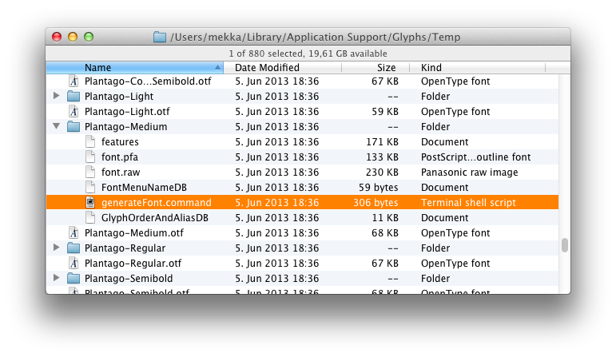

原文: [Troubleshooting a font that does not export](https://glyphsapp.com/learn/troubleshooting-a-font-that-does-not-export)
# 書き出せないフォントのトラブルシューティング

チュートリアル

[ トラブルシューティング ](https://glyphsapp.com/learn?q=troubleshooting) [ テスト ](https://glyphsapp.com/learn?q=testing)

執筆者: Rainer Erich Scheichelbauer

[ en ](https://glyphsapp.com/learn/troubleshooting-a-font-that-does-not-export) [ fr ](https://glyphsapp.com/fr/learn/troubleshooting-a-font-that-does-not-export) [ zh ](https://glyphsapp.com/zh/learn/troubleshooting-a-font-that-does-not-export)

2020年1月24日更新（初版公開：2013年6月12日）

フォントを書き出そうとしても、奇妙なエラーメッセージが表示されることがあります。ここではその修正方法を解説します。

「ファイル > 書き出し」でフォントを書き出そうとしても、`makeotfGlyphs`という奇妙なエラーメッセージが表示されるだけだったことはありませんか？えっ？

これは、内蔵の`makeotf`コマンド（おそらくご想像の通り、OTFを作成するコマンドです）が、提供されたフォントデータでエラーを起こしたことを意味します。この最も可能性の高い原因は、不正なグリフ名です。しかし、問題が何であるかを正確に突き止めるには、`makeotf`コマンドを自分で実行して何が起こるかを見る必要があります。

そのためには、エラーダイアログの「詳細」ボタンをクリックするだけです。そうすると、問題のフォントプロジェクトの一時フォルダに直接移動します。次の2つの段落はスキップできます。

あるいは、ダイアログに「詳細」ボタンがない場合は、`~/Application Support/Glyphs/Temp/`に移動する必要があります。最も手っ取り早い方法は、「スクリプト > スクリプトフォルダを開く」コマンドを使うことです。GlyphsがFinderでフォルダを開きます。正確には、その親フォルダであるGlyphsのApplication Supportフォルダを開きます。そこには、スクリプトフォルダの他に、プラグインフォルダや情報フォルダなど、さまざまなものが見つかるかもしれません。しかし、今私たちが興味があるのは、Tempフォルダです。

さて、Tempフォルダの中には、OTFと、最近のすべてのフォントプロジェクトを含むサブフォルダがいくつか、きれいに整理されて見つかります。各フォルダには、OTFを生成するために必要なファイルがいくつか含まれています。そのうちの一つが、たった今書き出そうとしたフォントの一時フォルダです。ヒント：「変更日」でソートすると便利です。

フォントの一時フォルダ内にあるファイルの一つに、`generateFont.command`というものがあります。

これをダブルクリックすると、ターミナルが開きます。そこで、`makeotf`コマンドはあらゆる種類の通知を出力し、OTFの生成プロセスを記録します。注記や警告は無視して構いませんが、`[FATAL]`で始まる行を探してください。これらが、フォントファイルの生成を妨げた「致命的な」エラーです。通常、出力の最後の方、`[Process completed]`と表示される直前に、次のようなものが見られます。

この場合、`[FATAL]`の行には「multiple glyphs euro Euro mapped to code 20ac」と書かれています。これは、フォント内にユーロ記号が2つあり、一つは`euro`、もう一つは`Euro`という名前で、どちらもUnicode `20AC`を持っていることを意味します。これで何をすべきかわかりましたね。Glyphsに戻り、どちらかのユーロ記号を削除してから、再度書き出してください。

もちろん、状況は大きく異なる場合があります。さらに、私たちはGlyphsが何か問題が発生した場合に、わかりやすいエラーメッセージを表示するように懸命に作業してきました。[Glyphsハンドブック](/get-started)には、表示される可能性のある様々なメッセージを説明する詳細な「エラー処理」の章もあります。

### サブテーブルオーバーフロー

「GPOS Subtable Overflow」というエラーが表示されることがあります。`GPOS`は、その名の通り*グリフの位置決め*情報を格納するOpenTypeテーブルです。これにはカーニングやマークの位置決めが含まれます。このエラーの最も可能性の高い原因は、カーニングペアが多すぎるか、大きなカーニンググループと多くのグループ例外および例外グループのカーニングペアを持つカーニングがあることです。

これに対処するにはいくつかの方法があります。書き出しが成功するまで、以下の手順をこの順序で試してください。

1.  「ファイル > フォント情報 > フォント > カスタムパラメータ」に`Use Extension Kerning`というカスタムパラメータを追加し、オンにします。
2.  可能であれば、結合マークの位置決め情報を格納する`mark`と`mkmk`機能を削除します。心配しないでください、コンパウンドには影響しません。「ファイル > フォント情報 > インスタンス」で、書き出しに失敗する各インスタンスに、`Remove Features`というカスタムパラメータを追加します。その「値」をクリックし、`mark`と`mkmk`を別の行に追加します。
3.  「ウインドウ > カーニング」に進み、カーニングペアをいくつか削除し始めるか、歯車メニューからカーニングを圧縮します。*Kerning*サブメニューにある[mekkablue scripts](https://github.com/mekkablue/Glyphs-Scripts/)の使用を検討してください。*Remove Kerning*で始まるスクリプトがいくつかあり、役立つかもしれません。

幸運を祈ります。

### 書き出しが終わらない

書き出しダイアログに回転するシンボルが表示され、それが止まらない場合はどうでしょうか？例えば、もう何分も待っているのに？

CFFフォントを複雑なアウトラインで書き出している可能性があります。終わらない書き出しの最も可能性の高い原因は、アウトラインのサブルーチン化です。これは、単純でクリーンなアウトライン構造に対してのみ、うまく効率的に機能します。「ファイル > フォント情報 > フォント」で、`Disable Subroutines`という単純なカスタムパラメータを追加し、その値をオンにすることで、問題が解決するかもしれません。

しかし、[複雑なアウトライン](creating-fonts-with-complex-outlines.md)に関するチュートリアルを読んで、もっと便利なヒントが見つかるかどうか確認してください。

### MakeOTF構文エラー

OpenType機能コードの構文エラーは特殊なケースです。特に、「ファイル > フォント情報 > 機能」に古いコードや手動のコードがある場合、*MakeOTF Error*というタイトルのダイアログが表示され、機能コード内の特定の行の問題を指摘されることがあります。

ダイアログに「表示」ボタンがある場合は、それをクリックしてください。Glyphsが機能コード内の問題箇所に移動します。コードが自動化されている場合（つまり、「機能を自動的に生成」オプションがオンの場合）は、「フォント情報 > 機能」ウィンドウの下部にある「更新」と「コンパイル」ボタンを試してください。それで問題が解決しない場合、または手動の機能コードがある場合は、*エラーメッセージが具体的に何を言っているか*（ここでも、[ハンドブック](/get-started)の「エラー処理」セクションが非常に役立ちます）と、*エラーメッセージが指し示している正確な場所*を詳しく調べる必要があります。

しかし注意してください：MakeOTFのエラーメッセージは、時々問題の箇所を見逃すことがあります。例えば、*syntax error at "Udieresisgrave" in Class Uppercase*と表示された場合、当然、`Udieresisgrave`に何か問題がないか調べるでしょう。グリフはそもそも存在しますか？書き出し対象に設定されていますか？適切なUnicode値を持っていますか？しかし、問題のグリフに何も問題が見つからない場合、問題は*その直前*にある可能性があります。では、`Udieresisgrave`の直前に言及されているグリフはどうでしょうか？何かタイプミスはありませんか？余分な構文、例えば、孤立したセミコロンや括弧はありませんか？非ASCII文字はありませんか？特に、コード行が言及されたグリフ名で*始まっている*場合、それは見えない文字である可能性さえあります。

ご覧の通り、それはほとんど何でもあり得ますが、少なくともどこを探せばよいかはわかります。

---

更新履歴 2016-12-30: 「詳細」ボタンに関する注記とMakeOTF構文エラーに関するセクションを追加。

更新履歴 2020-01-24: 「サブテーブルオーバーフロー」と「書き出しが終わらない」を追加。

更新履歴 2020-02-10: 誤字を修正、単語「very own」を削除、単語「Overflow」を「Overview」に変更、ハンドブックのリンクを修正。